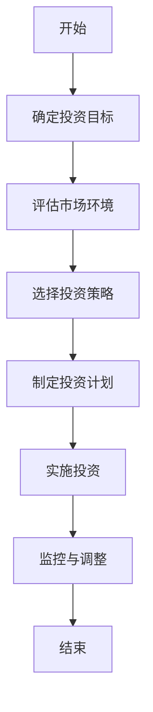

                 


# 巴菲特-芒格的智慧城市安全投资：隐私保护与公共安全的平衡

## 关键词
智慧城市建设, 安全投资, 隐私保护, 公共安全, 巴菲特投资理念, 芒格思维模型, 投资回报

## 摘要
随着智慧城市的快速发展，安全投资在智慧城市建设中的重要性日益凸显。本文结合巴菲特和芒格的投资理念，分析了隐私保护与公共安全的平衡问题。首先介绍了智慧城市的背景与投资的重要性，探讨了巴菲特的价值投资理论和芒格的多元思维模型在安全投资中的应用。接着，详细阐述了智慧城市安全投资的分类与特点，隐私保护与公共安全的平衡策略。最后，通过算法与系统设计、项目实战等部分，展示了如何在智慧城市建设中实现隐私保护与公共安全的平衡，并提出了最佳实践建议。

---

# 第一部分: 引言

## 第1章: 背景与重要性

### 1.1 智慧城市的发展背景

#### 1.1.1 智慧城市的定义与特征
智慧城市建设是利用信息技术和数据驱动的方法，提升城市运行效率、居民生活质量和社会管理水平。其核心特征包括数据化、智能化和网络化。

#### 1.1.2 智慧城市建设的现状与趋势
当前，智慧城市建设在全球范围内快速推进，但同时也面临数据隐私泄露、网络安全威胁等挑战。

#### 1.1.3 投资在智慧城市建设中的重要性
智慧城市建设需要大量资金支持，安全投资是其中的关键部分，直接影响项目的成功与否。

### 1.2 投资在智慧城市安全中的作用

#### 1.2.1 安全投资的核心概念
安全投资是指为保障智慧城市系统的安全性和稳定性而进行的资金投入，包括技术和管理两个方面。

#### 1.2.2 投资与智慧城市发展的关系
安全投资是智慧城市建设的基础，没有安全，智慧城市的其他功能将无法正常运行。

#### 1.2.3 隐私保护与公共安全的平衡
在智慧城市建设中，如何在保护个人隐私的同时，确保公共安全，是一个重要的挑战。

---

## 第2章: 巴菲特与芒格的投资理念

### 2.1 巴菲特的价值投资理论

#### 2.1.1 价值投资的定义与核心原则
价值投资是一种长期投资策略，强调以低于内在价值的价格买入优质资产。

#### 2.1.2 巴菲特投资成功的案例分析
通过分析巴菲特投资的案例，我们可以看到他对安全性和长期稳定性的重视。

#### 2.1.3 价值投资在智慧城市中的应用
将价值投资理念应用于智慧城市安全投资，需要选择具有长期发展潜力和良好治理能力的项目。

### 2.2 芒格的多元思维模型

#### 2.2.1 多元思维模型的定义与特点
多元思维模型是指通过多个学科和领域的知识，构建一个全面的思维方式。

#### 2.2.2 芒格思维模型在投资中的应用
芒格的思维模型帮助投资者在复杂决策中，综合考虑各种因素，避免单一视角的局限性。

#### 2.2.3 多元思维模型对智慧城市建设的启示
在智慧城市建设中，需要综合考虑技术、法律、社会等多个因素，避免单一化的解决方案。

### 2.3 巴菲特与芒格投资理念的结合

#### 2.3.1 价值投资与多元思维的结合
将价值投资的长期视角与多元思维的全面分析相结合，能够在智慧城市建设中做出更明智的投资决策。

#### 2.3.2 在智慧城市安全投资中的应用
通过综合分析和长期视角，选择那些在隐私保护和公共安全方面具有潜力的项目进行投资。

#### 2.3.3 投资理念对智慧城市建设的启示
智慧城市建设需要以价值为导向，注重长期效益，并综合考虑多方面因素。

---

# 第二部分: 智慧城市安全投资的核心概念

## 第3章: 智慧城市安全投资的分类与特点

### 3.1 安全投资的分类

#### 3.1.1 物理安全投资
包括物理设施的建设和维护，如智能监控设备、防盗系统等。

#### 3.1.2 网络安全投资
包括网络安全设备、防火墙、入侵检测系统等，保护智慧城市网络的安全。

#### 3.1.3 数据安全投资
包括数据加密、数据备份、隐私保护技术等，确保数据的安全性和隐私性。

#### 3.1.4 应用安全投资
包括应用程序的安全开发、漏洞修复、安全测试等，确保应用程序的安全性。

### 3.2 安全投资的特点

#### 3.2.1 长期性
安全投资需要长期持续投入，才能确保系统的安全性。

#### 3.2.2 系统性
安全投资需要从整体出发，综合考虑各个部分的安全性，避免单一环节的漏洞。

#### 3.2.3 风险性
安全投资存在一定的风险，可能会面临技术和市场变化的挑战。

#### 3.2.4 投资回报的不确定性
安全投资的回报周期较长，且回报的不确定性较高。

## 第4章: 隐私保护与公共安全的平衡

### 4.1 隐私保护的重要性

#### 4.1.1 隐私保护的法律框架
包括数据保护法、隐私权法等，确保个人隐私不被侵犯。

#### 4.1.2 隐私保护的技术手段
包括加密技术、匿名化处理、访问控制等，保障数据的安全性和隐私性。

#### 4.1.3 隐私保护与个人权益的关系
隐私保护是个人权益的重要组成部分，需要在智慧城市建设中得到充分重视。

### 4.2 公共安全的核心要素

#### 4.2.1 公共安全的定义与范围
包括公共安全事件的预防、应急响应和事后处理等。

#### 4.2.2 公共安全的法律与政策
包括公共安全法、应急管理法等，为公共安全提供法律保障。

#### 4.2.3 公共安全的技术手段
包括智能监控、应急通信、数据分析等，提高公共安全事件的预防和处理能力。

### 4.3 隐私保护与公共安全的平衡策略

#### 4.3.1 技术手段的平衡
在技术手段上，需要找到隐私保护与公共安全之间的平衡点，确保数据的可用性与安全性。

#### 4.3.2 法律与政策的平衡
通过法律法规和政策的制定，明确隐私保护与公共安全的边界，避免冲突。

#### 4.3.3 社会参与与教育
通过公众教育和参与，提高社会对隐私保护和公共安全的意识，形成良好的社会氛围。

---

# 第三部分: 算法与系统设计

## 第5章: 投资决策算法

### 5.1 投资决策模型

#### 5.1.1 投资决策模型的定义
投资决策模型是一种用于辅助投资者做出决策的数学模型。

#### 5.1.2 投资决策模型的核心要素
包括投资目标、风险偏好、市场环境、投资期限等。

#### 5.1.3 投资决策模型的数学公式
$$ 投资回报率 = \frac{最终价值 - 初始投资}{初始投资} \times 100\% $$

### 5.2 投资决策算法的实现

#### 5.2.1 投资决策算法的流程图


#### 5.2.2 投资决策算法的代码实现
```python
def investment_decision(target, risk, market, duration):
    # 计算投资回报率
    return_rate = (target - initial_investment) / initial_investment * 100
    # 评估风险
    risk_assessment = risk_level(risk)
    # 制定投资策略
    strategy = determine_strategy(market, return_rate, risk_assessment)
    # 返回结果
    return strategy
```

### 5.3 投资回报率的计算

#### 5.3.1 投资回报率的计算公式
$$ 投资回报率 = \frac{最终价值 - 初始投资}{初始投资} \times 100\% $$

#### 5.3.2 投资回报率的计算案例
假设初始投资为100万元，最终价值为120万元，投资回报率为20%。

---

# 第四部分: 项目实战

## 第6章: 智慧城市安全投资实战

### 6.1 项目环境与安装

#### 6.1.1 系统环境要求
包括操作系统、编程语言、开发工具等。

#### 6.1.2 依赖库的安装
包括numpy、pandas、scikit-learn等。

### 6.2 系统核心代码实现

#### 6.2.1 安全投资评估代码
```python
def evaluate_investment(portfolio):
    # 计算投资组合的回报率
    returns = calculate_returns(portfolio)
    # 计算投资组合的风险
    risk = calculate_risk(portfolio)
    # 返回评估结果
    return returns, risk
```

#### 6.2.2 隐私保护与公共安全平衡代码
```python
def balance_privacy_and_public Safety(portfolio):
    # 计算隐私保护投入
    privacy_investment = portfolio['privacy']
    # 计算公共安全投入
    public_safety_investment = portfolio['public_safety']
    # 平衡两者的关系
    balance_ratio = privacy_investment / public_safety_investment
    # 返回平衡结果
    return balance_ratio
```

### 6.3 代码实现与分析

#### 6.3.1 代码实现
详细实现上述函数的具体代码。

#### 6.3.2 代码分析
分析代码的逻辑和功能，解释其在安全投资中的作用。

### 6.4 实际案例分析

#### 6.4.1 案例背景
描述一个实际的智慧城市建设案例。

#### 6.4.2 投资决策过程
详细分析投资决策的过程和结果。

#### 6.4.3 投资效果评估
评估投资的效果，总结经验教训。

### 6.5 项目小结

#### 6.5.1 项目总结
总结项目的实施过程和主要成果。

#### 6.5.2 经验与教训
总结项目中的经验和教训，为未来的投资决策提供参考。

---

# 第五部分: 最佳实践

## 第7章: 投资策略与风险管理

### 7.1 投资策略

#### 7.1.1 长期投资策略
强调长期投资的重要性，选择具有长期发展潜力的项目。

#### 7.1.2 分散投资策略
通过分散投资，降低风险，提高投资回报率。

#### 7.1.3 价值投资策略
注重项目的内在价值，选择具有长期稳定收益的项目。

### 7.2 风险管理

#### 7.2.1 风险评估与控制
通过风险评估，制定有效的风险管理策略。

#### 7.2.2 应急预案
制定应急预案，应对可能出现的突发情况。

#### 7.2.3 监控与调整
定期监控投资组合的表现，及时调整投资策略。

### 7.3 投资与风险管理的结合

#### 7.3.1 投资与风险管理的关系
强调风险管理在投资决策中的重要性。

#### 7.3.2 在智慧城市建设中的应用
通过结合投资与风险管理，确保智慧城市建设的安全与稳定。

### 7.4 小结

#### 7.4.1 投资策略总结
总结本文提出的投资策略，强调其在智慧城市建设中的重要性。

#### 7.4.2 风险管理总结
总结风险管理的方法和技巧，为未来的投资决策提供参考。

#### 7.4.3 综合理解
综合分析投资策略与风险管理的关系，提出在智慧城市建设中实现隐私保护与公共安全平衡的建议。

---

# 结语

智慧城市建设是一个复杂而长期的过程，安全投资是其中的关键部分。通过结合巴菲特和芒格的投资理念，我们可以更好地理解隐私保护与公共安全的平衡问题。本文从理论到实践，详细探讨了智慧城市建设中的安全投资策略，为未来的投资决策提供了有益的参考。

---

## 作者：AI天才研究院/AI Genius Institute & 禅与计算机程序设计艺术 /Zen And The Art of Computer Programming

