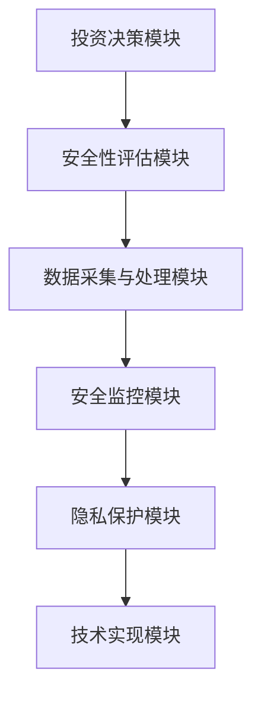

                 

# 巴菲特-芒格的智能城市安全投资：科技与隐私的平衡

---

## 关键词：巴菲特，芒格，智能城市，安全投资，科技，隐私，价值投资，长期主义，多元思维模型

---

## 摘要：

智能城市的发展离不开科技的进步，但科技的快速发展也带来了隐私保护的挑战。本文结合巴菲特和芒格的投资理念，探讨如何在智能城市的安全投资中实现科技与隐私的平衡。通过分析智能城市的核心概念、科技与隐私的平衡策略、投资决策的数学模型，以及实际案例，本文为投资者和科技从业者提供了深度的见解和实践指导。

---

# 第一部分：背景介绍

## 第1章：巴菲特-芒格投资理念概述

### 1.1 巴菲特-芒格投资理念的核心要素

#### 1.1.1 巴菲特的价值投资理论

价值投资的核心在于寻找具有持续竞争优势的企业，并以低于其内在价值的价格买入。巴菲特强调长期主义和安全边际，即在投资中留出足够大的安全空间，以应对不确定性和风险。

#### 1.1.2 芒格的多元思维模型

芒格提倡通过跨学科的多元思维模型来理解问题。他认为，只有通过多个角度的分析，才能全面评估一个投资的潜在风险和收益。

#### 1.1.3 价值投资与长期主义的结合

巴菲特和芒格的投资策略强调长期持有优质资产，而非短期波动。这种策略在智能城市的安全投资中尤为重要，因为智能城市的建设和运营需要长期的投入和维护。

---

### 1.2 智能城市的发展现状与挑战

#### 1.2.1 智能城市的定义与特征

智能城市是通过先进技术（如物联网、大数据、人工智能等）优化城市资源的配置和管理，以提高居民的生活质量。其核心特征包括智能化、数据化和可持续性。

#### 1.2.2 智能城市中的科技应用

智能城市的科技应用主要体现在以下几个方面：
- 数据采集与分析：通过传感器和大数据技术，实时采集和分析城市运行数据。
- 智能交通：优化交通流量，减少拥堵和污染。
- 智能能源：提高能源使用效率，降低碳排放。

#### 1.2.3 智能城市发展的主要挑战

智能城市的发展面临的主要挑战包括：
- 数据安全：大量的数据采集和传输可能带来隐私泄露和数据滥用的风险。
- 技术可靠性：智能系统的稳定性和抗干扰能力需要高度保障。
- 投资回报：智能城市的建设和运营成本高，回报周期长。

---

### 1.3 科技与隐私的平衡问题

#### 1.3.1 科技发展对隐私的影响

科技的快速发展带来了数据采集和分析能力的提升，但也可能导致个人隐私的泄露。例如，智能交通系统可能收集用户的出行数据，这些数据如果被滥用，可能侵犯用户的隐私。

#### 1.3.2 隐私保护的重要性

隐私保护是智能城市发展的基石。只有在确保用户隐私的前提下，智能城市的技术应用才能得到用户的信任和支持。

#### 1.3.3 科技与隐私的平衡策略

实现科技与隐私的平衡需要从以下几个方面入手：
- 技术层面：通过加密技术和数据脱敏等手段保护用户隐私。
- 制度层面：制定严格的隐私保护法律法规，规范数据的采集和使用。
- 用户层面：提高用户的隐私保护意识，让用户了解并掌控自己的数据。

---

## 第2章：巴菲特-芒格投资理念与智能城市安全投资的结合

### 2.1 巴菲特-芒格投资理念在智能城市中的应用

#### 2.1.1 价值投资与智能城市基础设施

智能城市的基础设施（如智能电网、智能交通系统等）具有长期稳定收益的特点，符合巴菲特的价值投资理念。这些基础设施通常由具有持续竞争优势的企业建设和运营，具有较高的投资价值。

#### 2.1.2 长期主义与智能城市可持续发展

智能城市的可持续发展需要长期的投入和维护。巴菲特和芒格的长期主义理念在智能城市的安全投资中尤为重要。投资者需要关注智能城市的长期收益，而不仅仅是短期的市场波动。

#### 2.1.3 多元思维模型与智能城市风险管理

智能城市的安全投资涉及多个领域的风险，如技术风险、市场风险和政策风险等。芒格的多元思维模型可以帮助投资者全面评估这些风险，并制定相应的应对策略。

---

### 2.2 智能城市安全投资的核心要素

#### 2.2.1 安全投资的定义与目标

智能城市的安全投资是指在智能城市的建设和运营过程中，通过技术和管理手段，确保城市系统的安全性和稳定性。其目标是降低安全风险，保障智能城市的正常运行。

#### 2.2.2 智能城市中的安全风险

智能城市的安全风险主要来自以下几个方面：
- 数据安全：数据泄露、篡改或滥用可能导致严重的经济损失和社会问题。
- 网络攻击：智能城市的系统可能成为黑客攻击的目标，导致服务中断或数据丢失。
- 设备故障：智能设备的故障可能导致系统运行中断或数据丢失。

#### 2.2.3 安全投资的评估标准

评估智能城市的安全投资需要考虑以下几个标准：
- 安全性：系统是否具备抗攻击和抗干扰的能力。
- 可持续性：投资是否能够长期支持智能城市的建设和运营。
- 成本效益：投资的成本与收益是否合理。

---

### 2.3 科技与隐私平衡的投资策略

#### 2.3.1 隐私保护的投资机会

在智能城市的安全投资中，隐私保护是一个重要的领域。投资者可以通过投资隐私保护技术（如数据加密、身份认证等）来满足市场需求，同时获得较高的投资回报。

#### 2.3.2 科技创新的安全边界

在推动科技创新的同时，投资者需要明确科技应用的安全边界，避免因技术滥用而导致的隐私泄露或其他安全问题。

#### 2.3.3 投资策略的动态调整

智能城市的科技发展和政策环境不断变化，投资者需要根据实际情况动态调整投资策略，以应对新的挑战和机遇。

---

# 第二部分：智能城市安全投资的核心概念与联系

---

## 第3章：智能城市安全投资的核心概念

### 3.1 智能城市安全投资的定义与特点

#### 3.1.1 定义与范围

智能城市安全投资是指在智能城市的建设和运营过程中，通过技术和管理手段，确保城市系统的安全性和稳定性。其范围包括数据安全、网络安全、设备安全等多个方面。

#### 3.1.2 核心特点分析

智能城市安全投资的核心特点包括：
- 系统性：需要从整体上考虑城市的安全问题，而非单一环节。
- 长期性：安全投资需要长期投入，才能实现持续的安全保障。
- 技术驱动：依赖先进的技术手段（如人工智能、区块链等）来实现安全目标。

#### 3.1.3 与传统投资的区别

与传统投资相比，智能城市安全投资具有以下特点：
- 投资目标更复杂：需要同时考虑技术、管理和政策等多个方面。
- 投资周期更长：安全投资的回报周期较长，需要长期的资金支持。
- 技术依赖性更强：依赖于先进的科技手段来实现安全目标。

---

### 3.2 巴菲特-芒格投资理念与智能城市安全投资的联系

#### 3.2.1 价值投资理念的适用性

价值投资理念在智能城市安全投资中的适用性体现在以下几个方面：
- 寻找具有持续竞争优势的企业：在智能城市的安全投资中，需要选择具有技术优势和管理能力的优质企业。
- 以低于内在价值的价格买入：通过分析企业的内在价值，选择合适的买入时机。

#### 3.2.2 多元思维模型的应用

多元思维模型在智能城市安全投资中的应用体现在以下几个方面：
- 从技术角度分析：评估企业的技术优势和创新能力。
- 从政策角度分析：关注相关政策的变化对企业的影响。
- 从市场角度分析：研究市场需求和竞争格局。

#### 3.2.3 长期主义与智能城市发展的契合

长期主义与智能城市发展的契合体现在以下几个方面：
- 智能城市的建设需要长期的投入和维护。
- 安全投资需要长期的资金支持和资源投入。
- 长期的稳定收益是智能城市安全投资的核心目标。

---

## 第4章：科技与隐私的平衡关系

### 4.1 科技发展对隐私的影响

#### 4.1.1 数据采集与隐私泄露风险

智能城市的科技应用需要大量的数据采集，这可能导致用户的隐私泄露。例如，智能交通系统可能收集用户的出行数据，这些数据可能被滥用，导致隐私泄露。

#### 4.1.2 技术进步与隐私保护的矛盾

技术的进步可以提高智能城市的效率和便利性，但也可能威胁用户的隐私。例如，人工智能技术可以用于数据分析，但如果缺乏有效的隐私保护机制，可能导致用户的隐私被滥用。

#### 4.1.3 科技伦理与隐私权的平衡

科技伦理是解决科技与隐私平衡问题的重要原则。通过制定和遵守科技伦理规范，可以在技术进步和隐私保护之间找到平衡点。

---

### 4.2 隐私保护的科技解决方案

#### 4.2.1 数据加密技术

数据加密技术是保护用户隐私的重要手段。通过加密技术，可以确保数据在传输和存储过程中的安全性，防止数据泄露。

#### 4.2.2 身份认证技术

身份认证技术可以确保只有授权的用户才能访问特定的数据或服务，从而保护用户的隐私。

#### 4.2.3 数据脱敏技术

数据脱敏技术可以对敏感数据进行处理，使其在不泄露用户隐私的前提下，仍可用于分析和研究。

---

## 第5章：科技与隐私平衡的数学模型

### 5.1 科技应用的隐私影响模型

我们可以用以下公式表示科技应用的隐私影响：
$$
\text{隐私风险} = \text{科技应用的范围} \times \text{隐私保护措施的强度}
$$

### 5.2 隐私保护与投资回报的关系

投资回报与隐私保护的关系可以通过以下公式表示：
$$
\text{投资回报} = \text{技术优势} \times \text{隐私保护水平} \times \text{市场需求}
$$

---

## 第6章：智能城市安全投资的系统架构设计

### 6.1 系统功能设计

智能城市安全投资的系统功能设计可以分为以下几个模块：
- 数据采集与处理模块：负责采集和处理城市运行数据。
- 安全监控模块：实时监控系统的安全性，发现并应对潜在的安全威胁。
- 投资决策模块：根据系统的安全性评估结果，制定投资策略。

### 6.2 系统架构设计

以下是智能城市安全投资系统的架构设计：

---

## 第7章：智能城市安全投资的项目实战

### 7.1 项目背景

假设我们投资于一个智能交通项目，该项目的目标是通过智能交通系统优化城市的交通流量，减少拥堵和污染。

### 7.2 项目环境配置

#### 7.2.1 硬件配置

- 服务器：用于数据处理和存储。
- 传感器：用于实时采集交通数据。
- 终端设备：用于数据传输和用户交互。

#### 7.2.2 软件配置

- 数据库：用于存储交通数据。
- 智能交通管理平台：用于系统的运行和管理。
- 安全监控系统：用于实时监控系统的安全性。

---

## 第8章：最佳实践与总结

### 8.1 最佳实践

- 在智能城市的安全投资中，投资者需要关注隐私保护和技术创新之间的平衡。
- 选择具有技术优势和管理能力的优质企业进行投资。
- 动态调整投资策略，以应对技术和政策的变化。

### 8.2 小结

智能城市的安全投资是一个复杂而重要的领域，需要结合科技与隐私的平衡，实现长期的稳定收益。

### 8.3 注意事项

- 投资者需要充分评估智能城市的安全投资风险。
- 在选择投资标的时，要关注企业的技术优势和管理能力。
- 动态调整投资策略，以应对技术和政策的变化。

### 8.4 拓展阅读

- 巴菲特的《聪明的投资者》
- 芒格的《穷查理宝典》
- 关于智能城市的书籍和研究报告

---

# 作者：AI天才研究院 & 禅与计算机程序设计艺术

