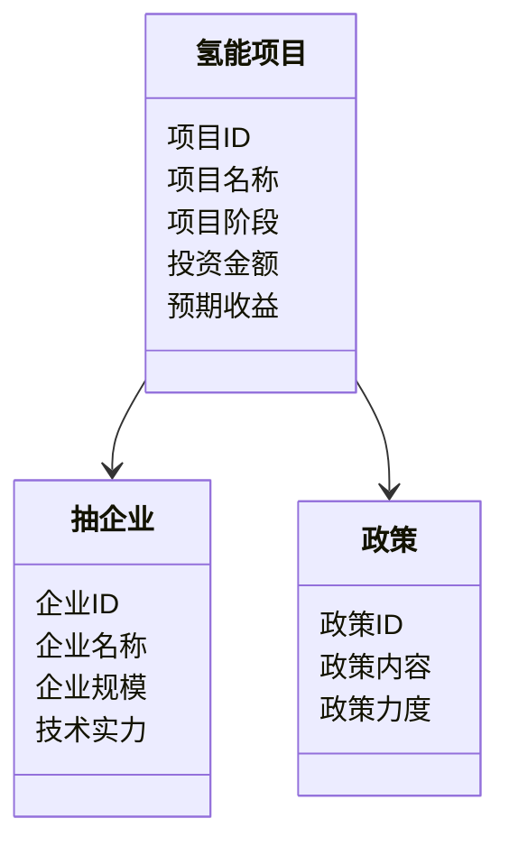

                 


# 巴菲特-芒格的氢能源投资：清洁能源的下一个前沿

> **关键词**：巴菲特、芒格、氢能源、清洁能源、投资策略、氢能技术、风险管理

> **摘要**：本文深入探讨了巴菲特和芒格在氢能源领域的投资策略，分析了氢能源的技术优势和市场潜力，结合他们的投资理念，详细阐述了氢能源在清洁能源转型中的重要性。文章通过技术分析、案例研究和系统设计，为读者提供了全面的视角，帮助理解氢能源的投资机会与挑战。

---

# 第1章: 巴菲特与芒格的投资哲学与氢能源

## 1.1 巴菲特的价值投资理论

### 1.1.1 巴菲特的价值投资理念
巴菲特的价值投资理论强调长期投资、安全边际和企业护城河。他认为，投资的本质是寻找那些具有持续竞争优势、良好治理结构和稳定财务状况的企业。

### 1.1.2 芒格的多元思维模型
芒格提倡多元思维模型，认为投资者应该通过多个学科的交叉视角来分析问题，避免单一思维的局限性。这种思维方式帮助他在投资决策中发现潜在的风险和机会。

### 1.1.3 巴菲特与芒格投资理念的异同
- **相同点**：都强调长期投资、价值投资和风险管理。
- **不同点**：巴菲特更注重企业基本面和财务指标，而芒格更注重跨学科的综合分析。

## 1.2 氢能源的基本概念与优势

### 1.2.1 氢能的定义与特点
氢能是通过氢气（H₂）的化学能转换为电能或热能的能量形式。氢能具有能量密度高、零碳排放、可储存和可运输的特点。

### 1.2.2 氢能作为清洁能源的优势
- **环保性**：燃烧氢气只产生水，无碳排放。
- **可再生能源的互补性**：氢能可以储存和运输可再生能源，解决间歇性问题。
- **广泛应用**：氢能适用于交通、工业和建筑等多个领域。

### 1.2.3 氢能在全球能源结构中的地位
随着全球能源转型的推进，氢能在能源结构中的比重逐渐增加，尤其是在减少碳排放和应对气候变化方面。

## 1.3 巴菲特与芒格为何投资氢能源

### 1.3.1 氢能行业的市场潜力
氢能技术的快速发展和政策支持为行业带来了巨大的市场潜力。特别是在交通领域，燃料电池汽车的推广为氢能的应用提供了广阔的前景。

### 1.3.2 环保与经济双驱动的政策支持
全球各国纷纷出台政策支持氢能的发展，例如欧盟的“氢战略”和美国的“国家氢能计划”。这些政策为氢能行业提供了良好的发展环境。

### 1.3.3 长期投资策略
巴菲特和芒格的投资理念注重长期价值，而氢能在能源转型中的长期潜力符合他们的投资策略。

## 1.4 本章小结
本章介绍了巴菲特和芒格的投资哲学，并分析了他们为何选择投资氢能源。氢能作为一种清洁、高效的能源形式，符合他们的长期投资策略和对可持续发展的关注。

---

# 第2章: 氢能产业链的技术与经济性分析

## 2.1 氢能产业链的构成

### 2.1.1 制氢技术
- **电解水制氢**：利用可再生能源电解水生成氢气，适用于可再生能源丰富的地区。
- **化石燃料制氢**：通过天然气或煤气化制氢，成本较低但会产生碳排放。
- **生物质制氢**：利用生物质分解制氢，具有环保性。

### 2.1.2 氢气储存与运输
- **高压储氢**：通过高压容器储存氢气，成本低但储存量有限。
- **液态储氢**：将氢气液化储存，适用于长距离运输。
- **管道运输**：通过专用管道输送氢气，成本较低但初期投资大。

### 2.1.3 氢能应用
- **燃料电池**：用于汽车、发电和备用电源。
- **工业应用**：用于氢冶金、氢化工和氢气生产。
- **交通领域**：燃料电池汽车、氢动力火车和船舶。

## 2.2 各种制氢技术的优缺点对比

| 制氢技术      | 优点                     | 缺点                       |
|---------------|--------------------------|---------------------------|
| 电解水制氢    | 清洁、可扩展             | 成本高、技术要求高         |
| 化学制氢       | 成本低、技术成熟         | 产生碳排放                 |
| 生物质制氢     | 可持续、环保             | 技术不成熟                 |

## 2.3 氢能在不同领域的应用前景

### 2.3.1 交通领域的燃料电池汽车
燃料电池汽车（FCEV）具有零排放、加氢快、续航里程长的优点，是氢能在交通领域的典型应用。

### 2.3.2 工业领域的氢冶金与氢化工
氢冶金通过使用氢气还原矿石，减少碳排放；氢化工用于生产氨、甲醇等化学品。

### 2.3.3 建筑与分布式能源的应用
氢能在建筑中的应用包括分布式发电和热电联供，能够提高能源利用效率。

## 2.4 氢能技术的挑战与解决方案

### 2.4.1 制氢成本的降低策略
- 提高制氢效率：通过技术创新降低成本。
- 使用可再生能源：降低电力成本，推动电解水制氢的普及。

### 2.4.2 氢气储存与运输的技术瓶颈
- 研发新型储氢材料：提高储氢密度和安全性。
- 建设氢气运输网络：完善基础设施，降低成本。

### 2.4.3 标准化与基础设施建设的推进
- 制定统一的技术标准：促进氢能在不同领域的应用。
- 加强基础设施建设：建设加氢站和氢气运输管道。

## 2.5 本章小结
本章分析了氢能产业链的各个环节，包括制氢、储氢、运氢和应用。各种制氢技术的优缺点对比以及技术挑战为后续投资分析奠定了基础。

---

# 第3章: 巴菲特与芒格的氢能源投资策略

## 3.1 巴菲特的长期价值投资策略

### 3.1.1 企业护城河的分析
巴菲特强调投资具有强大护城河的企业，例如可再生能源领域的龙头企业。

### 3.1.2 财务指标的筛选标准
巴菲特关注企业的盈利能力、资产负债表和现金流情况，确保投资的安全性。

### 3.1.3 企业治理结构的重要性
良好的公司治理是长期投资成功的基石，巴菲特倾向于投资治理透明、管理团队稳定的公司。

## 3.2 芒格的多元思维模型与氢能源

### 3.2.1 跨学科视角分析氢能源
芒格从物理学、化学和经济学等多个角度分析氢能源的技术可行性和市场潜力。

### 3.2.2 通过历史案例寻找投资机会
芒格善于从历史中汲取经验，分析氢能源行业的历史发展和未来趋势。

## 3.3 巴菲特与芒格的氢能源投资逻辑

### 3.3.1 选择具有技术优势的企业
巴菲特和芒格倾向于投资那些掌握核心技术、具有竞争优势的企业。

### 3.3.2 关注政策支持与市场潜力
氢能源行业的政策支持力度和市场容量是他们评估投资价值的重要因素。

## 3.4 投资案例分析：巴菲特与芒格的氢能源布局

### 3.4.1 投资标的：某氢能源公司
分析巴菲特和芒格投资的具体氢能源公司，探讨其技术优势和市场地位。

### 3.4.2 投资逻辑：长期增长与风险管理
通过财务分析和技术评估，展示巴菲特和芒格如何在氢能源领域实现长期增长和风险管理。

## 3.5 本章小结
本章结合巴菲特和芒格的投资哲学，分析了他们在氢能源领域的投资策略，并通过具体案例展示了他们的投资逻辑。

---

# 第4章: 氢能投资的分析与风险管理

## 4.1 氢能投资的市场分析

### 4.1.1 全球氢能源市场现状
分析全球氢能源市场的现状，包括产能、需求和主要参与者。

### 4.1.2 区域市场分析
探讨不同区域的市场潜力，例如欧洲、亚洲和北美洲的氢能发展情况。

## 4.2 投资模型与可行性评估

### 4.2.1 净现值（NPV）分析
通过NPV模型评估氢能源项目的经济可行性。

### 4.2.2 内部收益率（IRR）分析
计算项目的内部收益率，评估投资回报率。

## 4.3 风险管理策略

### 4.3.1 技术风险
分析氢能源技术的不确定性和应对措施。

### 4.3.2 市场风险
探讨市场需求波动对投资的影响。

### 4.3.3 政策风险
分析政策变化对氢能源投资的影响，提出应对策略。

## 4.4 本章小结
本章通过市场分析和投资模型，帮助投资者评估氢能源项目的可行性，并提出风险管理策略。

---

# 第5章: 氢能源投资的系统架构设计

## 5.1 项目介绍与目标

### 5.1.1 项目背景
介绍氢能源投资项目的背景和目标。

### 5.1.2 项目目标
通过系统设计实现氢能源投资的高效管理和决策支持。

## 5.2 系统功能设计

### 5.2.1 领域模型
使用Mermaid图展示氢能源投资领域的实体关系。



### 5.2.2 系统架构
使用Mermaid图展示系统的整体架构。


## 5.3 系统接口设计

### 5.3.1 数据接口
定义氢能源项目相关的数据接口，确保数据的准确传输。

### 5.3.2 用户接口
设计用户友好的界面，方便投资者进行数据查询和决策。

## 5.4 本章小结
本章通过系统架构设计，展示了氢能源投资的管理框架，为后续的项目实施提供了指导。

---

# 第6章: 项目实战——氢能源投资的环境与实现

## 6.1 环境安装

### 6.1.1 安装Python环境
使用Anaconda安装Python 3.8及以上版本。

### 6.1.2 安装必要的库
安装pandas、numpy、scipy等数据分析库。

## 6.2 核心代码实现

### 6.2.1 数据分析代码
```python
import pandas as pd
import numpy as np

# 示例数据：氢能源企业的财务数据
data = {
    '企业': ['A', 'B', 'C'],
    '收入': [100, 200, 150],
    '利润': [20, 30, 25]
}
df = pd.DataFrame(data)

# 计算净现值（NPV）
discount_rate = 0.1
NPV = (df['收入'] - df['利润']).sum() / (1 + discount_rate)
print("NPV:", NPV)
```

### 6.2.2 风险评估代码
```python
import numpy as np

# 示例数据：氢能源项目的风险评估
returns = [0.1, 0.2, 0.15, 0.25, 0.1]
expected_return = np.mean(returns)
volatility = np.std(returns)

print("预期回报率:", expected_return)
print("波动率:", volatility)
```

## 6.3 案例分析

### 6.3.1 案例背景
分析某氢能源公司的投资情况，包括财务状况和市场表现。

### 6.3.2 数据分析与结果
通过数据分析工具，评估该项目的投资回报率和潜在风险。

## 6.4 本章小结
本章通过实际案例展示了氢能源投资的环境搭建和数据分析，帮助读者理解如何将理论应用于实践。

---

# 第7章: 最佳实践与小结

## 7.1 投资策略总结

### 7.1.1 长期投资与技术驱动
氢能在能源转型中的长期潜力是投资的核心驱动力。

### 7.1.2 风险管理与多元化投资
通过多元化投资和风险管理降低投资风险。

## 7.2 未来展望

### 7.2.1 技术进步的推动
氢能源技术的进一步突破将推动行业的发展。

### 7.2.2 政策支持的加强
全球各国对氢能的支持政策将进一步推动行业增长。

## 7.3 最佳实践 tips

- **分散投资**：避免过度集中，降低风险。
- **关注技术**：选择具有技术优势的企业。
- **长期持有**：耐心等待投资回报。

## 7.4 本章小结
本章总结了氢能源投资的最佳实践，并对未来的发展趋势进行了展望，为投资者提供了宝贵的建议。

---

# 附录

## 附录A: 术语表
- 氢能（Hydrogen Energy）
- 燃料电池（Fuel Cell）
- 净现值（Net Present Value，NPV）
- 内部收益率（Internal Rate of Return，IRR）

## 附录B: 数据来源
- 全球氢能源市场数据来源：国际能源署（IEA）
- 投资案例数据来源：公开企业财报和行业报告

## 附录C: 参考文献
-巴菲特的著作和演讲
-芒格的跨学思维模型
-氢能源技术的相关研究论文

---

**作者：AI天才研究院 & 禅与计算机程序设计艺术**

