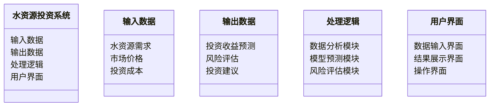

                 


# 巴菲特-芒格的水资源投资：稀缺资源的战略价值

> 关键词：巴菲特，芒格，水资源投资，稀缺资源，战略价值，价值投资，长期投资

> 摘要：本文深入分析了巴菲特和芒格在水资源投资领域的策略和理念，探讨了水资源作为稀缺资源的战略价值，并结合技术方法和实际案例，展示了如何利用价值投资和长期投资的策略在水资源领域获取超额收益。

---

## 第一部分: 背景介绍

### 第1章: 水资源的基本概念与投资价值

#### 1.1 水资源的定义与重要性
- 水资源是地球上最宝贵的自然资源之一。
- 水资源的稀缺性：全球水资源分布不均，部分地区面临水资源短缺问题。
- 水资源的战略价值：在农业、工业和生活中的不可替代性。

#### 1.2 巴菲特与芒格的投资理念
- 巴菲特的价值投资理论：寻找具有持续竞争优势和良好治理的企业。
- 芒格的多元思维模型：通过跨学科思考，寻找投资机会。
- 两人合作的投资哲学：长期投资、价值发现和风险管理。

---

## 第二部分: 水资源投资的核心要素

### 第2章: 水资源的供需关系与定价机制

#### 2.1 水资源的供需关系
- 人口增长和经济发展推动水资源需求上升。
- 气候变化对水资源分布的影响。
- 技术进步对水资源利用效率的提升。

#### 2.2 水资源的定价机制
- 水资源的公共定价与市场定价。
- 水资源的边际成本与收益分析。
- 政府政策对水资源价格的调节作用。

### 第3章: 水资源投资的风险与机会

#### 3.1 水资源投资的主要风险
- 政策风险：政府政策变化对水资源投资的影响。
- 环境风险：气候变化和自然灾害对水资源的影响。
- 市场风险：供需波动对水资源价格的影响。

#### 3.2 水资源投资的机会
- 基础设施投资：水务公司和水利工程。
- 技术创新：节水技术、污水处理和水资源回收。
- 新兴市场：发展中国家的水资源需求增长。

---

## 第三部分: 巴菲特与芒格的投资策略

### 第4章: 巴菲特的长期投资策略

#### 4.1 巴菲特的选股标准
- 寻找具有强大护城河的企业。
- 企业具备持续盈利能力。
- 管理层具备优秀的企业治理能力。

#### 4.2 巴菲特的水资源投资案例
- 水务公司投资：通过控股水务公司，获取稳定的现金流。
- 污水处理项目：投资于具备技术优势的环保企业。
- 农业用水管理：通过技术创新降低水资源浪费。

### 第5章: 芒格的多元思维模型

#### 5.1 芒格的多元思维模型
- 跨学科思考：将物理学、心理学、经济学等学科的知识结合起来。
- 通过模型简化问题：将复杂的现实问题转化为简单的模型进行分析。
- 持续学习与更新：保持对新知识的吸收和对旧知识的更新。

#### 5.2 芒格的水资源投资案例
- 投资于水资源回收技术：通过技术创新实现水资源的高效利用。
- 投资于智能水务系统：通过大数据和人工智能技术优化水资源管理。
- 投资于跨境水资源项目：通过国际合作实现水资源的合理分配。

---

## 第四部分: 水资源投资的技术方法

### 第6章: 水资源投资的数学模型与算法

#### 6.1 水资源投资的数学模型
- 现值法（Present Value Method）
  $$ PV = \frac{CF}{(1 + r)^n} $$
- 净现值法（Net Present Value Method）
  $$ NPV = \sum_{t=1}^{n} \frac{CF_t}{(1 + r)^t} $$
- 内部收益率法（Internal Rate of Return Method）
  $$ IRR = r \text{ 使得 } NPV = 0 $$

#### 6.2 水资源投资的算法实现
- 时间序列分析：预测水资源需求的变化趋势。
- 聚类分析：识别具有相似特征的水资源投资项目。
- 回归分析：评估影响水资源投资收益的关键因素。

#### 6.3 案例分析：水资源投资的算法应用
- 使用Python进行时间序列分析：
  ```python
  import pandas as pd
  import numpy as np
  from statsmodels.tsa.arima_model import ARIMA

  # 假设我们有一个包含水资源需求数据的DataFrame df
  # 使用ARIMA模型进行预测
  model = ARIMA(df['需求量'], order=(1, 1, 1))
  model_fit = model.fit()
  forecast = model_fit.forecast(steps=10)
  ```

---

## 第五部分: 系统分析与架构设计

### 第7章: 水资源投资系统的架构设计

#### 7.1 问题场景介绍
- 系统目标：优化水资源投资决策。
- 问题描述：如何利用技术手段提高水资源投资的效率和收益。
- 边界与外延：明确系统的输入输出和与外部系统的接口。

#### 7.2 系统功能设计
- 领域模型设计（Mermaid类图）


#### 7.3 系统架构设计
- 系统架构（Mermaid架构图）


---

## 第六部分: 项目实战与总结

### 第8章: 项目实战

#### 8.1 环境安装与数据准备
- 安装Python和相关库（如Pandas、NumPy、Scikit-learn）。
- 数据来源：公开的水资源需求数据、市场价格数据等。

#### 8.2 核心代码实现
- 使用Python进行时间序列预测：
  ```python
  import pandas as pd
  import numpy as np
  from sklearn.metrics import mean_squared_error

  # 数据加载
  df = pd.read_csv('water_demand.csv')
  train_data = df['需求量'].values[:100]
  test_data = df['需求量'].values[100:]

  # 时间序列预测
  def predict_next_value(train_data):
      # 使用简单平均法预测
      return np.mean(train_data)

  # 预测结果
  predicted = [train_data[0]] * len(test_data)
  for i in range(len(test_data)):
      predicted[i] = predict_next_value(train_data + test_data[:i+1])

  # 计算误差
  mse = mean_squared_error(test_data, predicted)
  print(f"均方误差：{mse}")
  ```

#### 8.3 案例分析与结果解读
- 案例：假设我们投资于一家水务公司，通过数据分析和模型预测，评估其未来的收益和风险。

---

## 第七部分: 总结与展望

### 第9章: 总结

#### 9.1 最佳实践 tips
- 价值投资：寻找具有长期竞争优势的企业。
- 风险管理：分散投资，降低风险。
- 持续学习：保持对新知识的吸收。

#### 9.2 小结
- 巴菲特和芒格的投资理念为水资源投资提供了重要的指导。
- 结合技术方法和实际案例，可以更好地理解和应用这些理念。

#### 9.3 注意事项
- 投资需谨慎，建议在专业指导下进行。
- 保持对市场的敏感性，及时调整投资策略。

#### 9.4 拓展阅读
- 巴菲特的《巴菲特致股东的信》。
- 芒格的《穷查理宝典》。

---

## 作者：AI天才研究院/AI Genius Institute & 禅与计算机程序设计艺术 /Zen And The Art of Computer Programming

---

通过本文的分析，我们不仅了解了巴菲特和芒格在水资源投资中的策略，还结合了技术方法和实际案例，展示了如何在水资源这一稀缺资源领域获取长期稳定的收益。

