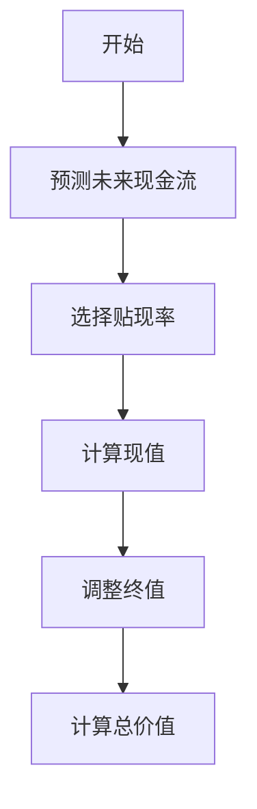
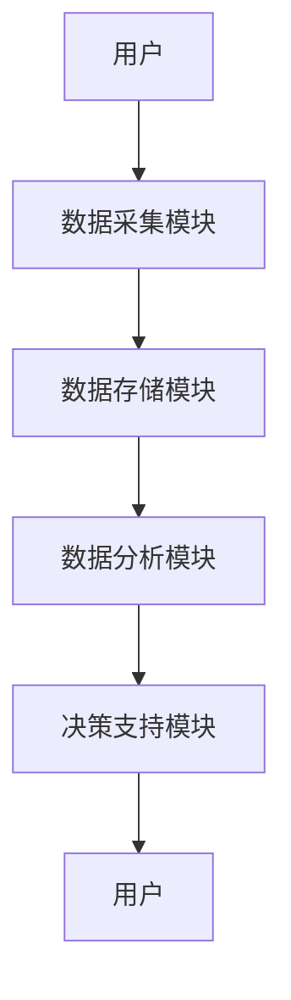

                 


# 巴菲特-芒格的深海资源开发投资：蓝色经济的新前沿

## 关键词：巴菲特，芒格，深海资源，蓝色经济，投资分析，价值投资

## 摘要：本文探讨了巴菲特和芒格的价值投资理念在深海资源开发中的应用，分析了蓝色经济的潜力以及如何通过投资分析模型评估深海资源项目的价值。文章详细介绍了DCF模型在深海资源开发中的应用，并提供了实际案例分析。

## 第一部分：背景介绍

### 第1章：巴菲特与芒格的价值投资理论

#### 1.1 巴菲特与芒格的投资理念
- 1.1.1 巴菲特的价值投资原则：寻找具有持续竞争优势和良好治理的企业，注重安全边际。
- 1.1.2 芒格的多元思维模型：通过多学科交叉思维，寻找投资机会中的潜在风险和收益。
- 1.1.3 价值投资的核心要素：内在价值、安全边际、长期持有。

#### 1.2 蓝色经济的定义与现状
- 1.2.1 蓝色经济的定义：与海洋相关的经济活动，包括渔业、能源、旅游等。
- 1.2.2 蓝色经济的主要领域：海洋资源开发、海上能源、蓝色旅游业。
- 1.2.3 蓝色经济的全球发展趋势：可持续发展、技术创新、政策支持。

#### 1.3 深海资源开发投资的背景
- 1.3.1 深海资源的定义与分类：海底矿产、天然气 hydrates、海底可再生能源。
- 1.3.2 深海资源开发的现状：技术进步、成本高、风险大。
- 1.3.3 深海资源开发的投资潜力：资源丰富、技术进步、市场需求增长。

## 第二部分：核心概念与联系

### 第2章：价值投资与蓝色经济的结合

#### 2.1 巴菲特与芒格投资理念的核心要素
- 2.1.1 企业的内在价值：DCF模型评估企业未来现金流的现值。
- 2.1.2 安全边际的重要性：确保投资的安全性和稳定性。
- 2.1.3 长期投资的哲学：注重企业的长期价值，而非短期波动。

#### 2.2 蓝色经济与深海资源开发的关系
- 2.2.1 蓝色经济中的深海资源开发：海底矿产、天然气 hydrates 开发。
- 2.2.2 深海资源开发对蓝色经济的影响：促进蓝色经济增长，提供新的能源和资源。
- 2.2.3 蓝色经济的可持续发展：环保、高效利用资源、技术创新。

## 第三部分：算法原理讲解

### 第3章：DCF模型在深海资源开发中的应用

#### 3.1 DCF模型的基本原理
- 3.1.1 DCF模型的定义：通过预测未来现金流并折现到现值，评估企业或项目的内在价值。
- 3.1.2 DCF模型的核心步骤：预测自由现金流、选择合适的贴现率、计算现值、调整终值。

#### 3.2 使用Mermaid流程图展示DCF模型


#### 3.3 Python代码实现DCF模型
```python
import pandas as pd
import numpy as np

# 假设现金流数据
cash_flows = [100, 150, 200, 250]
discount_rate = 0.10

# 计算现值
pv = sum(cash_flow / (1 + discount_rate) ** i for i, cash_flow in enumerate(cash_flows))

print(f"现值：{pv:.2f}")
```

#### 3.4 实际案例分析：深海资源开发项目
- 案例背景：假设一个深海矿产开发项目，预计未来5年的现金流分别为100万、150万、200万、250万和300万美元，贴现率为10%。
- 计算现值：现值 = 100/1.10 + 150/(1.10)^2 + 200/(1.10)^3 + 250/(1.10)^4 + 300/(1.10)^5 ≈ 432.48万美元。

## 第四部分：数学模型和公式

### 第4章：DCF模型的数学公式

#### 4.1 现金流现值公式
$$ PV = \sum_{t=1}^{n} \frac{CF_t}{(1 + r)^t} $$
其中，CF_t 是第t年的现金流，r 是贴现率。

#### 4.2 终值公式
$$ FV = \frac{CF_{n+1}}{(1 + r)^{n+1}} \times \frac{1}{1 - \frac{1}{(1 + r)^{T}}} $$
其中，T 是终值年份。

## 第五部分：系统分析与架构设计

### 第5章：深海资源开发投资分析系统的架构设计

#### 5.1 系统功能设计
- 数据采集模块：收集深海资源开发项目的现金流数据。
- 数据分析模块：应用DCF模型计算现值。
- 决策支持模块：提供投资建议和风险评估。

#### 5.2 系统架构图


## 第六部分：项目实战

### 第6章：DCF模型在深海资源开发中的实战应用

#### 6.1 环境安装
```bash
pip install pandas numpy
```

#### 6.2 核心代码实现
```python
import pandas as pd
import numpy as np

def calculateDCF(cash_flows, discount_rate):
    pv = 0
    for i, cf in enumerate(cash_flows):
        pv += cf / (1 + discount_rate) ** i
    return pv

cash_flows = [100, 150, 200, 250]
discount_rate = 0.10
result = calculateDCF(cash_flows, discount_rate)
print(f"现值：{result:.2f}")
```

#### 6.3 实际案例分析
- 项目背景：深海天然气 hydrates 开发项目，预计现金流为100万、150万、200万、250万、300万美元，贴现率为10%。
- 计算结果：现值 ≈ 432.48万美元。
- 投资建议：项目具有较高的内在价值，值得进一步研究。

## 第七部分：最佳实践

### 第7章：小结与注意事项

#### 7.1 小结
- 巴菲特和芒格的价值投资理念在深海资源开发中具有重要应用。
- DCF模型是评估深海资源开发项目价值的重要工具。
- 蓝色经济的可持续发展是未来投资的重要方向。

#### 7.2 注意事项
- 投资需谨慎，注意市场风险和政策变化。
- 深海资源开发技术复杂，需综合考虑各种因素。
- DCF模型的假设需合理，避免过高或过低估计贴现率。

#### 7.3 拓展阅读
- 巴菲特《巴菲特致股东的信》
- 芒格《穷查理宝典》
- 蓝色经济相关书籍《蓝色经济2.0》

## 作者信息

作者：AI天才研究院/AI Genius Institute & 禅与计算机程序设计艺术 /Zen And The Art of Computer Programming

