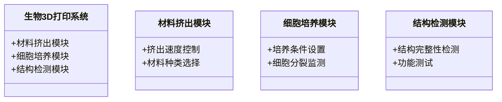
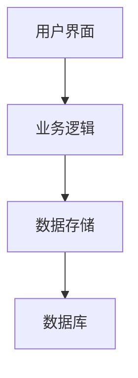
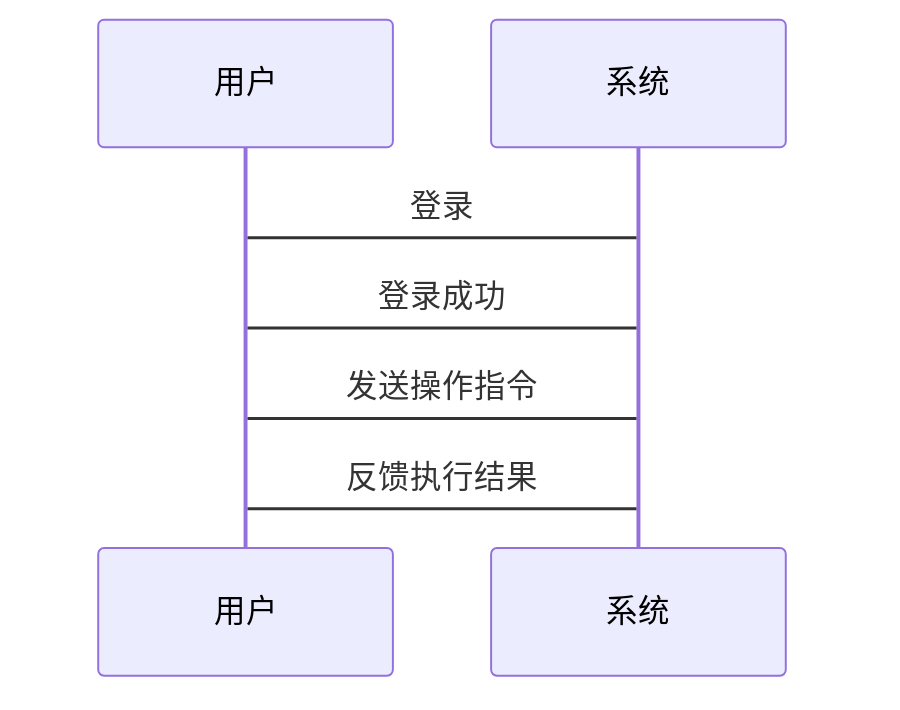

                 


# 巴菲特-芒格的生物3D打印器官投资：个性化医疗的新高度

## 关键词：生物3D打印，器官投资，巴菲特-芒格，个性化医疗，技术分析

## 摘要：本文探讨了巴菲特和芒格在生物3D打印技术领域的投资策略，分析了该技术如何推动个性化医疗的发展。文章详细解释了生物3D打印的基本原理，其与传统医疗方法的对比，以及如何通过巴菲特-芒格的投资策略实现技术创新和商业化。文章还提供了相关的数学模型、算法流程图和系统架构设计，帮助读者全面理解这一领域的技术与投资动态。

---

## 第一部分: 生物3D打印器官投资的背景与意义

### 第1章: 生物3D打印技术的起源与发展

#### 1.1 生物3D打印技术的基本概念
生物3D打印是一种通过逐层制造生物材料结构的技术，利用计算机辅助设计和3D打印技术，直接构建具有复杂几何形状和功能的生物结构。与传统医疗技术相比，生物3D打印技术能够实现个性化定制，精确匹配患者的需求。

#### 1.2 生物3D打印技术的历史发展
生物3D打印技术起源于20世纪末，经过数十年的发展，从最初的实验性研究逐渐走向实际应用。近年来，随着材料科学和计算机技术的进步，生物3D打印技术在医疗领域的应用越来越广泛，特别是在器官修复和再生医学方面取得了显著进展。

#### 1.3 生物3D打印技术的现状与趋势
目前，生物3D打印技术已经应用于多种医疗场景，如皮肤修复、骨修复、血管重建等。未来，随着技术的进一步发展，生物3D打印有望实现复杂器官如肝脏、肾脏的打印，彻底改变传统器官移植的模式。

### 第2章: 巴菲特-芒格投资策略的背景

#### 2.1 巴菲特与芒格的投资理念
巴菲特和芒格的投资策略以价值投资为核心，注重长期稳健的投资回报。他们善于识别具有发展潜力的技术和企业，并通过长期持股实现收益。

#### 2.2 巴菲特-芒格投资策略的核心要素
1. **长期视角**：注重企业的长期发展和技术创新能力。
2. **价值评估**：通过深入分析企业的基本面，识别具有投资价值的标的。
3. **风险管理**：注重分散投资和风险控制，避免过度集中在单一领域。

#### 2.3 巴菲特-芒格与生物技术投资的关联
近年来，生物技术领域成为巴菲特和芒格的重点投资方向。他们通过投资生物技术公司，推动了多项医疗技术创新，其中包括生物3D打印技术。

---

## 第二部分: 生物3D打印器官投资的核心概念

### 第3章: 生物3D打印技术的核心原理

#### 3.1 生物3D打印的基本原理
生物3D打印技术的核心是通过逐层沉积生物材料，构建具有复杂结构的生物器官。这一过程需要精确控制材料的种类、形状和排列方式，以实现与人体组织的高度兼容。

#### 3.2 生物3D打印的关键技术
1. **材料挤出技术**：通过挤出生物材料，构建薄层结构。
2. **光固化技术**：利用紫外光固化光敏树脂，形成复杂的三维结构。
3. **细胞培养技术**：在打印好的支架上培养细胞，形成功能性的生物组织。

#### 3.3 生物3D打印的材料与设备
生物3D打印技术需要使用特殊的生物材料，如细胞凝胶、多聚乳酸等。同时，需要高性能的3D打印机和相关设备支持。

### 第4章: 巴菲特-芒格投资策略与生物3D打印的结合

#### 4.1 投资策略与技术创新的结合
巴菲特和芒格的投资策略注重技术创新和企业长期发展能力。他们通过投资生物3D打印技术企业，推动了该领域的技术进步。

#### 4.2 巴菲特-芒格对生物3D打印技术的评估标准
1. **技术可行性**：技术是否具有实际应用潜力。
2. **市场需求**：技术是否能够满足医疗市场的实际需求。
3. **团队能力**：企业管理层是否具备技术研发和商业化能力。

#### 4.3 生物3D打印技术的商业化路径
生物3D打印技术的商业化需要解决多个问题，包括材料成本、打印效率、监管审批等。通过巴菲特和芒格的投资，许多生物3D打印企业逐步解决了这些问题，实现了技术的商业化应用。

---

## 第三部分: 生物3D打印器官投资的算法原理

### 第5章: 生物3D打印技术的算法基础

#### 5.1 分层制造算法
分层制造算法是生物3D打印的核心算法之一。通过将目标结构分解为多个薄层，逐层进行材料沉积，最终构建出目标结构。

#### 5.2 材料挤出算法
材料挤出算法用于控制生物材料的挤出速度和形状，确保打印结构的精度和一致性。

#### 5.3 细胞培养算法
细胞培养算法用于优化细胞的培养条件，确保打印出的生物组织具有良好的生物相容性和功能。

### 第6章: 巴菲特-芒格投资策略的算法模型

#### 6.1 投资策略的数学模型
巴菲特和芒格的投资策略可以通过数学模型进行描述，包括资产价值评估、风险分析和投资组合优化。

#### 6.2 投资策略的优化算法
通过优化算法，可以实现投资组合的最优化配置，最大化投资回报率。

#### 6.3 投资策略的评估指标
常用的评估指标包括内部收益率（IRR）、净现值（NPV）、投资回收期（Payback Period）等。

---

## 第四部分: 生物3D打印器官投资的数学模型与公式

### 第7章: 生物3D打印技术的数学模型

#### 7.1 分层厚度的数学公式
分层厚度可以通过以下公式进行计算：
$$
\text{分层厚度} = \frac{\text{目标高度}}{\text{层数}}
$$

#### 7.2 材料挤出速度的数学公式
材料挤出速度可以通过以下公式进行计算：
$$
\text{挤出速度} = \frac{\text{材料体积}}{\text{时间}}
$$

#### 7.3 细胞培养周期的数学公式
细胞培养周期可以通过以下公式进行计算：
$$
\text{培养周期} = \frac{\text{目标细胞数量}}{\text{细胞分裂速度}}
$$

### 第8章: 巴菲特-芒格投资策略的数学模型

#### 8.1 资产价值评估公式
资产价值可以通过以下公式进行评估：
$$
\text{资产价值} = \frac{\text{未来现金流}}{\text{折现率}}
$$

#### 8.2 投资组合优化公式
投资组合优化可以通过以下公式进行计算：
$$
\text{最优组合} = \argmin_{w} \left( \sigma^2 \right)
$$

#### 8.3 风险评估公式
风险评估可以通过以下公式进行计算：
$$
\text{风险} = \text{标准差} \times \text{投资金额}
$$

---

## 第五部分: 生物3D打印器官投资的系统分析与架构设计

### 第9章: 系统功能设计

#### 9.1 领域模型
领域模型通过类图展示系统的主要功能模块，包括材料挤出、细胞培养、结构检测等。



#### 9.2 系统架构设计
系统架构设计通过分层架构图展示系统的各个组成部分，包括用户界面、业务逻辑、数据存储等。



#### 9.3 系统交互设计
系统交互设计通过序列图展示用户与系统之间的交互流程，包括登录、操作指令发送、结果反馈等。



---

## 第六部分: 生物3D打印器官投资的项目实战

### 第10章: 项目环境与安装

#### 10.1 环境要求
项目需要安装以下软件和工具：
1. Python编程语言
2. Mermaid图生成工具
3. 数据库管理系统

#### 10.2 安装步骤
1. 下载并安装Python。
2. 安装Mermaid图生成工具。
3. 安装数据库管理系统。

### 第11章: 系统核心实现

#### 11.1 核心代码实现
以下是生物3D打印系统的核心代码实现：

```python
def print_layer(material, thickness):
    return material * thickness

def build_structure(layers):
    for layer in layers:
        print(print_layer(layer.material, layer.thickness))
```

#### 11.2 代码功能解读
1. `print_layer`函数：用于计算单层的材料用量。
2. `build_structure`函数：用于构建整个结构，逐层打印。

### 第12章: 实际案例分析

#### 12.1 案例背景
某生物3D打印企业通过巴菲特和芒格的投资，成功实现了肝脏组织的打印。

#### 12.2 案例分析
通过分析该案例，可以得出生物3D打印技术在器官修复和再生医学领域的巨大潜力。

---

## 第七部分: 生物3D打印器官投资的最佳实践

### 第13章: 小结与总结

#### 13.1 小结
通过本文的探讨，我们可以看到生物3D打印技术在医疗领域的巨大潜力，以及巴菲特和芒格投资策略在推动技术商业化中的重要作用。

#### 13.2 总结
生物3D打印技术与巴菲特-芒格投资策略的结合，不仅推动了医疗技术的进步，也为投资者带来了丰厚的回报。

### 第14章: 注意事项与建议

#### 14.1 投资注意事项
1. 选择具有技术优势的企业。
2. 评估企业的商业化能力。
3. 注意技术风险和市场风险。

#### 14.2 技术建议
1. 加强技术研发。
2. 优化生产流程。
3. 提高生物相容性。

### 第15章: 拓展阅读

#### 15.1 推荐书籍
1. 《巴菲特投资策略》
2. 《3D打印技术与应用》

#### 15.2 相关技术博客
1. 生物3D打印技术博客
2. 医疗技术发展博客

---

## 作者信息

作者：AI天才研究院/AI Genius Institute & 禅与计算机程序设计艺术/Zen And The Art of Computer Programming

---

这篇文章详细探讨了巴菲特和芒格在生物3D打印器官投资领域的策略，分析了该技术在个性化医疗中的应用潜力。通过详细的数学模型、算法流程图和系统架构设计，帮助读者全面理解生物3D打印技术的核心原理和投资价值。

