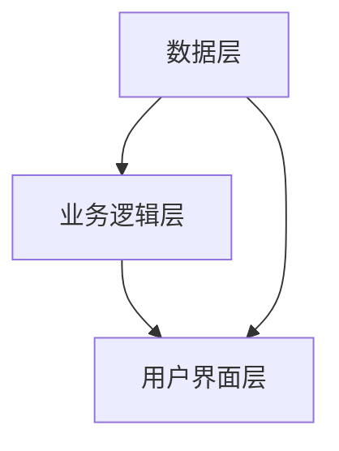

                 


# 巴菲特-芒格的生物技术伦理投资：科技进步与道德平衡

> 关键词：巴菲特, 芒格, 生物技术, 伦理投资, 科技进步, 道德平衡, 价值投资

> 摘要：本文探讨了生物技术投资中的伦理问题，结合巴菲特和芒格的价值投资理念，分析如何在科技发展与道德之间找到平衡。文章详细阐述了生物技术的伦理框架、评估方法和系统架构，并通过案例分析展示实际应用，最终总结伦理投资的重要性。

---

## 第1章：背景介绍

### 1.1 巴菲特与芒格的伦理投资理念

#### 1.1.1 巴菲特的价值投资原则
巴菲特的价值投资理念强调长期稳健的回报，注重企业的基本面分析和管理层的道德品质。他认为，投资不仅是经济行为，更是对社会和道德的考量。

#### 1.1.2 芒格的多元思维模型
芒格提倡通过跨学科的思维模型来分析问题，认为伦理因素是投资决策中的重要组成部分。他强调，投资者应具备识别道德风险的能力，以避免潜在的伦理困境。

#### 1.1.3 伦理在投资决策中的重要性
伦理投资不仅关乎社会的可持续发展，也直接影响投资的长期回报。忽视伦理因素可能导致企业声誉损失和法律风险，进而影响投资价值。

---

### 1.2 生物技术的伦理挑战

#### 1.2.1 生物技术的发展现状
生物技术在医学、农业和环境保护等领域取得了显著进展，但也带来了伦理问题。例如，基因编辑技术的应用可能引发生命伦理争议。

#### 1.2.2 基因编辑的伦理争议
基因编辑技术如CRISPR-Cas9的出现，使得人类可以精确修改基因。然而，这一技术的滥用可能导致基因歧视和人类基因多样性减少。

#### 1.2.3 医疗数据隐私与安全
随着生物技术的发展，医疗数据的收集和分析变得频繁。如何保护患者隐私和数据安全，成为伦理投资中的重要考量。

---

## 第2章：生物技术与伦理的交织

### 2.1 生物技术的核心领域

#### 2.1.1 基因疗法
基因疗法通过修改基因治疗疾病，但其伦理问题包括治疗的公平性、潜在的副作用和基因编辑的长远影响。

#### 2.1.2 精准医疗
精准医疗基于个体基因信息制定治疗方案，提高了治疗效果，但也面临数据隐私和治疗成本的伦理挑战。

#### 2.1.3 生物制药
生物制药利用生物技术开发药物，但其生产过程中的伦理问题涉及动物实验和生产条件的合规性。

---

### 2.2 伦理框架的构建

#### 2.2.1 伦理原则的界定
伦理框架应包括尊重、公正、 beneficence 和非作恶（maleficence）等原则，确保投资行为符合社会道德。

#### 2.2.2 投资中的伦理考量
投资者需评估企业的研发过程、产品用途和对社会的影响，避免投资于可能引发伦理争议的项目。

#### 2.2.3 利益相关者的权益平衡
伦理框架需平衡患者、研究人员、投资者和公众的利益，确保各方权益得到保护。

---

## 第3章：伦理框架的核心要素

### 3.1 生物技术伦理的关键维度

#### 3.1.1 安全性评估
评估生物技术产品对人类和环境的安全性，确保其不会带来不可逆的损害。

#### 3.1.2 有效性验证
验证生物技术产品的效果，确保其在伦理框架内有效治疗疾病。

#### 3.1.3 社会影响分析
分析生物技术对社会结构的影响，包括就业、经济和社会公平等方面。

---

### 3.2 伦理与投资的关联

#### 3.2.1 投资决策中的伦理筛选
投资者需筛选符合伦理标准的企业，避免投资于违背道德的项目。

#### 3.2.2 伦理风险的量化评估
通过风险评估模型，量化投资中的伦理风险，指导投资决策。

#### 3.2.3 伦理表现与投资回报的关系
研究表明，伦理投资不仅符合社会道德，还能带来长期的经济回报。

---

## 第4章：伦理评估方法

### 4.1 伦理评估的指标体系

#### 4.1.1 伦理风险矩阵
通过矩阵分析评估不同项目的伦理风险，帮助投资者做出决策。

#### 4.1.2 伦理影响评估模型
构建模型分析生物技术对社会和环境的影响，指导投资决策。

#### 4.1.3 伦理评分标准
制定评分标准，对企业的伦理表现进行评分，为投资决策提供依据。

---

### 4.2 伦理评估流程

#### 4.2.1 信息收集与分析
收集企业的伦理信息，分析其在研发和生产中的伦理表现。

#### 4.2.2 伦理风险识别
识别潜在的伦理风险，评估其对投资的影响。

#### 4.2.3 风险分类与优先级排序
根据风险的严重性和影响范围，进行分类和排序，制定应对策略。

---

## 第5章：伦理评估算法原理

### 5.1 伦理风险评估算法

#### 5.1.1 算法原理说明
伦理风险评估算法通过量化企业的伦理表现，计算其风险指数，指导投资决策。

#### 5.1.2 算法实现步骤
- 数据收集：收集企业的伦理信息。
- 风险识别：识别潜在的伦理风险。
- 风险评分：对风险进行评分和排序。
- 投资建议：根据评分结果，提出投资建议。

---

### 5.2 基于伦理的生物技术投资决策支持系统

#### 5.2.1 系统功能设计
系统功能包括数据采集、风险评估、决策支持和报告生成。

#### 5.2.2 系统架构设计
系统架构分为数据层、业务逻辑层和用户界面层，确保系统的高效运行。

#### 5.2.3 系统交互流程
用户输入企业信息，系统进行风险评估并生成报告，辅助投资决策。

---

## 第6章：项目实战——案例分析

### 6.1 实际案例的选择

#### 6.1.1 案例背景介绍
选择一家生物技术公司，分析其伦理表现和投资风险。

#### 6.1.2 数据收集与分析
收集公司的伦理信息，分析其在基因编辑和数据隐私方面的表现。

---

### 6.2 算法应用与结果分析

#### 6.2.1 伦理评分计算
根据伦理评分标准，计算公司的评分，评估其伦理风险。

#### 6.2.2 投资决策建议
基于评分结果，提出投资建议，指导投资者做出决策。

---

## 第7章：总结与展望

### 7.1 本文总结
本文探讨了生物技术投资中的伦理问题，提出了伦理评估的方法和系统架构，通过案例分析展示了实际应用。

### 7.2 未来研究方向
未来研究可进一步完善伦理评估模型，探索新兴技术的伦理影响。

### 7.3 伦理投资的未来发展趋势
伦理投资将越来越受到重视，成为可持续投资的重要组成部分。

---

## 附录：相关代码与工具

### 附录A：伦理风险评估算法代码
```python
def calculate_ethical_risk(company_data):
    # 计算伦理风险评分
    risk_score = 0
    for data in company_data:
        risk_score += assess_ethical_issue(data)
    return risk_score
```

### 附录B：系统架构图


### 附录C：案例分析数据表格
| 参数 | 描述 | 评分 |
|------|------|------|
| 基因编辑 | 伦理风险 | 85 |
| 数据隐私 | 合规性 | 90 |

---

## 参考文献
1. 巴菲特《巴菲特致股东的信》
2. 芒格《穷查理宝典》
3. 国际生物技术伦理学会的相关论文

---

## 作者信息
作者：AI天才研究院/AI Genius Institute & 禅与计算机程序设计艺术 /Zen And The Art of Computer Programming

---

通过以上内容，我们详细探讨了生物技术投资中的伦理问题，并结合巴菲特和芒格的投资理念，提出了伦理评估的方法和系统架构，为投资者提供了实践指导。希望本文能为生物技术伦理投资的研究和实践提供有价值的参考。

