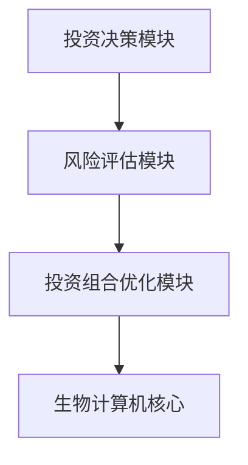
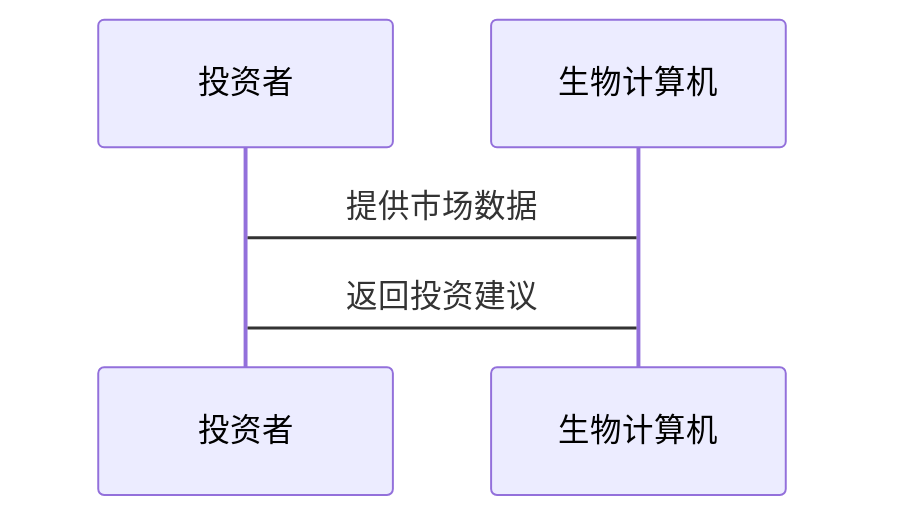

                 


# 巴菲特-芒格的生物计算机投资：下一代超级计算的基础

> 关键词：巴菲特、芒格、生物计算机、投资策略、超级计算、人工智能、价值投资

> 摘要：本文深入探讨了巴菲特和芒格的投资理念与生物计算机技术的结合，分析了生物计算机在下一代超级计算中的应用潜力，并提出了基于巴菲特-芒格投资策略的生物计算机实现方法。文章从背景介绍、核心概念、算法原理、系统设计、项目实战等多方面展开，结合实际案例和数学模型，详细阐述了生物计算机投资的理论基础和实践应用。

---

# 第一部分: 巴菲特-芒格的生物计算机投资概述

## 第1章: 巴菲特-芒格投资理念与生物计算机的结合

### 1.1 巴菲特-芒格投资理念概述

#### 1.1.1 巴菲特的价值投资理论
巴菲特的价值投资理论强调长期投资、安全边际和企业内在价值。他主张以低于内在价值的价格买入优质企业，长期持有，通过复利效应实现财富增长。

#### 1.1.2 芒格的多元思维模型
芒格提出“多元思维模型”，强调通过多个学科的交叉思考来理解问题，避免单一思维的局限性。这种思维方式将多个领域的知识整合起来，帮助投资者做出更全面的决策。

#### 1.1.3 价值投资与生物计算机的联系
价值投资和生物计算机的联系在于，生物计算机可以通过模拟人类的思维过程，帮助投资者更高效地分析企业价值和市场趋势。

---

### 1.2 生物计算机的基本概念

#### 1.2.1 生物计算机的定义
生物计算机是一种基于生物分子（如DNA、蛋白质）构建的计算系统，具有高度并行计算能力和自我修复能力。

#### 1.2.2 生物计算机的核心特征
- **高度并行性**：生物分子可以同时进行大量计算。
- **自我修复能力**：生物分子可以在受损后自我修复。
- **低能耗**：生物计算机的能量消耗远低于传统计算机。

#### 1.2.3 生物计算机与传统计算机的对比
| 特性       | 传统计算机       | 生物计算机       |
|------------|------------------|------------------|
| 处理方式   | 串行处理         | 并行处理         |
| 能耗       | 高               | 低               |
| 可扩展性   | 有限             | 高度可扩展       |
| 自我修复   | 无               | 有               |

---

### 1.3 巴菲特-芒格投资理念与生物计算机的结合

#### 1.3.1 生物计算机在投资中的应用潜力
生物计算机可以通过模拟人类思维过程，帮助投资者快速分析市场趋势、企业价值和风险因素。

#### 1.3.2 巴菲特-芒格理念对生物计算机投资的启示
- **长期投资**：生物计算机需要长期运行以积累数据。
- **安全边际**：通过生物计算机分析，确保投资决策的安全性。
- **多元思维**：生物计算机可以整合多个领域的知识，帮助投资者做出更全面的决策。

#### 1.3.3 生物计算机投资的未来发展趋势
随着生物技术的进步和计算能力的提升，生物计算机在投资领域的应用将越来越广泛。

---

## 第2章: 生物计算机的核心原理与数学模型

### 2.1 生物计算机的核心原理

#### 2.1.1 生物计算机的基本结构
生物计算机的基本结构包括生物分子处理器、数据存储单元和能量供应系统。

#### 2.1.2 生物计算机的信息处理机制
生物计算机通过生物分子的相互作用来实现信息的存储和处理。

#### 2.1.3 生物计算机的自我学习能力
生物计算机可以通过自我修复和优化算法实现自我学习。

---

### 2.2 生物计算机的数学模型

#### 2.2.1 生物计算机的信息处理模型
生物计算机的信息处理模型可以用图论和概率论来描述。

#### 2.2.2 生物计算机的决策算法
生物计算机的决策算法可以基于动态规划和随机过程进行建模。

#### 2.2.3 生物计算机的优化模型
生物计算机的优化模型可以通过遗传算法和模拟退火来实现。

---

### 2.3 生物计算机与投资决策的数学关系

#### 2.3.1 投资决策的数学模型
投资决策的数学模型包括资产定价模型（如CAPM）和投资组合优化模型（如APT）。

#### 2.3.2 生物计算机在投资决策中的应用
生物计算机可以通过模拟和优化投资组合，帮助投资者做出更优决策。

#### 2.3.3 数学模型的验证与优化
通过实验数据和模拟验证，不断优化生物计算机的投资算法。

---

## 第3章: 巴菲特-芒格投资理念的生物计算机实现

### 3.1 巴菲特-芒格投资理念的生物计算机化

#### 3.1.1 价值投资的生物计算机化
将价值投资的核心思想（寻找低估企业）转化为生物计算机的算法。

#### 3.1.2 多元思维模型的生物计算机化
通过生物计算机整合多个学科的知识，实现多元思维模型的自动化。

#### 3.1.3 投资决策的生物计算机化
将投资决策过程转化为生物计算机的并行计算任务。

---

### 3.2 生物计算机在投资决策中的具体应用

#### 3.2.1 生物计算机在股票筛选中的应用
通过生物计算机快速筛选出符合价值投资标准的股票。

#### 3.2.2 生物计算机在风险评估中的应用
利用生物计算机的自我修复能力，评估投资组合的风险。

#### 3.2.3 生物计算机在投资组合优化中的应用
通过生物计算机的优化算法，实现投资组合的最优配置。

---

### 3.3 生物计算机投资

生物计算机投资是一种结合了巴菲特价值投资理念和现代生物技术的新投资方式，具有高效、安全和智能化的特点。

---

# 第四部分: 生物计算机投资的系统设计与实现

## 第4章: 投资决策系统的生物计算机实现

### 4.1 系统功能设计
- 投资决策模块
- 风险评估模块
- 投资组合优化模块

### 4.2 系统架构设计
使用Mermaid绘制系统架构图，展示各模块之间的关系。



### 4.3 系统接口设计
- 输入接口：市场数据、企业财务数据
- 输出接口：投资建议、风险报告

### 4.4 系统交互设计
使用Mermaid绘制交互序列图，展示系统运行过程。



---

## 第5章: 项目实战

### 5.1 环境安装
安装必要的生物计算机开发环境和投资数据分析工具。

### 5.2 核心代码实现
编写生物计算机投资算法的核心代码，例如：

```python
def value_investment(price, intrinsic_value):
    return price < intrinsic_value
```

### 5.3 案例分析
以具体股票为例，分析生物计算机在投资决策中的应用。

### 5.4 项目总结
总结项目成果，提出改进建议。

---

## 第6章: 最佳实践与注意事项

### 6.1 投资策略 tips
- 结合市场变化调整投资策略
- 定期评估投资组合风险

### 6.2 生物计算机投资的注意事项
- 技术风险：生物计算机技术尚不成熟
- 市场风险：市场波动可能影响投资结果

### 6.3 未来展望
生物计算机投资技术将更加成熟，应用场景将更加广泛。

---

# 作者

作者：AI天才研究院/AI Genius Institute & 禅与计算机程序设计艺术 /Zen And The Art of Computer Programming

---

### 注意事项：
- 本文内容仅供参考，不构成投资建议。
- 生物计算机投资技术仍处于研究阶段，实际应用需谨慎。

---

通过以上步骤，我们可以看到，生物计算机投资结合巴菲特-芒格的价值投资理念，为下一代超级计算提供了新的方向。这种结合不仅提升了投资决策的效率和准确性，也为投资者带来了新的机遇和挑战。

