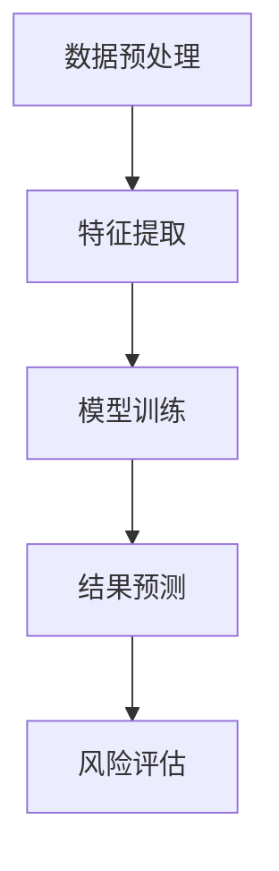
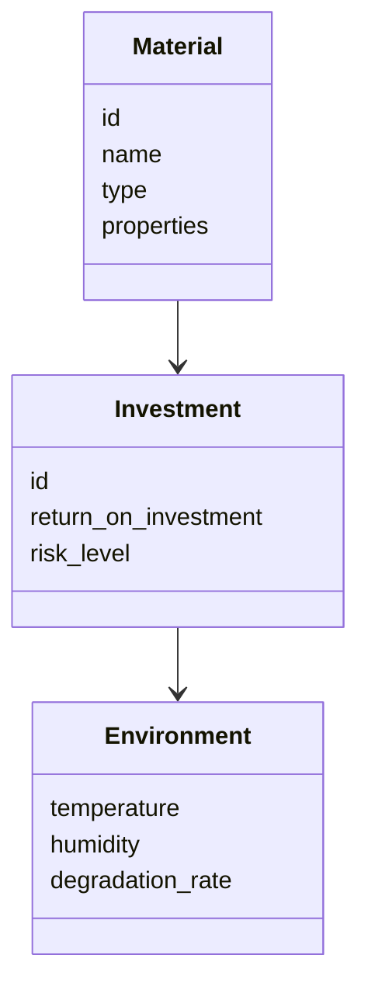
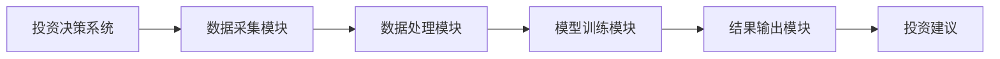

                 


# 巴菲特-芒格的生物降解智能材料投资：可持续科技的新方向

**关键词**：巴菲特、芒格、生物降解材料、智能材料、可持续投资、技术博客、投资模型

**摘要**：  
本文深入探讨了巴菲特和芒格在生物降解智能材料领域的投资策略，分析了该领域在可持续科技中的重要性。文章从材料科学基础、投资评估模型、算法实现、系统架构设计等多方面展开，结合实际案例，为读者提供了全面的技术解读和投资指南。通过本文，读者可以了解生物降解智能材料的投资价值、技术挑战以及未来发展方向。

---

## 第1章: 生物降解智能材料的定义与背景

### 1.1 生物降解材料的定义与特点

#### 1.1.1 生物降解材料的基本概念  
生物降解材料是指在自然环境中能够被微生物分解为二氧化碳和水等简单化合物的材料。与传统塑料等不可降解材料相比，生物降解材料具有环保性、可再生性和可持续性等优势。

#### 1.1.2 生物降解材料的环境意义  
随着全球环境污染问题的加剧，生物降解材料的开发和应用成为解决白色污染问题的重要途径。通过减少对传统塑料的依赖，生物降解材料有助于降低环境负担，推动绿色经济发展。

#### 1.1.3 智能材料的特性与优势  
智能材料是指能够对外界环境变化（如温度、湿度、光照等）做出响应，并调整自身性能的材料。生物降解智能材料结合了生物降解性和智能性，能够在降解过程中根据环境需求动态调整性能，具有广泛的应用潜力。

---

### 1.2 巴菲特与芒格的投资理念

#### 1.2.1 巴菲特的价值投资原则  
巴菲特的价值投资理念强调长期稳定回报和企业基本面分析。他认为，投资的核心在于选择具有持续竞争优势和良好管理团队的企业。

#### 1.2.2 芒格的多元思维模型  
芒格提倡通过多学科的交叉思维来分析问题，强调在投资决策中综合考虑技术、经济、环境等多个因素。

#### 1.2.3 投资与可持续发展的结合  
巴菲特和芒格的投资理念逐渐向可持续发展方向倾斜。他们意识到，环保和可持续发展不仅是社会责任，也是未来经济增长的重要驱动力。

---

### 1.3 生物降解智能材料的投资背景

#### 1.3.1 全球环保趋势与政策支持  
全球范围内，各国政府纷纷出台政策支持生物降解材料的研发和应用，例如限制传统塑料使用、鼓励可降解材料的生产和消费。

#### 1.3.2 可持续科技的市场需求  
随着消费者环保意识的提升，市场对生物降解材料的需求不断增加。从包装、农业到工业领域，生物降解材料的应用场景日益广泛。

#### 1.3.3 投资生物降解材料的潜力与风险  
生物降解材料市场潜力巨大，但同时也面临技术不成熟、成本高等挑战。投资者需要在技术可行性和市场回报之间找到平衡点。

---

## 第2章: 生物降解智能材料的核心科学基础

### 2.1 材料科学基础

#### 2.1.1 生物降解材料的化学结构  
生物降解材料通常由可再生资源（如淀粉、纤维素、聚乳酸等）制成。其化学结构决定了材料的降解速率和降解产物。

#### 2.1.2 智能材料的响应机制  
智能材料通过物理、化学或生物机制对外界刺激做出响应。例如，温度敏感性材料会根据环境温度变化调整其物理性能。

#### 2.1.3 材料性能与环境影响的对比分析  
传统塑料与生物降解材料在降解性、力学性能、成本等方面的对比分析，为投资决策提供科学依据。

---

### 2.2 投资评估模型的科学依据

#### 2.2.1 材料性能与市场价值的关系  
材料的性能（如降解速率、机械强度）直接影响其市场价值和应用场景。投资者需要综合评估这些因素。

#### 2.2.2 环境成本与经济收益的平衡  
生物降解材料的生产成本较高，但其环保价值和社会效益显著。投资者需要在短期成本和长期收益之间找到平衡。

#### 2.2.3 技术成熟度与投资风险的评估  
生物降解材料的技术成熟度直接影响投资风险。投资者需要关注技术的研发进展和商业化潜力。

---

## 第3章: 生物降解智能材料的投资评估模型

### 3.1 投资评估模型的构建

#### 3.1.1 数据收集与特征提取  
投资评估模型需要收集材料的性能数据、市场数据、政策支持等多方面的信息，并进行特征提取。

#### 3.1.2 模型假设与变量定义  
模型假设包括材料的降解速率、市场需求增长、政策支持强度等变量的定义。

#### 3.1.3 模型构建的数学基础  
投资回报率（ROI）的计算公式：  
$$ ROI = \frac{净收益}{投资成本} \times 100\% $$  

---

### 3.2 投资评估模型的算法实现

#### 3.2.1 算法流程图（Mermaid）  


#### 3.2.2 代码实现（Python）  
```python
import pandas as pd
from sklearn.model_selection import train_test_split
from sklearn.ensemble import RandomForestRegressor

# 数据预处理
data = pd.read_csv('biodegradable_materials.csv')
X = data.drop('investment_return', axis=1)
y = data['investment_return']

# 划分训练集和测试集
X_train, X_test, y_train, y_test = train_test_split(X, y, test_size=0.2, random_state=42)

# 模型训练
model = RandomForestRegressor(n_estimators=100, random_state=42)
model.fit(X_train, y_train)

# 预测与评估
predicted = model.predict(X_test)
print("预测投资回报率：", predicted)
```

---

## 第4章: 系统架构设计与实现

### 4.1 系统功能设计（领域模型）



---

### 4.2 系统架构设计（架构图）



---

## 第5章: 项目实战与案例分析

### 5.1 项目环境安装

```bash
pip install pandas scikit-learn matplotlib
```

---

### 5.2 核心代码实现

```python
# 训练好的模型
import joblib

model = joblib.load('investment_model.pkl')
new_data = pd.DataFrame({
    'property1': [value1],
    'property2': [value2],
    # 其他特征
})
predicted_return = model.predict(new_data)
print("预测的投资回报率为：", predicted_return)
```

---

### 5.3 案例分析

假设某生物降解材料企业的数据如下：  
- 产品类型：淀粉基塑料  
- 市场需求：年增长15%  
- 技术成熟度：70%  

模型预测的投资回报率为12%。投资者需要结合市场风险和企业实力进行最终决策。

---

## 第6章: 最佳实践与总结

### 6.1 最佳实践 Tips

- **技术关注点**：重点关注材料的降解性能和智能响应机制。  
- **投资策略**：分散投资，降低风险。  
- **政策跟踪**：密切关注政府政策和行业动态。  

### 6.2 小结

生物降解智能材料的投资不仅具有环保意义，也具备良好的经济回报潜力。投资者需要结合技术、市场和政策多方面因素，制定科学的投资策略。

### 6.3 注意事项

- **技术风险**：生物降解材料的技术尚未完全成熟，存在研发失败的可能。  
- **成本问题**：生产成本较高，短期内可能影响企业盈利。  
- **市场竞争**：行业内竞争激烈，需关注企业的核心竞争力。  

---

## 作者信息

作者：AI天才研究院/AI Genius Institute & 禅与计算机程序设计艺术 /Zen And The Art of Computer Programming

---

**全文完**

