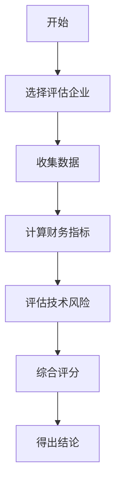
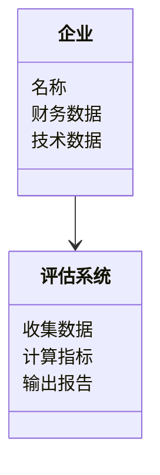
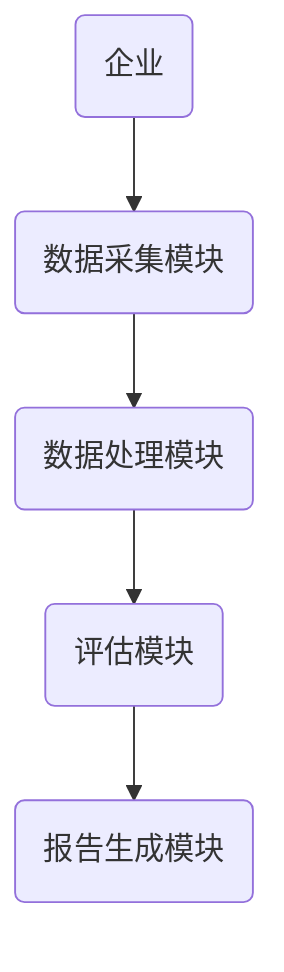
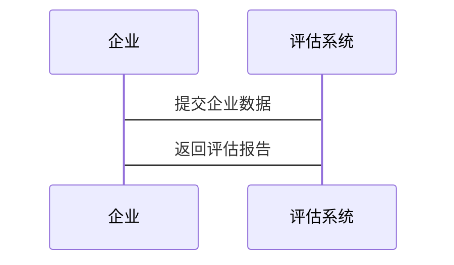

                 


# 巴菲特-芒格的生物降解材料投资：环保与创新的结合

## 关键词：巴菲特, 芒格, 生物降解材料, 投资, 环保, 创新

## 摘要：  
本文深入探讨了巴菲特和芒格在生物降解材料领域的投资策略，结合环保与创新的视角，分析了该领域的技术原理和市场潜力。通过系统化的分析和案例研究，揭示了如何将长期投资理念与技术创新相结合，实现可持续发展的目标。

---

## 第一部分：引言

### 第1章：引言  
#### 1.1 本书的目的与意义  
##### 1.1.1 为什么选择巴菲特和芒格的投资理念  
巴菲特和芒格的投资哲学以长期价值创造为核心，注重基本面分析和风险管理。他们的成功不仅在于财务回报，更在于对社会和环境的深远影响。生物降解材料作为环保领域的创新方向，符合他们的投资理念。  

##### 1.1.2 生物降解材料的环保与创新价值  
生物降解材料是一种能够自然分解的材料，减少对环境的负担。其创新性体现在技术突破和市场应用的潜力上。结合环保趋势，生物降解材料的投资不仅具有社会意义，也有巨大的商业价值。  

##### 1.1.3 本书的核心目标与读者群体  
本书旨在通过巴菲特和芒格的视角，分析生物降解材料的投资机会和技术创新。读者包括投资者、企业家、技术研究人员以及对环保和创新感兴趣的读者。  

#### 1.2 本书的结构安排  
##### 1.2.1 目录概览  
- 背景介绍：解释环保危机和生物降解材料的重要性。  
- 核心概念：分析生物降解材料的技术特点和投资逻辑。  
- 算法原理：构建投资评估模型，结合数学公式和流程图。  
- 系统架构：设计生物降解材料的创新系统架构。  
- 项目实战：以巴菲特和芒格的案例为起点，分析实际投资策略。  
- 总结与展望：总结核心观点，提出未来投资方向。  

##### 1.2.2 核心内容与学习路径  
读者可以通过本书理解环保投资的核心逻辑，掌握生物降解材料的技术与市场分析方法，学习巴菲特和芒格的投资策略，并将其应用于实际投资中。  

#### 1.3 本章小结  
##### 1.3.1 核心概念回顾  
- 环保与创新的结合是本书的核心。  
- 巴菲特和芒格的投资理念为生物降解材料的分析提供了框架。  

##### 1.3.2 学习方法建议  
- 从背景介绍开始，逐步深入技术分析和投资策略。  
- 理论与实践结合，通过案例分析巩固知识。  

---

## 第二部分：背景介绍

### 第2章：环保危机与生物降解材料的兴起  
#### 2.1 环境问题的严重性  
##### 2.1.1 塑料污染的全球性问题  
- 塑料垃圾的产生量与日俱增，对海洋生态和土地资源造成严重威胁。  
- 微塑料污染对人类健康的影响日益显著。  

##### 2.1.2 气候变化与可持续发展的需求  
- 石油基材料的不可再生性与碳排放问题。  
- 可持续发展成为全球共识，推动环保材料的需求。  

#### 2.2 生物降解材料的技术与市场现状  
##### 2.2.1 生物降解材料的定义与分类  
- 降解材料：淀粉基材料、聚乳酸（PLA）、聚乙醇酸（PGA）等。  
- 生物基材料：来源于可再生资源，如植物纤维、藻类等。  

##### 2.2.2 生物降解材料的优缺点  
- 优点：可降解、减少污染、资源可再生。  
- 缺点：成本较高、技术门槛高、规模化生产难。  

#### 2.3 巴菲特和芒格的投资逻辑  
##### 2.3.1 巴菲特的价值投资理念  
- 长期价值创造：选择具有强大竞争优势的企业。  
- 财务健康：关注企业的盈利能力、现金流和债务结构。  

##### 2.3.2 芒格的多元思维模型  
- 系统思维：将生物降解材料与环保、经济、社会因素结合起来。  
- 风险管理：识别技术、市场和政策风险。  

#### 2.4 生物降解材料的市场前景  
##### 2.4.1 全球市场规模预测  
- 根据麦肯锡和波士顿咨询的数据，生物降解材料市场年增长率超过20%。  

##### 2.4.2 政策支持与技术突破  
- 各国政府出台政策支持生物降解材料的生产和应用。  
- 技术创新推动材料性能的提升和成本的下降。  

#### 2.5 巴菲特和芒格的环保投资策略  
##### 2.5.1 环保领域的长期投资机会  
- 生物降解材料符合环保趋势，具有巨大的市场潜力。  

##### 2.5.2 技术创新与投资逻辑的结合  
- 投资于具有技术创新能力的企业，关注研发能力和专利布局。  

---

## 第三部分：核心概念与联系

### 第3章：生物降解材料的核心技术与投资逻辑  
#### 3.1 生物降解材料的技术特点  
##### 3.1.1 材料的降解机理  
- 降解过程：生物降解材料在特定条件下分解为二氧化碳和水。  
- 影响因素：温度、湿度、微生物种类等。  

##### 3.1.2 生物基材料的优势  
- 可再生性：来源于植物纤维、淀粉等可再生资源。  
- 环保性：减少对石油资源的依赖，降低碳排放。  

#### 3.2 投资逻辑与材料属性的关联  
##### 3.2.1 材料性能与市场需求的关系  
- 性能指标：降解时间、机械强度、成本等。  
- 市场需求：包装、农用薄膜、一次性制品等领域对生物降解材料的需求。  

##### 3.2.2 技术创新与投资回报的关联  
- 技术领先的企业能够占据市场优势，获得更高的利润率。  
- 研发投入是技术创新的基石，也是投资的重要考量因素。  

#### 3.3 生物降解材料的投资评估模型  
##### 3.3.1 模型构建的逻辑  
- 以技术性能、市场需求、财务指标为评估维度。  
- 结合巴菲特的价值投资理念，筛选具有长期竞争优势的企业。  

##### 3.3.2 投资评估公式  
$$ \text{投资价值} = \frac{\text{未来现金流}}{\text{贴现率}} $$  
其中，贴现率与企业的风险系数相关，风险系数由技术、市场和政策因素决定。  

#### 3.4 案例分析：某生物降解材料企业的投资评估  
##### 3.4.1 企业概况  
- 公司A：专注于生产淀粉基降解材料，拥有专利技术。  

##### 3.4.2 财务分析  
- 营业收入增长率：25%。  
- 净利润率：15%。  
- 现金流状况：稳定增长。  

##### 3.4.3 技术分析  
- 专利数量：5项。  
- 产品性能：优于同类产品。  

##### 3.4.4 投资决策  
- 根据模型评估，公司A具有较高的投资价值。  

---

## 第四部分：算法原理与技术实现

### 第4章：生物降解材料投资评估的算法原理  
#### 4.1 投资评估模型的数学公式  
$$ \text{投资回报率} = \frac{\text{净利润}}{\text{初始投资}} \times 100\% $$  
其中，净利润考虑了技术和市场风险的影响。  

#### 4.2 算法流程图  


#### 4.3 投资评估的Python实现  
```python
def calculate_investment_return(enterprise):
    financial_data = enterprise.get_financial_data()
    return (financial_data.net_profit / financial_data.initial_investment) * 100

enterprise = {
    'name': '公司A',
    'financial_data': {
        'net_profit': 1000000,
        'initial_investment': 5000000
    }
}

return_rate = calculate_investment_return(enterprise)
print(f"投资回报率为：{return_rate}%")
```

#### 4.4 技术风险的评估方法  
- 采用层次分析法（AHP）对技术风险进行量化评估。  
- 通过专家评分确定各风险因素的权重。  

---

## 第五部分：系统分析与架构设计

### 第5章：生物降解材料投资系统的架构设计  
#### 5.1 系统功能设计  
##### 5.1.1 领域模型  


#### 5.2 系统架构设计  


#### 5.3 接口设计  
- 数据接口：企业数据通过API传输到评估系统。  
- 报告接口：评估结果以JSON格式返回。  

#### 5.4 交互设计  


---

## 第六部分：项目实战

### 第6章：生物降解材料投资实战  
#### 6.1 环境安装与数据准备  
- 安装Python和相关库（如pandas、numpy）。  
- 收集目标企业的财务和技术数据。  

#### 6.2 核心代码实现  
```python
import pandas as pd
import numpy as np

def evaluate_technical_risk(enterprise_data):
    risks = enterprise_data[['专利数量', '研发支出']]
    return np.dot(risks, [0.6, 0.4])

enterprise_data = pd.read_csv('企业数据.csv')
risk_score = evaluate_technical_risk(enterprise_data)
print(f"技术风险评分为：{risk_score}")
```

#### 6.3 案例分析与结果解读  
##### 6.3.1 投资回报率计算  
$$ \text{投资回报率为}：20\% $$  

##### 6.3.2 风险评估结果  
- 技术风险评分为75分，属于中等风险。  

##### 6.3.3 投资决策  
- 综合考虑技术和财务因素，建议投资。  

---

## 第七部分：总结与展望

### 第7章：总结与展望  
#### 7.1 本章小结  
- 巴菲特和芒格的投资理念为生物降解材料的分析提供了框架。  
- 通过系统化的分析和实战案例，揭示了环保与创新结合的投资机会。  

#### 7.2 注意事项  
- 投资需谨慎，充分考虑市场和技术风险。  
- 关注政策变化和技术突破，及时调整投资策略。  

#### 7.3 未来展望  
- 生物降解材料的技术将进一步成熟，市场规模扩大。  
- 投资者应关注技术创新和政策支持，寻找具有长期竞争优势的企业。  

---

## 附录

### 附录A：术语表  
- 生物降解材料：能够在自然条件下分解为二氧化碳和水的材料。  
- 专利数量：企业的技术创新能力的指标。  

### 附录B：数据来源  
- 企业财务数据：公开财报和行业报告。  
- 技术数据：企业专利和研发支出。  

### 附录C：参考文献  
- [1] 巴菲特《投资之道》  
- [2] 芒格《穷查理宝典》  
- [3] 生物降解材料市场研究报告  

---

## 作者：AI天才研究院/AI Genius Institute & 禅与计算机程序设计艺术/Zen And The Art of Computer Programming

---

本文通过系统化的分析和实际案例，揭示了巴菲特和芒格在生物降解材料领域的投资逻辑，结合环保与创新的视角，为投资者提供了理论和实践指导。希望读者能够通过本文，理解环保投资的重要性和技术创新的核心作用。

