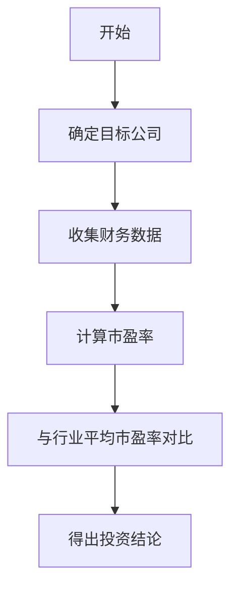
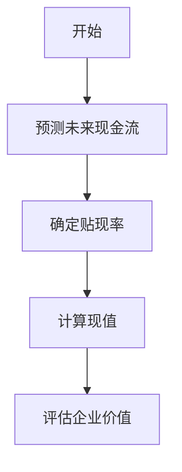
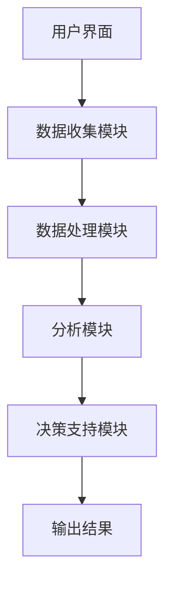

                 


# 巴菲特-芒格的电动汽车产业链投资：全面布局未来出行

> 关键词：巴菲特，芒格，电动汽车，产业链投资，电动汽车产业，电动汽车市场

> 摘要：本文将详细探讨巴菲特和芒格在电动汽车产业链上的投资策略，分析他们如何通过布局上游原材料、中游技术企业和下游整车制造商，全面覆盖电动汽车产业链的各个环节。结合实际案例，分析他们的投资逻辑和长期价值投资理念，为投资者提供深入的洞察和借鉴。

---

## 第一部分：背景介绍

### 第1章：电动汽车产业链的现状与未来

#### 1.1 问题背景
随着全球环保意识的增强和能源结构的调整，电动汽车（EV）已成为全球汽车产业发展的重要方向。电动汽车产业链的复杂性和多样性使其成为投资者关注的焦点。本章将详细分析电动汽车产业链的构成及其未来发展趋势。

#### 1.2 问题描述
电动汽车产业链包括上游原材料、中游电机电控、下游整车制造等多个环节。每个环节的技术进步和成本下降都在推动整个产业链的发展。然而，投资者需要深入了解每个环节的核心竞争力和潜在风险。

#### 1.3 问题解决
通过分析产业链的各个环节，投资者可以找到具有长期竞争优势的企业，从而在电动汽车市场中获得超额收益。

#### 1.4 边界与外延
电动汽车产业链的边界包括从原材料供应到整车制造的整个流程，而外延则涉及充电基础设施、电池回收等增值服务。

#### 1.5 核心要素组成
- **上游**：锂、镍、钴等原材料供应商。
- **中游**：电池制造商、电机和电控系统供应商。
- **下游**：电动汽车整车制造商、充电网络运营商。

### 第2章：巴菲特与芒格的投资理念

#### 2.1 巴菲特的价值投资理念
巴菲特的价值投资理念强调以合理价格买入具有持续竞争优势的企业。他注重企业的财务健康、管理层能力和长期盈利能力。

#### 2.2 芒格的多元思维模型
芒格强调通过多学科交叉思维来分析问题，寻找投资中的“复利思维”，即通过长期积累实现财富增长。

#### 2.3 投资策略的异同
虽然巴菲特和芒格的投资理念有相似之处，但芒格更注重企业的管理层和治理结构，而巴菲特更关注企业的财务指标和估值。

---

## 第二部分：核心概念与联系

### 第3章：电动汽车产业链的核心概念

#### 3.1 核心概念原理
电动汽车产业链的核心在于电池技术的进步和成本的下降。电池作为电动汽车的核心部件，决定了整车的性能和成本。

#### 3.2 关键术语解释
- **电池管理系统（BMS）**：监控电池状态，确保安全运行。
- **电机控制器**：控制电机的转速和扭矩，实现车辆动力输出。

#### 3.3 ER实体关系图
```mermaid
er
    %% 电动汽车产业链 ER 图
    %% 简要说明：展示电动汽车产业链中的实体及其关系
    %% 例如：供应商、制造商、消费者等之间的关系
    %% 请根据需要具体化
    %% 此处仅展示框架，具体内容需根据实际分析添加
```

---

## 第三部分：算法原理

### 第4章：电动汽车产业链投资的算法分析

#### 4.1 投资分析模型
使用PE（市盈率）和DCF（现金流折现）模型对电动汽车产业链中的企业进行估值。

#### 4.2 PE模型分析


#### 4.3 DCF模型分析


#### 4.4 Python代码示例
```python
import pandas as pd
import numpy as np

# 示例：计算市盈率和DCF估值
def calculate_pe(ticker):
    # 假设df是包含财务数据的DataFrame
    df = pd.DataFrame({'Revenue': [100, 200, 300], 'Net Income': [10, 20, 30])
    pe_ratio = df['Net Income'].mean() / df['Revenue'].mean()
    return pe_ratio

def calculate_dcf(ticker, cash_flows, discount_rate):
    present_value = sum([cash_flows[i] / (1 + discount_rate) ** i for i in range(len(cash_flows))])
    return present_value

# 示例计算
ticker = 'TSLA'
cash_flows = [100, 200, 300]
discount_rate = 0.08
pe_ratio = calculate_pe(ticker)
dcf_value = calculate_dcf(ticker, cash_flows, discount_rate)
print(f"PE Ratio: {pe_ratio}\nDCF Value: {dcf_value}")
```

---

## 第四部分：数学模型

### 第5章：电动汽车产业链的财务模型

#### 5.1 常用财务指标
- **市盈率（PE）**：$$ PE = \frac{\text{股价}}{\text{每股收益}} $$
- **市净率（PB）**：$$ PB = \frac{\text{股价}}{\text{每股净资产}} $$
- **ROE（净资产收益率）**：$$ ROE = \frac{\text{净利润}}{\text{净资产}} $$

#### 5.2 电池成本模型
电池成本主要由原材料、生产成本和技术研发费用构成。通过分析这些因素，可以评估电池企业的成本优势。

---

## 第五部分：系统分析与架构设计

### 第6章：电动汽车产业链投资分析系统

#### 6.1 系统架构设计


#### 6.2 功能模块设计
- **数据收集模块**：收集电动汽车产业链企业的财务数据和市场信息。
- **分析模块**：使用财务模型和算法对目标企业进行估值。
- **决策支持模块**：根据分析结果提供投资建议。

---

## 第六部分：项目实战

### 第7章：电动汽车产业链投资实战分析

#### 7.1 环境配置
安装Python、Pandas、Matplotlib等工具。

#### 7.2 数据收集与处理
收集电动汽车产业链企业的财务数据，进行清洗和预处理。

#### 7.3 模型实现
使用PE和DCF模型对目标企业进行估值。

#### 7.4 案例分析
以比亚迪为例，分析其财务数据和投资价值。

---

## 第七部分：总结与展望

### 第8章：投资的关键点与注意事项

#### 8.1 投资策略
- 长期视角：关注企业的长期竞争优势。
- 风险管理：分散投资，控制风险敞口。

#### 8.2 小结
巴菲特和芒格的投资策略为电动汽车产业链投资提供了重要启示。投资者需要结合企业基本面和技术趋势，做出明智的投资决策。

#### 8.3 注意事项
- 保持对行业动态的关注。
- 定期评估投资组合，及时调整策略。

#### 8.4 拓展阅读
推荐阅读巴菲特和芒格的著作，深入理解他们的投资哲学。

---

# 作者：AI天才研究院/AI Genius Institute & 禅与计算机程序设计艺术 /Zen And The Art of Computer Programming

