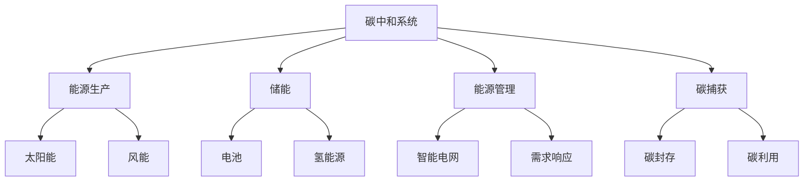
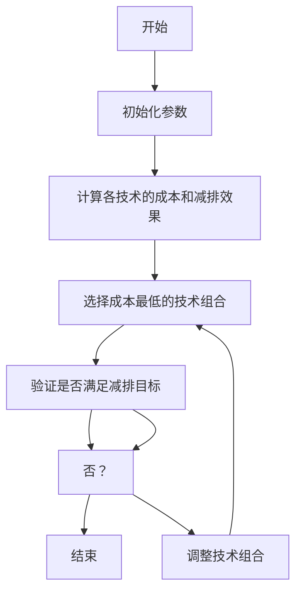

                 


# 巴菲特-芒格的碳中和技术投资：应对气候变化的创新

> 关键词：巴菲特，芒格，碳中和，技术投资，气候变化，创新

> 摘要：本文探讨了巴菲特和芒格在碳中和技术投资方面的策略和创新，分析了碳中和目标对全球经济的影响，以及如何通过技术创新和投资实现碳中和。文章结合伯克希尔 Hathaway 的投资案例，深入解析了碳中和技术创新的系统架构、算法原理和项目实战，为投资者提供了深刻的见解和实践指导。

---

## 第1章 巴菲特与芒格的投资哲学

### 1.1 巴菲特与芒格的投资理念概述

#### 1.1.1 巴菲特的价值投资理论

沃伦·巴菲特的价值投资理论是基于对公司基本面的深入分析，寻找具有持续竞争优势和良好管理的公司进行长期投资。他强调安全边际，即以低于内在价值的价格买入优质资产，以确保投资的安全性。

#### 1.1.2 芒格的多元思维模型

查理·芒格提倡多元思维模型，认为投资者应该通过多个学科的交叉分析来理解问题，避免单一视角的局限性。这种思维方式帮助投资者识别潜在的投资机会，并评估其长期价值。

#### 1.1.3 两人投资理念的结合与互补

巴菲特和芒格的投资理念互补性强，巴菲特注重短期价值和安全边际，而芒格注重长期价值和多元思维。两者的结合使伯克希尔 Hathaway 的投资策略更加稳健和多元化。

---

### 1.2 投资与风险管理的核心原则

#### 1.2.1 风险管理的重要性

风险管理是投资成功的关键，巴菲特和芒格始终将风险控制放在首位，避免过度杠杆和高风险投资。

#### 1.2.2 巴菲特的"安全边际"概念

安全边际是指买入价格低于公司内在价值的部分，确保在市场波动中仍能获得收益。

#### 1.2.3 芒格的"逆向思维"策略

芒格提倡在别人恐慌时贪婪，在别人贪婪时恐慌，逆向思考市场行为，寻找被低估的投资机会。

---

### 1.3 碳中和目标与投资机会的结合

#### 1.3.1 碳中和的定义与全球目标

碳中和是指通过减少温室气体排放，使碳排放量与碳移除量相等，实现净零排放。全球主要经济体已设定碳中和目标，推动能源转型和技术创新。

#### 1.3.2 碳中和对全球经济的影响

碳中和将重塑全球经济结构，推动新能源、储能等领域的投资机会，同时淘汰高碳产业，引发产业链重构。

#### 1.3.3 碳中和投资的长期价值

碳中和投资符合长期价值投资理念，具有可持续性和增长潜力，是巴菲特和芒格关注的重点领域。

---

## 第2章 碳中和技术创新与投资机会

### 2.1 碳中和技术创新的核心领域

#### 2.1.1 新能源技术

- 太阳能和风能是主要的可再生能源，技术进步和成本下降使其更具竞争力。

#### 2.1.2 储能技术

- 电池储能和氢能源是解决可再生能源不稳定性的关键，提高能源系统的灵活性和可靠性。

#### 2.1.3 智能电网与能源管理

- 智能电网通过实时数据和人工智能优化能源分配，提升能源使用效率。

#### 2.1.4 碳捕获与封存技术

- 碳捕获技术通过化学反应或物理分离捕获二氧化碳，封存于地下或转化为其他用途。

---

### 2.2 碳中和技术创新的驱动因素

#### 2.2.1 政策支持与法规驱动

政府政策和法规为碳中和技术提供了激励和保障，推动技术商业化和大规模应用。

#### 2.2.2 市场需求与经济激励

市场需求的增长和经济激励措施（如补贴、税收优惠）吸引了大量投资，推动技术创新。

#### 2.2.3 技术进步与成本下降

技术进步降低了碳中技术的成本，提高了效率，使其更具竞争力。

---

### 2.3 碳中和技术创新的投资逻辑

#### 2.3.1 技术成熟度评估

评估技术的成熟度和商业化潜力，选择具有长期增长潜力的领域。

#### 2.3.2 市场潜力分析

分析市场需求、竞争格局和市场进入壁垒，选择具有竞争优势的公司。

#### 2.3.3 投资风险与回报平衡

评估技术风险、市场风险和政策风险，平衡短期回报和长期价值。

---

## 第3章 伯克希尔 Hathaway 的碳中和投资实践

### 3.1 伯克希尔 Hathaway 的投资策略

#### 3.1.1 长期价值投资的核心理念

伯克希尔 Hathaway 通过长期价值投资，寻找具有持续竞争优势的公司，注重公司的管理和财务健康。

#### 3.1.2 股票投资与控股公司的结合

伯克希尔通过控股公司布局多个领域，分散风险，同时通过股票投资集中配置优质资产。

#### 3.1.3 能源领域的投资布局

伯克希尔在能源领域进行了大量投资，特别是在可再生能源和储能技术方面，推动能源结构转型。

---

### 3.2 碳中和相关投资案例分析

#### 3.2.1 太阳能与风能项目的投资

伯克希尔投资于太阳能和风能项目，通过规模效应降低成本，推动可再生能源的广泛应用。

#### 3.2.2 储能技术的布局

伯克希尔通过投资储能技术，解决可再生能源的间歇性问题，提升能源系统的稳定性。

#### 3.2.3 智能电网与能源管理的投资

伯克希尔投资智能电网和能源管理技术，优化能源分配，提高能源使用效率。

---

### 3.3 投资案例的启示

#### 3.3.1 成功经验总结

伯克希尔的成功在于长期价值投资和多元化布局，注重技术创新和政策支持。

#### 3.3.2 投资风险的应对策略

通过多元化投资和严格的风险管理，降低投资风险，确保投资的稳健回报。

#### 3.3.3 未来投资方向的展望

未来将继续关注新能源、储能技术和碳捕获等领域，推动碳中和目标的实现。

---

## 第4章 碳中和技术创新的系统分析与架构设计

### 4.1 碳中和技术创新的系统架构

#### 4.1.1 系统整体架构图

以下是一个碳中和技术创新的系统架构图，展示了各模块之间的关系：



#### 4.1.2 关键技术模块分析

- **能源生产模块**：包括太阳能和风能的发电技术，是碳中和系统的核心部分。
- **储能模块**：包括电池和氢能源技术，用于存储和调配能源。
- **能源管理模块**：包括智能电网和需求响应技术，优化能源分配。
- **碳捕获模块**：包括碳封存和碳利用技术，减少温室气体排放。

#### 4.1.3 系统功能需求分析

碳中和系统的功能需求包括：

1. 实时监测和优化能源生产与消耗。
2. 储能和调配能源，确保能源供应的稳定性。
3. 实现智能电网和需求响应，提高能源使用效率。
4. 碳捕获和封存，减少温室气体排放。

---

### 4.2 碳中和技术创新的算法原理

#### 4.2.1 碳中和优化算法的数学模型

以下是一个碳中和优化算法的数学模型示例：

$$ \text{目标函数：} \quad \min \sum_{i=1}^{n} c_i x_i $$

$$ \text{约束条件：} \quad \sum_{i=1}^{n} x_i \geq D $$

其中，\( c_i \) 是第 \( i \) 项技术的成本，\( x_i \) 是投资量，\( D \) 是目标碳减排量。

#### 4.2.2 算法流程图

以下是一个碳中和优化算法的流程图：



---

### 4.3 碳中和技术创新的数学模型

#### 4.3.1 碳排放计算公式

碳排放计算公式：

$$ \text{碳排放量} = \sum_{i=1}^{n} a_i \times x_i $$

其中，\( a_i \) 是第 \( i \) 项技术的单位碳排放量，\( x_i \) 是投资量。

#### 4.3.2 碳中和目标函数

碳中和目标函数：

$$ \text{目标函数：} \quad \min \sum_{i=1}^{n} c_i x_i $$

$$ \text{约束条件：} \quad \sum_{i=1}^{n} x_i \geq D $$

---

## 第5章 碳中和技术创新的项目实战

### 5.1 项目环境与工具安装

#### 5.1.1 开发环境配置

推荐使用Python和相关库（如NumPy、Pandas、Matplotlib）进行数据分析和可视化。

#### 5.1.2 依赖库的安装

安装以下依赖库：

```bash
pip install numpy pandas matplotlib
```

#### 5.1.3 项目代码仓库的克隆

克隆代码仓库：

```bash
git clone https://github.com/your-repository/carbon-neutrality.git
```

---

### 5.2 项目核心功能的实现

#### 5.2.1 碳排放计算模块

以下是碳排放计算模块的Python代码：

```python
import numpy as np
import pandas as pd

def calculate_emissions(data):
    emissions = np.dot(data['energy_consumption'], data['emission_factor'])
    return emissions
```

#### 5.2.2 碳中和优化算法实现

以下是碳中和优化算法的Python代码：

```python
def optimize_carbon_neutrality(data):
    cost = data['cost']
    emission_factor = data['emission_factor']
    target = data['target_emission']
    
    # 初始解
    solution = np.zeros(len(cost))
    solution[np.argmin(cost)] = 1
    
    # 优化过程
    while True:
        current_emission = np.dot(solution, emission_factor)
        if current_emission <= target:
            break
        # 调整解
        min_cost_index = np.argmin(cost)
        solution[min_cost_index] = 1
    return solution
```

#### 5.2.3 系统接口设计与实现

以下是系统接口设计的Python代码：

```python
class CarbonNeutralitySystem:
    def __init__(self, data):
        self.data = data
    
    def calculate_emissions(self):
        return self.calculate_emissions(self.data)
    
    def optimize_solution(self):
        return self.optimize_carbon_neutrality(self.data)
```

---

### 5.3 实际案例分析

#### 5.3.1 案例背景

假设我们有一个可再生能源项目，目标是减少碳排放量，选择最优的技术组合。

#### 5.3.2 数据分析与建模

分析各技术的成本和减排效果，建立数学模型进行优化。

#### 5.3.3 算法实现与结果解读

通过算法选择最优的技术组合，验证是否满足减排目标。

---

### 5.4 项目小结

通过项目实战，我们学会了如何将碳中和技术创新的理论应用于实际，掌握了算法实现和系统设计的关键步骤。

---

## 附录

### 附录A 巴菲特与芒格的经典语录

- 巴菲特："价格是买进的阻力，价值是卖出的阻力。"
- 芒格："机会来自于错误发生的时候，而不是在你正确的时候。"

---

### 附录B 碳中和相关技术的最新发展

- 全球范围内，可再生能源技术的成本持续下降。
- 碳捕获技术逐渐成熟，商业化进程加快。
- 智能电网和能源管理技术的应用日益广泛。

---

## 参考文献

1. 巴菲特，沃伦. 《巴菲特致股东的信》
2. 芒格，查理. 《芒格投资哲学》
3. 全球碳中和相关研究报告

---

## 作者

作者：AI天才研究院/AI Genius Institute & 禅与计算机程序设计艺术 /Zen And The Art of Computer Programming

