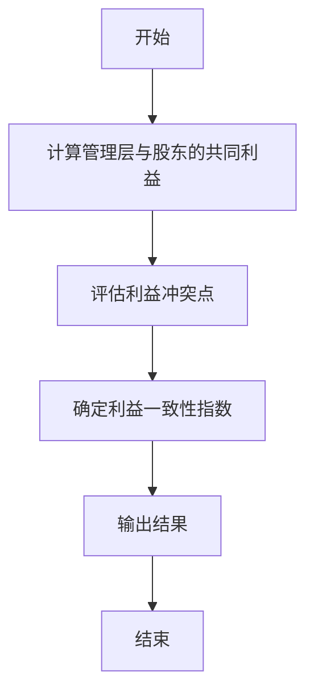
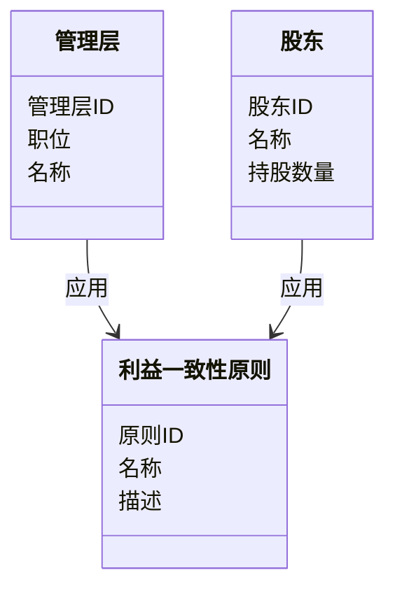
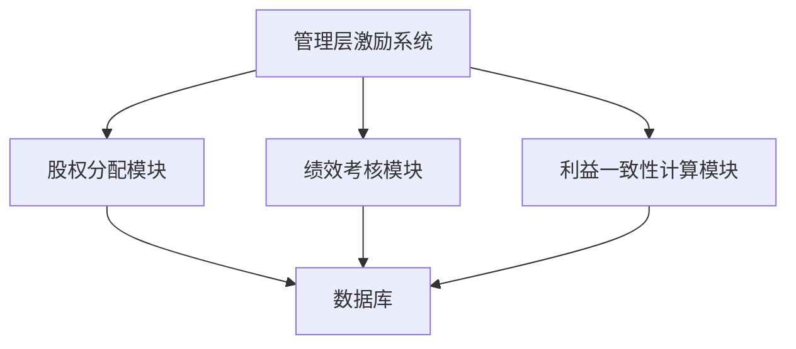

                 


# 巴菲特-芒格的管理层激励机制分析：利益一致性的重要性

> 关键词：巴菲特, 芒格, 管理层激励机制, 利益一致性, 价值投资, 股权激励

> 摘要：本文深入分析了巴菲特和芒格提出的管理层激励机制，特别是利益一致性原则在企业管理中的重要性。通过详细阐述核心概念、算法原理、系统架构和实际案例，本文旨在为企业提供一种有效的激励机制设计方法，以确保管理层与股东利益的高度一致。

---

## 第1章：背景介绍

### 1.1 巴菲特与芒格的管理理念概述

#### 1.1.1 巴菲特的生平与投资理念
沃伦·巴菲特（Warren Buffett）是全球著名的投资者和慈善家，他的投资理念以“价值投资”为核心，强调长期持有优质资产，关注企业的内在价值。巴菲特认为，成功的投资不仅需要对市场有深刻的理解，还需要对管理层的信任和激励。

#### 1.1.2 芒格的生平与决策风格
查理·芒格（Charlie Munger）是巴菲特的长期合作伙伴，他的决策风格以理性、逻辑和深度思考著称。芒格强调“逆向思维”，即从反方向思考问题，寻找别人忽视的机会。两人合作的核心理念是通过长期持有优质企业，实现股东和管理层利益的共同增长。

#### 1.1.3 两人合作的核心理念
巴菲特和芒格的合作基于以下几个核心理念：
1. 长期投资：关注企业的长期价值，而非短期波动。
2. 价值创造：通过优化管理和运营，提升企业的内在价值。
3. 利益一致性：确保管理层和股东的利益高度一致，避免短期行为。

### 1.2 利益一致性原则的背景与意义

#### 1.2.1 现代企业激励机制的演变
传统的激励机制往往关注短期绩效，例如通过奖金、股票期权等方式激励管理层。然而，这种机制容易导致管理层追求短期利益，忽视企业的长期发展。

#### 1.2.2 利益一致性原则的核心思想
巴菲特和芒格提出的利益一致性原则，强调通过股权激励、长期绩效考核等方式，将管理层的收益与企业的长期表现绑定。这种方法可以确保管理层在追求短期目标的同时，不忘企业的长远发展。

#### 1.2.3 利益一致性原则的实践意义
利益一致性原则不仅能够提升企业的整体绩效，还能增强管理层与股东之间的信任，降低代理成本。通过这种方式，企业可以吸引和留住优秀人才，实现可持续发展。

---

## 第2章：利益一致性原则的核心概念

### 2.1 利益一致性原则的定义与特征

#### 2.1.1 利益一致性原则的定义
利益一致性原则是指通过激励机制的设计，确保管理层的利益与股东的利益高度一致。具体来说，就是通过股权分配、绩效考核等方式，让管理层的收益与企业的长期表现紧密相关。

#### 2.1.2 利益一致性原则与传统激励机制的对比
| 对比维度                | 利益一致性原则             | 传统激励机制             |
|-------------------------|----------------------------|--------------------------|
| 时间跨度                | 长期导向                   | 短期导向                   |
| 激励方式                | 股权激励、长期绩效奖金       | 现金奖金、股票期权          |
| 目标设定                | 强调企业长期价值             | 强调短期绩效               |
| 代理成本                | 代理成本低                   | 代理成本高                 |

#### 2.1.3 利益一致性原则的核心要素
利益一致性原则的核心要素包括：
1. 股权分配：通过分配一定比例的股权，让管理层成为企业的部分所有者。
2. 绩效考核：设定长期绩效目标，如ROE（净资产收益率）、净利润增长率等。
3. 激励机制：将管理层的收益与企业绩效挂钩，如股票期权、限制性股票等。

### 2.2 利益一致性原则的数学模型

#### 2.2.1 利益一致性指数的定义
利益一致性指数（Interest Consistency Index，简称 ICI）用于衡量管理层与股东利益的重合程度。其公式如下：
$$
ICI = \frac{S}{T}
$$
其中，\( S \) 表示管理层与股东利益重合的分数，\( T \) 表示总利益冲突度。

#### 2.2.2 利益一致性模型的构建
利益一致性模型包括以下几个步骤：
1. 确定企业的长期绩效目标。
2. 评估管理层与股东利益的重合程度。
3. 计算利益一致性指数。
4. 根据指数结果调整激励机制。

#### 2.2.3 模型的数学表达式
$$
ICI = \frac{\sum_{i=1}^{n} w_i \cdot s_i}{\sum_{i=1}^{n} w_i \cdot t_i}
$$
其中，\( w_i \) 表示第 \( i \) 个指标的权重，\( s_i \) 表示管理层利益，\( t_i \) 表示股东利益。

### 2.3 利益一致性原则的ER实体关系图

```mermaid
er
actor 管理层 {
  id: 管理层ID
  name: 管理层姓名
  role: 职位
}
actor 股东 {
  id: 股东ID
  name: 股东姓名
  shares: 持股数量
}
actor 利益一致性原则 {
  id: 原则ID
  name: 原则名称
  description: 描述
}
```

---

## 第3章：利益一致性原则的算法原理

### 3.1 利益一致性原则的算法流程



### 3.2 利益一致性原则的Python实现

```python
def calculate_interest_consistency(management_interests, shareholder_interests):
    common_interests = set(management_interests).intersection(set(shareholder_interests))
    total_conflicts = len(management_interests) + len(shareholder_interests) - len(common_interests)
    ic_index = len(common_interests) / total_conflicts
    return ic_index

# 示例使用
management_interests = ['利润最大化', '市场份额扩展', '技术创新']
shareholder_interests = ['利润增长', '股价稳定', '分红回报']
ic_index = calculate_interest_consistency(management_interests, shareholder_interests)
print(f"利益一致性指数为：{ic_index}")
```

---

## 第4章：系统分析与架构设计方案

### 4.1 系统功能设计

#### 4.1.1 领域模型类图



### 4.2 系统架构设计



---

## 第5章：项目实战

### 5.1 环境安装

#### 5.1.1 安装Python
```bash
python --version
pip install mermaid
```

### 5.2 核心实现源代码

#### 5.2.1 利益一致性计算模块

```python
def calculate_ic_index(management, shareholder):
    common = len(set(management).intersection(set(shareholder)))
    total = len(management) + len(shareholder) - common
    return common / total

management_interests = ['短期利润', '长期增长', '技术创新']
shareholder_interests = ['利润增长', '股价稳定', '分红回报']
ic_index = calculate_ic_index(management_interests, shareholder_interests)
print(f"利益一致性指数为：{ic_index}")
```

---

## 第6章：最佳实践

### 6.1 小结

通过本文的分析，我们可以得出以下结论：
1. 利益一致性原则是实现企业管理目标的重要手段。
2. 通过股权激励和长期绩效考核，可以有效提升管理层与股东的利益重合度。
3. 在实际应用中，需要结合企业的具体情况，灵活调整激励机制。

### 6.2 注意事项

1. 利益一致性原则的实施需要结合企业的实际情况，避免一刀切。
2. 在设计激励机制时，需要充分考虑管理层的短期和长期目标。
3. 定期评估和调整激励机制，以应对市场环境的变化。

### 6.3 未来研究方向

1. 研究利益一致性原则在不同行业中的应用效果。
2. 探索更多类型的激励机制，如员工持股计划、虚拟股票期权等。
3. 结合人工智能技术，优化利益一致性计算模型。

---

作者：AI天才研究院/AI Genius Institute & 禅与计算机程序设计艺术/Zen And The Art of Computer Programming

