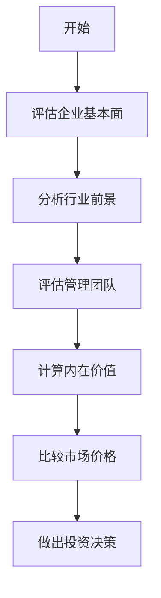
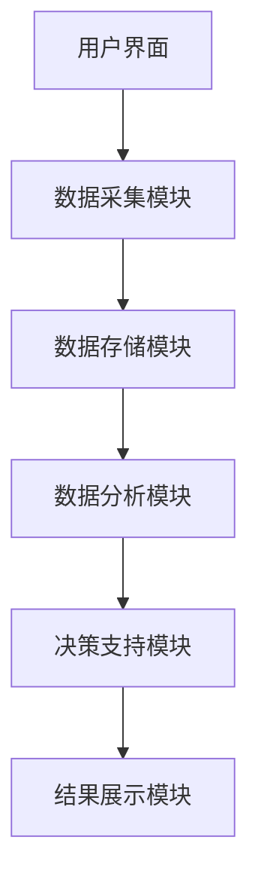
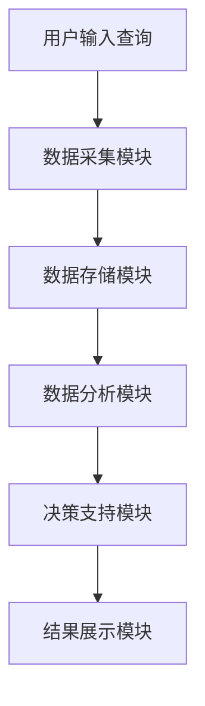

                 


# 巴菲特-芒格的纳米医学投资：精准医疗的微观革命

## 关键词：巴菲特，芒格，纳米医学，精准医疗，投资策略，系统设计

## 摘要

本文探讨了巴菲特和芒格在纳米医学领域的投资策略，分析了纳米医学如何推动精准医疗的发展。通过详细的技术分析，包括纳米医学和精准医疗的基本概念、投资决策模型、系统架构设计以及项目实战案例，本文揭示了如何将投资理念应用于实际医疗领域，推动医学技术的进步。

---

## 第一部分：背景介绍

### 第1章：纳米医学与精准医疗概述

#### 1.1 纳米医学的基本概念

- **1.1.1 纳米医学的定义**
  纳米医学是利用纳米技术在医学领域的应用，用于疾病诊断、治疗和监测。

- **1.1.2 纳米医学的核心技术与应用领域**
  - 核心技术：纳米材料合成、纳米传感器、纳米药物递送。
  - 应用领域：癌症治疗、基因编辑、诊断工具。

- **1.1.3 纳米医学与传统医学的对比**
  - 精准性：纳米医学能够更精准地靶向病变部位，减少副作用。
  - 效率：纳米技术提高了诊断和治疗的效率。

#### 1.2 精准医疗的概念与特点

- **1.2.1 精准医疗的定义**
  精准医疗是基于患者个体特征制定个性化治疗方案。

- **1.2.2 精准医疗的优势与挑战**
  - 优势：提高治疗效果，减少浪费。
  - 挑战：数据获取、技术成本、隐私问题。

- **1.2.3 纳米医学在精准医疗中的作用**
  纳米技术提供了更精准的诊断和治疗手段，是精准医疗的重要组成部分。

#### 1.3 巴菲特与芒格的投资理念

- **1.3.1 巴菲特的价值投资理论**
  价值投资强调长期持有优质资产，关注企业的内在价值。

- **1.3.2 芒格的多元思维模型**
  芒格主张通过多学科思维模型来分析问题，寻找投资机会。

- **1.3.3 两人投资理念的结合与应用**
  结合长期价值和多维度分析，巴菲特和芒格在纳米医学领域寻找具备长期潜力的企业。

#### 1.4 纳米医学投资的背景与意义

- **1.4.1 纳米医学投资的兴起**
  随着纳米技术的发展，其在医学领域的应用越来越广泛。

- **1.4.2 精准医疗对医疗行业的影响**
  精准医疗提高了治疗效果，降低了医疗成本。

- **1.4.3 巴菲特与芒格投资纳米医学的意义**
  他们的投资推动了纳米医学技术的商业化，促进了精准医疗的发展。

---

## 第二部分：核心概念与联系

### 第2章：纳米医学与精准医疗的核心要素

#### 2.1 纳米医学的核心要素

- **2.1.1 纳米材料的特性**
  - 纳米材料具有独特的物理和化学性质，如高表面积和催化活性。

- **2.1.2 纳米技术在医学中的应用**
  - 纳米传感器用于实时监测，纳米药物递送系统用于靶向治疗。

- **2.1.3 纳米医学的创新点**
  创新点在于精准性和高效性，减少了传统医学的副作用和成本。

#### 2.2 精准医疗的核心要素

- **2.2.1 精准医疗的目标**
  根据患者个体特征制定个性化治疗方案。

- **2.2.2 精准医疗的关键技术**
  - 基因测序技术：用于个性化诊断。
  - 纳米技术：用于精准治疗和监测。

- **2.2.3 精准医疗的实施步骤**
  1. 数据采集：收集患者的基因、蛋白质等信息。
  2. 数据分析：利用AI和大数据技术进行分析。
  3. 制定方案：根据分析结果制定个性化治疗方案。

#### 2.3 巴菲特与芒格投资策略的核心要素

- **2.3.1 价值投资的核心要素**
  - 企业基本面：关注企业的盈利能力、财务状况。
  - 长期潜力：选择具备长期增长潜力的企业。

- **2.3.2 多元思维模型的应用**
  - 跨学科分析：从多个角度评估企业的价值和风险。

- **2.3.3 投资策略的创新点**
  将长期价值投资与多学科分析相结合，精准识别高潜力企业。

---

### 第3章：纳米医学与精准医疗的联系

#### 3.1 纳米医学与精准医疗的对比分析

| 特性       | 纳米医学                | 精准医疗               |
|------------|-------------------------|-------------------------|
| 定义       | 纳米技术在医学中的应用   | 个性化医疗方案          |
| 核心技术   | 纳米材料、传感器        | 基因测序、AI分析        |
| 应用领域   | 癌症治疗、诊断工具      | 个性化治疗、预防        |
| 优势       | 精准性高、副作用少      | 效果显著、成本降低      |

#### 3.2 纳米医学与精准医疗的关联

- **3.2.1 纳米技术在精准医疗中的作用**
  纳米传感器和药物递送系统是精准医疗的重要工具。

- **3.2.2 精准医疗推动纳米医学的发展**
  精准医疗的需求促进了纳米技术在医学领域的应用。

#### 3.3 巴菲特与芒格投资策略与精准医疗的关联

- **3.3.1 投资策略的核心要素**
  - 长期价值投资：关注企业的长期发展潜力。
  - 多元思维模型：从多个角度评估企业的价值和风险。

- **3.3.2 投资策略对精准医疗的影响**
  巴菲特和芒格的投资推动了纳米医学技术的商业化，促进了精准医疗的发展。

---

## 第三部分：投资决策模型

### 第3章：巴菲特与芒格的投资决策模型

#### 3.1 投资决策模型的核心原理

- **3.1.1 价值投资模型**
  价值投资模型基于企业的内在价值，寻找被市场低估的企业。

- **3.1.2 多元思维模型**
  多元思维模型通过多个学科的视角分析问题，寻找投资机会。

#### 3.2 投资决策模型的算法流程



#### 3.3 投资决策模型的数学模型

- **3.3.1 市盈率计算**
  $$市盈率 = \frac{股票价格}{每股收益}$$

- **3.3.2 市净率计算**
  $$市净率 = \frac{股票价格}{每股净资产}$$

- **3.3.3 内在价值估算**
  $$内在价值 = \frac{未来现金流}{折现率}$$

---

## 第四部分：系统分析与架构设计

### 第4章：纳米医学投资决策支持系统

#### 4.1 系统设计背景

- 系统目标：辅助投资者进行纳米医学领域的投资决策。
- 项目介绍：构建一个基于巴菲特和芒格投资策略的决策支持系统。

#### 4.2 系统功能设计

- 数据采集模块：收集企业的财务数据、行业信息。
- 数据分析模块：利用AI和大数据技术进行分析。
- 决策支持模块：提供投资建议和风险评估。

#### 4.3 系统架构设计



#### 4.4 系统接口设计

- API接口：提供数据接口，供第三方调用。
- 接口协议：使用RESTful API，支持JSON格式数据。

#### 4.5 系统交互流程图



---

## 第五部分：项目实战

### 第5章：纳米医学投资决策实战案例

#### 5.1 环境安装

- 安装Python环境：使用Anaconda或Miniconda。
- 安装相关库：Pandas、NumPy、Scikit-learn、Matplotlib。

#### 5.2 系统核心实现源代码

```python
import pandas as pd
import numpy as np
from sklearn import linear_model

# 加载数据
data = pd.read_csv('medical_data.csv')

# 计算市盈率
data['PE'] = data['股票价格'] / data['每股收益']

# 计算市净率
data['PB'] = data['股票价格'] / data['每股净资产']

# 计算内在价值
data['内在价值'] = data['未来现金流'] / data['折现率']

# 输出结果
print(data[['股票名称', 'PE', 'PB', '内在价值']])
```

#### 5.3 代码应用解读与分析

- **代码功能：** 计算市盈率、市净率和内在价值，评估股票的投资价值。
- **数据来源：** 数据来自公开的医疗行业数据集。
- **结果分析：** 输出每只股票的市盈率、市净率和内在价值，供投资者参考。

#### 5.4 实际案例分析

- 案例：假设某纳米医学公司数据如下：
  - 股票价格：$100
  - 每股收益：$10
  - 每股净资产：$20
  - 未来现金流：$150
  - 折现率：10%
  
  计算结果：
  - 市盈率：10
  - 市净率：5
  - 内在价值：150 / 0.1 = 1500

  分析：市盈率和市净率均低于行业平均水平，内在价值远高于市场价格，具有投资价值。

#### 5.5 项目小结

- 通过代码实现投资价值评估，验证巴菲特和芒格的投资策略。
- 系统能够辅助投资者进行纳米医学领域的投资决策。

---

## 第六部分：最佳实践

### 第6章：投资策略与系统设计的最佳实践

#### 6.1 小结

- 纳米医学和精准医疗是未来医疗发展的重要方向。
- 巴菲特和芒格的投资策略为纳米医学投资提供了有效的指导。

#### 6.2 投资注意事项

- **风险控制：** 评估企业的财务状况和行业风险。
- **长期视角：** 关注企业的长期发展潜力。
- **技术发展：** 关注纳米技术的最新进展。

#### 6.3 拓展阅读

- 巴菲特的《巴菲特致股东的信》。
- 芒格的《Poor Charlie's Almanack》。
- 纳米医学领域的相关文献和研究报告。

---

## 作者：AI天才研究院/AI Genius Institute & 禅与计算机程序设计艺术 /Zen And The Art of Computer Programming

---

以上是《巴菲特-芒格的纳米医学投资：精准医疗的微观革命》的完整目录大纲和文章内容。文章详细探讨了纳米医学和精准医疗的基本概念，巴菲特和芒格的投资理念，以及如何将这些理念应用于实际投资决策中。通过具体案例分析和系统设计，展示了如何利用技术手段推动精准医疗的发展。

