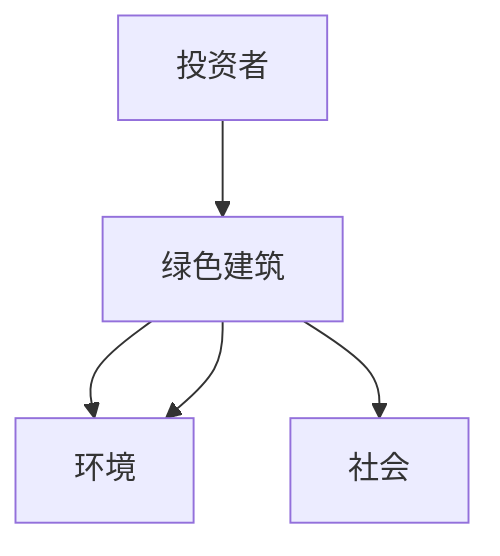
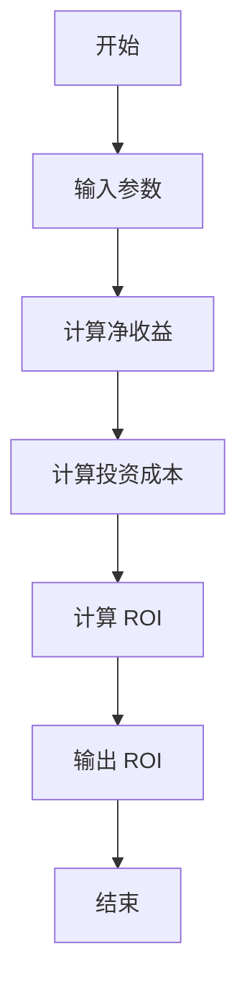
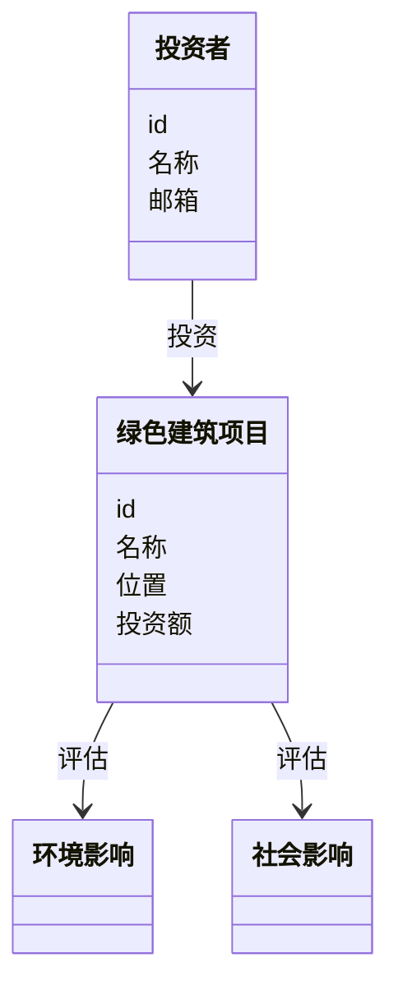
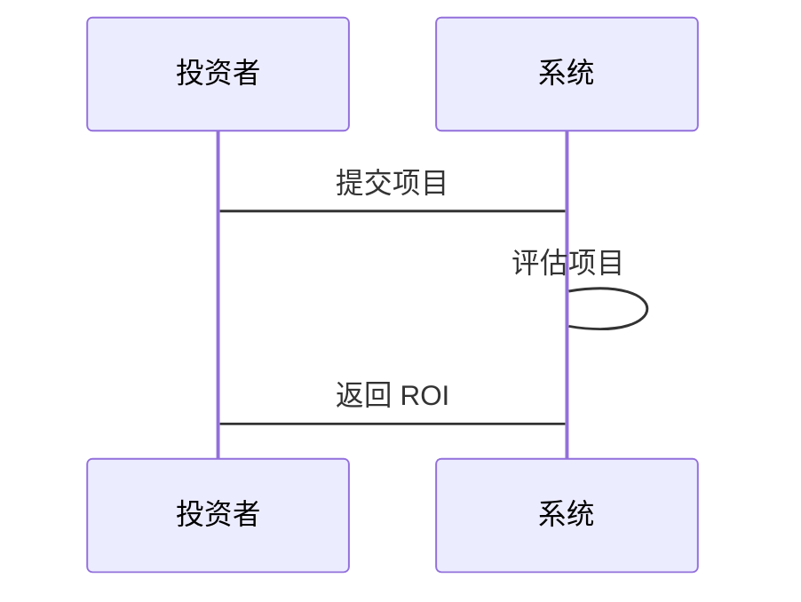

                 


# 巴菲特-芒格的绿色建筑投资：可持续发展的城市未来

## 关键词：绿色建筑、可持续发展、巴菲特、芒格、投资策略、城市规划、环境影响

## 摘要

本文深入探讨了巴菲特和芒格在绿色建筑投资领域的策略及其对可持续城市发展的影响。通过分析绿色建筑的核心概念、投资模型、系统架构以及实际案例，本文揭示了绿色建筑投资的经济与环境双重价值，并提供了实践指南和未来展望。

## 第一部分：绿色建筑与可持续发展的背景

### 第1章：绿色建筑与可持续发展的背景

#### 1.1 绿色建筑的定义与特点

绿色建筑是指在设计、施工和运营过程中最大限度地减少对环境的负面影响，同时提供健康、舒适和高效使用空间的建筑。其特点包括：

- **环保性**：采用节能材料和可再生能源。
- **经济性**：降低运营成本，提高资产价值。
- **社会性**：创造健康的生活环境，提升居住质量。

#### 1.2 巴菲特与芒格的投资理念

巴菲特的价值投资策略强调长期稳定和内在价值，而芒格的多元思维模型则注重跨学科思考。两人共同注重基本面分析和长期价值。

- **巴菲特的价值投资**：寻找具有持续竞争优势和良好治理的企业。
- **芒格的多元思维**：通过跨学科分析，识别潜在投资机会。

#### 1.3 绿色建筑投资的背景与意义

随着全球气候变化加剧，绿色建筑投资成为实现可持续发展的重要手段。它不仅减少环境影响，还能带来经济效益。

- **全球气候变化**：推动绿色建筑需求。
- **可持续发展**：绿色建筑是实现低碳经济的关键。
- **经济价值**：绿色建筑提升资产价值和投资回报。

## 第二部分：绿色建筑投资的核心概念与联系

### 第2章：绿色建筑投资的核心概念

#### 2.1 绿色建筑投资的定义与特点

绿色建筑投资是指在绿色建筑项目中的资金投入，具有高初始成本、长期回报和政策支持等特点。

- **高初始成本**：绿色技术初期投资较高。
- **长期回报**：节能和环保带来持续收益。
- **政策支持**：政府补贴和税收优惠。

#### 2.2 绿色建筑投资的属性特征对比

通过对比分析，绿色建筑投资在可持续性、环保性和社会性方面具有明显优势。

| 属性       | 可持续性 | 经济性 | 环保性 | 社会性 |
|------------|----------|--------|--------|--------|
| 可持续性     | 高       | 中     | 高     | 高     |
| 经济性       | 中       | 高     | 中     | 中     |
| 环保性       | 高       | 中     | 高     | 中     |
| 社会性       | 高       | 中     | 中     | 高     |

#### 2.3 绿色建筑投资的ER实体关系图



## 第三部分：绿色建筑投资的算法原理

### 第3章：绿色建筑投资的评估模型

#### 3.1 绿色建筑投资的评估框架

评估绿色建筑投资需考虑项目可行性、投资回报率和风险因素。

- **项目可行性分析**：评估市场需求、技术可行性和经济可行性。
- **投资回报率计算**：使用净现值、内部收益率等指标。
- **风险评估模型**：识别市场、技术和政策风险。

#### 3.2 投资回报率的数学模型

投资回报率（ROI）计算公式：

$$ ROI = \frac{净收益}{投资成本} \times 100\% $$

示例：

$$ ROI = \frac{100}{500} \times 100\% = 20\% $$

#### 3.3 算法流程图



#### 3.4 代码实现

```python
def calculateROI(net_profit, cost):
    return (net_profit / cost) * 100

# 示例
net_profit = 100000
cost = 500000
roi = calculateROI(net_profit, cost)
print(f"ROI: {roi}%")
```

### 第4章：系统分析与架构设计

#### 4.1 项目介绍

本项目旨在开发绿色建筑投资评估系统，帮助投资者评估绿色建筑项目。

#### 4.2 系统功能设计

系统功能包括用户管理、项目评估、数据可视化和报告生成。



#### 4.3 系统架构设计

系统架构采用分层设计，包括数据层、业务逻辑层和表现层。


#### 4.4 系统接口设计

系统接口包括：

- 用户登录接口
- 项目提交接口
- 评估结果查询接口

#### 4.5 系统交互设计



### 第5章：项目实战

#### 5.1 环境安装

安装Python和必要的库：

```bash
pip install numpy pandas matplotlib
```

#### 5.2 核心代码实现

实现绿色建筑投资评估的代码：

```python
import numpy as np
import pandas as pd

def calculate_energy_efficiency(energy_usage, target):
    return (target / energy_usage) * 100

data = {'建筑类型': ['住宅', '商业', '公共'],
        '能源使用': [100, 150, 80]}
df = pd.DataFrame(data)
efficiency = calculate_energy_efficiency(df['能源使用'], 100)
print(efficiency)
```

#### 5.3 案例分析

以某个绿色建筑项目为例，分析其投资回报率和环境影响。

### 第6章：最佳实践与小结

#### 6.1 投资建议

- **长期视角**：关注长期回报和环境效益。
- **技术驱动**：采用先进技术和管理系统。
- **政策支持**：利用政府补贴和税收优惠。

#### 6.2 注意事项

- **风险管理**：识别和应对市场和技术风险。
- **持续监控**：定期评估项目表现。
- **团队合作**：跨学科团队合作提升投资效果。

#### 6.3 未来展望

随着技术进步和政策支持，绿色建筑投资将更加重要，推动城市可持续发展。

## 作者

作者：AI天才研究院/AI Genius Institute & 禅与计算机程序设计艺术 /Zen And The Art of Computer Programming

---

这篇博客文章系统地介绍了绿色建筑投资的背景、核心概念、算法原理、系统架构和项目实战，为读者提供了全面的视角和实用的指导。通过详细分析巴菲特和芒格的投资策略，文章展示了绿色建筑投资在实现可持续发展中的重要作用。

