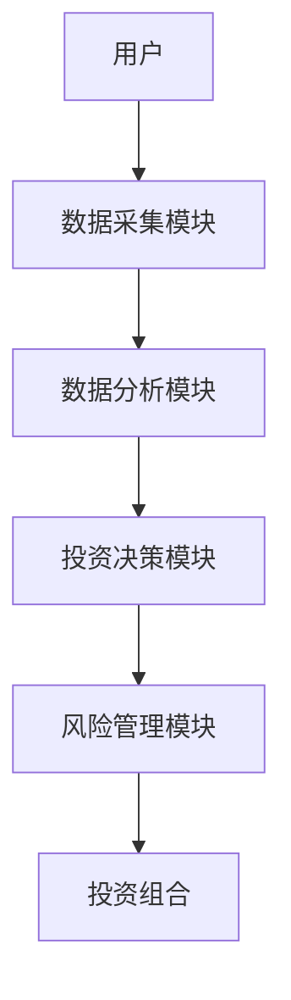

                 

# 巴菲特-芒格的耐心投资：等待击球的好球

## 关键词：巴菲特、芒格、价值投资、耐心投资、安全边际、复利效应

## 摘要：本书系统介绍了巴菲特和芒格的投资哲学，重点分析了耐心投资的核心概念、价值投资的理论基础、安全边际的应用方法以及复利效应的数学模型。通过实际案例分析和系统架构设计，展示了如何在实际投资中应用这些理论，帮助读者掌握耐心投资的策略和技巧。

---

# 第一部分: 背景介绍

## 第1章: 巴菲特与芒格的投资哲学

### 1.1 巴菲特的背景与投资理念

#### 1.1.1 巴菲特的生平与投资历程
- 巴菲特的早年经历：从小展现出对投资的兴趣。
- 成立巴菲特合伙公司：早期投资策略的成功与挑战。
- 伯克希尔哈撒韦的收购与发展：从一家保险公司到投资巨头的转变。

#### 1.1.2 巴菲特的投资理念
- 价值投资的核心：寻找低于内在价值的股票。
- 长期投资的重要性：复利效应的力量。
- 投资的三步曲：找到好企业、以合理价格买入、长期持有。

#### 1.1.3 巴菲特的投资风格
- 集中投资：将资金集中在少数优质企业上。
- 避免短期波动：忽略市场的短期波动，关注企业的长期价值。
- 安全边际：买入价格低于内在价值，以降低风险。

### 1.2 芮格的背景与投资理念

#### 1.2.1 芮格的生平与投资历程
- 芮格的早年经历：从律师到投资家的转型。
- 芮格的多元思维模型：通过跨学科思考来评估企业价值。
- 芮格与巴菲特的合作：两人理念的互补性。

#### 1.2.2 芮格的投资理念
- 多元思维模型：将多个学科的原理应用到投资决策中。
- 慎思与独立思考：避免从众心理，独立判断企业价值。
- 风险管理：通过分散投资和严格选股来降低风险。

### 1.3 巴菲特与芒格合作的里程碑事件

#### 1.3.1 伯克希尔哈撒韦的收购策略
- 收购国民保险公司的案例分析。
- 收购可口可乐公司的案例分析。
- 收购吉列刀片公司的案例分析。

#### 1.3.2 巴菲特与芒格的合作模式
- 投资决策的分工与合作。
- 两人在股东大会上的互动与交流。
- 两人在伯克希尔哈撒韦董事会中的角色。

---

## 第2章: 耐心投资的核心概念

### 2.1 耐心投资的定义与特征

#### 2.1.1 耐心投资的定义
- 耐心投资是一种长期投资策略，强调等待好的投资机会，而不是频繁交易。
- 耐心投资的核心在于寻找具有持续竞争优势的企业，以合理价格买入并长期持有。

#### 2.1.2 耐心投资的特征
- 长期视角：关注企业的长期价值，而不是短期市场波动。
- 价值导向：寻找低于内在价值的企业，避免追涨杀跌。
- 安全边际：买入价格低于内在价值，以降低投资风险。

### 2.2 耐心投资与传统投资的区别

#### 2.2.1 传统投资的特点
- 短期交易：频繁买卖股票，试图通过市场波动获利。
- 技术分析：依赖图表和技术指标进行交易决策。
- 高风险高回报：追求短期高回报，但风险较高。

#### 2.2.2 耐心投资的特点
- 长期持有：关注企业的长期价值，而非短期市场波动。
- 价值导向：寻找具有持续竞争优势的企业，以合理价格买入。
- 安全边际：买入价格低于内在价值，降低投资风险。

#### 2.2.3 两种投资策略的对比
- 投资目标：短期交易 vs 长期持有。
- 投资方法：技术分析 vs 基本面分析。
- 投资风险：高风险 vs 低风险。

### 2.3 耐心投资的哲学基础

#### 2.3.1 巴菲特的价值投资哲学
- 价格是价格，价值是价值：价格围绕价值波动，但长期来看，价格会回归价值。
- 投资是马拉松，不是短跑：耐心等待好企业，长期持有，获得复利效应。

#### 2.3.2 芮格的多元思维模型
- 通过跨学科思考，评估企业的竞争优势和潜在风险。
- 独立思考：避免从众心理，独立判断企业价值。
- 风险管理：通过分散投资和严格选股来降低风险。

---

## 第3章: 耐心投资的策略与方法

### 3.1 耐心投资的选股标准

#### 3.1.1 选股的核心标准
- 企业具有持续的竞争优势：企业的商业模式、竞争优势和市场地位。
- 企业具有良好的财务状况：低债务、高利润率、稳定的现金流。
- 企业具有优秀的管理团队：管理层诚信、能力和愿景。

#### 3.1.2 企业的财务指标分析
- 市盈率（P/E）：市盈率低于行业平均水平，表示股票价格被低估。
- 市净率（P/B）：市净率低于行业平均水平，表示股票价格被低估。
- 净利润率：企业盈利能力强，净利润率高。
- 现金流：企业具有稳定的现金流，能够支持长期发展。

#### 3.1.3 企业的竞争优势分析
- 技术优势：企业拥有独特的技术或专利，具有竞争优势。
- 市场地位：企业在市场中具有领先地位，竞争对手难以超越。
- 模式优势：企业具有独特的商业模式，能够持续盈利。

### 3.2 耐心投资的买入时机

#### 3.2.1 市场恐慌与投资机会
- 市场恐慌时，投资者情绪低落，股票价格可能被低估。
- 识别恐慌情绪：市场恐慌时，寻找具有长期竞争优势的企业，以合理价格买入。
- 投资机会：市场恐慌时，优质企业的股票价格可能被低估，提供买入机会。

#### 3.2.2 估值低于内在价值的判断
- 内在价值计算：通过DCF模型等方法，计算企业的内在价值。
- 市场价格与内在价值的对比：当市场价格低于内在价值时，买入股票。
- 安全边际：买入价格低于内在价值，以降低投资风险。

#### 3.2.3 耐心等待与果断行动的平衡
- 耐心等待：不急于买入，等待更好的买入机会。
- 果断行动：当市场恐慌时，果断买入优质企业的股票。
- 平衡策略：在耐心等待和果断行动之间找到平衡，避免错失投资机会。

### 3.3 耐心投资的长期视角

#### 3.3.1 长期投资的优势
- 复利效应：长期持有优质股票，可以获得复利效应，财富增长更快。
- 企业成长：长期持有优质企业，可以分享企业的成长成果。
- 市场波动：长期投资可以避免短期市场波动的影响，获得稳定的收益。

#### 3.3.2 短期波动对长期投资的影响
- 短期波动：市场的短期波动不会影响企业的长期价值。
- 长期持有：长期持有优质股票，可以忽略短期波动，获得稳定的收益。
- 市场周期：长期投资可以穿越市场的周期，获得长期收益。

#### 3.3.3 长期投资的风险管理
- 风险分散：通过投资多种优质企业，分散投资风险。
- 风险评估：定期评估投资组合的风险，调整投资策略。
- 风险控制：设定止损点，避免重大损失。

---

## 第4章: 耐心投资的算法原理

### 4.1 耐心投资的数学模型

#### 4.1.1 复利的数学模型
- 复利公式：$$A = P(1 + r)^t$$
  - A：最终金额
  - P：本金
  - r：年化收益率
  - t：时间（年）
- 复利计算：通过复利公式计算长期投资的收益。

#### 4.1.2 内在价值的计算模型
- DCF模型：$$企业内在价值 = \sum_{t=1}^{n} \frac{CF_t}{(1 + r)^t}$$
  - CF_t：第t年的现金流
  - r：折现率
  - n：计算的年数
- 内在价值计算：通过DCF模型计算企业的内在价值，判断股票是否被低估。

### 4.2 耐心投资的算法实现

#### 4.2.1 股票筛选算法
- 算法步骤：
  1. 确定选股标准：企业具有持续的竞争优势、良好的财务状况和优秀的管理团队。
  2. 收集数据：收集企业的财务数据、市场数据和竞争对手数据。
  3. 计算内在价值：使用DCF模型计算企业的内在价值。
  4. 判断估值：比较市场价格与内在价值，判断是否低估。
  5. 买入时机：等待市场恐慌时，价格低于内在价值时买入。

#### 4.2.2 买入时机算法
- 算法步骤：
  1. 监测市场情绪：通过市场指数、成交量等指标监测市场情绪。
  2. 识别恐慌情绪：当市场恐慌时，寻找具有长期竞争优势的企业。
  3. 判断估值：比较市场价格与内在价值，判断是否低估。
  4. 果断行动：当市场价格低于内在价值时，买入股票。

#### 4.2.3 长期持有算法
- 算法步骤：
  1. 定期评估：定期评估投资组合的财务状况和市场环境。
  2. 调整策略：根据市场变化和企业情况调整投资策略。
  3. 长期持有：长期持有优质股票，获得复利效应。

---

## 第5章: 耐心投资的系统分析与架构设计

### 5.1 系统功能设计

#### 5.1.1 系统功能模块
- 数据采集模块：收集企业的财务数据、市场数据和竞争对手数据。
- 数据分析模块：使用DCF模型计算企业的内在价值。
- 投资决策模块：根据分析结果，判断买入时机和估值是否合理。
- 风险管理模块：评估投资组合的风险，调整投资策略。

#### 5.1.2 系统功能流程
1. 数据采集：收集企业的财务数据、市场数据和竞争对手数据。
2. 数据分析：使用DCF模型计算企业的内在价值。
3. 投资决策：根据分析结果，判断买入时机和估值是否合理。
4. 风险管理：评估投资组合的风险，调整投资策略。

### 5.2 系统架构设计

#### 5.2.1 系统架构图

#### 5.2.2 系统组件设计
- 数据采集模块：负责收集企业的财务数据、市场数据和竞争对手数据。
- 数据分析模块：使用DCF模型计算企业的内在价值。
- 投资决策模块：根据分析结果，判断买入时机和估值是否合理。
- 风险管理模块：评估投资组合的风险，调整投资策略。

### 5.3 系统接口设计

#### 5.3.1 系统接口
- 数据接口：与数据源（如股票市场数据、财务数据）连接，获取实时数据。
- 用户接口：用户可以通过界面输入参数，查看分析结果和投资建议。
- 投资决策接口：与其他投资系统连接，实现自动化投资决策。

#### 5.3.2 系统交互流程
1. 用户输入参数：如企业名称、财务数据、市场数据。
2. 系统采集数据：从数据源获取实时数据。
3. 系统分析数据：使用DCF模型计算企业的内在价值。
4. 系统生成报告：根据分析结果，生成投资报告。
5. 用户查看报告：用户根据报告做出投资决策。

---

## 第6章: 耐心投资的项目实战

### 6.1 项目背景

#### 6.1.1 项目目标
- 应用巴菲特和芒格的耐心投资策略，分析具体企业的投资价值。
- 通过实际案例分析，验证耐心投资策略的有效性。

#### 6.1.2 项目选择
- 选择苹果公司作为案例分析，因为苹果公司具有强大的竞争优势和长期增长潜力。

### 6.2 项目核心实现

#### 6.2.1 数据采集
- 收集苹果公司的财务数据：如收入、利润、现金流等。
- 收集市场数据：如股票价格、市盈率、市净率等。
- 收集竞争对手数据：如谷歌、亚马逊等。

#### 6.2.2 数据分析
- 计算苹果公司的内在价值：使用DCF模型计算苹果公司的内在价值。
- 判断苹果公司的估值：比较市场价格与内在价值，判断是否低估。

#### 6.2.3 投资决策
- 确定买入时机：当市场价格低于内在价值时，买入苹果公司的股票。
- 长期持有：长期持有苹果公司的股票，获得复利效应。

### 6.3 项目实战分析

#### 6.3.1 苹果公司案例分析
- 苹果公司的竞争优势：强大的品牌、创新的产品、稳定的现金流。
- 苹果公司的财务状况：收入稳定增长，利润率高，现金流充足。
- 苹果公司的市场地位：在全球科技市场具有领先地位，竞争对手难以超越。

#### 6.3.2 投资决策过程
- 数据采集：收集苹果公司的财务数据和市场数据。
- 数据分析：使用DCF模型计算苹果公司的内在价值。
- 投资决策：当市场价格低于内在价值时，买入苹果公司的股票。
- 长期持有：长期持有苹果公司的股票，获得复利效应。

### 6.4 项目小结

#### 6.4.1 项目成果
- 通过分析苹果公司，验证了耐心投资策略的有效性。
- 确认了长期持有优质企业的投资策略，可以获得稳定的收益。

#### 6.4.2 项目总结
- 耐心投资是一种有效的长期投资策略，需要耐心等待好企业，长期持有。
- 通过系统分析和实际案例分析，可以帮助投资者更好地应用耐心投资策略。

---

## 第7章: 耐心投资的最佳实践

### 7.1 耐心投资的成功经验

#### 7.1.1 巴菲特的成功经验
- 长期持有优质企业：巴菲

