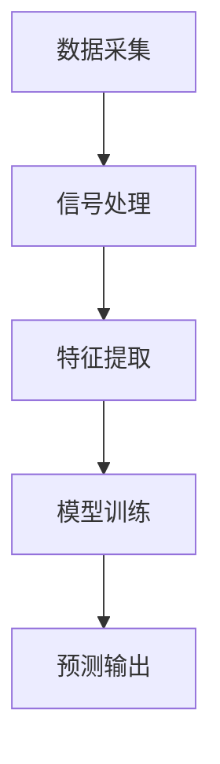
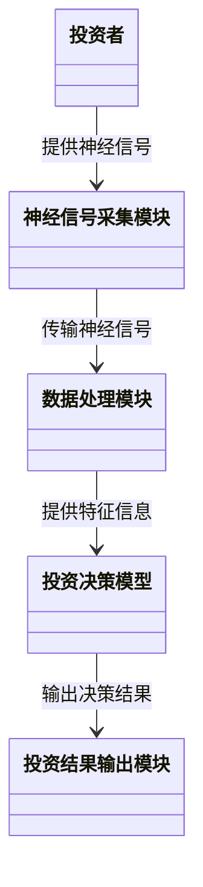
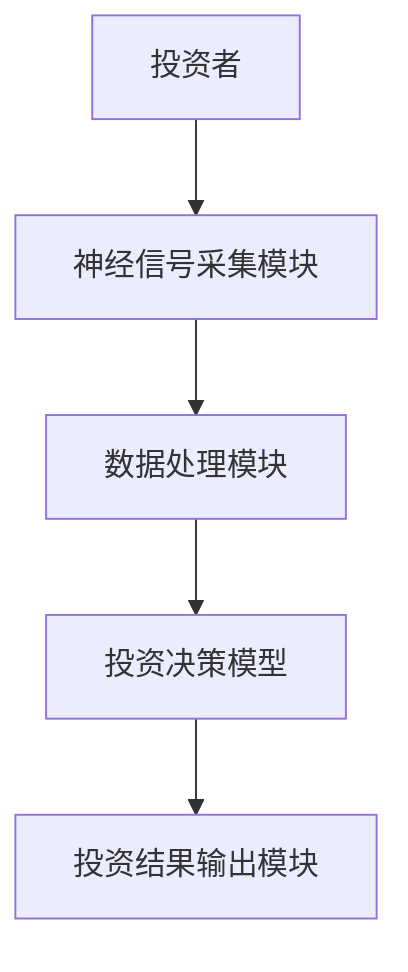
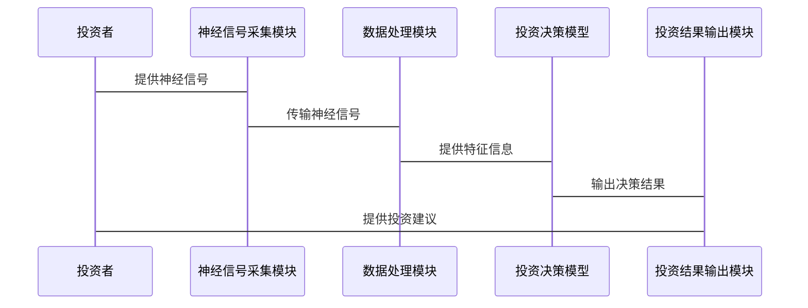

                 


# 巴菲特-芒格的脑机接口伦理投资：人类增强的未来

**关键词：** 脑机接口、巴菲特、芒格、伦理投资、人类增强、人工智能、投资决策

**摘要：** 本文探讨了脑机接口技术在伦理投资中的潜在应用，特别是结合巴菲特和芒格的投资理念，分析了脑机接口在投资决策中的优势，以及其对人类增强的未来影响。文章从脑机接口的技术原理、伦理投资的定义与重要性、脑机接口与伦理投资的结合等方面展开，结合实际案例和系统架构设计，详细阐述了脑机接口在投资领域的应用前景。

---

## 第1章：脑机接口与伦理投资概述

### 1.1 脑机接口的基本概念

#### 1.1.1 脑机接口的定义与核心原理

脑机接口（Brain-Computer Interface，BCI）是一种通过采集和分析大脑神经信号，将人类的思维活动转化为计算机可识别指令的技术。其核心原理包括数据采集、信号处理、特征提取、模型训练和预测输出五个步骤。

#### 1.1.2 脑机接口的发展历程

脑机接口技术起源于20世纪70年代，经历了从实验研究到实际应用的逐步发展。近年来，随着人工智能和神经科学的进步，脑机接口技术在医疗、教育、娱乐和投资等领域得到了广泛应用。

#### 1.1.3 脑机接口的主要应用领域

- 医疗领域：帮助瘫痪患者恢复肢体功能。
- 教育领域：通过脑电波分析学生的学习状态。
- 娱乐领域：实现用意念控制游戏。
- 投资领域：通过脑机接口技术辅助投资决策。

### 1.2 巴菲特与芒格的投资理念

#### 1.2.1 巴菲特的价值投资理论

巴菲特的价值投资理论强调长期投资、安全边际和企业基本面分析。他主张以合理的价格投资于具有持续竞争优势的企业。

#### 1.2.2 芒格的多元思维模型

芒格的多元思维模型强调通过多个学科的交叉应用，形成全面的决策框架。他认为投资决策需要考虑物理学、心理学、经济学等多个领域的知识。

#### 1.2.3 巴菲特与芒格投资理念的结合

巴菲特和芒格的投资理念共同强调了价值投资和跨学科思维的重要性。这种理念为脑机接口技术在投资领域的应用提供了理论基础。

### 1.3 伦理投资的定义与重要性

#### 1.3.1 伦理投资的定义

伦理投资是指在追求经济效益的同时，注重社会、环境和治理因素的投资方式。其核心原则包括社会责任、环境保护和公平正义。

#### 1.3.2 伦理投资的核心原则

- **社会责任**：避免投资于有害社会的企业。
- **环境保护**：支持环保型企业和项目。
- **公平正义**：促进社会公平和经济正义。

#### 1.3.3 伦理投资的现状与挑战

目前，伦理投资在全球范围内逐渐兴起，但仍然面临信息不对称、执行难度大和监管不足等挑战。

### 1.4 脑机接口与伦理投资的结合

#### 1.4.1 脑机接口在投资决策中的潜力

脑机接口技术可以通过分析投资者的心理状态和决策偏好，提供更精准的投资建议。

#### 1.4.2 伦理投资的未来发展方向

随着脑机接口技术的进步，伦理投资将更加注重投资者的心理健康和决策的透明性。

#### 1.4.3 脑机接口技术对伦理投资的推动作用

脑机接口技术可以帮助投资者更好地理解和控制自己的决策偏好，从而实现更符合伦理的投资行为。

### 1.5 本章小结

本章介绍了脑机接口的基本概念、巴菲特和芒格的投资理念以及伦理投资的定义和重要性。通过分析脑机接口与伦理投资的结合，展望了其在投资领域的未来发展方向。

---

## 第2章：脑机接口技术的核心原理

### 2.1 脑机接口的基本工作流程

#### 2.1.1 数据采集与处理

脑机接口技术通过电极采集大脑神经信号，并将其转化为数字信号。

#### 2.1.2 信号分析与特征提取

利用信号处理算法提取神经信号中的特征信息，如功率谱分析和时序分析。

#### 2.1.3 模型训练与预测

基于特征信息训练分类器模型，实现对大脑意图的预测和分类。

### 2.2 脑机接口的关键技术

#### 2.2.1 神经信号采集技术

常用的神经信号采集方法包括EEG、fMRI和MEG等。

#### 2.2.2 数据处理与算法优化

通过数据预处理、特征提取和模型优化提高脑机接口的准确性和稳定性。

#### 2.2.3 人机交互界面设计

设计友好的用户界面，实现人机交互的高效性和便捷性。

### 2.3 脑机接口的数学模型

#### 2.3.1 神经网络模型

常用的神经网络模型包括卷积神经网络（CNN）、循环神经网络（RNN）和长短期记忆网络（LSTM）。

#### 2.3.2 时间序列分析模型

时间序列分析模型包括ARIMA和GARCH等。

#### 2.3.3 聚类与分类算法

聚类算法如K-means和层次聚类，分类算法如SVM和随机森林。

### 2.4 脑机接口的算法实现

#### 2.4.1 基于Python的脑机接口实现

以下是一个简单的脑机接口实现代码示例：

```python
import numpy as np
from sklearn import svm

# 数据预处理
X = np.random.randn(100, 5)
y = np.random.randint(2, size=100)

# 模型训练
clf = svm.SVC()
clf.fit(X, y)

# 模型预测
test_data = np.random.randn(5, 5)
print(clf.predict(test_data))
```

#### 2.4.2 算法流程图（Mermaid）



### 2.5 本章小结

本章详细介绍了脑机接口的核心原理和技术实现，包括数据采集、信号处理、模型训练和预测输出等步骤。通过Python代码和流程图，读者可以更好地理解脑机接口的实现过程。

---

## 第3章：巴菲特与芒格投资理念的脑机接口应用

### 3.1 巴菲特价值投资的神经科学视角

#### 3.1.1 投资决策的神经机制

投资者的决策过程受到大脑前额叶皮层和边缘系统的影响。

#### 3.1.2 价值投资的神经网络模型

基于神经网络模型，模拟巴菲特的价值投资决策过程。

### 3.2 芒格多元思维模型的脑机接口实现

#### 3.2.1 多元思维模型的神经网络构建

通过构建多元化的神经网络模型，实现芒格的多元思维理念。

#### 3.2.2 多元思维模型的特征提取

从多个维度提取特征信息，构建全面的投资决策模型。

### 3.3 脑机接口在投资决策中的优势

#### 3.3.1 提高投资决策的准确性

通过分析投资者的心理状态，提供更精准的投资建议。

#### 3.3.2 加强投资决策的逻辑性

基于多元思维模型，实现投资决策的全面性和逻辑性。

#### 3.3.3 提升投资决策的效率

通过自动化处理和实时反馈，提高投资决策的效率。

### 3.4 本章小结

本章结合巴菲特和芒格的投资理念，分析了脑机接口技术在投资决策中的应用优势，特别是其在提高决策准确性和逻辑性方面的潜力。

---

## 第4章：脑机接口与伦理投资的未来展望

### 4.1 伦理投资的未来发展趋势

#### 4.1.1 可持续投资的兴起

随着全球可持续发展目标的推进，可持续投资将成为主流。

#### 4.1.2 社会责任投资的深化

社会责任投资将更加注重企业社会责任和环境保护。

### 4.2 脑机接口技术对伦理投资的推动作用

#### 4.2.1 提高投资决策的透明性

通过脑机接口技术，实现投资决策过程的透明化和可视化。

#### 4.2.2 增强投资者的责任感

通过实时反馈和情感分析，增强投资者的社会责任感。

#### 4.2.3 促进可持续发展

脑机接口技术可以辅助投资者更好地实现可持续发展目标。

### 4.3 本章小结

本章展望了伦理投资的未来发展趋势，强调了脑机接口技术在推动伦理投资中的重要作用，特别是在提高透明性和促进可持续发展方面。

---

## 第5章：项目实战——脑机接口在投资决策中的应用

### 5.1 环境安装与数据采集

#### 5.1.1 环境安装

安装必要的Python库，如numpy、scipy和matplotlib。

#### 5.1.2 数据采集

通过脑电设备采集投资者的神经信号数据。

### 5.2 系统功能设计

#### 5.2.1 领域模型（Mermaid类图）



#### 5.2.2 系统架构设计（Mermaid架构图）



### 5.3 系统接口设计

#### 5.3.1 接口设计

投资者通过脑电设备与系统交互，系统输出投资建议。

#### 5.3.2 交互流程（Mermaid序列图）



### 5.4 项目小结

本章通过项目实战，展示了脑机接口技术在投资决策中的具体应用。通过系统设计和接口设计，实现了一个基于脑机接口的投资决策辅助系统。

---

## 第6章：最佳实践与注意事项

### 6.1 最佳实践

#### 6.1.1 数据隐私保护

在脑机接口应用中，必须重视投资者的神经数据隐私保护。

#### 6.1.2 系统稳定性保障

确保系统的稳定性和可靠性，避免因技术故障导致投资损失。

#### 6.1.3 模型持续优化

定期更新和优化投资决策模型，提高系统的准确性和适应性。

### 6.2 注意事项

#### 6.2.1抽动症技术的伦理问题

脑机接口技术的应用必须遵循伦理规范，避免滥用。

#### 6.2.2抽动症技术的局限性

脑机接口技术目前还存在一定的局限性，如数据采集精度和模型泛化能力等。

### 6.3 拓展阅读

建议读者进一步阅读相关领域的经典文献，如《巴菲特传》和《芒格投资哲学》。

### 6.4 本章小结

本章总结了脑机接口技术在投资应用中的最佳实践和注意事项，强调了伦理保护和系统优化的重要性。

---

## 结语

脑机接口技术为伦理投资的发展提供了新的可能性。通过结合巴菲特和芒格的投资理念，脑机接口技术可以帮助投资者实现更精准、更符合伦理的投资决策。随着技术的不断进步，脑机接口在投资领域的应用前景将更加广阔。

---

**作者：AI天才研究院/AI Genius Institute & 禅与计算机程序设计艺术 /Zen And The Art of Computer Programming**

