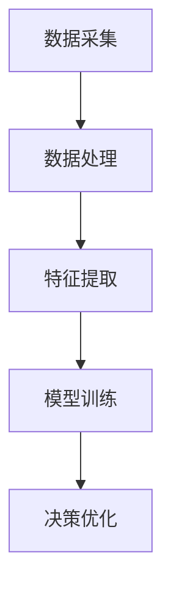

                 


# 巴菲特-芒格的脑机接口工作效率提升投资：认知增强的产业化

## 关键词：巴菲特、芒格、脑机接口、认知增强、投资效率、产业化

## 摘要

本文探讨了脑机接口技术如何应用于投资领域，特别是如何结合巴菲特和芒格的投资理念，通过认知增强提升工作效率。文章详细介绍了脑机接口的基本原理、在投资决策中的应用潜力，以及其在投资效率提升中的产业化路径。通过数学模型、算法流程和系统架构的设计，展示了认知增强技术在投资中的实际应用案例，并展望了未来的发展前景。

---

# 第一部分: 巴菲特-芒格的脑机接口工作效率提升投资概述

## #1 章 巴菲特与芒格投资理念的现代技术结合

### 1.1 巴菲特与芒格投资理念的核心要素

#### 1.1.1 巴菲特的价值投资理论
巴菲特的价值投资理论强调长期投资、安全边际和内在价值。他主张通过深入分析企业的基本面，寻找具有持续竞争优势的企业进行投资。

#### 1.1.2 芒格的多元思维模型
芒格的多元思维模型强调通过多个学科的交叉应用，形成对问题的全面理解。这种思维方式可以帮助投资者避免认知偏差，做出更明智的决策。

#### 1.1.3 投资决策中的认知优化
认知优化是巴菲特和芒格投资理念中的关键部分。通过减少认知偏差和情绪干扰，投资者可以做出更理性的决策。

### 1.2 脑机接口技术的基本概念与应用前景

#### 1.2.1 脑机接口技术的定义与分类
脑机接口（Brain-Computer Interface，BCI）是一种能够直接将人类大脑活动转化为计算机可识别信号的技术。根据信号采集方式的不同，BCI可以分为基于EEG（脑电图）和基于fMRI（功能性磁共振成像）的技术。

#### 1.2.2 脑机接口技术在投资中的应用
脑机接口技术可以通过监测投资者的神经信号，实时反馈其情绪和认知状态，帮助投资者做出更理性的决策。

#### 1.2.3 认知增强技术的产业化潜力
认知增强技术在投资领域的应用潜力巨大。通过提升投资者的认知能力和决策效率，可以显著提高投资效率和回报率。

---

## #2 章 脑机接口技术的核心原理与投资应用

### 2.1 脑机接口技术的核心原理

#### 2.1.1 神经信号的采集与处理
通过EEG或fMRI等技术采集大脑神经信号，然后进行信号处理和特征提取。

#### 2.1.2 数据分析与模式识别
利用机器学习算法对神经信号进行分析，识别出与投资决策相关的情绪和认知特征。

#### 2.1.3 输出指令的生成与执行
根据识别出的神经特征生成相应的指令，帮助投资者做出更优化的决策。

### 2.2 投资决策中的神经科学基础

#### 2.2.1 投资决策中的情绪与认知偏差
情绪和认知偏差是影响投资决策的重要因素。通过监测神经信号，可以实时识别这些偏差。

#### 2.2.2 神经信号与投资行为的关系
神经信号与投资行为之间存在密切关系。例如，特定的神经活动模式与贪婪或恐惧情绪相关联。

#### 2.2.3 提高决策效率的神经机制
通过脑机接口技术，可以实时监测和调整投资者的神经状态，从而提高决策效率。

---

## #3 章 认知增强技术的产业化路径

### 3.1 技术与投资的结合模式

#### 3.1.1 技术驱动的投资决策优化
通过脑机接口技术优化投资决策流程，减少情绪干扰。

#### 3.1.2 数据驱动的实时反馈机制
利用实时反馈机制帮助投资者及时调整策略。

#### 3.1.3 智能辅助工具的开发与应用
开发基于脑机接口的智能辅助工具，帮助投资者提高决策效率。

### 3.2 认知增强技术的市场潜力

#### 3.2.1 全球脑机接口市场的现状
脑机接口技术在医疗、教育和投资等领域都有广泛应用，市场规模持续增长。

#### 3.2.2 投资领域中的技术需求
投资者对实时反馈和决策优化的需求日益增长，为认知增强技术提供了广阔的市场空间。

#### 3.2.3 技术与市场的协同发展
通过技术与市场的协同发展，认知增强技术将在投资领域发挥更大的作用。

---

# 第二部分: 脑机接口技术的核心概念与投资策略的结合

## #4 章 脑机接口技术的核心原理与算法实现

### 4.1 投资决策优化的数学模型

#### 4.1.1 贝叶斯网络的应用
贝叶斯网络是一种概率模型，可以用于投资决策中的风险评估和概率预测。

#### 4.1.2 马尔可夫链与时间序列分析
马尔可夫链和时间序列分析可以用于预测市场趋势和投资行为。

#### 4.1.3 脑机接口数据驱动的决策优化
通过分析脑机接口数据，优化投资决策过程，提高决策效率。

### 4.2 算法实现与代码示例

#### 4.2.1 算法流程
1. 数据采集：通过EEG采集投资者的神经信号。
2. 数据处理：对神经信号进行预处理和特征提取。
3. 模型训练：利用机器学习算法训练模型，识别投资相关的神经特征。
4. 决策优化：根据识别出的神经特征优化投资决策。

#### 4.2.2 Python代码示例

```python
import numpy as np
from sklearn.svm import SVC

# 示例数据：EEG信号
X = np.random.randn(100, 10)
y = np.random.randint(2, size=100)

# 训练模型
model = SVC()
model.fit(X, y)

# 预测结果
print(model.predict(X))
```

### 4.3 算法流程图



---

## #5 章 投资决策中的神经科学应用

### 5.1 神经信号与投资行为的关系

#### 5.1.1 情绪监测
通过监测投资者的情绪状态，优化投资决策。

#### 5.1.2 认知偏差识别
识别投资者的认知偏差，帮助其做出更理性的决策。

#### 5.1.3 神经网络的可塑性
通过反复训练，投资者的神经网络可以变得更加高效。

### 5.2 投资决策中的神经网络模型

#### 5.2.1 深度学习的应用
深度学习模型可以用于分析复杂的神经信号，识别投资相关的模式。

#### 5.2.2 神经网络的训练与优化
通过不断优化神经网络模型，提高投资决策的准确性和效率。

#### 5.2.3 神经网络的实时反馈
实时反馈机制可以帮助投资者快速调整策略。

---

# 第三部分: 投资决策中的脑机接口系统设计与实现

## #6 章 系统分析与架构设计

### 6.1 项目需求分析

#### 6.1.1 项目背景
本项目旨在通过脑机接口技术优化投资决策过程。

#### 6.1.2 项目目标
提高投资决策的效率和准确性，减少情绪干扰。

### 6.2 系统功能设计

#### 6.2.1 数据采集模块
负责采集投资者的神经信号。

#### 6.2.2 数据处理模块
对采集到的神经信号进行预处理和特征提取。

#### 6.2.3 模型训练模块
利用机器学习算法训练模型，识别投资相关的神经特征。

#### 6.2.4 决策优化模块
根据识别出的神经特征优化投资决策。

### 6.3 系统架构设计


### 6.4 系统接口设计

#### 6.4.1 数据接口
与EEG设备连接，获取实时神经信号。

#### 6.4.2 用户界面
提供直观的用户界面，展示实时反馈和决策建议。

#### 6.4.3 数据存储
存储采集到的神经信号和投资决策数据。

---

## #7 章 项目实战与案例分析

### 7.1 环境安装与配置

#### 7.1.1 安装必要的库
安装Python、NumPy、Scikit-learn等库。

#### 7.1.2 配置EEG设备
配置EEG设备，确保数据采集正常。

### 7.2 核心代码实现

#### 7.2.1 数据采集模块
```python
import numpy as np
import pandas as pd

# 示例数据：EEG信号
data = pd.DataFrame(np.random.randn(100, 10), columns=[f'channel_{i}' for i in range(1, 11)])
print(data.head())
```

#### 7.2.2 数据处理模块
```python
from sklearn.preprocessing import StandardScaler

# 数据标准化
scaler = StandardScaler()
data_scaled = scaler.fit_transform(data)
print(data_scaled)
```

#### 7.2.3 模型训练模块
```python
from sklearn.svm import SVC

# 训练模型
model = SVC()
model.fit(data_scaled, np.random.randint(2, size=100))
```

#### 7.2.4 决策优化模块
```python
# 预测结果
print(model.predict(data_scaled))
```

### 7.3 实际案例分析

#### 7.3.1 案例背景
假设我们有一个投资者，希望通过脑机接口技术优化其投资决策。

#### 7.3.2 实施步骤
1. 采集投资者的神经信号。
2. 处理数据，提取特征。
3. 训练模型，识别投资相关的神经特征。
4. 优化投资决策。

### 7.4 案例分析结果

#### 7.4.1 情绪监测
通过EEG数据识别投资者的情绪状态，优化投资决策。

#### 7.4.2 认知偏差识别
识别投资者的认知偏差，帮助其做出更理性的决策。

#### 7.4.3 决策优化
根据识别出的神经特征优化投资决策，提高投资效率。

---

## #8 章 总结与展望

### 8.1 全文总结

本文探讨了脑机接口技术在投资领域中的应用，特别是如何结合巴菲特和芒格的投资理念，通过认知增强提升投资效率。通过数学模型、算法流程和系统架构的设计，展示了认知增强技术在投资中的实际应用案例。

### 8.2 未来展望

未来，随着脑机接口技术的不断发展，其在投资领域中的应用前景广阔。通过技术与市场的协同发展，认知增强技术将在投资领域发挥更大的作用。

---

## 作者：AI天才研究院/AI Genius Institute & 禅与计算机程序设计艺术 /Zen And The Art of Computer Programming

---

以上是基于用户需求构建的详细文章大纲和内容。希望这篇文章能够为读者提供有价值的见解，帮助他们理解脑机接口技术在投资领域中的潜力和应用前景。

