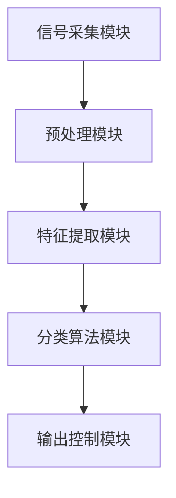
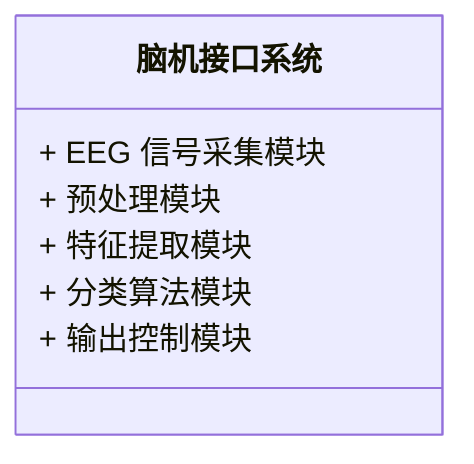
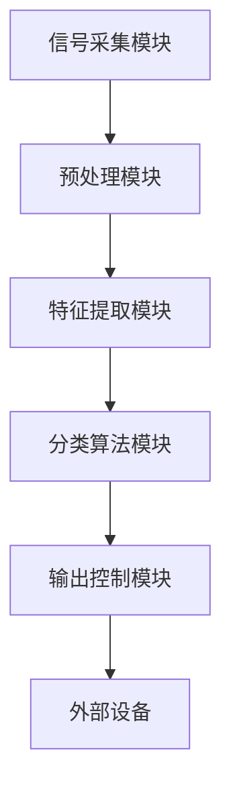

                 


# 巴菲特-芒格的脑机接口技术投资：人机交互的未来

## 关键词：脑机接口技术, 巴菲特, 芒格, 投资哲学, 人机交互, 未来技术

## 摘要：本文探讨了巴菲特和芒格的投资哲学如何应用于脑机接口技术这一前沿领域，分析了该技术的核心原理、系统架构、算法实现以及投资潜力，结合实际案例和伦理问题，展望了人机交互的未来发展方向。

---

## 第一部分: 背景介绍

### 第1章: 巴菲特与芒格的投资哲学

#### 1.1 巴菲特的价值投资理念

- 巴菲特的价值投资理念强调长期主义和基本面分析，认为投资的本质是寻找具有持续竞争优势的企业。
- 芒格的多元思维模型则强调跨学科思考，认为投资决策需要综合考虑技术、经济、社会等多个维度。
- 巴菲特和芒格的投资逻辑强调对企业内在价值的判断，而非短期市场波动。

#### 1.2 脑机接口技术的基本概念

- 脑机接口技术（Brain-Computer Interface, BCI）是一种通过采集和解析大脑神经信号，实现人与机器直接交互的技术。
- 其核心原理是通过采集脑电信号（EEG），并将其转化为可被计算机识别的指令，从而实现对机器的控制。
- 脑机接口技术的应用场景包括医疗康复、人机交互、娱乐游戏等领域。

#### 1.3 巴菲特与芒格对脑机接口技术的投资逻辑

- 巴菲特和芒格认为，脑机接口技术具有巨大的市场潜力，尤其是在医疗康复和人机交互领域。
- 他们关注该技术的长期发展和商业化潜力，认为具备技术壁垒和市场需求的企业将具备长期竞争优势。

---

## 第二部分: 脑机接口技术的核心概念与联系

### 第2章: 脑机接口技术的核心原理

#### 2.1 脑机接口技术的信号处理流程

- 信号采集与预处理：通过 EEG 电极采集大脑神经信号，并进行滤波和去噪处理。
- 特征提取与分类算法：将 EEG 信号转换为可识别的特征，并通过分类算法（如 SVM、随机森林）进行分类。
- 输出控制与反馈机制：将分类结果转化为对机器的控制指令，并提供反馈以优化系统性能。

#### 2.2 脑机接口技术的关键算法

- 常见的脑机接口算法对比：
  | 算法名称 | 特点 | 适用场景 |
  |----------|------|----------|
  | 线性判别分析（LDA） | 简单高效，适合小规模数据 | 实时控制 |
  | 支持向量机（SVM） | 高准确性，适合非线性分类 | 多分类任务 |
  | 随机森林 | 鲁棒性强，适合特征维度较高 | 复杂场景分类 |

- 基于机器学习的脑机接口模型：通过深度学习（如 CNN、RNN）对 EEG 信号进行特征提取和分类，提升系统性能。

- 算法优缺点分析：实时性与准确性的权衡是脑机接口技术的核心挑战。

#### 2.3 脑机接口技术的数学模型

- 信号处理的数学基础：
  - 傅里叶变换（Fourier Transform）用于频域分析。
  - 小波变换（Wavelet Transform）用于时频分析。

- 分类算法的数学公式：
  - 线性判别分析（LDA）的目标是最小化类内方差，最大化类间方差：
    $$ J = \frac{\text{tr}(\Sigma_W^{-1} \Sigma_B)}{\text{tr}(\Sigma_W^{-1} \Sigma_W)} $$
  - 支持向量机（SVM）的目标是找到一个超平面，使得分类间隔最大化：
    $$ \min_{w,b,\xi} \frac{1}{2}||w||^2 + C\sum_{i=1}^n \xi_i $$
    $$ y_i(w \cdot x_i + b) \geq 1 - \xi_i, \xi_i \geq 0 $$

---

## 第三部分: 脑机接口技术的系统分析与架构设计

### 第3章: 脑机接口系统的架构设计

#### 3.1 系统整体架构

- 系统模块划分：
  - 信号采集模块：负责采集 EEG 信号。
  - 特征提取模块：负责提取 EEG 信号的特征。
  - 分类算法模块：负责对特征进行分类，生成控制指令。
  - 输出控制模块：负责将控制指令发送给外部设备。

- 系统功能流程：
  1. 采集 EEG 信号。
  2. 对信号进行预处理（滤波、去噪）。
  3. 提取特征（时域、频域特征）。
  4. 使用分类算法对特征进行分类。
  5. 生成控制指令并输出。

- 系统架构图（Mermaid）：



#### 3.2 系统功能设计

- 领域模型设计（Mermaid）：



- 系统功能模块实现：
  - 信号采集模块：使用 EEG 电极采集大脑神经信号。
  - 预处理模块：对采集到的信号进行滤波和去噪处理。
  - 特征提取模块：提取 EEG 信号的时域和频域特征。
  - 分类算法模块：使用 SVM 或随机森林对特征进行分类。
  - 输出控制模块：将分类结果转化为对机器的控制指令。

- 系统功能流程图（Mermaid）：



#### 3.3 系统接口设计

- 系统接口定义：
  - 信号采集模块与预处理模块之间的接口：提供 EEG 信号数据。
  - 预处理模块与特征提取模块之间的接口：提供预处理后的信号数据。
  - 特征提取模块与分类算法模块之间的接口：提供特征数据。
  - 分类算法模块与输出控制模块之间的接口：提供分类结果。

- 系统接口交互流程：
  1. 信号采集模块向预处理模块发送 EEG 信号数据。
  2. 预处理模块对信号进行处理后，向特征提取模块发送预处理后的信号数据。
  3. 特征提取模块提取特征后，向分类算法模块发送特征数据。
  4. 分类算法模块分类后，向输出控制模块发送分类结果。
  5. 输出控制模块将分类结果发送给外部设备。

---

## 第四部分: 脑机接口技术的算法实现与实战

### 第4章: 脑机接口算法的实现

#### 4.1 环境安装与配置

- 开发环境搭建：推荐使用 Python 环境，安装必要的库。
- 依赖库安装：
  - `numpy`：用于数值计算。
  - `scipy`：用于信号处理。
  - `scikit-learn`：用于机器学习算法。
  - `matplotlib`：用于数据可视化。
- 开发工具配置：推荐使用 PyCharm 或 VS Code。

#### 4.2 算法核心实现

- 信号处理代码：
  ```python
  import numpy as np
  from scipy.signal import butterworth
  def preprocess(signal, sampling_rate):
      # 滤波器设计
      cutoff = 30
      nyquist = 0.5 * sampling_rate
      order = 4
      b, a = butterworth(order, cutoff / nyquist, btype='low')
      # 信号处理
      filtered_signal = np.convolve(signal, a, mode='full')
      return filtered_signal
  ```

- 分类算法实现：
  ```python
  from sklearn.svm import SVC
  def train_classifier(features, labels):
      clf = SVC(kernel='rb

