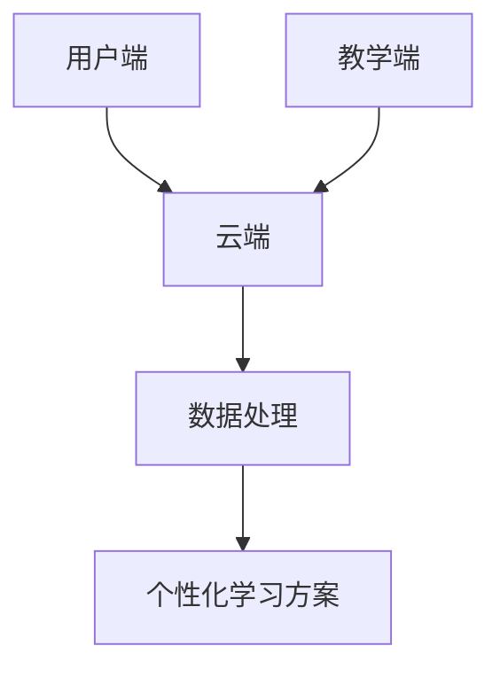
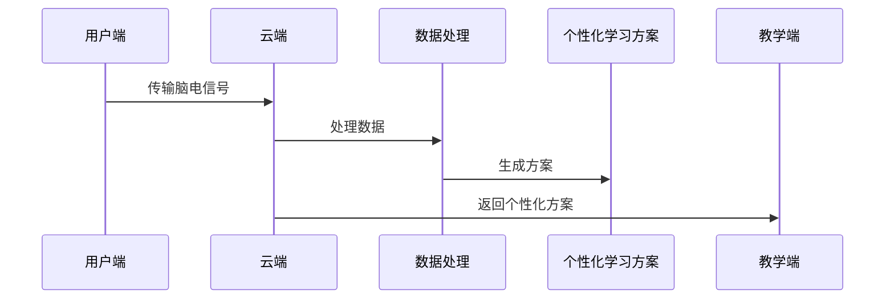

                 


# 巴菲特-芒格的脑机接口教育平台投资：认知增强的学习革命

> 关键词：脑机接口，巴菲特，芒格，教育平台，认知增强，投资策略，人工智能

> 摘要：本文探讨了巴菲特和芒格投资脑机接口教育平台的背景、技术原理及投资逻辑。通过分析脑机接口的核心算法、系统架构和实际应用案例，本文揭示了认知增强学习革命的潜力，并总结了投资者在这一领域的成功经验与未来展望。

---

# 第一部分: 背景与概述

## 第1章: 巴菲特与芒格的脑机接口教育平台投资概述

### 1.1 脑机接口技术的基本概念

#### 1.1.1 脑机接口的定义与基本原理
脑机接口（Brain-Computer Interface, BCI）是一种通过采集和分析大脑神经信号，将大脑意图转化为外部设备操作的技术。它通过采集脑电信号（EEG）、处理并识别特定模式，实现人与机器之间的直接交互。脑机接口的核心在于将不可见的神经活动转化为可量化的数据，从而为教育提供个性化和实时反馈的可能。

#### 1.1.2 脑机接口在教育领域的应用前景
在教育领域，脑机接口技术可以实时监测学生的学习状态，分析注意力水平、情绪波动和认知负荷，从而为个性化学习方案提供科学依据。通过脑机接口，教育平台能够动态调整教学内容的难度和节奏，提升学习效率和学生体验。

#### 1.1.3 巴菲特与芒格对脑机接口技术的投资逻辑
巴菲特和芒格长期关注技术驱动的教育变革，认为脑机接口技术代表了未来教育的发展方向。他们投资的脑机接口教育平台不仅能够提升学习效果，还能通过数据分析优化教育资源分配，从而在教育领域创造长期价值。

### 1.2 教育平台的现状与挑战

#### 1.2.1 当前教育平台的主要问题
传统教育平台往往依赖于学生自控力和教师反馈，缺乏实时监测和个性化调整的能力。学习者在不同阶段的认知状态差异较大，传统的“一刀切”教学方式难以满足个性化需求。

#### 1.2.2 脑机接口技术如何解决这些问题
脑机接口技术通过实时监测学习者的神经活动，能够动态识别其注意力水平和认知负荷，从而为教育平台提供实时反馈。教育平台可以根据这些数据调整教学内容的呈现方式，确保学习者在最佳认知状态下进行学习。

#### 1.2.3 巴菲特与芒格在教育领域的投资策略
巴菲特和芒格的投资策略注重长期价值和技术创新。他们选择投资那些能够显著提升教育效果、优化资源分配的脑机接口教育平台，认为这些平台将引领未来的教育革命。

## 第2章: 脑机接口教育平台的核心概念

### 2.1 脑机接口的核心技术

#### 2.1.1 神经科学基础
脑机接口技术依赖于神经科学的研究成果，特别是对大脑活动的监测和分析。通过研究大脑皮层的神经活动，科学家可以识别与特定行为或认知状态相关的神经信号。

#### 2.1.2 硬件设备：脑电采集技术
脑机接口的核心硬件设备是脑电采集装置，通常包括电极帽和信号采集电路。这些设备能够捕捉大脑皮层产生的微弱电场变化，并将其转化为可处理的数字信号。

#### 2.1.3 软件算法：信号处理与模式识别
脑机接口的软件算法负责对采集到的信号进行预处理、特征提取和模式识别。通过复杂的算法，系统能够识别出与特定认知状态相关的神经特征，并将其转化为可操作的输出。

### 2.2 教育平台的系统架构

#### 2.2.1 用户端：脑机接口设备
学习者需要佩戴脑电采集设备，设备实时采集并传输大脑神经信号到云端。这些信号经过预处理后，提取出与学习状态相关的特征。

#### 2.2.2 云端：数据处理与分析
云端服务器接收用户端传输的神经数据，进行深度学习和模式识别。通过训练好的模型，系统能够识别出学习者的注意力水平和认知负荷。

#### 2.2.3 教学端：个性化学习方案
基于云端分析结果，教育平台动态调整教学内容和节奏，为学习者提供个性化的学习方案，提升学习效率和效果。

### 2.3 巴菲特与芒格的投资逻辑

#### 2.3.1 投资背景：技术驱动教育变革
巴菲特和芒格认识到，脑机接口技术能够显著提升教育的个性化和效率。他们相信，这一技术将引领未来的教育革命。

#### 2.3.2 投资目标：认知增强的学习革命
他们投资的目标是通过脑机接口技术，实现认知增强的学习方式，帮助学习者更高效地掌握知识和技能。

#### 2.3.3 投资策略：长期价值与风险控制
巴菲特和芒格注重长期价值和风险控制，选择那些具有技术领先性和市场潜力的脑机接口教育平台进行投资。

---

# 第二部分: 核心技术与算法原理

## 第3章: 脑机接口的核心算法

### 3.1 神经信号处理算法

#### 3.1.1 数据采集与预处理
神经信号的采集和预处理是脑机接口技术的关键步骤。预处理包括去噪、滤波和特征提取，确保后续分析的准确性。

#### 3.1.2 基于EEG的特征提取
特征提取是通过提取脑电信号中的特定频段能量或时域特征，反映大脑的不同认知状态。常用的特征包括α波、β波和γ波的能量变化。

#### 3.1.3 信号分类算法
分类算法包括支持向量机（SVM）、随机森林和深度学习模型。这些算法能够识别不同认知状态的神经特征，并进行分类。

### 3.2 认知增强算法

#### 3.2.1 基于脑电的注意力检测
注意力检测算法通过分析脑电信号中的θ波和α波变化，判断学习者的注意力水平。

#### 3.2.2 个性化学习方案生成
基于注意力检测结果，系统动态调整教学内容的呈现方式，确保学习者始终处于最佳学习状态。

#### 3.2.3 实时反馈机制
实时反馈机制通过调整教学节奏和内容，帮助学习者保持高效学习状态。

## 第4章: 算法实现与优化

### 4.1 算法实现流程

#### 4.1.1 数据采集与预处理
数据采集：通过脑电帽采集脑电信号；
预处理：去除噪声，提取特征。

#### 4.1.2 特征提取与分类
特征提取：提取α波、β波的能量特征；
分类算法：使用支持向量机进行分类。

### 4.2 算法优化策略

#### 4.2.1 参数优化
通过网格搜索优化分类算法的参数，提高分类准确率。

#### 4.2.2 模型优化
使用深度学习模型（如卷积神经网络）替代传统分类算法，提升分类精度和鲁棒性。

---

# 第三部分: 系统分析与架构设计

## 第4章: 系统分析与架构设计

### 4.1 系统功能设计

#### 4.1.1 领域模型
领域模型包括用户、学习内容、系统反馈等核心要素。

#### 4.1.2 系统架构
系统架构包括用户端、云端和教学端三个部分，分别负责数据采集、处理和个性化教学方案生成。

### 4.2 系统架构图


### 4.3 系统接口设计

#### 4.3.1 用户端接口
用户端通过脑电帽采集数据，并通过API将数据传输到云端。

#### 4.3.2 教学端接口
教学端接收个性化学习方案，并通过API与云端进行数据交互。

### 4.4 系统交互设计

#### 4.4.1 序列图


---

# 第四部分: 项目实战

## 第5章: 项目实战与案例分析

### 5.1 环境安装

#### 5.1.1 硬件环境
需要脑电帽、计算机和网络环境。

#### 5.1.2 软件环境
安装Python、TensorFlow和相关数据处理库。

### 5.2 核心实现

#### 5.2.1 数据采集代码
```python
import numpy as np

def采集脑电信号():
    # 代码实现数据采集
    pass
```

#### 5.2.2 特征提取代码
```python
def提取特征():
    # 代码实现特征提取
    pass
```

#### 5.2.3 分类算法代码
```python
def分类算法():
    # 代码实现分类
    pass
```

### 5.3 案例分析

#### 5.3.1 案例背景
分析一个实际的脑机接口教育平台，介绍其系统设计和实现。

#### 5.3.2 实施效果
通过实际数据展示，说明系统在提升学习效率方面的效果。

#### 5.3.3 经验总结
总结项目实施中的经验和教训，为未来项目提供参考。

---

# 第五部分: 总结与展望

## 第6章: 总结与展望

### 6.1 投资的启示

#### 6.1.1 成功因素
成功的脑机接口教育平台需要技术创新、市场需求和优秀的团队。

#### 6.1.2 失败教训
技术瓶颈、市场接受度和用户体验问题是需要克服的主要挑战。

### 6.2 未来展望

#### 6.2.1 技术进步
未来，脑机接口技术将更加精准和便捷，应用场景将更加广泛。

#### 6.2.2 教育领域的变革
脑机接口技术将进一步推动教育的个性化和智能化，创造更高效的学习方式。

---

作者：AI天才研究院 & 禅与计算机程序设计艺术

