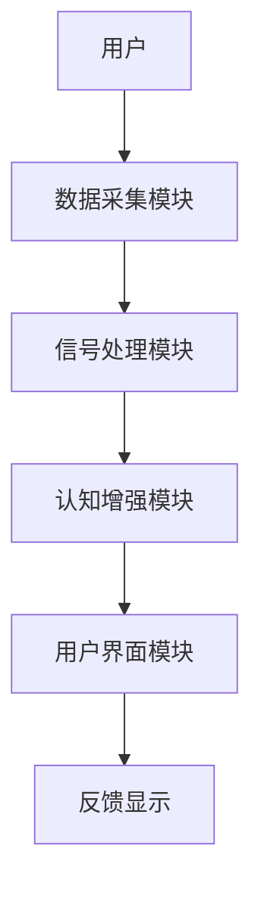
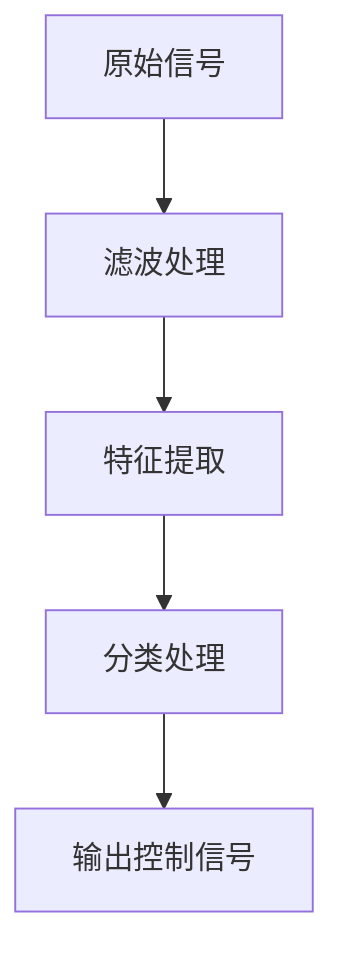

                 


# 巴菲特-芒格的脑机接口教育应用投资：认知增强的新范式

> **关键词**：巴菲特，芒格，脑机接口，教育应用，认知增强，投资策略，系统架构，教育科技

> **摘要**：  
本文探讨了巴菲特和芒格的投资哲学在脑机接口（BCI）教育应用中的潜在影响，分析了BCI技术如何通过认知增强改变教育投资的范式。文章从技术背景、系统架构、投资策略到项目实战，全面解析了BCI在教育中的应用潜力，并提出了结合巴菲特和芒格投资理念的认知增强新范式。

---

# 第一部分: 巴菲特-芒格的脑机接口教育应用投资概述

## 第1章: 巴菲特与芒格的投资哲学

### 1.1 巴菲特的价值投资理念

#### 1.1.1 巴菲特投资哲学的核心思想
巴菲特的价值投资理念以“长期思维”为核心，强调寻找具有持续竞争优势和良好管理的企业进行长期投资。他主张以合理价格买入优秀企业，而非频繁交易以追求短期收益。  
- **核心思想**：
  - **长期主义**：投资不是短期的交易，而是长期的价值积累。
  - **安全边际**：买入价格低于内在价值，确保投资的安全性。
  - **企业基本面**：关注企业的盈利能力、财务健康和管理团队。

#### 1.1.2 芒格的多元思维模型
芒格提倡“多元思维模型”，即通过多个学科的交叉应用来理解复杂问题，避免单一思维的局限性。他强调：
- **跨学科技整合**：将心理学、经济学、物理学等知识融会贯通。
- **避免认知偏差**：通过多元视角减少决策错误。

#### 1.1.3 巴菲特与芒格投资理念的结合
巴菲特和芒格的投资哲学共同点在于：
- 长期价值导向。
- 强调安全边际和企业基本面。
- 避免情绪化决策，追求理性投资。

### 1.2 巴菲特与芒格的成功案例分析

#### 1.2.1 巴菲特的伯克希尔哈撒韦公司
伯克希尔哈撒韦的投资策略体现了巴菲特的长期价值投资理念。通过收购具有持续盈利能力的公司，伯克希尔实现了长期稳定的增长。

#### 1.2.2 芒格的早期投资案例
芒格早期的投资案例展示了其多元思维模型的应用，例如通过分析企业的竞争优势和行业地位，选择具有长期增长潜力的公司。

#### 1.2.3 巴菲特与芒格合作的经典投资策略
- **买入并持有**：选择优质企业长期持有，避免频繁交易。
- **注重企业治理**：关注管理层的诚信和能力。
- **分散与集中**：适度分散投资，但集中于少数优质企业。

### 1.3 巴菲特与芒格投资理念的现代应用

#### 1.3.1 现代投资环境的变化
现代投资环境的复杂性增加，技术进步和全球化带来了新的挑战和机会。

#### 1.3.2 巴菲特与芒格理念的适应性
巴菲特和芒格的投资理念在变化中依然适用，但需要结合新的技术和行业趋势进行调整。

#### 1.3.3 教育领域的投资机会
教育科技的快速发展为投资者提供了新的机会，特别是结合脑机接口技术的教育应用。

## 1.4 本章小结

### 1.4.1 巴菲特与芒格投资理念的核心要点
- 长期价值投资，注重安全边际。
- 多元思维模型，避免认知偏差。

### 1.4.2 教育领域的投资潜力
- 教育科技的创新为投资者提供了新机会。
- 脑机接口技术可能成为教育投资的重要方向。

### 1.4.3 本书的研究方向
- 探讨脑机接口技术在教育中的应用。
- 分析其对教育投资的潜在影响。

---

## 第2章: 脑机接口技术的概述

### 2.1 脑机接口的基本概念

#### 2.1.1 脑机接口的定义
脑机接口（BCI）是连接人脑与外部设备的接口技术，允许通过脑活动直接控制计算机或其他设备。

#### 2.1.2 脑机接口的工作原理
- **神经信号采集**：通过 EEG、fMRI 等技术采集脑电信号。
- **信号处理**：对采集的信号进行滤波、特征提取和分类。
- **控制输出**：将处理后的信号转化为对设备的控制指令。

#### 2.1.3 脑机接口的分类与特点
- **侵入式 vs 非侵入式**：非侵入式（如 EEG）更适用于教育场景。
- **实时性**：高实时性是教育应用的关键。
- **易用性**：用户友好性是大规模应用的前提。

### 2.2 脑机接口技术的发展历程

#### 2.2.1 脑机接口技术的起源
- 20世纪70年代：初步研究集中在医疗领域。
- 20世纪90年代：技术进步推动了脑机接口的快速发展。

#### 2.2.2 脑机接口技术的发展阶段
- **研究阶段**：基础科学研究和技术突破。
- **应用探索阶段**：在医疗、教育等领域进行初步应用。
- **商业化阶段**：逐步进入市场，应用于教育、医疗等领域。

#### 2.2.3 当前脑机接口技术的现状
- 技术成熟度较高，但大规模应用仍面临挑战。
- 教育领域应用逐渐增多，特别是在认知增强方面。

### 2.3 脑机接口技术在教育中的应用前景

#### 2.3.1 教育领域的脑机接口应用现状
- **辅助学习**：帮助学生更高效地学习。
- **个性化教学**：根据学生脑活动调整教学策略。

#### 2.3.2 脑机接口技术在教育中的潜在应用
- **实时反馈**：教师可以根据学生脑活动实时调整教学节奏。
- **注意力监测**：帮助教师了解学生的学习状态。
- **认知增强**：通过脑机接口技术提升学生的学习能力。

#### 2.3.3 脑机接口技术对教育的影响
- 提高教学效率。
- 个性化学习成为可能。
- 教育模式的创新。

### 2.4 本章小结

#### 2.4.1 脑机接口技术的基本概念
- 脑机接口是连接人脑与设备的技术，具有实时性和易用性特点。

#### 2.4.2 脑机接口技术的发展历程
- 起源于医疗领域，逐步发展到商业化阶段。

#### 2.4.3 教育领域的应用前景
- 脑机接口技术在教育中的应用潜力巨大，特别是在认知增强方面。

---

## 第3章: 认知增强的理论基础

### 3.1 认知科学与脑

#### 3.1.1 认知科学的基本概念
认知科学是研究人类认知过程的跨学科领域，涉及心理学、神经科学、计算机科学等。

#### 3.1.2 脑的结构与功能
- **大脑皮层**：负责高级认知功能。
- **神经网络**：信息处理的基本单元。

#### 3.1.3 认知过程的模型
- **信息处理模型**：将认知过程分为输入、处理和输出阶段。
- **连接主义模型**：基于神经网络的分布式表示。

### 3.2 脑机接口与认知增强

#### 3.2.1 脑机接口在认知增强中的作用
- **实时监测**：采集和分析脑活动数据。
- **反馈调节**：根据数据调整认知过程。

#### 3.2.2 认知增强的实现机制
- **神经反馈训练**：通过反馈调节神经活动。
- **神经刺激技术**：利用电刺激增强神经活动。

### 3.3 教育中的认知增强应用

#### 3.3.1 学习效果的提升
- 通过脑机接口技术优化学习策略。

#### 3.3.2 个性化学习支持
- 根据学生认知特点提供个性化教学方案。

#### 3.3.3 注意力管理
- 帮助学生集中注意力，提高学习效率。

### 3.4 本章小结

#### 3.4.1 认知科学的基本概念
- 认知科学是研究人类认知过程的跨学科领域。

#### 3.4.2 脑机接口在认知增强中的作用
- 脑机接口技术可以实时监测和调节认知过程。

#### 3.4.3 教育中的认知增强应用
- 提高学习效率，支持个性化教学。

---

## 第4章: 脑机接口在教育投资中的应用

### 4.1 教育领域的投资机会

#### 4.1.1 教育科技的现状
- 技术进步推动教育模式的创新。
- 在线教育、人工智能教育工具快速发展。

#### 4.1.2 脑机接口技术在教育中的投资价值
- 提高学习效率，降低教育成本。
- 个性化教学的支持。

### 4.2 脑机接口技术的投资策略

#### 4.2.1 投资方向
- 开发脑机接口教育工具的企业。
- 提供个性化教学服务的平台。

#### 4.2.2 投资风险
- 技术成熟度风险。
- 市场接受度风险。

### 4.3 投资收益分析

#### 4.3.1 财务模型
- 通过财务模型评估脑机接口技术的投资回报。

#### 4.3.2 收益来源
- 教育机构的采购收入。
- 个性化教学服务的订阅收入。

### 4.4 本章小结

#### 4.4.1 教育领域的投资机会
- 脑机接口技术在教育中的应用潜力巨大。

#### 4.4.2 投资策略
- 选择具有技术创新和市场潜力的企业。

#### 4.4.3 投资风险与收益
- 需要综合评估技术风险和市场风险。

---

## 第5章: 系统架构与技术实现

### 5.1 系统架构设计

#### 5.1.1 系统组成
- **数据采集模块**：采集脑电信号。
- **信号处理模块**：对信号进行滤波和特征提取。
- **认知增强模块**：根据信号生成反馈或调节信号。
- **用户界面模块**：提供直观的操作界面。

#### 5.1.2 系统架构图


### 5.2 系统实现

#### 5.2.1 环境配置
- **开发工具**：Python、Matplotlib、Scipy。
- **数据采集**：使用 EEG 采集设备。

#### 5.2.2 核心代码实现
```python
import numpy as np
from scipy.signal import butterworth

def process_eeg_signal(signal):
    # 滤波器设计
    fs = 250  # 采样频率
    cutoff = 30  # 截止频率
    order = 4  # 滤波器阶数
    b, a = butterworth(order, cutoff, fs=fs)
    filtered_signal = np.convolve(signal, a, mode='full')[:len(signal)]
    return filtered_signal
```

#### 5.2.3 算法流程图


### 5.3 本章小结

#### 5.3.1 系统架构设计
- 明确系统的组成模块及其功能。

#### 5.3.2 技术实现
- 数据采集和信号处理是系统实现的关键。

#### 5.3.3 算法流程
- 滤波、特征提取和分类处理是信号处理的核心步骤。

---

## 第6章: 项目实战与案例分析

### 6.1 项目实战

#### 6.1.1 项目背景
- 开发一个基于脑机接口的教育工具，用于提高学生的学习效率。

#### 6.1.2 环境配置
- 使用Python和相关库进行开发。

#### 6.1.3 核心代码实现
```python
import numpy as np
import matplotlib.pyplot as plt

def plot_eeg_signal(signal):
    plt.plot(signal)
    plt.title('EEG Signal')
    plt.xlabel('Time')
    plt.ylabel('Amplitude')
    plt.show()
```

#### 6.1.4 案例分析
- 实际应用中的效果评估和问题分析。

### 6.2 项目总结

#### 6.2.1 项目成果
- 成功开发了一个基于脑机接口的教育工具。

#### 6.2.2 经验与教训
- 技术实现中的难点及解决方案。

#### 6.2.3 未来改进方向
- 提高系统的实时性和准确性。

### 6.3 本章小结

#### 6.3.1 项目实战
- 实际开发过程中积累了宝贵的经验。

#### 6.3.2 案例分析
- 案例分析展示了脑机接口技术在教育中的应用潜力。

#### 6.3.3 总结与展望
- 总结项目成果，展望未来的发展方向。

---

## 第7章: 总结与展望

### 7.1 总结

#### 7.1.1 巴菲特与芒格投资理念的核心
- 长期价值投资和多元思维模型。

#### 7.1.2 脑机接口技术的教育应用
- 认知增强是脑机接口技术在教育中的重要应用。

#### 7.1.3 教育投资的新范式
- 结合脑机接口技术的认知增强模式，为教育投资提供了新的方向。

### 7.2 展望

#### 7.2.1 未来技术发展
- 脑机接口技术的进一步成熟和应用。

#### 7.2.2 教育领域的变革
- 个性化教学和认知增强将成为教育的主流。

#### 7.2.3 投资机会
- 脑机接口技术在教育中的应用将继续扩大。

### 7.3 最佳实践 tips

#### 7.3.1 投资者建议
- 关注脑机接口技术在教育中的应用，寻找具有技术创新和市场潜力的企业。

#### 7.3.2 技术开发者建议
- 结合教育需求，开发具有实际应用场景的脑机接口产品。

### 7.4 本章小结

#### 7.4.1 总结
- 巴菲特和芒格的投资理念为脑机接口技术的教育应用提供了新的视角。

#### 7.4.2 展望
- 未来，脑机接口技术将在教育中发挥更大的作用。

---

# 作者：AI天才研究院 & 禅与计算机程序设计艺术

---

**Note:** 以上目录和内容仅为示例，实际写作时需要根据具体研究和数据进行补充和完善。

