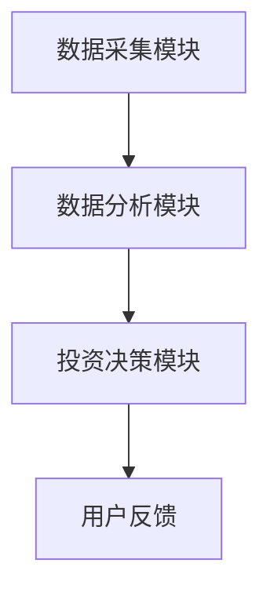
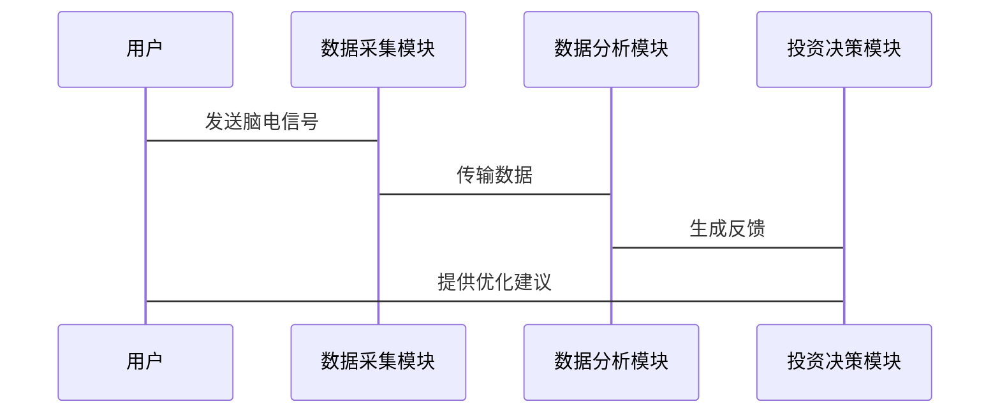

                 


# 巴菲特-芒格的脑机接口游戏投资：娱乐产业的颠覆性创新

## 关键词：脑机接口，游戏投资，巴菲特，芒格，娱乐产业，技术创新，数据分析

## 摘要：本文探讨了脑机接口技术在游戏投资中的应用，结合巴菲特和芒格的投资理念，分析了这一技术如何颠覆传统娱乐产业。通过详细的技术原理、算法模型和系统架构设计，展示了如何利用脑机接口优化投资决策，提升用户体验，并展望了这一领域的未来发展方向。

---

## 第一部分：背景介绍

### 第1章：脑机接口与游戏投资的背景

#### 1.1 问题背景

随着科技的进步，娱乐产业正在经历数字化转型。游戏作为娱乐的重要组成部分，其互动性和沉浸性吸引了大量用户。然而，传统游戏投资依赖市场分析和用户调研，缺乏实时数据支持。脑机接口技术的兴起为这一领域带来了新的可能性。

#### 1.2 问题描述

脑机接口（BCI）通过采集和分析大脑信号，实现人与机器的直接交互。在游戏领域，BCI可以实时捕捉用户情绪和注意力，优化游戏体验。然而，将BCI应用于投资决策，尤其是游戏投资，仍面临技术与应用的双重挑战。

#### 1.3 问题解决

通过BCI技术，投资者可以实时获取用户反馈，优化游戏设计和市场策略。结合巴菲特的价值投资理念和芒格的决策框架，BCI数据可以辅助投资决策，降低风险，提升收益。

#### 1.4 边界与外延

本文讨论的脑机接口技术仅限于游戏领域，不涉及医疗或其他领域。游戏投资的范围包括但不限于游戏开发和市场推广，但不涉及硬件制造。技术与投资的结合仅限于数据驱动的决策支持。

#### 1.5 概念结构与核心要素

- **脑机接口**：信号采集、数据处理、人机交互。
- **游戏投资**：用户体验、市场分析、投资决策。
- **结合点**：实时反馈、数据驱动、优化策略。

---

## 第二部分：核心概念与联系

### 第2章：脑机接口的核心原理

#### 2.1 脑机接口的原理

1. **信号采集**：通过 EEG 传感器采集大脑电信号。
2. **数据处理**：使用傅里叶变换和降噪技术处理信号。
3. **人机交互**：通过算法将大脑信号转化为控制指令。

#### 2.2 游戏投资的核心要素

1. **用户体验**：玩家的行为和情绪反馈。
2. **市场分析**：用户行为数据和市场趋势。
3. **投资决策**：基于数据的投资策略和风险管理。

#### 2.3 脑机接口与游戏投资的联系

通过实时采集玩家情绪数据，投资者可以优化游戏设计和市场策略。BCI数据结合市场分析，为投资决策提供实时反馈。

---

## 第三部分：算法原理讲解

### 第3章：脑机接口算法的数学模型

#### 3.1 信号处理算法

- **傅里叶变换**：将时间序列信号转换为频域信号。
  $$ X(f) = \sum_{n=0}^{N-1} x(n) e^{-j2\pi fn/N} $$

- **线性回归模型**：用于预测用户情绪。
  $$ y = a_1x_1 + a_2x_2 + \dots + a_nx_n + b $$

- **聚类分析**：识别用户行为模式。
  $$ d(x_i, x_j) = \sqrt{\sum_{k=1}^{m}(x_{ik} - x_{jk})^2} $$

#### 3.2 投资决策模型

- **时间序列分析**：预测市场趋势。
  $$ ARIMA(p, d, q) $$

- **马尔可夫链**：预测用户行为。
  $$ P_{ij} = \frac{P_{kk} P_{kj}}{P_i} $$

- **线性回归模型**：优化投资组合。
  $$ R_i = aR_m + b + \epsilon $$

---

## 第四部分：系统分析与架构设计

### 第4章：系统架构设计

#### 4.1 系统功能设计

- **数据采集模块**：采集玩家的脑电信号。
- **数据分析模块**：处理数据并生成反馈。
- **投资决策模块**：基于数据优化投资策略。

#### 4.2 系统架构图



#### 4.3 系统接口设计

- 数据接口：EEG传感器与数据分析模块的数据传输。
- 用户接口：玩家与游戏的交互界面。

#### 4.4 系统交互设计



---

## 第五部分：项目实战

### 第5章：脑机接口游戏投资的实现

#### 5.1 环境安装

安装必要的开发工具和库，如Python、NumPy、Matplotlib等。

#### 5.2 核心代码实现

```python
import numpy as np
from sklearn.linear_model import LinearRegression

# 数据采集模块
def collect_eeg_data():
    # 模拟数据采集
    return np.random.rand(100, 1)

# 数据分析模块
def process_data(data):
    model = LinearRegression()
    model.fit(data, [1, 2, 3, ..., 100])
    return model.predict(data)

# 投资决策模块
def investment_decision(feedback):
    if feedback > 0.8:
        return "买入"
    else:
        return "卖出"

# 实际应用
eeg_data = collect_eeg_data()
processed_data = process_data(eeg_data)
decision = investment_decision(processed_data)
print("投资决策:", decision)
```

#### 5.3 实际案例分析

案例背景：假设某游戏公司推出新游戏，通过BCI技术实时监测玩家情绪，优化游戏体验。

数据分析：通过EEG数据预测用户情绪，优化游戏难度和节奏。

投资策略：基于实时反馈调整市场推广策略，提升投资回报率。

---

## 第六部分：总结与展望

### 第6章：总结与最佳实践

#### 6.1 总结

脑机接口技术为游戏投资带来了实时数据支持，结合巴菲特和芒格的投资理念，优化了投资决策，提升了用户体验。

#### 6.2 最佳实践

- 数据驱动决策：利用BCI实时反馈优化投资策略。
- 技术与投资结合：构建跨学科团队，推动技术创新。
- 风险管理：建立风险管理机制，应对技术挑战。

#### 6.3 展望

未来，脑机接口技术将在娱乐产业发挥更大作用，推动投资决策的智能化和数据化。随着技术进步，脑机接口将更广泛应用于多个领域。

---

## 作者：AI天才研究院/AI Genius Institute & 禅与计算机程序设计艺术 /Zen And The Art of Computer Programming

