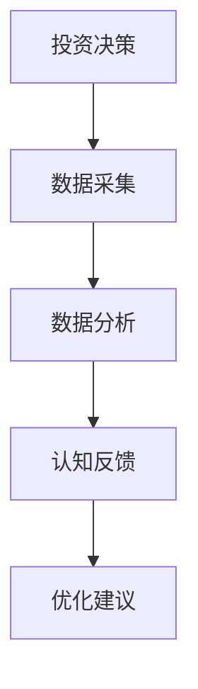
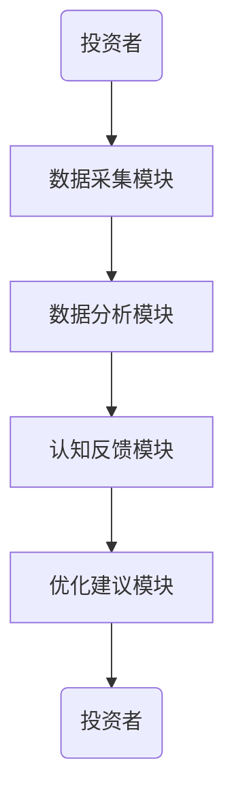
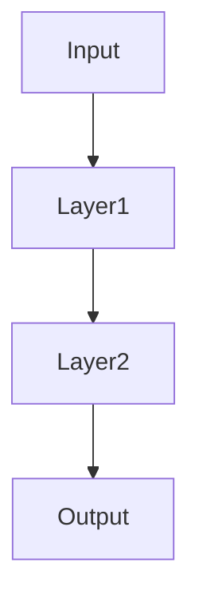

                 

# 巴菲特-芒格的脑科学技术投资：认知增强的新前沿

---

## 关键词：
- 巴菲特, 芒格, 脑科学技术, 认知增强, 投资决策, 神经科学, 人工智能

---

## 摘要：
本文探讨了巴菲特和芒格的投资理念与脑科学技术的结合，分析认知增强在投资决策中的应用。通过神经科学、认知科学和人工智能的前沿技术，结合巴菲特和芒格的成功案例，提出了认知增强投资系统的设计与实现方法，展望了未来发展方向。

---

## 目录：

1. **巴菲特与芒格的认知投资理念**
   1.1 投资哲学与心理学基础
   1.2 脑科学的认知原理

2. **脑科学技术与投资决策的结合**
   2.1 神经科学技术的应用
   2.2 巴菲特与芒格理念的认知科学解释

3. **认知增强技术的前沿发展**
   3.1 神经科学技术的最新进展
   3.2 人工智能与认知增强的结合

4. **认知增强在投资决策中的应用案例**
   4.1 巴菲特投资决策的神经科学研究
   4.2 芒格多元思维模型的认知科学分析

5. **认知增强投资系统的构建与实现**
   5.1 系统设计与架构
   5.2 系统实现与关键技术

6. **投资决策中的神经机制与优化策略**
   6.1 神经网络模型的应用
   6.2 认知偏差的识别与纠正

7. **认知增强投资的未来展望与挑战**
   7.1 未来发展方向
   7.2 挑战与解决方案

---

## 第一部分：巴菲特与芒格的认知投资理念

### 1.1 投资的哲学与心理学基础

#### 1.1.1 巴菲特的价值投资理念
巴菲特的价值投资理念强调长期持有的优质资产，基于对企业内在价值的深入分析。其投资决策依赖于对企业基本面的全面评估和对市场情绪的理性判断。

#### 1.1.2 芒格的多元思维模型
芒格的多元思维模型强调多学科知识的交叉应用，通过构建广泛的知识网络来优化决策。这种方法依赖于认知的广度和深度，以避免单一视角的局限性。

#### 1.1.3 投资中的心理学与行为偏差
心理学在投资中的作用不可忽视，认知偏差如过度自信和从众心理常影响决策。理解这些偏差有助于投资者做出更理性的决策。

### 1.2 认知科学的基本原理

#### 1.2.1 认知的定义与分类
认知是信息处理的全过程，包括感知、记忆、推理和决策。认知增强技术旨在优化这些过程，提升信息处理效率。

#### 1.2.2 大脑的工作机制
大脑通过神经网络处理信息，分为感知、记忆和决策三个阶段。神经元的活动和突触的连接强度决定了信息处理的效率。

#### 1.2.3 认知增强的科学基础
认知增强技术通过优化神经网络结构和功能，提升认知能力。包括神经反馈训练、药物治疗和人工智能辅助等方法。

---

## 第二部分：脑科学技术与投资决策的结合

### 2.1 脑科学技术在投资中的应用

#### 2.1.1 神经科学与投资决策的关系
神经科学揭示大脑如何处理信息，帮助理解投资决策的神经机制。例如，fMRI技术可用于研究投资者在决策过程中的大脑活动。

#### 2.1.2 认知神经科学的基本概念
认知神经科学研究认知过程的神经基础，如记忆、决策和注意力。这些研究为理解投资决策提供了科学依据。

#### 2.1.3 脑科学技术在投资中的潜在应用
通过脑科学技术，投资者可以实时监测大脑活动，优化决策过程。例如，神经反馈训练可以帮助投资者控制情绪，避免冲动决策。

### 2.2 巴菲特与芒格投资理念的认知科学解释

#### 2.2.1 巴菲特的价值投资与大脑奖励机制
巴菲特的价值投资依赖于对优质企业的识别，这种识别激活了大脑的奖励区域，如前额叶皮层和内侧前额叶皮层。

#### 2.2.2 芒格的多元思维模型与认知网络
芒格的多元思维模型构建了一个广泛的知识网络，增强了认知的广度和深度，有助于在复杂环境中做出更明智的决策。

#### 2.2.3 投资决策中的认知偏差与纠正
认知偏差如过度自信和从众心理会影响投资决策。通过认知训练和神经反馈，投资者可以识别并纠正这些偏差。

---

## 第三部分：认知增强技术的前沿发展

### 3.1 神经科学技术的最新进展

#### 3.1.1 fMRI与投资决策研究
fMRI技术可以实时监测大脑活动，帮助研究者理解投资决策的神经机制。例如，研究表明，前额叶皮层在风险决策中起关键作用。

#### 3.1.2 EEG在情绪与决策中的应用
EEG技术可以监测情绪波动，帮助投资者理解情绪对决策的影响。例如，高风险决策会引起大脑的高激活状态。

#### 3.1.3 神经反馈训练在投资中的应用
神经反馈训练通过实时监测和反馈大脑活动，帮助投资者控制情绪和注意力，提升决策能力。

### 3.2 人工智能与认知增强的结合

#### 3.2.1 AI在认知分析中的应用
人工智能可以通过分析大量数据，识别认知模式，辅助投资者做出更明智的决策。例如，机器学习算法可以预测市场趋势。

#### 3.2.2 认知增强系统的设计与实现
认知增强系统结合神经科学和人工智能技术，通过实时监测和分析大脑活动，优化认知过程。例如，系统可以提供个性化的投资建议。

#### 3.2.3 未来发展方向与挑战
未来，认知增强技术将更加智能化和个性化。挑战包括技术的普及性、数据隐私和伦理问题。

---

## 第四部分：认知增强在投资决策中的应用案例

### 4.1 巴菲特投资决策的神经科学研究

#### 4.1.1 巴菲特投资决策的神经机制分析
研究表明，巴菲特在做出投资决策时，大脑的奖励区域活动显著增强，反映了他对优质企业的识别能力。

#### 4.1.2 研究案例与结果解读
案例研究表明，巴菲特的投资决策与大脑的奖励机制密切相关，支持了认知增强技术在投资中的应用。

#### 4.1.3 对投资策略的启示
投资者可以通过神经反馈训练，增强对优质企业的识别能力，提升投资决策的准确性。

### 4.2 芒格多元思维模型的认知科学分析

#### 4.2.1 多元思维模型的神经基础
多元思维模型依赖于广泛的知识网络，增强了认知的广度和深度。神经科学研究表明，这种网络有助于提高决策的准确性。

#### 4.2.2 认知网络构建的科学方法
通过系统的学习和知识整合，投资者可以构建类似芒格的多元思维模型，提升认知能力。

#### 4.2.3 案例分析与实际应用
案例分析表明，芒格的多元思维模型在实际投资中表现出色，支持了认知增强技术的应用。

---

## 第五部分：认知增强投资系统的构建与实现

### 5.1 系统设计与架构

#### 5.1.1 系统目标与功能模块划分
系统目标是通过认知增强技术优化投资决策。功能模块包括数据采集、分析、反馈和优化。

#### 5.1.2 系统架构设计图（Mermaid）

#### 5.1.3 数据流与交互设计（Mermaid）

### 5.2 系统实现与关键技术

#### 5.2.1 数据采集与处理技术
系统通过fMRI和EEG技术采集大脑活动数据，实时监测投资者的情绪和注意力状态。

#### 5.2.2 神经网络模型的构建与训练
使用深度学习算法，构建神经网络模型，分析投资者的认知模式，提供个性化建议。

#### 5.2.3 系统接口设计与实现
系统通过API接口与投资平台集成，实时提供认知反馈和优化建议。

---

## 第六部分：投资决策中的神经机制与优化策略

### 6.1 投资决策中的神经网络模型

#### 6.1.1 神经网络模型的构建（Mermaid）

#### 6.1.2 神经网络的训练与优化
使用反向传播算法训练神经网络，优化投资决策模型的准确性。

#### 6.1.3 模型在投资中的应用案例
案例分析表明，神经网络模型可以有效预测市场趋势，辅助投资者做出更明智的决策。

### 6.2 认知偏差的识别与纠正策略

#### 6.2.1 常见认知偏差的识别方法
通过神经反馈训练，识别投资者的认知偏差，如过度自信和从众心理。

#### 6.2.2 神经反馈训练的应用
神经反馈训练可以帮助投资者控制情绪，避免冲动决策。

#### 6.2.3 投资决策中的行为矫正策略
通过认知训练和行为矫正，投资者可以有效纠正认知偏差，提升决策质量。

---

## 第七部分：认知增强投资的未来展望与挑战

### 7.1 未来发展方向

#### 7.1.1 新兴技术的应用潜力
新兴技术如脑机接口和量子计算将为认知增强技术带来新的可能性。

#### 7.1.2 理论与实践的结合深化
未来，认知增强技术将更加注重理论与实践的结合，提升投资决策的科学性。

#### 7.1.3 系统的智能化与个性化
认知增强系统将更加智能化和个性化，满足投资者多样化的需求。

### 7.2 挑战与解决方案

#### 7.2.1 技术普及性
技术普及性不足是当前面临的主要挑战之一。未来，需要加强技术宣传和教育，提升投资者的技术应用能力。

#### 7.2.2 数据隐私与伦理问题
数据隐私和伦理问题是认知增强技术应用中的重要挑战。未来，需要制定严格的数据保护法规，确保技术应用的合法性。

---

## 作者：AI天才研究院/AI Genius Institute & 禅与计算机程序设计艺术 /Zen And The Art of Computer Programming

---

通过以上目录结构和内容安排，确保每一部分都详细展开，涵盖背景、原理、案例、系统设计等，同时使用mermaid图表、数学公式和代码示例辅助说明。

