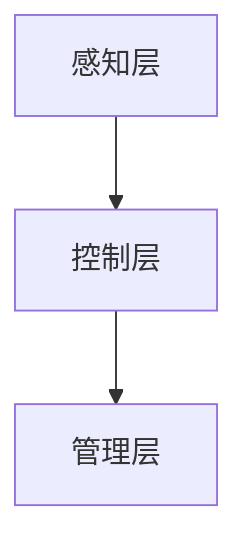
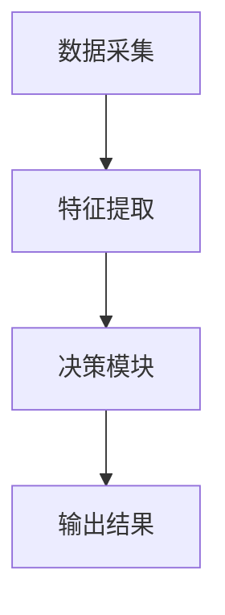

                 

# 巴菲特-芒格的自动化与人工智能投资：劳动力市场的变革

## 关键词
- 巴菲特
- 芮格
- 自动化
- 人工智能
- 投资
- 劳动力市场
- 技术变革

## 摘要
本文探讨了巴菲特和芒格在面对自动化与人工智能时代的投资策略变化，分析了这些技术对劳动力市场的深远影响。文章从投资哲学、技术基础、系统架构、项目实战等多角度进行详细阐述，结合实际案例和数学模型，为读者提供了全面的分析和见解。

---

## 正文

### 第一部分：巴菲特与芒格的投资哲学与自动化

#### 第1章：巴菲特与芒格的投资理念

##### 1.1 巴菲特的价值投资理念

**背景介绍：**  
巴菲特的价值投资理念强调长期投资、安全边际和企业基本面分析。他的投资策略基于对企业内在价值的评估，而非短期市场波动。

**核心概念：**  
- **内在价值：** 企业未来现金流的现值，是投资决策的核心。
- **安全边际：** 购买价格低于内在价值，以降低风险。

**数学模型：**  
巴菲特的内在价值公式基于 discounted cash flow (DCF) 模型，计算公式如下：
$$
\text{内在价值} = \sum_{t=1}^{n} \frac{\text{现金流}_t}{(1 + r)^t}
$$  
其中，\( r \) 是折现率，\( \text{现金流}_t \) 是第 \( t \) 年的现金流。

##### 1.2 芮格的多元思维模型

**背景介绍：**  
芒格强调通过多元思维模型来理解复杂问题，将不同学科的原理结合起来，形成决策框架。

**核心概念：**  
- **多元思维模型：** 包括心理学、经济学、物理学等多个领域的知识，帮助投资者全面分析问题。
- **逆向思维：** 从反方向思考问题，寻找市场的非共识观点。

**实际应用：**  
芒格通过分析企业的竞争优势（如护城河）来评估其长期价值。例如，使用 SWOT 分析法（优势、劣势、机会、威胁）来评估企业。

---

#### 第2章：自动化与人工智能的崛起

##### 2.1 自动化的历史与发展

**背景介绍：**  
自动化技术起源于工业革命，经历了机械化、电气化和数字化的发展阶段。当前，自动化与人工智能的结合推动了第四次工业革命。

**技术基础：**  
自动化系统通常由传感器、执行器和控制器组成，实现对生产流程的监控和优化。

**系统架构：**  
自动化系统的架构可以分为三层：感知层（传感器）、控制层（PLC）和管理层（SCADA）。如下图所示：

##### 2.2 人工智能的定义与技术基础

**背景介绍：**  
人工智能（AI）是模拟人类智能的计算机系统，涵盖学习、推理、问题解决等功能。

**核心算法：**  
常用算法包括监督学习、非监督学习和强化学习。

- **监督学习：** 输入-输出数据对，训练模型预测新数据。例如，线性回归模型：
  $$
  y = \theta_0 + \theta_1 x
  $$

- **非监督学习：** 通过聚类分析未标记数据。例如，K-means 聚类算法：
  $$
  \text{目标函数} = \sum_{i=1}^{k} \sum_{j=1}^{n} (y_{ij})^2
  $$

- **强化学习：** 通过试错机制优化决策策略，例如 Q-learning 算法：
  $$
  Q(s, a) = r + \gamma \max_{a'} Q(s', a')
  $$

---

### 第二部分：人工智能在投资中的具体应用

#### 第5章：人工智能在投资决策中的算法原理

##### 5.1 机器学习在投资中的应用

**背景介绍：**  
机器学习通过数据训练模型，识别市场中的规律和趋势。例如，使用 LSTM 网络预测股票价格。

**数学模型：**  
LSTM 的长短期记忆单元结构：
$$
f_t = \sigma(g_t + \beta_{f} f_{t-1})
$$  
$$
o_t = \sigma(h_t + \beta_{o} o_{t-1})
$$  
$$
h_t = \tanh(c_t)
$$  
$$
c_t = f_t \cdot c_{t-1} + i_t \cdot g_t
$$  
$$
i_t = \sigma(g_t + \beta_{i} i_{t-1})
$$

**实际案例：**  
使用 LSTM 模型训练 historical stock prices 数据集，预测未来的价格走势。

##### 5.2 深度学习在投资中的应用

**背景介绍：**  
深度学习通过多层神经网络提取复杂特征，应用于图像识别和自然语言处理。

**系统架构：**  
投资分析系统可能包括数据采集、特征提取和决策模块。如下图所示：

---

### 第三部分：劳动力市场的变革

#### 第6章：人工智能对劳动力市场的冲击与应对策略

##### 6.1 人工智能对就业的影响

**背景介绍：**  
自动化和人工智能可能导致某些岗位的消失，但也创造新的就业机会。

**具体行业分析：**  
- 制造业：自动化生产线减少蓝领工人需求。
- 金融行业：AI 投资工具减少传统分析师需求。
- 新兴行业：AI 开发、数据分析等领域需求增加。

**应对策略：**  
- **技能升级：** 通过培训提升员工的技术能力。
- **政策支持：** 政府提供再培训和就业服务。

---

### 第四部分：未来趋势与伦理挑战

#### 第7章：自动化与人工智能的未来发展

##### 7.1 技术进步的潜力

**背景介绍：**  
人工智能和自动化将继续推动生产效率的提升，实现更智能化的生产方式。

**未来预测：**  
- 更广泛的应用场景，如智能工厂和自动驾驶。
- 更高的自动化程度，减少人类直接参与。

##### 7.2 伦理与社会挑战

**背景介绍：**  
技术进步带来伦理问题，如就业机会减少、隐私保护等。

**解决方案：**  
- 建立伦理框架，规范技术应用。
- 推动政策法规的完善，确保技术发展与社会价值观一致。

---

## 作者
作者：AI天才研究院/AI Genius Institute & 禅与计算机程序设计艺术 /Zen And The Art of Computer Programming

