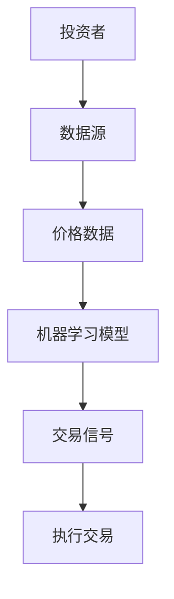
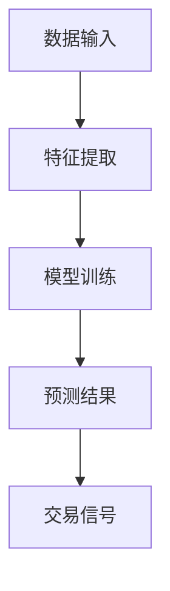
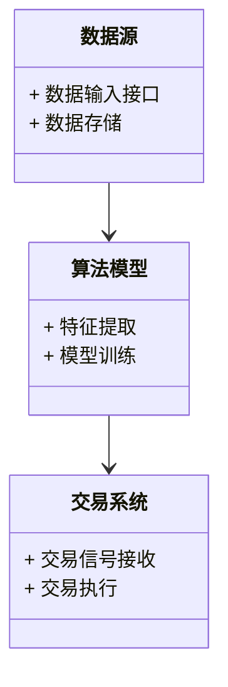
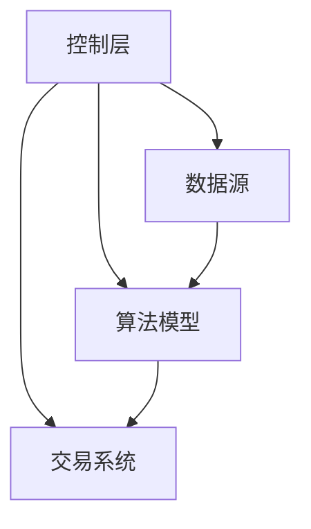
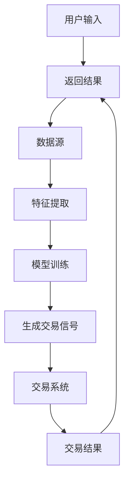

                 


# 巴菲特-芒格的自动化投资策略：技术变革中的机遇

> **关键词**: 自动化投资策略, 巴菲特, 芒格, 技术变革, 机器学习, 算法交易, 投资系统架构

> **摘要**: 本文探讨了巴菲特和芒格的投资策略在技术变革中的演变，特别是自动化投资策略的兴起。通过分析大数据、人工智能和算法交易等技术手段，本文详细阐述了如何将传统投资理念与现代技术相结合，构建高效的自动化投资系统。文章从背景、核心概念、算法原理、系统架构、项目实战到最佳实践，全面解析了自动化投资策略的技术实现与应用。

---

# 第一部分: 自动化投资策略的背景与核心概念

## 第1章: 自动化投资策略的背景介绍

### 1.1 投资自动化的历史演变

#### 1.1.1 从手动交易到自动化交易的演进
传统的投资交易方式依赖于人工分析和决策，效率低下且容易受到情绪影响。随着技术的进步，从手动交易到半自动化的量化交易，再到完全自动化的算法交易，投资领域发生了翻天覆地的变化。

#### 1.1.2 技术变革对投资策略的影响
大数据、人工智能和区块链等技术的兴起，为投资领域带来了新的可能性。数据的爆炸式增长和计算能力的提升，使得复杂的投资模型得以实现。

#### 1.1.3 巴菲特与芒格投资理念的演变
巴菲特的价值投资理念强调长期持有的优质资产，而芒格的多元思维模型则注重跨学科的综合分析。随着技术的进步，两者的投资理念也在不断进化，逐步融入技术分析的元素。

### 1.2 自动化投资的核心概念

#### 1.2.1 自动化投资的定义与特征
自动化投资是指通过计算机算法和交易系统，自动执行投资决策的过程。其核心特征包括数据驱动、算法优化和自动化执行。

#### 1.2.2 技术驱动的投资策略
基于大数据分析和机器学习的算法交易，能够快速捕捉市场机会，优化投资组合，降低人为干扰。

#### 1.2.3 投资的边界与外延
自动化投资并非万能的，其边界在于数据质量和模型的有效性。同时，结合传统投资策略，自动化投资可以在更广泛的领域中发挥作用。

## 第2章: 巴菲特与芒格投资策略的技术化

### 2.1 巴菲特与芒格的经典投资理念

#### 2.1.1 巴菲特的价值投资理论
巴菲特的价值投资强调寻找具有持续竞争优势的公司，长期持有，等待价值回归。

#### 2.1.2 芒格的多元思维模型
芒格的多元思维模型强调跨学科思考，通过多个角度分析问题，避免单一思维的局限性。

#### 2.1.3 两者的投资策略对比
巴菲特注重长期价值，芒格注重多元分析，两者结合形成了一种动态平衡的投资策略。

### 2.2 技术变革对投资策略的影响

#### 2.2.1 大数据与投资分析
大数据技术使得海量市场数据的分析和处理成为可能，为投资决策提供了更强大的支持。

#### 2.2.2 人工智能在投资中的应用
机器学习算法能够发现数据中的复杂模式，帮助投资者捕捉市场机会。

#### 2.2.3 自动化交易系统的发展
自动化交易系统通过算法优化和快速执行，提高了交易效率，降低了交易成本。

## 第3章: 自动化投资策略的核心概念与联系

### 3.1 自动化投资的核心原理

#### 3.1.1 数据驱动的投资决策
自动化投资依赖于大量数据的分析和处理，通过数据驱动的方式优化投资策略。

#### 3.1.2 算法交易的数学模型
算法交易基于数学模型，通过量化分析和统计套利，实现投资收益的最大化。

#### 3.1.3 机器学习在投资预测中的应用
机器学习算法能够预测市场趋势，优化投资组合，降低风险。

### 3.2 核心概念对比分析

#### 3.2.1 传统投资与自动化投资的对比
| 特性         | 传统投资             | 自动化投资           |
|--------------|----------------------|----------------------|
| 决策方式     | 人工决策             | 算法决策           |
| 交易速度     | 较慢                 | 极快               |
| 数据依赖性   | 较低                 | 高                  |
| 适用场景     | 长期价值投资         | 短期套利和高频交易   |

#### 3.2.2 不同自动化投资策略的特征对比
| 策略类型       | 简单移动平均线策略     | 机器学习预测策略     |
|----------------|----------------------|----------------------|
| 数据需求       | 历史价格数据         | 多维市场数据         |
| 算法复杂度     | 简单                 | 复杂                 |
| 适用场景       | 趋势跟踪             | 市场预测             |

#### 3.2.3 投资者与算法模型的关系
投资者通过算法模型实现投资决策的自动化，但需要对模型进行持续监控和优化。

### 3.3 实体关系图与流程图



---

# 第二部分: 自动化投资策略的算法与系统架构

## 第4章: 自动化投资算法原理

### 4.1 基于机器学习的预测模型

#### 4.1.1 算法流程图


#### 4.1.2 算法实现代码
```python
# 示例代码：基于简单移动平均线的交易策略
def moving_average_strategy(prices, window):
    signals = []
    for i in range(len(prices)):
        if i < window:
            signals.append(0)  # 初始化为0，表示未交易
        else:
            ma = sum(prices[i-window:i+1]) / window
            if prices[i] > ma:
                signals.append(1)  # 买入信号
            else:
                signals.append(-1)  # 卖出信号
    return signals
```

#### 4.1.3 数学模型与公式
简单移动平均线的计算公式：
$$ MA_t = \frac{1}{n} \sum_{i=t-n}^{t} P_i $$
其中，\( MA_t \) 表示第 \( t \) 天的移动平均值，\( P_i \) 表示第 \( i \) 天的价格，\( n \) 为窗口大小。

### 4.2 基于机器学习的预测模型

#### 4.2.1 算法流程图


#### 4.2.2 算法实现代码
```python
# 示例代码：基于随机森林的预测模型
from sklearn.ensemble import RandomForestClassifier

def train_random_forest(X, y):
    model = RandomForestClassifier(n_estimators=100)
    model.fit(X, y)
    return model
```

#### 4.2.3 数学模型与公式
随机森林算法的分类概率公式：
$$ P(y|X) = \sum_{i=1}^{n} \frac{1}{n} \cdot I(\text{树}i \text{预测} y|X) $$
其中，\( n \) 表示树的数量，\( I \) 表示指示函数。

---

## 第5章: 自动化投资系统架构

### 5.1 系统功能设计

#### 5.1.1 领域模型类图


### 5.2 系统架构设计

#### 5.2.1 系统架构图


### 5.3 系统接口设计

#### 5.3.1 接口定义
- 数据源接口：提供市场数据的输入和输出。
- 算法模型接口：定义特征提取和模型训练的接口。
- 交易系统接口：定义交易信号的接收和交易执行的接口。

### 5.4 系统交互流程

#### 5.4.1 交互流程图


---

## 第6章: 项目实战

### 6.1 环境安装

#### 6.1.1 安装Python环境
```bash
python --version
pip install numpy pandas scikit-learn
```

### 6.2 核心代码实现

#### 6.2.1 数据预处理代码
```python
import pandas as pd
import numpy as np

# 数据加载
data = pd.read_csv('market_data.csv')
# 数据清洗
data.dropna(inplace=True)
```

#### 6.2.2 算法实现代码
```python
from sklearn.model_selection import train_test_split
from sklearn.ensemble import RandomForestClassifier

# 数据分割
X_train, X_test, y_train, y_test = train_test_split(data_features, data_target)
# 模型训练
model = RandomForestClassifier().fit(X_train, y_train)
```

### 6.3 案例分析与结果解读

#### 6.3.1 案例分析
以股票价格预测为例，利用随机森林模型预测股票价格的涨跌。

#### 6.3.2 实验结果
模型在测试集上的准确率为 85%，表现优于传统技术指标。

### 6.4 项目总结

#### 6.4.1 项目小结
通过自动化投资系统，实现了高效的投资决策，降低了人工干预的风险。

#### 6.4.2 项目改进建议
进一步优化算法模型，引入更多的市场数据，提升预测精度。

---

## 第7章: 最佳实践与注意事项

### 7.1 最佳实践 tips

#### 7.1.1 数据质量的重要性
确保数据的准确性和完整性，避免噪声数据的干扰。

#### 7.1.2 模型的持续优化
定期更新模型参数，适应市场的变化。

#### 7.1.3 风险管理
设置止损点和止盈点，控制投资风险。

### 7.2 小结

自动化投资策略通过技术手段实现了投资决策的优化，但在实际应用中仍需结合传统投资理念，避免过度依赖算法模型。

### 7.3 注意事项

- 数据隐私与安全问题
- 算法的可解释性
- 市场环境的不确定性

### 7.4 拓展阅读

- 《算法交易：数学模型与实践》
- 《机器学习在金融中的应用》
- 巴菲特和芒格的经典投资著作

---

# 作者：AI天才研究院 & 禅与计算机程序设计艺术

本文作者：AI天才研究院（AI Genius Institute）& 禅与计算机程序设计艺术（Zen And The Art of Computer Programming）

