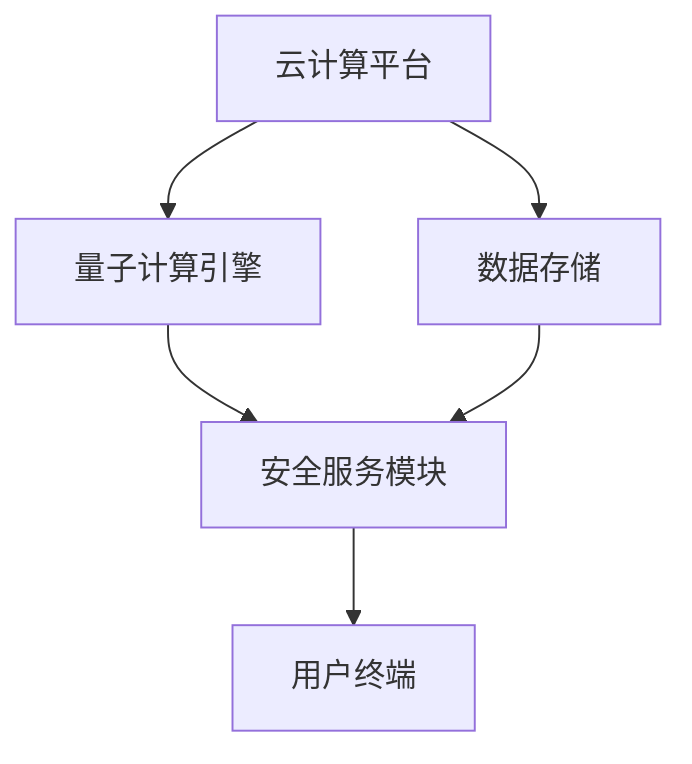
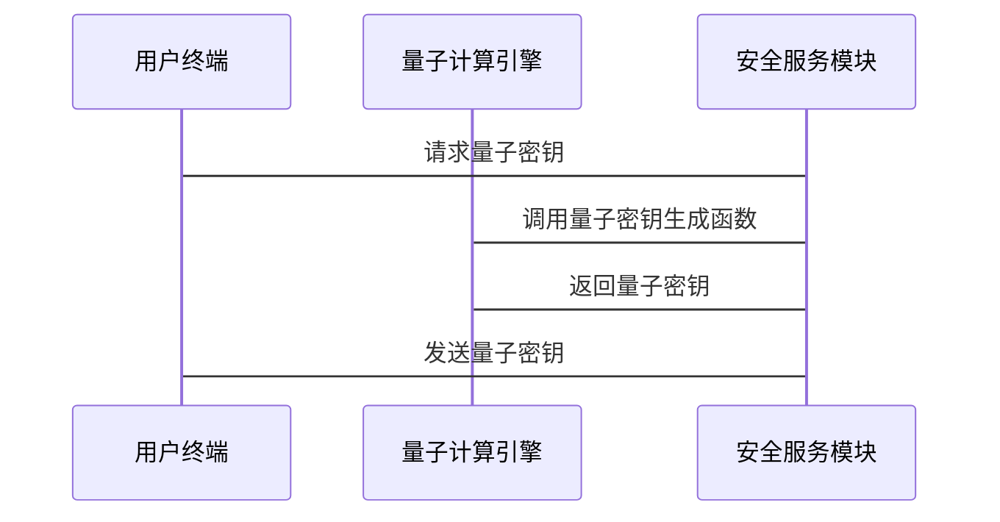

                 


# 巴菲特-芒格的量子云安全服务投资：数据保护的终极解决方案

---

## 关键词：巴菲特，芒格，量子云安全服务，数据保护，投资哲学，安全边际，量子计算，云计算

---

## 摘要：

本文探讨了巴菲特和芒格的投资哲学在量子云安全服务领域的应用，分析了量子计算和云计算对数据安全的深远影响，并提出了基于价值投资和多元思维模型的量子云安全服务投资策略。文章结合理论与实践，深入解析了量子云安全服务的核心概念、系统架构和实际应用场景，为数据保护提供了终极解决方案。

---

## 第一部分: 引言

### 1.1 巴菲特与芒格的投资哲学

#### 1.1.1 巴菲特的价值投资理念
- 巴菲特的价值投资理念强调长期持有、关注基本面和安全边际。
- 安全边际：投资标的的实际价值远高于其市场价格。

#### 1.1.2 芒格的多元思维模型
- 多元思维模型：通过多个学科的思维框架交叉验证，形成全面的认知。
- 芒格的决策模型：以“概率”和“风险”为核心。

#### 1.1.3 投资哲学与量子云安全服务的结合
- 量子云安全服务的投资价值：长期性、基本面稳定、安全边际高。

### 1.2 数据保护的终极解决方案
#### 1.2.1 数据保护的现状与挑战
- 数据泄露的高发态势：2022年全球数据泄露事件超过1000起。
- 传统加密算法的局限性：RSA算法面临量子攻击威胁。
- 数据保护的终极目标：构建基于量子计算的安全防护体系。

#### 1.2.2 量子云安全服务的核心优势
- 利用量子计算的超强算力，实现加密算法的突破性创新。
- 提供云环境下的量子加密通信和量子密钥分发服务。

#### 1.2.3 巴菲特-芒格投资哲学在数据保护中的应用
- 价值投资：选择具有长期竞争优势的量子安全服务企业。
- 多元思维：结合技术、市场、财务等多维度分析。

---

## 第二部分: 背景介绍

### 2.1 量子计算与云计算的背景

#### 2.1.1 量子计算的基本概念
- 量子计算：利用量子叠加和量子纠缠现象进行计算。
- 量子位：qubit，具有0和1的叠加态，计算速度远超经典计算机。

#### 2.1.2 云计算的发展历程
- 云计算：通过互联网提供按需计算资源。
- 从IaaS到SaaS：从虚拟化技术到全栈云服务。

#### 2.1.3 量子计算与云计算的融合
- 量子云服务：将量子计算能力作为服务提供给用户。
- 云计算的量子化：利用量子计算优化云资源分配。

#### 2.1.4 量子计算对数据安全的影响
- 量子计算对现有加密算法的威胁：RSA、AES等传统加密算法面临破解风险。
- 量子安全加密算法：后量子加密算法的研究与应用。

### 2.2 数据安全的演变

#### 2.2.1 数据安全的历史发展
- 从单机防护到网络防护：从PC时代的杀毒软件到网络安全设备。
- 数据中心的安全建设：从物理隔离到虚拟化安全。
- 云计算环境下的数据安全：从虚拟化安全到云原生安全。

#### 2.2.2 当前数据安全的主要威胁
- APT攻击：高级持续性威胁。
- 数据泄露：内部人员和外部攻击者的双重威胁。
- 数据完整性破坏：数据篡改和伪造。

#### 2.2.3 量子云安全服务的出现
- 量子安全加密：基于量子计算的加密算法。
- 量子密钥分发：提供不可破解的加密密钥。
- 云计算环境下的量子安全：将量子安全技术融入云服务。

---

## 第三部分: 核心概念与联系

### 3.1 量子云安全服务的定义与特点

#### 3.1.1 量子云安全服务的定义
- 量子云安全服务：基于量子计算技术，提供加密通信、密钥分发和数据保护服务。
- 核心功能：量子密钥分发（QKD）、量子加密通信、后量子加密算法支持。

#### 3.1.2 量子云安全服务的核心特点
| 特性       | 描述 |
|------------|------|
| 不可破解性 | 基于量子物理定律，提供理论上不可破解的加密能力。 |
| 高安全性 | 适用于金融、政府、医疗等高安全要求的行业。 |
| 云原生 | 集成到云计算平台，提供即服务（aaS）模式。 |
| 高扩展性 | 支持大规模数据加密和分布式计算。 |

#### 3.1.3 量子云安全服务与传统安全服务的对比
- 技术基础：传统基于经典计算，量子基于量子计算。
- 加密算法：传统依赖RSA、AES，量子支持后量子算法。
- 安全性：传统可能被量子计算机破解，量子安全不可被量子计算机破解。

### 3.2 巴菲特-芒格投资哲学与量子云安全服务的关系

#### 3.2.1 投资哲学的核心要素
| 要素       | 描述 |
|------------|------|
| 价值投资 | 寻找具有长期竞争优势的企业。 |
| 安全边际 | 确保投资标的的实际价值远高于市场价格。 |
| 多元思维 | 结合多个学科的思维方式，全面分析投资标的。 |

#### 3.2.2 量子云安全服务的商业模型
- 服务模式：SaaS（软件即服务）和IaaS（基础设施即服务）。
- 收入来源：按需收费，长期订阅。
- 市场定位：高安全需求的行业，如金融、政府、医疗。

#### 3.2.3 投资哲学与量子云安全服务的结合
- 价值投资：选择具有技术壁垒和市场领先地位的量子安全服务企业。
- 安全边际：确保投资标的的估值远低于其实际价值。
- 多元思维：从技术、市场、财务等多个维度分析投资标的。

---

## 第四部分: 理论框架

### 4.1 巴菲特-芒格投资哲学的理论基础

#### 4.1.1 价值投资的数学模型
- 股票的内在价值公式：
  $$ V = \frac{CF}{r - g} $$
  - \( V \)：内在价值
  - \( CF \)：自由现金流
  - \( r \)：贴现率
  - \( g \)：永续增长率

#### 4.1.2 安全边际的计算方法
- 安全边际 = 内在价值 - 市场价格
- 安全边际率 = （内在价值 - 市场价格）/ 内在价值

#### 4.1.3 多元思维模型的系统架构
- 多元思维模型的系统架构：
  ```mermaid
  graph TD
      A[技术分析] --> C[投资决策]
      B[基本面分析] --> C
      D[行业分析] --> C
      E[财务分析] --> C
  ```

### 4.2 量子云安全服务的理论框架

#### 4.2.1 量子计算在数据安全中的应用
- 量子安全加密算法：抗量子攻击的加密算法。
- 量子密钥分发：基于量子纠缠实现安全通信。

#### 4.2.2 云计算的安全挑战与解决方案
- 云计算的安全挑战：数据泄露、侧信道攻击、虚拟化安全。
- 量子云安全解决方案：量子加密通信、量子密钥分发、后量子加密算法。

#### 4.2.3 量子云安全服务的数学模型
- 量子密钥分发的数学模型：
  $$ | \psi \rangle = \alpha |0\rangle + \beta |1\rangle $$
  - \( \alpha \) 和 \( \beta \) 是复数，满足 \( |\alpha|^2 + |\beta|^2 = 1 \)。

---

## 第五部分: 系统分析与架构设计

### 5.1 量子云安全服务的系统架构

#### 5.1.1 系统架构图


#### 5.1.2 系统功能设计
- 量子密钥分发（QKD）：基于量子纠缠实现安全通信。
- 量子加密通信：利用量子计算生成加密密钥。
- 后量子加密算法：实现抗量子攻击的加密能力。

#### 5.1.3 系统接口设计
- 用户接口：API接口、控制面板。
- 内部接口：量子计算引擎与安全服务模块的通信接口。

#### 5.1.4 系统交互图


---

## 第六部分: 项目实战

### 6.1 环境安装

#### 6.1.1 安装量子计算开发环境
```bash
# 安装QKD开发库
pip install qkd-sdk
```

#### 6.1.2 安装云计算平台
```bash
# 安装阿里云SDK
pip install aliyun-python-sdk-core
```

### 6.2 核心实现

#### 6.2.1 量子密钥分发实现
```python
import qkd_sdk

def generate_quantum_key(length):
    client = qkd_sdk.Client()
    key = client.generate_key(length)
    return key
```

#### 6.2.2 量子加密通信实现
```python
def encrypt_message(message, key):
    # 使用量子密钥进行加密
    cipher = AES.new(key, AES.MODE_ECB)
    encrypted = cipher.encrypt(message)
    return encrypted
```

#### 6.2.3 后量子加密算法实现
```python
def post_quantum_encrypt(message, key):
    # 使用抗量子攻击的加密算法
    from nist_pqc import NISTPQC
    pqc = NISTPQC(key)
    encrypted = pqc.encrypt(message)
    return encrypted
```

### 6.3 案例分析

#### 6.3.1 案例：金融行业的量子云安全服务部署
- 问题场景：金融行业面临高频交易和数据泄露的双重威胁。
- 解决方案：部署量子密钥分发系统，保护交易数据的安全性。
- 实施步骤：
  1. 部署量子计算引擎。
  2. 配置量子密钥分发服务。
  3. 与高频交易系统集成。

#### 6.3.2 案例：政府机构的量子加密通信
- 问题场景：政府机构需要高度安全的通信系统。
- 解决方案：利用量子加密通信技术，实现不可破解的安全通信。
- 实施步骤：
  1. 配置量子加密通信模块。
  2. 与现有通信系统对接。
  3. 测试和优化通信性能。

### 6.4 项目小结

---

## 第七部分: 未来展望与最佳实践

### 7.1 未来展望

#### 7.1.1 量子云安全服务的发展趋势
- 后量子加密算法的标准化：NIST将发布抗量子加密标准。
- 量子安全服务的普及：从政府和金融行业向其他行业扩展。
- 云计算与量子计算的深度融合：实现更高效的安全防护。

#### 7.1.2 巴菲特-芒格投资哲学的演变
- 投资标的多样化：从传统行业向高科技领域转移。
- 数据驱动的决策：利用大数据和人工智能优化投资决策。
- 全球化与本地化的平衡：在新兴市场寻找新的投资机会。

### 7.2 最佳实践 tips

#### 7.2.1 投资者注意事项
- 选择具有技术壁垒的量子安全服务企业。
- 关注企业的财务健康和市场定位。
- 保持对行业动态的敏感性。

#### 7.2.2 企业建议
- 加强研发投入，提升技术竞争力。
- 提供差异化的量子安全服务。
- 加强与云计算平台的合作，构建生态系统。

#### 7.2.3 技术展望
- 后量子加密算法的标准化：NIST将发布抗量子加密标准。
- 量子安全服务的普及：从政府和金融行业向其他行业扩展。
- 云计算与量子计算的深度融合：实现更高效的安全防护。

### 7.3 小结

---

## 附录

### 附录A: 量子计算相关术语解释
- 量子位（qubit）：量子计算的基本单位。
- 量子叠加：\( |0\rangle + |1\rangle \)。
- 量子纠缠：两个或多个粒子相互关联的状态。

### 附录B: 云计算相关术语解释
- IaaS：基础设施即服务。
- PaaS：平台即服务。
- SaaS：软件即服务。

### 附录C: 巴菲特-芒格投资哲学推荐阅读书单
1. 《聪明的投资者》——巴菲特
2. 《穷查理宝典》——芒格
3. 《投资最重要的事情》——格雷厄姆

---

## 参考文献

1. 巴菲特, W. (1970). 《聪明的投资者》.
2. 芒格, C. (2007). 《穷查理宝典》.
3. 量子计算权威指南（NIST）.
4. 公共云安全最佳实践（AWS白皮书）.

---

## 作者：AI天才研究院 & 禅与计算机程序设计艺术

---

通过以上结构化的内容，本文全面解析了巴菲特-芒格投资哲学与量子云安全服务的结合，为数据保护提供了终极解决方案。文章结合理论与实践，详细探讨了量子云安全服务的核心概念、系统架构和实际应用场景，为投资者和技术从业者提供了重要的参考价值。

