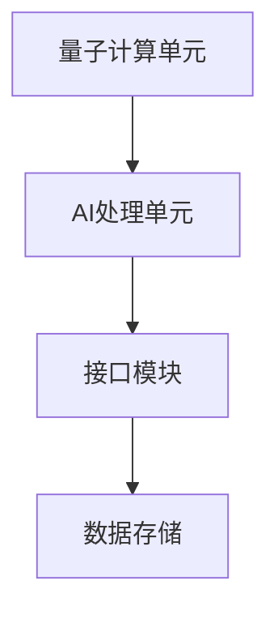
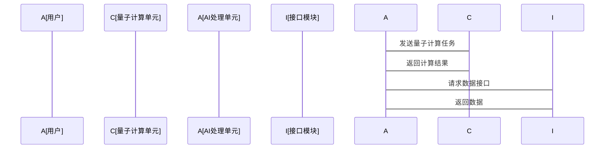

                 


# 巴菲特-芒格的量子人工智能芯片投资：新一代AI硬件革命

## 关键词：巴菲特，芒格，量子计算，人工智能芯片，投资策略，技术革命

## 摘要：本文探讨了巴菲特和芒格的投资哲学与量子计算和人工智能芯片的结合，分析了量子计算在AI硬件中的应用潜力，并结合实际案例，展示了如何通过量子AI芯片实现投资决策的优化。文章从背景介绍、技术原理、系统架构到项目实战，全面解析了这一投资革命的核心要素。

---

## 第一部分: 背景介绍

### 1.1 量子计算与人工智能芯片的背景

#### 1.1.1 量子计算的基本概念
量子计算是一种基于量子力学原理的计算方式，其核心是利用量子位(qubit)的叠加态和纠缠态来进行信息处理。与经典计算机中的二进制位不同，量子位可以同时表示0和1的状态，这使得量子计算机在某些特定问题上具有远超经典计算机的计算能力。

#### 1.1.2 人工智能芯片的发展
人工智能芯片是专为加速AI算法设计的硬件，包括GPU、TPU（张量处理单元）以及新兴的专用AI芯片。这些芯片通过并行计算和优化的架构，显著提升了AI模型的训练和推理速度。

#### 1.1.3 量子计算与AI芯片的结合
随着量子计算技术的不断进步，量子计算机在AI领域的应用逐渐成为可能。量子计算的并行处理能力可以显著加速AI算法的训练过程，尤其是在处理复杂问题时表现出色。

### 1.2 巴菲特与芒格的投资哲学

#### 1.2.1 巴菲特的价值投资理论
巴菲特的价值投资理论强调长期投资、安全边际和企业基本面分析。他认为，投资的核心是寻找具有持续竞争优势的企业，并以合理的价格买入。

#### 1.2.2 芒格的多元思维模型
芒格的多元思维模型强调通过多个学科的交叉应用来解决问题。他认为，投资者需要从物理学、心理学、经济学等多个角度来分析问题，从而做出更明智的决策。

#### 1.2.3 投资中的安全边际
安全边际是巴菲特投资策略中的重要概念，指以低于内在价值的价格买入资产，从而降低投资风险。

---

## 第二部分: 核心概念与联系

### 2.1 量子计算与AI芯片的关系

#### 2.1.1 量子计算的优势
- **并行计算能力**：量子计算机可以在同一时间处理大量数据，显著提高计算速度。
- **复杂问题处理**：量子计算在优化问题、因子分解和信号处理等领域具有显著优势。

#### 2.1.2 AI芯片的特点
- **专用性**：AI芯片专为加速神经网络的训练和推理设计，具有高效的矩阵运算能力。
- **并行计算**：AI芯片通过并行计算优化了传统CPU的串行处理问题。

#### 2.1.3 量子AI芯片的潜力
量子AI芯片结合了量子计算的并行处理能力和AI芯片的专用性，未来可能在复杂AI模型的训练和优化中发挥重要作用。

---

## 第三部分: 算法原理

### 3.1 量子计算中的关键算法

#### 3.1.1 Shor算法
Shor算法是一种用于大数分解的量子算法，其在密码学和AI中的因子分解问题中具有重要应用。

#### 3.1.2 Grover算法
Grover算法是一种用于无序数据库搜索的量子算法，其在优化问题和AI中的搜索任务中表现出色。

#### 3.1.3 量子傅里叶变换
量子傅里叶变换是一种在量子计算机上实现的快速傅里叶变换，其在信号处理和AI中的频域分析中具有潜在应用。

### 3.2 量子AI芯片的算法实现

#### 3.2.1 量子神经网络
量子神经网络是一种基于量子计算的神经网络模型，其通过量子位的叠加态实现更高效的特征提取和分类。

#### 3.2.2 量子支持向量机
量子支持向量机是一种基于量子计算的支持向量机算法，其在高维数据分类中具有潜在优势。

#### 3.2.3 量子强化学习
量子强化学习是一种基于量子计算的强化学习算法，其在复杂决策问题中表现出更高的效率。

---

## 第四部分: 系统分析与架构设计

### 4.1 量子AI芯片的系统架构

#### 4.1.1 系统功能模块
- **量子计算单元**：负责量子位的操作和计算。
- **AI处理单元**：负责神经网络的训练和推理。
- **接口模块**：负责与外部系统的数据交互。

#### 4.1.2 系统架构图


#### 4.1.3 系统接口设计
量子AI芯片通过API接口与外部系统交互，支持标准的量子计算和AI算法接口。

#### 4.1.4 系统交互流程


---

## 第五部分: 项目实战

### 5.1 环境配置

#### 5.1.1 软件环境
- Python 3.8+
- Qiskit（量子计算开发工具）
- TensorFlow（AI框架）

#### 5.1.2 硬件环境
- 量子AI芯片（模拟环境）
- GPU支持的计算设备

### 5.2 核心代码实现

#### 5.2.1 量子计算代码示例
```python
from qiskit import QuantumCircuit, execute, Aer
from qiskit.circuit import gates

qc = QuantumCircuit(2, 2)
qc.h(0)
qc.cx(0, 1)
qc.measure(0, 0)
qc.measure(1, 1)

backend = Aer.get_backend('qasm_simulator')
job = execute(qc, backend)
result = job.result()
print(result.get_counts())
```

#### 5.2.2 AI芯片代码示例
```python
import tensorflow as tf
from tensorflow.keras import layers

model = tf.keras.Sequential([
    layers.Dense(64, activation='relu'),
    layers.Dense(1, activation='sigmoid')
])

model.compile(optimizer='adam', loss='binary_crossentropy', metrics=['accuracy'])
model.fit(x_train, y_train, epochs=10, batch_size=32)
```

### 5.3 案例分析

#### 5.3.1 量子AI芯片在金融中的应用
通过量子AI芯片，可以实现更高效的金融数据处理和预测，提升投资决策的准确性。

#### 5.3.2 投资策略优化
量子AI芯片可以通过优化算法，帮助投资者找到最优的投资组合，降低风险并提高收益。

### 5.4 项目小结

---

## 第六部分: 最佳实践与小结

### 6.1 投资建议

#### 6.1.1 量子计算的优势
量子计算在特定领域的计算能力远超经典计算机，未来将在AI和金融领域发挥重要作用。

#### 6.1.2 AI芯片的潜力
AI芯片的专用性和高效性使其在AI模型的训练和推理中具有不可替代的优势。

### 6.2 未来展望

#### 6.2.1 量子计算的进一步发展
随着量子计算技术的不断进步，其在AI和金融领域的应用将更加广泛。

#### 6.2.2 量子AI芯片的商业化
量子AI芯片的商业化将推动AI硬件革命，进一步改变投资决策的方式。

---

## 作者信息

作者：AI天才研究院/AI Genius Institute & 禅与计算机程序设计艺术 /Zen And The Art of Computer Programming

