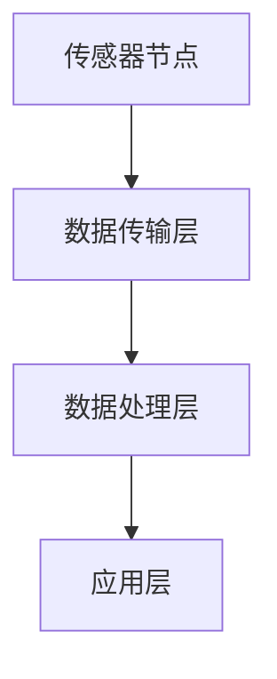

                 


# 巴菲特-芒格的量子传感器网络投资：物联网的下一代基础设施

---

## 关键词

- 巴菲特投资哲学
- 量子传感器网络
- 物联网
- 投资策略
- 系统架构

---

## 摘要

本文探讨了巴菲特和芒格的投资哲学如何与量子传感器网络技术相结合，为物联网的下一代基础设施提供新的投资机会。文章首先介绍了量子传感器网络的核心概念和其在物联网中的重要性，然后分析了巴菲特和芒格的投资策略如何应用于量子传感器网络的投资中。通过具体的算法实现和系统架构设计，文章详细展示了量子传感器网络在物联网中的实际应用，并提供了投资实践的案例分析。最后，文章总结了量子传感器网络在物联网投资中的潜力，并提出了未来的发展方向。

---

## 第一部分：量子传感器网络与物联网的背景介绍

### 第1章：量子传感器网络的核心概念

#### 1.1 量子传感器的基本概念

量子传感器是一种利用量子效应进行测量的设备，其核心优势在于其极高的灵敏度和精度。与传统传感器相比，量子传感器能够检测更微小的变化，适用于高精度测量场景。

#### 1.2 量子传感器网络的组成部分

- **传感器节点**：负责采集环境数据。
- **数据传输层**：通过无线通信技术将数据传输到云端。
- **数据处理层**：对数据进行分析和处理，生成有用的信息。
- **应用层**：将处理后的数据应用于实际场景中。

#### 1.3 量子传感器网络的市场潜力

量子传感器网络在多个领域具有广泛的应用潜力，包括环境监测、医疗健康、智能交通等。随着技术的成熟，其市场规模将快速增长。

---

### 第2章：物联网的现状与发展

#### 2.1 物联网的基本概念

物联网是指通过各种信息传感设备，如传感器、射频识别（RFID）技术、全球定位系统（GPS）、红外感应器等，按约定的协议，把任何物品与互联网连接起来，进行信息交换和通信，以实现智能化识别、定位、跟踪、监控和管理。

#### 2.2 物联网的核心技术

- **传感器技术**：用于数据采集。
- **通信技术**：如5G、NB-IoT等。
- **数据存储与处理技术**：如云 computing和大数据分析。

#### 2.3 物联网发展的瓶颈

- **数据量大**：海量数据的存储和处理成本高昂。
- **安全性问题**：数据泄露风险较高。
- **能源消耗**：传感器节点的能耗问题亟待解决。

---

## 第二部分：巴菲特-芒格投资哲学与量子传感器网络的结合

### 第3章：巴菲特与芒格的投资哲学

#### 3.1 巴菲特的价值投资理论

巴菲特的价值投资理论强调长期持有优质资产，注重企业的内在价值，而非短期市场波动。他主张投资那些具有强大护城河和持续竞争优势的企业。

#### 3.2 芒格的多元思维模型

芒格认为，投资者需要构建一个多维的知识体系，将各个领域的知识相互连接，从而做出更明智的决策。这种思维方式被称为“多元思维模型”。

#### 3.3 投资哲学的结合与创新

将巴菲特的价值投资理论与芒格的多元思维模型相结合，投资者可以在量子传感器网络领域中找到具有长期增长潜力的优质企业。

---

### 第4章：量子传感器网络的投资价值

#### 4.1 量子传感器网络的市场潜力

随着物联网的快速发展，量子传感器网络的应用场景将越来越广泛，市场需求将快速增长。

#### 4.2 量子传感器网络的技术壁垒

量子传感器的核心技术具有较高的技术壁垒，尤其是量子传感器芯片的设计和制造。

#### 4.3 量子传感器网络的商业模式

量子传感器网络的投资可以采用多种商业模式，如硬件销售、数据服务、解决方案提供等。

---

### 第5章：量子传感器网络的投资策略

#### 5.1 投资策略的制定

- **市场分析**：研究量子传感器网络的市场需求和发展趋势。
- **技术评估**：评估目标企业的技术实力和创新能力。
- **投资组合优化**：根据风险偏好构建合理的投资组合。

#### 5.2 投资实践的案例分析

以某家量子传感器网络公司为例，分析其市场地位、技术优势、财务状况和竞争优势，评估其投资价值。

---

## 第三部分：量子传感器网络的技术实现与系统架构

### 第6章：量子传感器网络的算法实现

#### 6.1 传感器数据融合算法

传感器数据融合算法用于将来自多个传感器的数据进行整合，提高数据的准确性和可靠性。

##### 6.1.1 数据融合算法的实现步骤

1. 数据采集：通过传感器获取原始数据。
2. 数据预处理：去除噪声，提取有用信息。
3. 数据融合：将多个传感器的数据进行融合，得到更准确的结果。
4. 数据分析：对融合后的数据进行分析，生成有用的信息。

##### 6.1.2 数据融合算法的数学模型

$$ y = \alpha x_1 + (1-\alpha) x_2 $$

其中，$x_1$ 和 $x_2$ 是两个传感器的测量值，$\alpha$ 是融合权重。

##### 6.1.3 数据融合算法的Python实现

```python
def data_fusion(x1, x2, alpha=0.5):
    return alpha * x1 + (1 - alpha) * x2

# 示例
x1 = 10
x2 = 20
result = data_fusion(x1, x2)
print(result)  # 输出：15
```

---

### 第7章：量子传感器网络的系统架构

#### 7.1 系统架构设计

量子传感器网络的系统架构包括以下几个部分：

- **传感器节点**：负责数据采集。
- **数据传输层**：通过无线通信技术将数据传输到云端。
- **数据处理层**：对数据进行分析和处理，生成有用的信息。
- **应用层**：将处理后的数据应用于实际场景中。

#### 7.2 系统架构的Mermaid图表示



---

## 第四部分：项目实战与投资分析

### 第8章：量子传感器网络的项目实战

#### 8.1 项目环境配置

- **硬件设备**：需要量子传感器节点、无线通信模块等。
- **软件环境**：需要安装相关开发工具和编程语言，如Python、C++等。

#### 8.2 核心代码实现

##### 8.2.1 传感器数据采集代码

```python
import serial

ser = serial.Serial('COM3', 9600)
while True:
    data = ser.readline()
    print(data)
```

##### 8.2.2 数据传输代码

```python
import socket

s = socket.socket(socket.SOCK_DGRAM)
s.sendto(b'data', ('localhost', 5000))
```

#### 8.3 系统功能实现

- 数据采集：通过传感器节点采集环境数据。
- 数据传输：将数据传输到云端。
- 数据处理：对数据进行分析和处理，生成有用的信息。
- 数据应用：将处理后的数据应用于实际场景中。

---

### 第9章：投资分析与案例研究

#### 9.1 投资回报分析

通过财务模型和市场分析，评估量子传感器网络的投资回报率。

#### 9.2 投资风险分析

分析量子传感器网络投资中的主要风险，如技术风险、市场风险、政策风险等。

#### 9.3 投资策略优化

根据市场变化和技术发展，动态调整投资策略，优化投资组合。

---

## 第五部分：结论与展望

### 第10章：结论

#### 10.1 量子传感器网络的投资价值

量子传感器网络作为物联网的下一代基础设施，具有广阔的发展前景和巨大的投资价值。

#### 10.2 投资策略的总结

结合巴菲特的价值投资理论和芒格的多元思维模型，投资者可以在量子传感器网络领域找到具有长期增长潜力的优质企业。

---

### 第11章：未来展望

#### 11.1 量子传感器网络的技术发展趋势

随着技术的进步，量子传感器网络将更加智能化、自动化和高效化。

#### 11.2 物联网的未来发展

物联网将继续深度融合各个行业，推动社会的智能化和数字化转型。

#### 11.3 投资机会的展望

未来，量子传感器网络的投资机会将更加丰富，投资者需要持续关注技术发展和市场变化。

---

## 作者：AI天才研究院/AI Genius Institute & 禅与计算机程序设计艺术/Zen And The Art of Computer Programming

