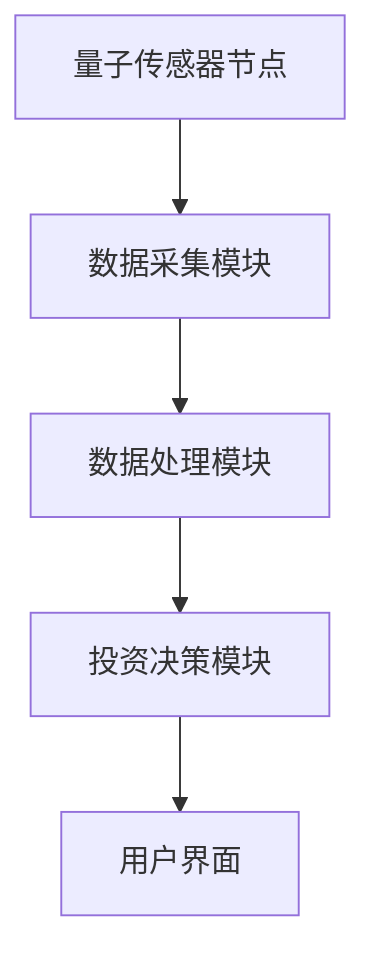
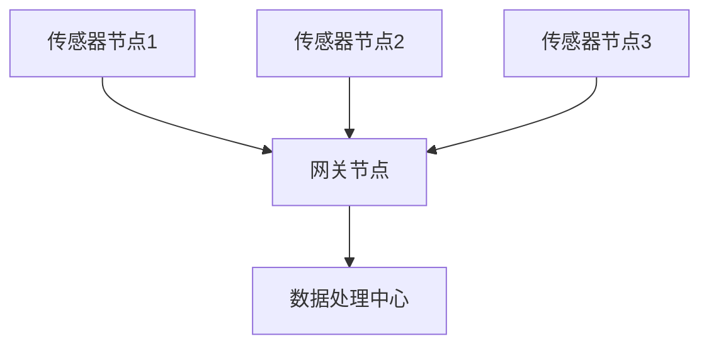
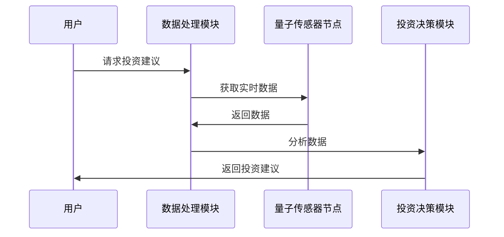

                 


# 巴菲特-芒格的量子传感器网络投资：物联网的革命性升级

---

## 关键词：巴菲特、芒格、量子传感器、物联网、投资策略、数据驱动决策、时间序列分析、机器学习

---

## 摘要：

本文探讨了巴菲特和芒格的投资理念与量子传感器网络技术的结合，展示了如何通过物联网技术的革命性升级，利用量子传感器网络实现更加精准和高效的投资决策。文章详细介绍了量子传感器网络的核心原理、算法模型、系统架构，并通过实际案例分析展示了其在投资领域的应用前景。

---

# 第1章 巴菲特-芒格投资理念概述

## 1.1 巴菲特的价值投资理念

### 1.1.1 价值投资的核心思想

巴菲特的价值投资理念强调长期持有优质资产，关注企业的内在价值，而非短期市场波动。他主张通过深入分析企业的财务状况、行业地位和竞争优势，选择那些具有长期增长潜力的企业进行投资。

### 1.1.2 巴菲特的投资策略

- **集中投资**：巴菲特倾向于投资少数优质企业，而非分散投资。
- **长期持有**：他强调长期持有优质资产，避免频繁交易。
- **安全边际**：在投资决策中，注重留有安全边际，以降低风险。

### 1.1.3 芒格的多元思维模型

芒格提倡通过多元思维模型来分析问题，将多个学科的知识结合起来，形成对问题的全面理解。这种思维方式帮助投资者避免单一视角的局限性，从而做出更明智的投资决策。

## 1.2 量子传感器网络的基本概念

### 1.2.1 传感器网络的定义

传感器网络是由多个传感器节点组成的网络，用于采集、处理和传输环境中的各种数据。这些传感器节点通常分布于不同的位置，能够实时感知环境信息。

### 1.2.2 量子传感器的优势

量子传感器利用量子力学原理，具有更高的灵敏度和精度。与传统传感器相比，量子传感器能够检测更微弱的信号，适用于高精度测量和复杂环境监测。

### 1.2.3 物联网的革命性升级

物联网（IoT）通过将物体与互联网连接，实现了数据的实时采集、传输和处理。量子传感器网络的引入，进一步提升了物联网的感知能力和数据处理能力，为投资决策提供了更强大的支持。

## 1.3 量子传感器网络在投资中的应用前景

### 1.3.1 投资领域的数据革命

随着物联网技术的发展，投资领域的数据采集和处理能力得到了显著提升。量子传感器网络能够实时采集海量数据，为投资决策提供了更丰富的信息来源。

### 1.3.2 量子传感器网络的优势

量子传感器网络具有高精度、高灵敏度和高可靠性等特点，能够为投资决策提供更准确的数据支持。此外，量子传感器网络的分布式架构能够实现对复杂环境的全面感知。

### 1.3.3 投资模式的颠覆性变革

量子传感器网络的应用，使得投资决策更加数据驱动，能够实时感知市场变化，快速响应投资机会和风险。这种模式将颠覆传统的投资方式，为投资者带来更高的收益和更低的风险。

---

# 第2章 量子传感器网络的核心原理

## 2.1 量子传感器的工作原理

### 2.1.1 量子力学基础

量子力学研究微观粒子的行为规律，利用量子纠缠、叠加等现象，实现对环境的高精度测量。

### 2.1.2 传感器的量子特性

量子传感器利用量子系统的特性，如超分辨率和纠缠态，实现对微弱信号的检测。这些特性使得量子传感器在高精度测量中具有显著优势。

### 2.1.3 量子传感器的信号处理

量子传感器通过量子态的测量和处理，提取环境中的有用信息。信号处理过程包括量子态的转换、测量和解码，最终得到可读的测量结果。

## 2.2 传感器网络的构建与优化

### 2.2.1 传感器节点的设计

传感器节点包括传感器、数据采集模块和通信模块。节点的设计需要考虑功耗、灵敏度、通信距离等因素。

### 2.2.2 网络拓扑结构

传感器网络的拓扑结构包括星形、树形、网状等。不同的拓扑结构适用于不同的应用场景，需要根据具体需求进行选择。

### 2.2.3 数据传输与同步

数据传输需要考虑带宽、延迟和数据完整性。数据同步是确保网络中各个节点时间一致的关键步骤。

## 2.3 量子传感器网络的性能评估

### 2.3.1 网络覆盖范围

量子传感器网络的覆盖范围取决于传感器的灵敏度和通信能力。较大的覆盖范围意味着能够感知更广泛的区域。

### 2.3.2 数据采集精度

量子传感器的高精度使得数据采集更加准确，能够捕捉到微小的变化。

### 2.3.3 网络稳定性与可靠性

量子传感器网络的稳定性与网络架构、通信协议和节点可靠性密切相关。高可靠性网络能够确保数据的持续传输和处理。

---

# 第3章 量子传感器网络在投资中的算法原理

## 3.1 时间序列分析

### 3.1.1 时间序列的基本概念

时间序列是指按照时间顺序排列的数据。在投资中，时间序列分析用于预测未来的市场走势。

### 3.1.2 量子传感器数据的时间序列特征

量子传感器数据具有高频率、高精度和连续性的特点。这些特征使得时间序列分析更加复杂但也更具挑战性。

### 3.1.3 时间序列预测模型

常用的时间序列预测模型包括ARIMA、GARCH和LSTM等。这些模型能够捕捉数据中的趋势、周期性和随机性特征。

## 3.2 机器学习在投资中的应用

### 3.2.1 机器学习的基本原理

机器学习通过训练数据，建立模型来预测未来的事件。在投资中，机器学习用于预测市场走势和风险评估。

### 3.2.2 量子传感器数据的特征提取

特征提取是机器学习的关键步骤。通过对量子传感器数据的特征提取，可以识别出与投资决策相关的关键因素。

### 3.2.3 投资决策的机器学习模型

基于机器学习的模型，如随机森林和神经网络，能够对量子传感器数据进行分类和回归分析，从而支持投资决策。

## 3.3 基于量子传感器的异常检测

### 3.3.1 异常检测的定义与意义

异常检测是指识别数据中的异常值或异常模式。在投资中，异常检测能够帮助发现潜在的风险和机会。

### 3.3.2 量子传感器数据的异常检测算法

常用的异常检测算法包括基于统计的方法和基于机器学习的方法。量子传感器数据的高精度和复杂性要求采用更高级的异常检测算法。

### 3.3.3 异常检测在投资中的应用

通过异常检测，投资者能够及时发现市场中的异常波动，从而做出更快的反应，降低风险。

---

# 第4章 量子传感器网络的系统架构设计

## 4.1 系统功能设计

### 4.1.1 数据采集模块

数据采集模块负责从量子传感器获取实时数据，并进行初步处理。

### 4.1.2 数据处理模块

数据处理模块对采集的数据进行清洗、转换和分析，提取有用的信息。

### 4.1.3 投资决策模块

投资决策模块基于处理后的数据，生成投资建议和决策。

## 4.2 系统架构设计

### 4.2.1 系统架构图



### 4.2.2 网络拓扑结构



### 4.2.3 系统接口设计

系统接口包括传感器接口、数据接口和用户接口。传感器接口用于连接量子传感器，数据接口用于数据传输，用户接口用于显示投资决策结果。

## 4.3 系统交互设计

### 4.3.1 系统交互流程



### 4.3.2 交互优化

通过优化系统交互流程，可以提高系统的响应速度和用户体验。例如，采用异步数据处理和缓存技术，减少用户的等待时间。

---

# 第5章 量子传感器网络的项目实战

## 5.1 环境配置

### 5.1.1 硬件配置

需要配置量子传感器节点、网关节点和数据处理中心。传感器节点负责数据采集，网关节点负责数据传输，数据处理中心负责数据分析。

### 5.1.2 软件配置

需要安装操作系统、传感器驱动、数据处理软件和投资决策模型。推荐使用Linux系统和Python编程语言。

## 5.2 核心实现

### 5.2.1 数据采集模块

使用Python编写数据采集程序，通过传感器驱动获取实时数据。

```python
import sensor_driver

data = sensor_driver.read_data()
print("采集到的数据:", data)
```

### 5.2.2 数据处理模块

使用Pandas和NumPy对数据进行清洗和分析。

```python
import pandas as pd
import numpy as np

data = pd.DataFrame(data)
data_cleaned = data.dropna()
```

### 5.2.3 投资决策模块

使用机器学习模型进行投资决策。

```python
from sklearn.ensemble import RandomForestClassifier

model = RandomForestClassifier()
model.fit(X_train, y_train)
y_pred = model.predict(X_test)
```

## 5.3 案例分析

### 5.3.1 案例背景

假设我们投资于某家科技公司，通过量子传感器网络实时监测市场数据，预测公司股票的价格走势。

### 5.3.2 数据分析

通过时间序列分析和机器学习模型，预测股票价格的未来走势。

### 5.3.3 投资决策

基于分析结果，生成投资建议，如买入、卖出或持有。

## 5.4 项目小结

通过实际案例分析，验证了量子传感器网络在投资中的应用价值。项目的成功实施需要硬件、软件和算法的协同配合。

---

# 第6章 总结与展望

## 6.1 总结

本文探讨了巴菲特和芒格的投资理念与量子传感器网络技术的结合，展示了如何利用物联网技术的革命性升级，实现更加精准和高效的投资决策。文章详细介绍了量子传感器网络的核心原理、算法模型、系统架构，并通过实际案例分析展示了其在投资领域的应用前景。

## 6.2 展望

未来，随着量子传感器技术的不断发展，投资领域的数据驱动决策将变得更加精确和高效。量子传感器网络的应用将推动投资决策向更加智能化和自动化方向发展。

---

# 作者：AI天才研究院 & 禅与计算机程序设计艺术

---

*参考书籍：*
- 巴菲特《巴菲特致股东的信》
- 芒格《穷查理宝典》
- 《物联网技术与应用》
- 《量子传感器网络》

