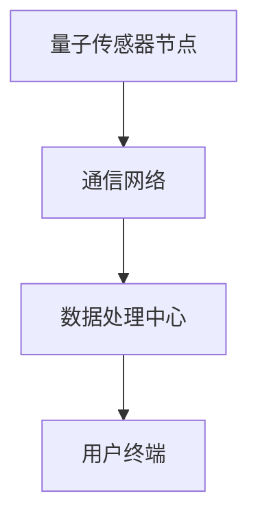

                 


# 巴菲特-芒格的量子传感网络投资：物联网的量子飞跃

---

## 关键词

- 巴菲特
- 芒格
- 量子传感网络
- 物联网
- 投资策略
- 量子技术
- 传感器

---

## 摘要

本文深入探讨了巴菲特和芒格在量子传感网络领域的投资理念，结合物联网技术的量子飞跃，分析了量子传感网络的核心原理、应用场景、投资机会及风险管理。文章通过系统化的结构，从理论到实践，详细阐述了如何将巴菲特的价值投资哲学与芒格的多元思维模型应用于量子传感网络的投资决策中，为读者提供了全面的技术与投资视角。

---

## 第1章：量子传感网络的基础知识

### 1.1 量子传感的基本概念

量子传感是一种利用量子力学原理进行测量的技术，其核心在于利用量子系统的特性（如叠加态、纠缠态）来实现更高精度的测量。与传统传感器相比，量子传感器具有更高的灵敏度和分辨率。

#### 1.1.1 量子传感的定义

量子传感是指通过量子系统（如光子、原子、离子等）的量子特性进行测量的技术。其核心在于利用量子叠加态和纠缠态来实现对目标物理量（如磁场、重力、位置等）的高精度测量。

#### 1.1.2 量子传感的工作原理

量子传感的工作原理基于量子力学的基本原理。传感器通过与被测对象的量子相互作用，将被测物理量编码到量子系统中，然后通过对量子系统的测量来提取被测信息。

#### 1.1.3 量子传感与传统传感技术的对比

| 特性         | 量子传感               | 传统传感             |
|--------------|------------------------|----------------------|
| 灵敏度       | 极高                   | 较低                 |
| 精度         | 超高                   | 一般                 |
| 响应时间     | 极快                   | 较慢                 |
| 应用领域     | 国防、通信、医疗等     | 工业、环境监测等      |

---

### 1.2 量子传感网络的构建

量子传感网络是由多个量子传感器通过通信网络连接而成的分布式系统。其构建需要考虑传感器的部署、数据传输、信号处理等多个方面。

#### 1.2.1 量子传感网络的体系结构

以下是量子传感网络的体系结构示意图：



#### 1.2.2 量子传感网络的关键技术

- **量子传感器芯片**：用于实现对目标物理量的量子测量。
- **量子通信链路**：用于传感器节点之间的数据传输。
- **量子数据处理算法**：用于对量子传感器输出的数据进行处理和分析。

---

## 第2章：物联网中的量子传感应用

### 2.1 物联网与量子传感的结合

物联网（IoT）是一个由传感器、通信网络和数据处理系统组成的生态系统。量子传感网络可以通过其高精度和高灵敏度的特点，显著提升物联网的性能。

#### 2.1.1 量子传感在物联网中的优势

- **高精度测量**：量子传感器可以实现比传统传感器更高的测量精度。
- **快速响应**：量子传感器的测量速度远快于传统传感器。
- **分布式部署**：量子传感网络可以实现大规模分布式部署，覆盖更广的区域。

#### 2.1.2 量子传感在物联网中的典型应用

- **智慧城市**：用于环境监测、交通管理等领域。
- **医疗健康**：用于生命体征监测、疾病诊断等领域。
- **工业自动化**：用于设备状态监测、生产过程优化等领域。

---

## 第3章：量子传感网络的投资机会

### 3.1 量子传感市场的现状与趋势

量子传感市场目前仍处于发展初期，但其潜在市场规模巨大。随着技术的成熟和应用领域的扩展，量子传感市场将呈现快速增长的趋势。

#### 3.1.1 市场规模分析

根据市场研究机构的预测，全球量子传感市场将在未来几年内以年均30%以上的速度增长，预计到2030年市场规模将达到数百亿美元。

---

## 第4章：巴菲特与芒格的投资哲学

### 4.1 巴菲特的价值投资理念

巴菲特的价值投资理念强调长期投资、基本面分析和安全边际。他认为，投资的本质是寻找具有持续竞争优势的企业，并以合理的价格买入并长期持有。

#### 4.1.1 巴菲特的投资策略

1. **寻找具有护城河的企业**：选择那些具有强大竞争优势的企业进行投资。
2. **注重企业的财务健康**：关注企业的盈利能力、现金流和债务水平。
3. **长期持有**：避免频繁交易，追求长期的资本增值。

### 4.2 芒格的多元思维模型

芒格的多元思维模型强调从多个学科的角度分析问题，寻找跨学科的解决方案。他认为，投资者需要具备广泛的知识储备，才能做出明智的投资决策。

#### 4.2.1 芒格的思维方式

1. **跨学科思考**：将物理学、化学、生物学等学科的知识应用于投资决策。
2. **逆向思维**：从反方向思考问题，寻找市场的空白点。
3. **注重风险控制**：在投资过程中，始终将风险管理放在首位。

---

## 第5章：量子传感网络的投资策略

### 5.1 量子传感网络的投资框架

结合巴菲特的价值投资理念和芒格的多元思维模型，我们可以构建一个适用于量子传感网络投资的框架。

#### 5.1.1 投资框架的核心要素

1. **技术可行性**：评估量子传感技术的成熟度和可实现性。
2. **市场需求**：分析量子传感技术在物联网中的市场需求。
3. **竞争环境**：研究市场上现有竞争者的情况。
4. **财务状况**：评估目标企业的财务健康状况。
5. **长期潜力**：预测量子传感技术的未来发展潜力。

---

## 第6章：量子传感网络的系统架构设计

### 6.1 量子传感网络的系统架构

量子传感网络的系统架构包括传感器节点、通信网络、数据处理中心和用户终端四个部分。

#### 6.1.1 系统架构的实体关系图

```mermaid
erdiagram
    Actor 用户终端
    Actor 数据处理中心
    Actor 通信网络
    Actor 传感器节点
    SensorNode 传感器节点
    CommunicationNetwork 通信网络
    DataProcessingCenter 数据处理中心
    用户终端 --> SensorNode: 发送控制指令
    SensorNode --> 通信网络: 发送测量数据
    通信网络 --> 数据处理中心: 传输数据
    数据处理中心 --> 用户终端: 返回处理结果
```

---

## 第7章：量子传感网络的实战案例

### 7.1 量子传感网络在智慧城市中的应用

#### 7.1.1 案例背景

某城市计划建设一个基于量子传感网络的环境监测系统，用于实时监测空气质量和污染源。

#### 7.1.2 实施过程

1. **传感器部署**：在城市各主要区域部署量子传感器节点。
2. **通信网络搭建**：建立覆盖全城的量子通信网络。
3. **数据处理系统开发**：开发数据处理中心，对传感器数据进行分析和处理。
4. **用户终端开发**：开发用户终端，向市民提供实时环境数据。

#### 7.1.3 实施效果

通过量子传感网络的应用，该城市实现了对环境质量的实时监测，显著提升了环境管理效率。

---

## 第8章：量子传感网络的未来展望

### 8.1 量子传感技术的未来发展

随着技术的进步，量子传感网络将在更多领域得到应用，市场规模也将进一步扩大。

#### 8.1.1 技术进步的方向

1. **提高测量精度**：进一步优化量子传感器的设计，提高测量精度。
2. **降低成本**：通过规模化生产和技术改进，降低量子传感器的成本。
3. **扩展应用领域**：探索量子传感技术在更多领域的应用潜力。

---

## 第9章：量子传感网络的投资风险管理

### 9.1 风险管理的重要性

在量子传感网络的投资过程中，风险管理是至关重要的。投资者需要识别和评估潜在风险，并采取相应的措施进行控制。

#### 9.1.1 风险识别与评估

1. **技术风险**：量子传感技术尚未完全成熟，存在技术失败的风险。
2. **市场风险**：市场需求可能不如预期，导致投资失败。
3. **竞争风险**：市场上可能涌现出更多的竞争者，导致价格战和利润下降。

---

## 第10章：量子传感网络的投资策略总结

### 10.1 总结与展望

量子传感网络的投资需要结合巴菲特的价值投资理念和芒格的多元思维模型，注重技术可行性、市场需求和长期潜力。投资者需要具备全面的知识储备和风险意识，才能在量子传感网络的投资中获得成功。

---

## 作者

作者：AI天才研究院 & 禅与计算机程序设计艺术

---

**注**：本文为技术博客文章，内容基于假设和理论分析，具体投资决策需结合实际情况和专业咨询。

