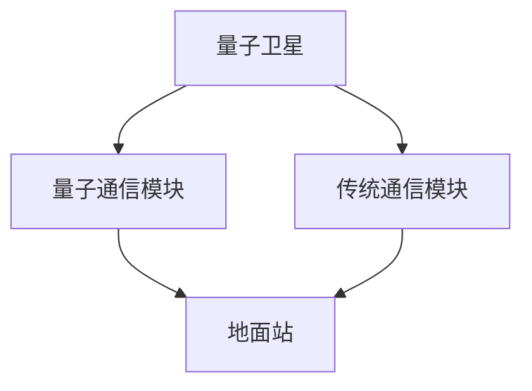

                 

# 巴菲特-芒格的量子加密通信卫星投资：全球安全通信的新标准

> **关键词**：量子加密通信、量子卫星、巴菲特、芒格、安全通信标准

> **摘要**：本文探讨了巴菲特和芒格在量子加密通信卫星领域的投资策略，分析了量子通信的技术原理、应用优势，以及这些投资如何影响全球安全通信的标准。通过详细的技术分析和投资案例，本文揭示了量子通信在未来的战略意义和投资价值。

---

# 引言

在全球数字化转型的背景下，通信安全成为各国和企业的核心关注点。量子通信作为一种革命性的技术，以其不可破解的安全性，正在重新定义全球安全通信的标准。本文将从巴菲特和芒格的投资视角出发，探讨他们为何选择量子加密通信卫星，以及这种投资对全球通信格局的深远影响。

---

# 第一章: 量子通信的背景与概述

## 1.1 量子通信的基本概念

### 1.1.1 量子通信的定义与核心原理

量子通信是一种利用量子力学原理进行信息传输的技术。其核心原理包括量子密钥分发（QKD）和量子隐形传态（QST）。QKD通过量子态传输密钥，确保通信的安全性；QST则能够在不传递实体的情况下传输量子信息。

### 1.1.2 量子通信的技术特点与优势

量子通信具有以下特点：
- **绝对安全性**：基于量子力学的不可克隆性，任何窃听都会留下痕迹。
- **高速性**：量子通信的传输速度接近光速，远超传统通信技术。
- **抗干扰性**：量子通信信号难以被干扰或截获。

### 1.1.3 量子通信的应用领域与前景

量子通信的应用领域广泛，包括：
- **国家安全**：用于军事通信和情报传输。
- **金融行业**：保护银行交易和数据传输的安全。
- **个人隐私**：为用户提供更安全的通信方式。

## 1.2 量子加密通信的原理

### 1.2.1 量子密钥分发（QKD）的原理

QKD通过量子态传输密钥，确保只有合法用户能够获取密钥。其过程如下：
1. **密钥生成**：发送方生成量子密钥，并通过量子信道传输。
2. **密钥分发**：接收方确认密钥，双方使用该密钥进行加密通信。
3. **安全性验证**：通过数学算法验证密钥的完整性。

### 1.2.2 量子加密通信的安全性分析

量子加密通信的安全性基于量子力学的不确定性原理，任何未经授权的窃听都会破坏量子状态，从而被合法用户发现。

### 1.2.3 量子加密通信与传统加密技术的对比

| 特性            | 量子加密通信      | 传统加密技术      |
|-----------------|-------------------|-------------------|
| 安全性          | 绝对安全性        | 可能被破解        |
| 传输速度        | 高速              | 较慢              |
| 抗干扰性        | 强                | 较弱              |

## 1.3 全球安全通信的新标准

### 1.3.1 全球安全通信的现状与挑战

当前，传统加密技术面临日益严峻的挑战，如计算能力的提升和加密算法的破解风险。量子通信的出现为解决这些问题提供了新的可能性。

### 1.3.2 量子加密通信在安全通信中的地位

量子加密通信被认为是未来全球安全通信的核心技术，能够有效应对传统加密技术的局限性。

### 1.3.3 新标准对全球通信产业的影响

量子通信的新标准将推动全球通信产业的升级，促进相关技术和产业的发展。

---

# 第二章: 巴菲特与芒格的投资哲学与量子通信

## 2.1 巴菲特与芒格的投资哲学

### 2.1.1 巴菲特的价值投资理念

巴菲特的价值投资理念强调长期持有优质资产，注重企业的内在价值和管理层素质。

### 2.1.2 芒格的多元思维模型

芒格的多元思维模型强调跨学科思考，通过多角度分析问题，寻找投资机会。

### 2.1.3 两人投资策略的共同点与差异

两人共同点：长期投资、注重基本面分析。

差异：巴菲特更关注企业的财务状况，芒格更注重企业的创新能力和管理层素质。

## 2.2 量子通信行业的投资机会

### 2.2.1 量子通信行业的现状与发展趋势

当前，量子通信技术仍处于发展阶段，但市场需求旺盛，技术进步迅速。

### 2.2.2 量子通信行业的投资热点

- **量子卫星**：量子卫星是量子通信的重要组成部分，具有战略意义。
- **量子芯片**：量子芯片是量子通信的核心技术，投资价值高。
- **量子网络**：量子网络的建设需要大量投资，但前景广阔。

### 2.2.3 量子通信行业的市场容量与增长潜力

预计未来几年，量子通信市场规模将快速增长，年复合增长率超过30%。

## 2.3 巴菲特与芒格对量子通信行业的看法

### 2.3.1 巴菲特对技术创新型企业的投资策略

巴菲特倾向于投资那些具有强大技术壁垒和持续创新能力的企业。

### 2.3.2 芒格对量子通信技术的长期看法

芒格认为，量子通信技术将彻底改变全球通信格局，具有巨大的投资潜力。

### 2.3.3 两人对量子通信投资的具体策略

- **长期投资**：巴菲特点名长期持有量子通信相关企业。
- **价值投资**：芒格强调选择具有竞争优势的量子通信企业。

---

# 第三章: 量子加密通信卫星的技术分析

## 3.1 量子加密通信卫星的技术原理

### 3.1.1 卫星量子通信的系统架构

量子卫星系统包括发射端、接收端和地面站，通过量子信道实现密钥分发。

### 3.1.2 量子卫星通信的工作原理

量子卫星通过量子态传输密钥，确保通信的安全性。地面站通过激光器与卫星建立量子连接。

### 3.1.3 量子卫星通信的部署挑战

- **技术难度**：量子卫星的制造和发射需要极高的技术水平。
- **成本高昂**：量子卫星的研发和发射成本巨大。
- **维护复杂**：量子卫星的维护和更新需要持续投入。

## 3.2 量子加密通信卫星的系统设计

### 3.2.1 系统功能设计

量子卫星系统包括：
- **量子通信模块**：负责量子密钥的生成和传输。
- **传统通信模块**：支持传统加密技术的通信。
- **地面控制站**：监控和管理卫星运行。

### 3.2.2 系统架构设计

使用 Mermaid 绘制系统架构图：

### 3.2.3 系统接口设计

量子卫星与地面站通过激光通信接口进行数据传输，接口协议采用国际标准。

## 3.3 量子卫星通信的数学模型

### 3.3.1 量子密钥分发的数学模型

量子密钥分发的核心算法基于以下数学模型：

$$ QKD = \begin{cases} 
1 & \text{若密钥相同} \\
0 & \text{否则}
\end{cases} $$

### 3.3.2 量子隐形传态的数学表达

量子隐形传态的数学表达如下：

$$ \Psi = \alpha |0\rangle + \beta |1\rangle $$

### 3.3.3 量子通信的安全性证明

通过数学证明，量子通信的安全性基于以下定理：

$$ \text{安全性} = 1 - \text{窃听概率} $$

---

# 第四章: 量子加密通信卫星的实际应用

## 4.1 量子卫星在国家安全中的应用

### 4.1.1 国家安全的通信需求

国家安全对通信的高安全性要求，使得量子卫星成为理想的选择。

### 4.1.2 量子卫星在军事领域的应用

量子卫星可用于军事指挥、情报传输和战场通信。

## 4.2 量子卫星在金融领域的应用

### 4.2.1 金融交易的安全需求

金融行业对数据传输的安全性要求极高，量子卫星提供了完美的解决方案。

### 4.2.2 量子卫星在金融交易中的应用

量子卫星可用于银行交易、支付系统和证券交易的安全通信。

## 4.3 量子卫星在个人隐私保护中的应用

### 4.3.1 个人隐私保护的需求

随着数字化的普及，个人隐私保护变得越来越重要。

### 4.3.2 量子卫星在个人通信中的应用

量子卫星可为个人用户提供加密通信服务，保护隐私。

---

# 第五章: 投资机会与风险分析

## 5.1 量子通信行业的投资机会

### 5.1.1 量子通信市场的现状

当前，量子通信市场处于快速发展阶段，市场规模逐年增长。

### 5.1.2 量子通信市场的投资热点

- **量子卫星**：具有战略意义，投资回报高。
- **量子芯片**：核心技术，投资价值大。
- **量子网络**：基础设施建设，需求旺盛。

## 5.2 投资量子通信的风险分析

### 5.2.1 技术风险

量子通信技术尚未完全成熟，存在技术瓶颈。

### 5.2.2 市场风险

市场竞争激烈，技术迭代快，投资风险高。

### 5.2.3 政策风险

政策变化可能影响量子通信的发展和投资。

---

# 第六章: 量子通信的未来趋势与投资展望

## 6.1 量子通信技术的未来发展方向

### 6.1.1 量子通信技术的演进

未来，量子通信技术将向更高效率、更低成本方向发展。

### 6.1.2 量子通信与人工智能的融合

量子通信与人工智能的结合将推动技术进步和应用创新。

## 6.2 量子通信的投资机会展望

### 6.2.1 量子卫星的投资潜力

量子卫星作为量子通信的核心技术，具有巨大的投资潜力。

### 6.2.2 量子通信产业链的投资机会

从上游的量子芯片到下游的量子网络，整个产业链都存在投资机会。

---

# 结论

量子通信作为一项革命性技术，正在改变全球安全通信的格局。巴菲特和芒格的投资策略为量子通信的发展提供了资金和资源支持。未来，随着技术的不断进步和应用的扩展，量子通信将成为全球安全通信的新标准，为投资者带来丰厚的回报。

---

**作者：AI天才研究院/AI Genius Institute & 禅与计算机程序设计艺术 /Zen And The Art of Computer Programming**

