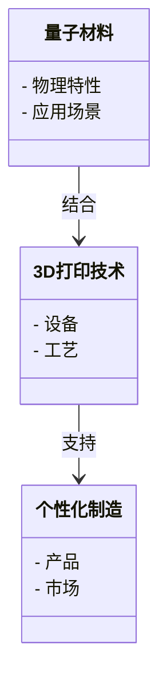

                 


# 巴菲特-芒格的量子材料3D打印投资：个性化制造的未来

> 关键词：巴菲特,芒格,量子材料,3D打印,投资,个性化制造,技术趋势

> 摘要：本文探讨了巴菲特和芒格的投资理念与量子材料、3D打印技术的结合，分析了个性化制造的未来发展趋势。通过详细的技术背景介绍、核心概念分析、投资模型构建、算法原理阐述以及实际案例分析，本文为读者提供了全面的视角，帮助理解如何将传统投资理念与新兴技术相结合，抓住未来个性化制造的投资机会。

---

## 第1章: 巴菲特-芒格投资理念概述

### 1.1 巴菲特-芒格投资理念的核心要素

#### 1.1.1 巴菲特的价值投资理论
巴菲特的价值投资理论强调长期持有优质资产，关注企业的内在价值，寻找那些具有强大护城河和持续盈利能力的企业进行投资。他的投资策略注重基本面分析，强调安全边际和长期价值。

#### 1.1.2 芒格的多元思维模型
芒格的多元思维模型强调通过多个学科的交叉应用来理解复杂问题，避免单一视角的局限性。他认为，投资者需要构建一个由多个学科知识组成的思维框架，以更好地识别投资机会和风险。

#### 1.1.3 两人投资理念的结合与互补
巴菲特和芒格的投资理念在实践中相互补充，巴菲特注重企业的内在价值和长期盈利能力，而芒格的多元思维模型则帮助识别复杂市场环境中的潜在风险和机会。两者的结合使得投资决策更加全面和科学。

---

### 1.2 量子材料与3D打印技术的背景介绍

#### 1.2.1 量子材料的定义与特性
量子材料是指在量子效应显著影响其宏观物理性质的材料，包括超导体、量子阱、量子点等。这些材料具有独特的物理特性，如超导性、高磁阻、光电效应等，广泛应用于电子设备、量子计算等领域。

#### 1.2.2 3D打印技术的原理与发展
3D打印技术是一种基于数字模型的快速成型技术，通过逐层叠加材料来构建三维物体。与传统制造相比，3D打印具有灵活性高、成本低、周期短等优势，适用于复杂形状和定制化产品的制造。

#### 1.2.3 个性化制造的未来趋势
个性化制造是指根据客户需求定制化生产产品，这与3D打印技术的特性高度契合。随着技术的进步，个性化制造将成为未来制造业的重要趋势，尤其是在医疗、航空航天、汽车等领域。

---

### 1.3 投资与技术创新的结合

#### 1.3.1 技术创新对投资的影响
技术创新可以显著改变市场的竞争格局，创造新的投资机会。量子材料和3D打印技术的结合为个性化制造带来了革命性的变化，投资者需要关注这些技术的商业化应用和市场潜力。

#### 1.3.2 量子材料与3D打印的投资机会
量子材料的高性能和3D打印的灵活性共同推动了个性化制造的发展，投资者可以关注相关领域的技术创新和市场扩展。例如，量子材料在3D打印中的应用可能带来新的投资机会。

#### 1.3.3 个性化制造的市场潜力
个性化制造的市场潜力巨大，尤其是在医疗和航空航天等领域。通过技术创新和成本下降，个性化制造将逐步从高端市场扩展到更广泛的市场。

---

## 第2章: 量子材料与3D打印的核心概念

### 2.1 量子材料的物理特性与应用

#### 2.1.1 量子材料的基本性质
量子材料的物理特性包括超导性、高磁阻、光电效应等，这些特性使其在电子设备、量子计算等领域具有广泛应用。

#### 2.1.2 量子材料在电子设备中的应用
量子材料在电子设备中的应用主要体现在高性能电子元件的制造上，例如超导体用于高温超导电缆，量子点用于显示技术。

#### 2.1.3 量子材料的市场潜力
随着量子计算和人工智能的发展，量子材料的需求将快速增长，市场潜力巨大。

---

### 2.2 3D打印技术的原理与优势

#### 2.2.1 3D打印的基本原理
3D打印的基本原理是通过数字模型逐层叠加材料，构建三维物体。其核心优势在于灵活性高、成本低、周期短。

#### 2.2.2 3D打印技术的优势
3D打印技术的优势包括：无需模具、支持复杂形状、适合小批量生产、定制化能力强。

#### 2.2.3 3D打印技术的局限性
3D打印技术的局限性包括：材料选择有限、生产速度慢、成本高等。

---

### 2.3 量子材料与3D打印的结合

#### 2.3.1 量子材料在3D打印中的应用
量子材料在3D打印中的应用主要体现在高性能材料的定制化生产上，例如超导体用于高端电子设备。

#### 2.3.2 3D打印技术对量子材料的影响
3D打印技术使得量子材料的制造更加灵活和高效，降低了生产成本，提高了产品的定制化能力。

#### 2.3.3 量子材料与3D打印的协同效应
量子材料与3D打印的结合可以显著提升个性化制造的水平，推动相关产业的技术进步和市场扩展。

---

## 第3章: 量子材料与3D打印的投资模型

### 3.1 投资模型的构建

#### 3.1.1 投资模型的核心要素
投资模型的核心要素包括：市场潜力、技术可行性、竞争优势、财务状况、管理团队等。

#### 3.1.2 投资模型的逻辑框架
投资模型的逻辑框架包括：市场分析、技术评估、财务分析、风险评估等。

#### 3.1.3 投资模型的数学表达
投资模型的数学表达可以表示为：

$$ 投资价值 = \alpha \times 市场潜力 + \beta \times 技术可行性 + \gamma \times 财务状况 $$

其中，$\alpha$、$\beta$、$\gamma$是权重系数，表示各因素的重要程度。

---

### 3.2 量子材料与3D打印的市场分析

#### 3.2.1 市场规模与增长趋势
量子材料与3D打印市场的规模正在快速增长，预计未来几年将保持高速增长。

#### 3.2.2 市场竞争格局
市场竞争格局主要由技术领先企业主导，但随着技术的普及，市场竞争将更加激烈。

#### 3.2.3 市场风险与机会
市场风险主要来自技术不确定性、政策变化和市场竞争。机会则在于技术创新和市场扩展。

---

### 3.3 投资策略的制定

#### 3.3.1 投资策略的多样性
投资者可以根据自身的风险偏好和投资目标选择不同的投资策略，例如长期持有、分散投资等。

#### 3.3.2 投资策略的可行性
投资策略的可行性需要考虑市场的实际状况、技术的成熟度以及自身的资源条件。

#### 3.3.3 投资策略的动态调整
投资者需要根据市场变化和技术进步动态调整投资策略，以应对潜在的风险和机会。

---

## 第4章: 量子材料与3D打印的数学模型与算法

### 4.1 数学模型的建立

#### 4.1.1 量子材料的物理特性建模
量子材料的物理特性可以通过量子力学方程进行建模，例如：

$$ H = \sum_{i} \epsilon_i |i\rangle \langle i| $$

其中，$H$是哈密顿量，$\epsilon_i$是能级，$|i\rangle$是能级态。

#### 4.1.2 3D打印技术的数学描述
3D打印技术的数学描述可以通过层状叠加的方式进行建模，例如：

$$ z = f(x, y) $$

其中，$z$是高度，$f(x, y)$是二维坐标$(x, y)$对应的高度函数。

#### 4.1.3 综合模型的构建
综合模型的构建需要将量子材料的物理特性与3D打印技术的数学描述结合起来，例如：

$$ V(x, y, z) = \sum_{i} a_i x_i + \sum_{j} b_j y_j + \sum_{k} c_k z_k $$

其中，$a_i$、$b_j$、$c_k$是权重系数，$x_i$、$y_j$、$z_k$是变量。

---

### 4.2 算法原理的讲解

#### 4.2.1 算法的基本原理
算法的基本原理是通过迭代优化来找到最优解，例如：

1. 初始化参数
2. 计算目标函数
3. 更新参数
4. 重复步骤2-3直到收敛

#### 4.2.2 算法的实现步骤
算法的实现步骤包括：数据预处理、模型训练、参数优化、结果验证等。

#### 4.2.3 算法的优化与改进
算法的优化与改进可以通过引入正则化、使用更高效的优化方法等来实现。

---

## 第5章: 量子材料与3D打印的系统分析与架构设计

### 5.1 系统分析

#### 5.1.1 问题场景介绍
问题场景介绍包括：个性化制造的需求、量子材料与3D打印的结合、市场潜力分析等。

#### 5.1.2 项目介绍
项目介绍包括：项目目标、项目范围、项目计划、项目团队等。

---

### 5.2 系统功能设计

#### 5.2.1 领域模型设计
领域模型设计可以通过Mermaid类图表示，例如：



#### 5.2.2 系统架构设计
系统架构设计可以通过Mermaid架构图表示，例如：


---

## 第6章: 量子材料与3D打印的项目实战

### 6.1 环境安装

#### 6.1.1 安装必要的软件和库
需要安装的软件和库包括：Python、numpy、scipy、matplotlib等。

### 6.2 核心代码实现

#### 6.2.1 量子材料的物理特性计算
量子材料的物理特性可以通过Python代码进行计算，例如：

```python
import numpy as np

# 定义哈密顿量
def hamiltonian(epsilon):
    return np.diag(epsilon)

# 计算能级
epsilon = [1, 2, 3]
H = hamiltonian(epsilon)
print(H)
```

#### 6.2.2 3D打印技术的数学建模
3D打印技术的数学建模可以通过Python代码实现，例如：

```python
import matplotlib.pyplot as plt

# 定义高度函数
def height(x, y):
    return np.sin(x) + np.cos(y)

# 绘制3D图形
x = np.linspace(-2, 2, 100)
y = np.linspace(-2, 2, 100)
X, Y = np.meshgrid(x, y)
Z = height(X, Y)

plt.contourf(X, Y, Z)
plt.colorbar()
plt.show()
```

---

## 第7章: 最佳实践与小结

### 7.1 最佳实践

#### 7.1.1 小结
本文通过详细的技术背景介绍、核心概念分析、投资模型构建、算法原理阐述以及实际案例分析，全面探讨了巴菲特和芒格的投资理念与量子材料、3D打印技术的结合，为读者提供了全面的视角，帮助理解如何将传统投资理念与新兴技术相结合，抓住未来个性化制造的投资机会。

#### 7.1.2 注意事项
投资者在实际操作中需要注意市场风险、技术不确定性以及政策变化等因素，同时需要结合自身的资源和能力制定合理的投资策略。

#### 7.1.3 拓展阅读
读者可以进一步阅读相关领域的学术论文、行业报告以及技术文档，以更深入地理解量子材料和3D打印技术的投资机会和挑战。

---

## 作者信息

作者：AI天才研究院/AI Genius Institute & 禅与计算机程序设计艺术 /Zen And The Art of Computer Programming

---

以上是《巴菲特-芒格的量子材料3D打印投资：个性化制造的未来》的技术博客文章的详细目录大纲和部分内容。

