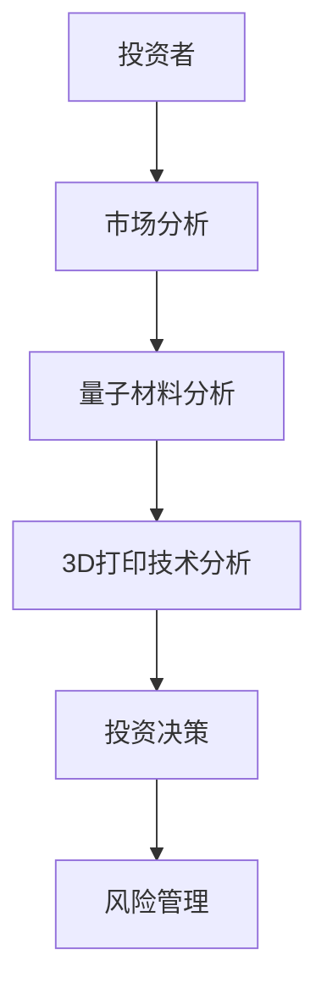
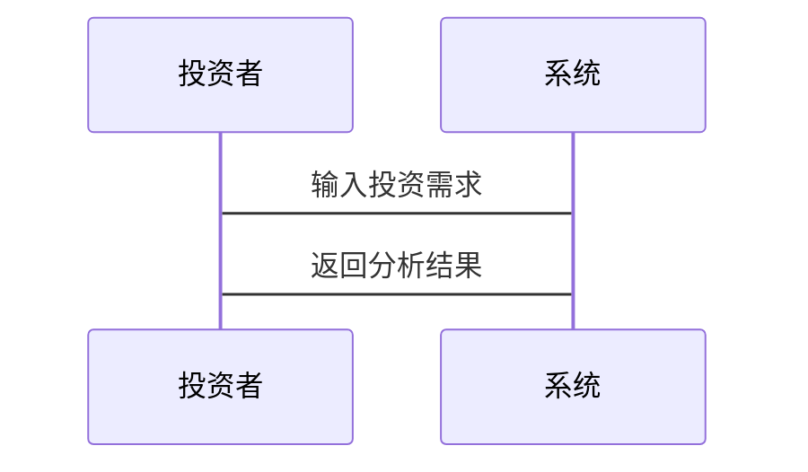

                 


# 巴菲特-芒格的量子材料3D打印投资：制造业的革命性突破

> 关键词：巴菲特、芒格、量子材料、3D打印、投资策略、制造业创新、技术驱动

> 摘要：本文深入探讨了巴菲特和芒格的投资理念如何与量子材料和3D打印技术相结合，推动制造业的革命性突破。通过分析量子材料和3D打印技术的核心概念、投资分析模型、系统架构设计以及实际案例，本文揭示了这些技术如何改变制造业的未来，并为投资者提供了新的视角和策略。

---

## 第一部分: 巴菲特与芒格的投资理念

### 第1章: 巴菲特与芒格的投资哲学

#### 1.1 巴菲特与芒格的投资理念概述

##### 1.1.1 巴菲特的价值投资理论
巴菲特的价值投资理论强调长期主义和安全边际。他认为，投资者应该以低于内在价值的价格购买优秀的公司，并长期持有。这种理念的核心在于对公司基本面的深入分析，包括财务状况、竞争优势和管理团队等方面。

##### 1.1.2 芒格的多元思维模型
芒格的多元思维模型强调将各个学科的基本原理融会贯通，形成一个立体的知识框架。他认为，投资者应该从多个角度分析问题，避免单一思维的局限性。这种思维方式帮助他在投资决策中识别潜在风险和机会。

##### 1.1.3 两人投资理念的结合与互补
巴菲特和芒格的投资理念在实践中形成了互补关系。巴菲特注重企业的内在价值和长期稳定性，而芒格则注重跨学科的分析和风险管理。两者的结合使得他们的投资决策更加全面和稳健。

#### 1.2 投资哲学的核心要素

##### 1.2.1 长期主义
长期主义是巴菲特和芒格投资理念的核心。他们认为，短期市场的波动不应该影响长期的投资决策。通过长期持有优质资产，投资者能够获得稳定的回报。

##### 1.2.2 安全边际
安全边际是指投资价格低于内在价值的部分。巴菲特认为，安全边际是保护投资者免受市场波动影响的重要因素。通过寻找具有较大安全边际的投资标的，投资者可以降低风险并获得超额回报。

##### 1.2.3 企业基本面分析
基本面分析是巴菲特和芒格选股的核心方法。他们通过分析公司的财务报表、行业地位、竞争优势和管理团队等因素，筛选出具有长期增长潜力的优秀企业。

---

### 第2章: 量子材料与3D打印技术的背景

#### 2.1 量子材料的基本概念

##### 2.1.1 量子材料的定义与分类
量子材料是指在量子效应显著的尺度下表现出独特物理性质的材料。常见的量子材料包括石墨烯、超导体、拓扑绝缘体等。这些材料在电子、磁性、热导率等方面具有显著的量子效应，适用于高端制造业和高科技领域。

##### 2.1.2 量子材料的物理特性
量子材料的物理特性包括高导电性、超导性、磁性等。这些特性使得量子材料在电子设备、能源存储、传感器等领域具有广泛的应用前景。

##### 2.1.3 量子材料在制造业中的应用前景
随着技术的进步，量子材料在制造业中的应用前景广阔。例如，石墨烯可以用于制造柔性电子设备，超导体可以用于高效能源传输等。

#### 2.2 3D打印技术的革命性突破

##### 2.2.1 3D打印技术的定义与原理
3D打印技术是一种基于数字模型的制造技术。它通过逐层叠加材料，构建出三维物体。3D打印技术的核心原理是将数字模型转化为物理物体，具有高度的定制化和灵活性。

##### 2.2.2 3D打印技术的核心优势
3D打印技术的核心优势包括快速原型制作、复杂结构的实现、按需生产等。这些优势使得3D打印技术在航空航天、医疗、汽车等领域得到了广泛应用。

##### 2.2.3 3D打印技术在制造业中的应用案例
例如，3D打印技术可以用于制造复杂形状的金属零件，减少材料浪费和生产成本。此外，3D打印技术还可以用于快速原型制作，缩短产品开发周期。

---

### 第3章: 巴菲特与芒格投资理念与量子材料的结合

#### 3.1 量子材料的投资价值

##### 3.1.1 量子材料的市场潜力
量子材料在电子、能源、医疗等领域具有巨大的市场潜力。随着技术的进步，量子材料的应用范围将进一步扩大，市场需求将快速增长。

##### 3.1.2 量子材料的技术壁垒
量子材料的研发和生产需要高度的技术 expertise 和资金投入。较高的技术壁垒使得量子材料的市场竞争相对较低，具有较高的投资价值。

##### 3.1.3 量子材料的长期投资价值
量子材料作为新兴技术的重要组成部分，具有长期的投资价值。随着技术的成熟和应用的推广，量子材料的投资回报将逐步显现。

#### 3.2 3D打印技术的投资机会

##### 3.2.1 3D打印技术的市场前景
3D打印技术在制造业中的应用前景广阔。随着技术的进步和成本的降低，3D打印技术将逐渐普及，市场需求将快速增长。

##### 3.2.2 3D打印技术的创新潜力
3D打印技术具有高度的创新潜力。通过不断的技术创新，3D打印技术可以实现更复杂、更高效的生产方式，推动制造业的革命性突破。

##### 3.2.3 3D打印技术的行业应用
3D打印技术在航空航天、医疗、汽车等领域具有广泛的应用前景。例如，3D打印技术可以用于制造复杂形状的零件，提高生产效率和产品质量。

---

### 第4章: 投资分析与决策模型

#### 4.1 投资分析的基本框架

##### 4.1.1 投资分析的核心要素
投资分析的核心要素包括市场分析、财务分析、竞争优势分析和风险管理。通过综合分析这些要素，投资者可以做出科学的投资决策。

##### 4.1.2 投资分析的步骤与方法
投资分析的步骤包括定义问题、数据收集、分析和评估、制定决策等。投资者需要根据实际情况灵活调整分析步骤和方法。

##### 4.1.3 投资分析的工具与技术
投资分析的工具与技术包括财务指标分析、情景分析、蒙特卡洛模拟等。这些工具和技术可以帮助投资者更好地理解市场风险和不确定性。

#### 4.2 投资决策模型的构建

##### 4.2.1 投资决策模型的逻辑框架
投资决策模型的逻辑框架包括目标设定、数据输入、模型运算、结果输出等。投资者需要根据具体需求设计合理的模型框架。

##### 4.2.2 投资决策模型的数学公式
以下是投资决策模型的一个示例：

$$
\text{投资回报率} = \frac{\text{净收益}}{\text{初始投资}} \times 100\%
$$

##### 4.2.3 投资决策模型的验证与优化
投资者需要通过历史数据和实际市场表现验证模型的有效性，并根据实际情况不断优化模型。

---

### 第5章: 量子材料与3D打印技术的系统架构

#### 5.1 系统架构设计

##### 5.1.1 系统功能设计
系统功能设计包括数据采集、模型运算、结果输出等。投资者需要根据具体需求设计合理的系统功能。

##### 5.1.2 系统架构设计
以下是量子材料与3D打印技术的系统架构图：



##### 5.1.3 系统接口设计
系统接口设计包括数据输入、模型调用、结果输出等。投资者需要根据具体需求设计合理的系统接口。

##### 5.1.4 系统交互设计
以下是系统交互的序列图：



---

### 第6章: 项目实战

#### 6.1 环境安装

##### 6.1.1 Python环境安装
投资者需要安装Python编程环境，包括Python解释器和相关库。

##### 6.1.2 数据分析工具安装
投资者需要安装数据分析工具，如Pandas、NumPy等。

##### 6.1.3 可视化工具安装
投资者需要安装可视化工具，如Matplotlib、Seaborn等。

#### 6.2 核心代码实现

##### 6.2.1 数据分析代码
以下是量子材料投资分析的代码示例：

```python
import pandas as pd
import numpy as np

# 数据加载
data = pd.read_csv('quantum_material.csv')

# 数据清洗
data.dropna(inplace=True)

# 数据分析
mean_return = data['return'].mean()
std_deviation = data['return'].std()

print(f"平均回报率: {mean_return}")
print(f"标准差: {std_deviation}")
```

##### 6.2.2 3D打印技术分析代码
以下是3D打印技术投资分析的代码示例：

```python
import matplotlib.pyplot as plt

# 数据加载
data = pd.read_csv('3d_printing.csv')

# 数据可视化
plt.plot(data['year'], data['return'], 'b-')
plt.xlabel('年份')
plt.ylabel('回报率')
plt.title('3D打印技术投资回报率分析')
plt.show()
```

#### 6.3 案例分析

##### 6.3.1 量子材料投资案例
以下是量子材料投资的案例分析：

假设某投资者投资于一家量子材料公司，该公司在2020年的收入为1000万美元，净利润率为10%。根据巴菲特的价值投资理论，该公司的内在价值为1200万美元。如果当前股价为每股10美元，该公司股票具有较大的安全边际。

##### 6.3.2 3D打印技术投资案例
以下是3D打印技术投资的案例分析：

假设某投资者投资于一家3D打印技术公司，该公司在2020年的收入为5000万美元，净利润率为15%。根据芒格的多元思维模型，该公司的竞争优势明显，具有较高的投资价值。

---

### 第7章: 投资策略与风险管理

#### 7.1 投资策略

##### 7.1.1 长期投资策略
长期投资策略是巴菲特和芒格的核心投资策略。通过长期持有优质资产，投资者可以避免短期市场的波动，获得稳定的回报。

##### 7.1.2 风险管理策略
风险管理策略是投资决策的重要组成部分。投资者需要通过 diversification、止损等方法，降低投资风险。

#### 7.2 投资风险管理

##### 7.2.1 风险识别与评估
投资者需要通过市场分析、财务分析等方法，识别和评估投资风险。

##### 7.2.2 风险应对策略
投资者需要根据风险的性质和严重程度，制定相应的风险应对策略，如调整投资组合、增加安全边际等。

---

### 第8章: 未来展望与挑战

#### 8.1 量子材料与3D打印技术的未来趋势

##### 8.1.1 量子材料的未来发展趋势
量子材料的未来发展趋势包括材料性能的进一步提升、应用场景的扩展等。随着技术的进步，量子材料的投资价值将进一步显现。

##### 8.1.2 3D打印技术的未来发展趋势
3D打印技术的未来发展趋势包括技术的进一步创新、成本的降低等。随着技术的进步，3D打印技术将更加广泛地应用于制造业。

#### 8.2 制造业的革命性突破

##### 8.2.1 量子材料与3D打印技术的结合
量子材料与3D打印技术的结合将推动制造业的革命性突破。通过量子材料的高性能和3D打印技术的灵活性，制造业将实现更高效、更智能的生产方式。

##### 8.2.2 制造业的未来发展方向
制造业的未来发展方向包括智能化、数字化、绿色化等。量子材料和3D打印技术的应用将推动制造业向这些方向发展。

---

### 第9章: 结论与总结

#### 9.1 结论

量子材料和3D打印技术的结合将推动制造业的革命性突破。通过巴菲特和芒格的投资理念，投资者可以更好地把握这些技术的投资机会，实现长期稳定的回报。

#### 9.2 总结

本文深入探讨了巴菲特和芒格的投资理念与量子材料、3D打印技术的结合，分析了这些技术在制造业中的应用前景和投资价值。通过系统的分析和实际案例，本文为投资者提供了新的视角和策略。

---

**作者：AI天才研究院/AI Genius Institute & 禅与计算机程序设计艺术 /Zen And The Art of Computer Programming**

