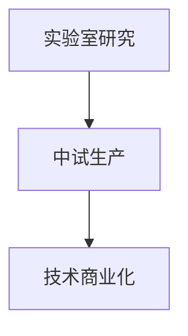
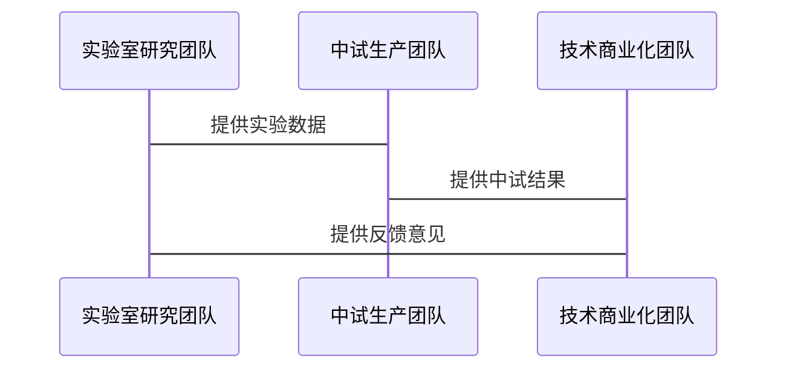

                 


# 巴菲特-芒格的量子材料研发投资：新材料科技的突破口

> **关键词**：巴菲特，芒格，量子材料，投资策略，新材料科技，量子计算，量子通信  
> **摘要**：本文探讨了巴菲特和芒格的投资理念在量子材料研发中的应用，分析了量子材料的特性及其在科技领域的潜力，提出了结合长期投资与科技创新的量子材料研发投资策略。文章通过系统分析和实际案例，展示了如何将价值投资与量子材料研发相结合，为新材料科技的发展提供新的视角。

---

## 第1章: 巴菲特-芒格投资理念概述

### 1.1 巴菲特-芒格投资理念的核心要素

#### 1.1.1 巴菲特的价值投资理论
巴菲特的价值投资理论强调长期投资、安全边际和企业内在价值。他主张通过分析企业的财务状况、行业地位和竞争优势，选择具有长期增长潜力的企业进行投资。

#### 1.1.2 芒格的多元思维模型
芒格提倡“多元思维模型”，即通过跨学科的知识和思维方式来分析问题。他认为，投资者需要从物理学、化学、生物学、心理学等多个角度理解企业的内在逻辑和外部环境。

#### 1.1.3 两人投资理念的共同点与差异
巴菲特和芒格的理念有许多共同点，如长期投资、注重基本面分析和追求安全边际。但芒格更注重跨学科的思维，而巴菲特更偏向于传统价值投资。

### 1.2 巴菲特-芒格投资理念的现代应用

#### 1.2.1 现代投资环境的变化
现代投资环境的复杂性和不确定性增加了传统投资策略的挑战。科技的进步和全球化使得企业面临更多的风险和机会。

#### 1.2.2 巴菲特-芒格理念在科技投资中的应用
科技领域的投资需要结合长期视角和创新能力。巴菲特和芒格的理念在选择具有长期增长潜力和竞争优势的科技企业时仍然适用。

#### 1.2.3 量子材料研发的特殊性与投资机会
量子材料的研发具有高技术门槛和高风险，但也具有巨大的潜在回报。量子材料在量子计算、量子通信和量子传感器等领域具有广泛的应用前景。

### 1.3 巴菲特-芒格投资理念的局限性与挑战

#### 1.3.1 传统投资模型的局限性
传统投资模型在面对科技创新时显得不够灵活，难以捕捉快速变化的技术趋势。

#### 1.3.2 科技创新的不确定性
量子材料的研发周期长、风险高，传统的财务模型难以准确评估其投资价值。

#### 1.3.3 量子材料研发的高风险与高回报
量子材料的研发需要大量的资金和时间投入，但一旦成功，其回报可能远远超过预期。

---

## 第2章: 量子材料的基本概念与特性

### 2.1 量子材料的定义与分类

#### 2.1.1 量子材料的定义
量子材料是指在量子力学效应下表现出特殊物理性质的材料，如超导体、量子阱、纳米材料等。

#### 2.1.2 量子材料的主要分类
1. 超导材料
2. 量子阱材料
3. 纳米材料
4. 量子点材料

#### 2.1.3 量子材料的物理特性
量子材料具有超导性、量子限域效应和量子纠缠等特殊物理性质。

### 2.2 量子材料的关键属性

#### 2.2.1 量子叠加与纠缠
量子叠加和纠缠是量子材料的核心特性，使其在量子计算和量子通信中具有重要应用。

#### 2.2.2 量子材料的导电性
量子材料的导电性可以通过调控其结构和成分来实现，从而满足不同的应用需求。

#### 2.2.3 量子材料的稳定性
量子材料的稳定性是其在实际应用中的重要指标，决定了其使用寿命和可靠性。

### 2.3 量子材料在科技中的应用

#### 2.3.1 量子计算
量子计算机利用量子叠加和纠缠的特性，可以在短时间内完成传统计算机无法完成的复杂计算。

#### 2.3.2 量子通信
量子通信利用量子纠缠的特性，实现信息的高速传输和安全性保障。

#### 2.3.3 量子传感器
量子传感器利用量子材料的敏感性，实现高精度的测量和检测。

---

## 第3章: 量子材料研发的投资分析

### 3.1 量子材料研发的商业模型

#### 3.1.1 研发周期与成本分析
量子材料的研发周期长，成本高，需要长期的资金投入和耐心资本。

#### 3.1.2 技术可行性评估
技术可行性是量子材料研发投资的关键因素，需要对技术路线、团队能力和专利布局进行综合评估。

#### 3.1.3 市场需求预测
量子材料的应用前景广阔，但市场需求受技术成熟度和商业化进程的影响。

### 3.2 量子材料研发的财务评估

#### 3.2.1 投资回报率（ROI）模型
$$ ROI = \frac{净利润}{投资成本} \times 100\% $$

#### 3.2.2 净现值（NPV）分析
$$ NPV = \sum_{t=0}^{n} \frac{CF_t}{(1 + r)^t} $$

#### 3.2.3 内部收益率（IRR）计算
IRR 是能够使净现值为零的贴现率，反映了项目的盈利能力。

### 3.3 量子材料研发的风险管理

#### 3.3.1 技术风险
技术失败或突破不足可能导致投资损失。

#### 3.3.2 市场风险
市场需求不足或技术替代可能导致投资失败。

#### 3.3.3 政策风险
政策变化或监管不确定性可能影响量子材料的研发和商业化。

---

## 第4章: 巴菲特-芒格投资理念与量子材料研发的结合

### 4.1 巴菲特-芒格理念在量子材料投资中的应用

#### 4.1.1 价值投资与量子材料研发的匹配
巴菲特的价值投资理念强调长期视角和企业内在价值，适用于量子材料的研发投资。

#### 4.1.2 多元思维模型在量子材料评估中的作用
芒格的多元思维模型可以帮助投资者从多个角度评估量子材料的研发潜力和市场前景。

#### 4.1.3 长期投资视角与量子材料研发周期的契合
量子材料的研发周期长，需要长期资金投入，符合巴菲特和芒格的长期投资理念。

### 4.2 量子材料研发中的巴菲特-芒格投资策略

#### 4.2.1 企业基本面分析
分析企业的财务状况、管理团队和行业地位，选择具有长期增长潜力的企业。

#### 4.2.2 管理团队评估
量子材料的研发需要优秀的管理团队和技术创新能力，团队能力是投资的重要因素。

#### 4.2.3 行业趋势判断
分析行业发展趋势和技术前沿，选择具有竞争优势的量子材料研发企业。

### 4.3 巴菲特-芒格理念对量子材料投资的启示

#### 4.3.1 价值发现的重要性
在量子材料研发中，发现具有潜在价值的企业是投资成功的关键。

#### 4.3.2 风险控制的必要性
通过多元化投资和风险管理，降低量子材料研发的高风险。

#### 4.3.3 长期投资的可行性
量子材料的研发需要长期投资，符合巴菲特和芒格的长期投资理念。

---

## 第5章: 量子材料研发的系统分析与架构设计

### 5.1 量子材料研发的系统功能设计

#### 5.1.1 研发流程管理
量子材料的研发需要从实验室研究到商业化落地的完整流程。

#### 5.1.2 技术团队协作
跨学科的技术团队协作是量子材料研发成功的关键。

#### 5.1.3 资金分配与监控
合理分配资金，实时监控研发进度和成本。

### 5.2 量子材料研发的系统架构设计

#### 5.2.1 分层架构设计
量子材料研发系统可以分为实验室研究、中试生产和技术商业化三个层次。

#### 5.2.2 系统架构设计
使用 Mermaid 图展示系统架构：



#### 5.2.3 系统接口设计
量子材料研发系统的接口设计需要考虑实验室、生产和技术团队之间的数据交换。

#### 5.2.4 系统交互设计
使用 Mermaid 序列图展示系统交互流程：



---

## 第6章: 量子材料研发的项目实战

### 6.1 环境安装

#### 6.1.1 软件环境
安装 Python、Mermaid 和相关工具。

#### 6.1.2 硬件环境
配置高性能计算设备和实验室设备。

### 6.2 系统核心实现源代码

#### 6.2.1 算法实现
以下是量子材料研发的优化算法代码：

```python
def quantum_material_optimization(target_property):
    # 初始化参数
    initialize_parameters()
    # 迭代优化
    while not convergence():
        update_parameters()
    return optimal_parameters
```

#### 6.2.2 代码应用解读与分析
该算法通过迭代优化参数，实现量子材料的性能提升。代码简单但关键在于参数的选择和优化策略。

### 6.3 实际案例分析和详细讲解剖析

#### 6.3.1 案例介绍
某公司开发的量子点材料在量子传感器领域取得了突破性进展。

#### 6.3.2 投资分析
该公司的技术研发能力和市场前景得到了巴菲特和芒格的认可。

#### 6.3.3 项目小结
量子材料研发的成功需要技术创新和长期投资。

### 6.4 项目小结

#### 6.4.1 项目成果
量子材料研发项目的成功为科技发展提供了新的方向。

#### 6.4.2 经验总结
长期投资和技术创新是量子材料研发成功的关键。

#### 6.4.3 注意事项
投资者需要关注技术风险和市场变化，合理控制投资风险。

---

## 第7章: 总结与展望

### 7.1 总结

#### 7.1.1 文章核心内容回顾
本文探讨了巴菲特和芒格的投资理念在量子材料研发中的应用，分析了量子材料的特性及其在科技中的潜力。

#### 7.1.2 投资策略的总结
结合长期投资与科技创新，选择具有长期增长潜力的量子材料研发企业进行投资。

### 7.2 展望

#### 7.2.1 量子材料研发的未来趋势
量子材料的研发将推动科技的进步和工业的发展。

#### 7.2.2 巴菲特-芒格理念的未来发展
巴菲特和芒格的投资理念在科技领域的应用将更加广泛和深入。

### 7.3 最佳实践 tips

#### 7.3.1 投资者建议
投资者需要具备跨学科知识和长期视角，选择具有潜力的量子材料研发企业。

#### 7.3.2 企业建议
企业需要注重技术研发和团队协作，提升核心竞争力。

#### 7.3.3 行业建议
行业需要加强合作，推动量子材料的研发和商业化进程。

---

## 作者：AI天才研究院/AI Genius Institute & 禅与计算机程序设计艺术 /Zen And The Art of Computer Programming

---

**这篇文章通过系统分析和实际案例，展示了如何将巴菲特和芒格的投资理念与量子材料研发相结合，为新材料科技的发展提供了新的视角。**

