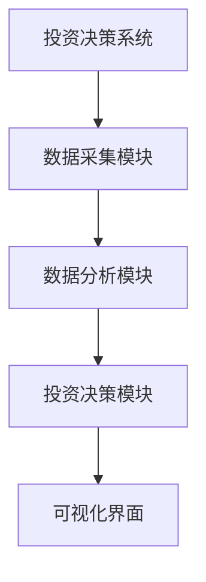
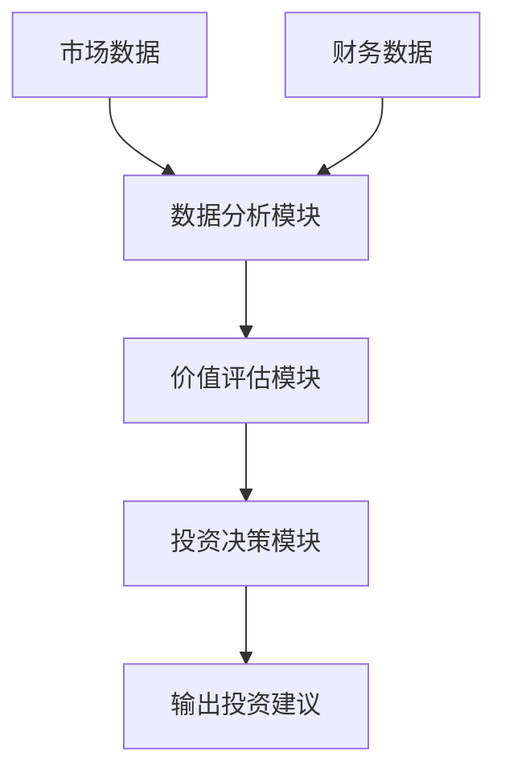

                 


# 巴菲特-芒格的量子点太阳能电池投资：新能源革命的催化剂

## 关键词：巴菲特、芒格、量子点太阳能电池、新能源革命、投资策略、技术创新

## 摘要：本文探讨了巴菲特和芒格如何通过投资量子点太阳能电池技术，推动新能源革命的发展。文章从投资哲学、技术背景、投资协同、算法优化、系统架构、项目实战到未来展望，详细分析了巴菲特和芒格的投资策略如何与技术创新相结合，成为新能源革命的重要催化剂。

---

# 第一部分：巴菲特与芒格的投资哲学

## 第1章：巴菲特的价值投资哲学

### 1.1 巴菲特的投资理念概述

#### 1.1.1 价值投资的核心原则
价值投资是一种长期投资策略，强调以低于内在价值的价格购买优质资产。巴菲特的投资哲学基于以下原则：
- **安全边际**：买入价格低于内在价值，确保投资的安全性。
- **长期视角**：关注企业的长期盈利能力，而非短期市场波动。
- **企业质量**：选择具有强大护城河和良好管理的公司。

#### 1.1.2 芒格的多元思维模型
芒格提倡通过多个学科的交叉分析来做出决策，强调：
- **跨学科技能**：将物理学、心理学、经济学等学科的知识结合起来，形成全面的决策框架。
- **逆向思维**：从问题的反面思考，避免常见错误。

#### 1.1.3 价值投资与市场周期
巴菲特和芒格的价值投资策略在市场周期中表现稳健，尤其是在市场低迷时，优质资产的价值会被低估，为投资提供了机会。

### 1.2 巴菲特与芒格的投资策略

#### 1.2.1 长期投资与安全边际
巴菲特定律：“价格是你支付的，价值是你得到的。”通过安全边际确保在市场波动中依然盈利。

#### 1.2.2 股东权益与企业价值评估
巴菲特强调企业的内在价值，关注ROE（净资产收益率）等指标，确保投资的企业具有可持续的盈利能力。

#### 1.2.3 投资组合管理
芒格的决策框架包括：
- **分散投资**：避免过度集中，降低风险。
- **持续学习**：不断更新知识库，适应市场变化。

---

## 第2章：量子点太阳能电池的技术背景

### 2.1 量子点太阳能电池的基本原理

#### 2.1.1 太阳能电池的工作原理
太阳能电池通过半导体材料将光能转化为电能。传统的硅基太阳能电池面临效率瓶颈，而量子点技术提供了更高的转换效率。

#### 2.1.2 量子点材料的光电特性
量子点是一种纳米级半导体材料，具有独特的光电效应：
- **吸收与发射光谱**：量子点可以通过调整尺寸和形状来改变吸收和发射光的波长，提高能量转换效率。
- **稳定性**：量子点材料在不同环境条件下表现稳定，适合大规模应用。

#### 2.1.3 量子点太阳能电池的优势与挑战
优势：
- **高效率**：量子点太阳能电池的理论效率可达30%以上，高于传统硅基电池。
- **灵活应用**：适合各种形状和尺寸，适用于建筑集成光伏（BIPV）等领域。
- **成本降低**：制造过程简化，可能降低成本。

挑战：
- **技术成熟度**：量子点技术仍处于研发阶段，大规模商业化面临技术难题。
- **稳定性问题**：量子点材料在长期使用中的稳定性需要进一步验证。

### 2.2 量子点太阳能电池的市场应用

#### 2.2.1 新能源市场的现状与趋势
全球能源结构转型推动了对可再生能源的需求，太阳能作为主要来源之一，市场潜力巨大。

#### 2.2.2 量子点太阳能电池的市场潜力
- **技术创新驱动市场**：量子点技术的突破将推动太阳能电池市场增长。
- **政策支持**：政府对可再生能源的补贴和政策支持为量子点技术提供了发展动力。

#### 2.2.3 新能源革命的催化剂作用
量子点太阳能电池的技术进步将加速能源结构转型，推动全球向清洁能源迈进。

---

## 第3章：巴菲特与芒格投资量子点太阳能电池的协同效应

### 3.1 投资策略与技术创新的结合

#### 3.1.1 投资策略的技术驱动
巴菲特和芒格的价值投资策略关注企业的技术创新能力，量子点太阳能电池的技术突破为投资提供了新机遇。

#### 3.1.2 技术创新的投资催化
通过投资量子点技术，巴菲特和芒格不仅支持了技术创新，还为企业的长期价值增长提供了动力。

### 3.2 量子点技术对企业价值的影响

#### 3.2.1 技术创新对企业竞争力的提升
量子点太阳能电池的高效率和灵活性将增强企业的市场竞争力，提升企业价值。

#### 3.2.2 企业价值的长期增长
技术创新带来的成本下降和效率提升将推动企业长期盈利，符合巴菲特的价值投资理念。

### 3.3 投资策略与技术发展的协同效应

#### 3.3.1抽丝剥茧地分析投资策略如何影响技术创新
- **资金支持**：投资为企业提供了研发资金，推动技术进步。
- **管理优化**：巴菲特和芒格的投资策略注重企业管理，帮助量子点技术企业优化运营。

#### 3.3.2 技术进步如何促进投资回报
- **技术创新带来效率提升**：量子点技术的突破降低了成本，提高了利润率。
- **市场扩展**：技术创新推动市场扩张，增加企业的收入来源。

---

## 第4章：投资决策的算法优化

### 4.1 投资决策的数学模型

#### 4.1.1 股东权益价值评估模型
$$ V = \text{FCFF} \times (WACC)^{-1} $$
其中，FCFF是自由现金流，WACC是加权平均资本成本。

#### 4.1.2 企业价值与投资决策的关系
$$ \text{投资价值} = \text{企业价值} - \text{当前股价} $$

### 4.2 量子点技术的优化算法

#### 4.2.1 量子点材料优化的数学模型
$$ \text{效率} = f(\text{量子点尺寸}, \text{掺杂浓度}, \text{制备工艺}) $$

#### 4.2.2 基于遗传算法的优化
- **目标函数**：最大化太阳能电池效率。
- **变量选择**：量子点尺寸、掺杂浓度等。
- **约束条件**：工艺可行性、成本限制。

### 4.3 投资决策的优化路径

#### 4.3.1 数据分析与模型构建
- **数据采集**：收集企业财务数据和市场数据。
- **模型构建**：建立投资决策模型，评估量子点技术的投资价值。

#### 4.3.2 案例分析：假设某量子点企业
假设企业A的FCFF为1000万元，WACC为8%，则：
$$ V = 1000 \times (1/0.08) = 12500 \text{万元} $$
如果当前股价为每股10元，流通股1000万股，则企业价值为12500万元，当前市值为10000万元，投资价值为2500万元。

---

## 第5章：系统架构与数据流设计

### 5.1 量子点技术投资决策系统架构

#### 5.1.1 系统功能模块
- **数据采集**：收集企业财务数据和市场数据。
- **数据分析**：构建投资模型，评估企业价值。
- **决策支持**：提供投资建议和风险评估。

#### 5.1.2 系统架构图


### 5.2 数据流与交互设计

#### 5.2.1 数据流图


#### 5.2.2 系统交互流程
- **输入**：市场数据和财务数据。
- **处理**：数据分析模块构建模型，评估企业价值。
- **输出**：投资建议和风险评估。

---

## 第6章：项目实战与案例分析

### 6.1 项目环境与安装

#### 6.1.1 环境要求
- **编程语言**：Python 3.8+
- **库依赖**：Pandas、NumPy、Matplotlib。

#### 6.1.2 系统安装
```bash
pip install pandas numpy matplotlib
```

### 6.2 核心代码实现

#### 6.2.1 数据分析模块
```python
import pandas as pd
import numpy as np

# 假设df是包含财务数据的DataFrame
def calculate_value(df):
    # 计算自由现金流
    fcff = df['Operating Cash Flow'] - df['Capital Expenditure']
    # 计算WACC
    wacc = 0.08  # 假设WACC为8%
    # 计算企业价值
    enterprise_value = fcff / wacc
    return enterprise_value
```

#### 6.2.2 投资决策模块
```python
def investment_decision(enterprise_value, current_price):
    # 计算投资价值
    investment_value = enterprise_value - current_price
    if investment_value > 0:
        return "买入"
    else:
        return "卖出"
```

### 6.3 实际案例分析

#### 6.3.1 案例背景
假设企业B的财务数据如下：
| 年份 | 营业现金流量 | 资本支出 |
|------|--------------|----------|
| 2020 | 500          | 200      |
| 2021 | 600          | 250      |
| 2022 | 700          | 300      |

#### 6.3.2 计算过程
- 计算FCFF：2022年的FCFF为700 - 300 = 400万元。
- 计算企业价值：400 / 0.08 = 5000万元。
- 假设当前股价为每股5元，流通股1000万股，当前市值为5000万元。
- 投资价值：5000 - 5000 = 0，投资决策为“观望”。

---

## 第7章：总结与展望

### 7.1 投资策略与技术创新的结合
巴菲特和芒格的投资策略与量子点太阳能电池的技术创新相互促进，推动了新能源革命的发展。

### 7.2 未来展望
- **技术创新**：量子点技术的进一步突破将推动太阳能电池效率的提升。
- **市场扩展**：新能源市场的需求增长将为量子点技术提供更广阔的应用空间。
- **投资机会**：随着技术成熟，量子点太阳能电池的投资价值将更加显著。

### 7.3 最佳实践与注意事项
- **长期视角**：投资者应关注企业的长期价值，而非短期市场波动。
- **风险管理**：通过分散投资和严格的财务分析，降低投资风险。

---

## 作者：AI天才研究院 & 禅与计算机程序设计艺术

---

本文通过详细分析巴菲特和芒格的投资哲学、量子点太阳能电池的技术背景，以及两者如何协同推动新能源革命，为投资者和技术开发者提供了宝贵的见解。通过实际案例和系统设计，展示了如何将投资策略与技术创新相结合，实现长期价值增长。未来，随着技术的进一步发展，量子点太阳能电池的投资潜力将更加显著，成为新能源革命的重要催化剂。

