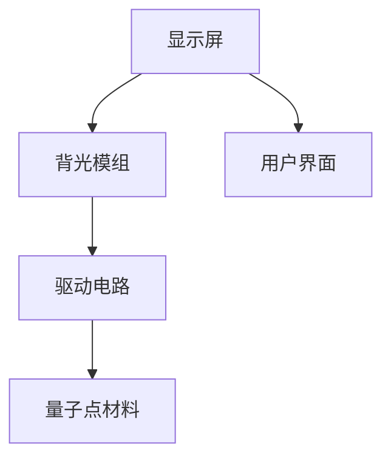

                 

# 巴菲特-芒格的量子点显示技术投资：新一代显示产业的引领者

> **关键词**：巴菲特、芒格、量子点显示技术、投资哲学、显示产业、技术驱动

> **摘要**：本文探讨了巴菲特和芒格的投资哲学在量子点显示技术领域的应用，分析了量子点显示技术的科学原理、市场现状及未来发展趋势，结合投资策略与风险管理，详细阐述了如何通过技术驱动引领显示产业的变革。

---

# 第1章: 巴菲特和芒格的投资哲学

## 1.1 巴菲特的价值投资理论

### 1.1.1 股票分析的三要素
- **护城河**：企业的竞争优势，如专利、品牌、成本优势等。
- **管理层**：管理层的能力和决策质量。
- **财务状况**：企业的财务健康状况，关注ROE（股东权益回报率）。

### 1.1.2 芒格的多元思维模型
- 芒格强调通过多个学科的交叉思维来理解问题。
- 通过建立多元思维模型，投资者可以更全面地分析企业的潜在风险和机会。

### 1.1.3 投资哲学的结合
- 巴菲特和芒格的投资哲学结合了价值投资和多元思维模型，形成了独特的投资方法。

## 1.2 投资方法论

### 1.2.1 长期投资与价值发现
- 巴菲特强调长期投资，寻找具有持续竞争优势的企业。
- 通过长期持有优质股票，避免短期市场的波动。

### 1.2.2 股东资金回报率（ROE）的重要性
- ROE是衡量企业盈利能力的重要指标，高ROE意味着企业能够高效利用股东资金创造利润。

### 1.2.3 风险控制与投资组合管理
- 通过分散投资和严格的风险评估，降低投资组合的整体风险。

---

# 第2章: 量子点显示技术的科学原理

## 2.1 量子点的基本概念

### 2.1.1 量子点的定义与基本性质
- 量子点是一种纳米级半导体材料，尺寸在1-10纳米之间。
- 其发光颜色取决于尺寸，可通过调节尺寸实现不同颜色的发光。

### 2.1.2 量子点的发光机制
- 量子点通过吸收光子激发电子跃迁，释放特定波长的光，实现发光。
- 其发光效率高，颜色纯度高，具有优异的显示性能。

### 2.1.3 量子点的制备与合成
- 量子点的制备方法包括溶液法、气相合成法等。
- 制备过程中需要精确控制尺寸和形貌，以保证其发光性能。

## 2.2 量子点显示技术的核心优势

### 2.2.1 高色域与宽色温
- 量子点显示技术能够实现100%的NTSC色域，色彩表现远超传统显示技术。
- 宽色温调节能力，适应不同环境需求。

### 2.2.2 高亮度与低能耗
- 量子点显示技术具有高亮度，能够在明亮环境下提供清晰的显示效果。
- 低能耗特性，延长设备续航时间。

### 2.2.3 长寿命与稳定性
- 量子点材料具有较长的使用寿命，显示效果稳定，不易衰减。

## 2.3 量子点显示技术的市场应用

### 2.3.1 液晶电视中的量子点背光技术
- 量子点背光技术通过调节背光颜色，提升电视的色域和亮度。
- 代表企业：三星、LG等。

### 2.3.2 量子点显示屏在智能手机中的应用
- 高色域和高亮度的量子点显示屏提升了智能手机的显示效果。
- 代表企业：苹果、华为等。

### 2.3.3 量子点技术在汽车显示系统中的应用
- 汽车仪表盘和中控屏采用量子点技术，提升显示效果和用户体验。
- 代表企业：特斯拉、奔驰等。

---

# 第3章: 巴菲特-芒格投资策略与量子点显示产业的结合

## 3.1 量子点显示产业的市场分析

### 3.1.1 全球显示产业的现状与趋势
- 全球显示产业规模庞大，预计未来几年将继续增长。
- 量子点显示技术作为新兴技术，市场渗透率逐步提高。

### 3.1.2 量子点显示技术的市场渗透率
- 量子点技术在高端显示设备中的应用逐步增加。
- 市场渗透率的提高依赖于技术成熟度和成本下降。

### 3.1.3 主要竞争企业的市场份额分析
- 三星、LG等企业在量子点显示技术领域占据重要地位。
- 新兴企业也在逐步进入市场，推动技术发展。

## 3.2 巴菲特-芒格投资策略在量子点显示产业中的应用

### 3.2.1 企业护城河的构建与分析
- 巴菲特强调企业应具备强大的护城河，如技术专利、品牌影响力等。
- 量子点显示技术企业需要通过技术创新和专利布局构建护城河。

### 3.2.2 管理层能力与企业价值的关系
- 管理层的能力直接影响企业的战略决策和执行效果。
- 投资者需要关注管理层的过往业绩和决策能力。

### 3.2.3 量子点显示企业的财务指标分析
- 关注企业的ROE、毛利率、研发投入等财务指标，评估企业的财务健康状况和成长潜力。

## 3.3 投资机会与风险评估

### 3.3.1 量子点显示技术的未来发展趋势
- 随着技术的进步，量子点显示技术在更多领域的应用将逐步扩大。
- 市场需求的增加将推动相关企业的成长。

### 3.3.2 投资风险的识别与管理
- 技术风险：技术更新换代快，可能存在技术被淘汰的风险。
- 市场风险：市场需求不确定，可能存在市场渗透不足的风险。
- 竞争风险：行业竞争激烈，企业可能面临价格压力和市场份额被抢占的风险。

### 3.3.3 投资组合的优化与调整
- 通过分散投资降低风险，同时关注优质企业的投资机会。
- 定期评估投资组合，根据市场变化进行调整。

---

# 第4章: 量子点显示技术的系统架构

## 4.1 量子点显示系统的整体架构

### 4.1.1 系统组成
- 显示屏、背光模组、驱动电路、量子点材料等。
- 系统架构图如下：

### 4.1.2 核心组件的功能
- **显示屏**：显示最终的图像和文字。
- **背光模组**：提供光源，量子点材料调节光源颜色。
- **驱动电路**：控制显示面板的电流和电压，实现图像的显示。

## 4.2 量子点显示技术的实现流程

### 4.2.1 制备量子点材料
- 通过溶液法或气相合成法制备量子点材料。
- 调节量子点的尺寸和形貌，实现不同颜色的发光。

### 4.2.2 量子点材料的集成
- 将量子点材料集成到背光模组中，实现颜色调节。
- 量子点材料的集成需要精确控制，确保其发光效率和稳定性。

### 4.2.3 显示系统的调试与优化
- 对显示系统进行调试，优化显示效果。
- 调整驱动电路的参数，提升显示系统的性能。

---

# 第5章: 量子点显示技术的投资与风险管理

## 5.1 量子点显示技术的投资机会

### 5.1.1 技术驱动的市场增长
- 量子点显示技术的市场需求稳步增长，技术驱动型企业具备较大的投资潜力。

### 5.1.2 优质企业的识别
- 关注具有强大研发能力和专利布局的企业。
- 评估企业的财务状况和管理层能力。

## 5.2 风险管理策略

### 5.2.1 技术风险的控制
- 关注技术的成熟度和企业的研发能力。
- 通过分散投资降低技术风险。

### 5.2.2 市场风险的应对
- 关注市场需求的变化，及时调整投资策略。
- 通过长期投资避免短期市场波动的影响。

### 5.2.3 竞争风险的管理
- 关注行业竞争格局，选择具有竞争优势的企业。
- 通过投资组合优化降低竞争风险。

---

# 第6章: 量子点显示技术的项目实战

## 6.1 项目背景

### 6.1.1 项目目标
- 分析量子点显示技术的投资机会，评估相关企业的投资价值。

### 6.1.2 项目范围
- 研究量子点显示技术的市场现状、技术发展和竞争格局。
- 分析主要企业的财务状况和管理层能力。

## 6.2 项目实施步骤

### 6.2.1 市场调研
- 收集量子点显示技术的市场数据和竞争分析。
- 了解行业的发展趋势和市场需求。

### 6.2.2 企业分析
- 分析主要企业的财务状况、管理层能力和专利布局。
- 评估企业的投资价值和风险。

### 6.2.3 投资决策
- 根据分析结果制定投资策略，选择具有潜力的企业进行投资。
- 制定风险管理计划，确保投资的安全性。

---

# 第7章: 最佳实践与未来展望

## 7.1 投资关键点

### 7.1.1 长期视角
- 投资者应具备长期视角，关注企业的长期发展潜力。
- 避免短期市场的波动影响投资决策。

### 7.1.2 技术驱动
- 量子点显示技术作为新兴技术，具备较大的市场潜力。
- 投资者应关注技术的发展和应用，寻找技术驱动型企业。

### 7.1.3 风险管理
- 技术风险、市场风险和竞争风险是投资者需要关注的主要风险。
- 通过分散投资和风险控制，降低投资风险。

## 7.2 未来展望

### 7.2.1 技术发展
- 量子点显示技术将继续发展，应用领域将进一步扩大。
- 技术的成熟和成本的下降将推动其市场渗透率的提高。

### 7.2.2 市场应用
- 量子点显示技术将在更多领域得到应用，如智能手机、电视、汽车显示等。
- 技术的广泛应用将推动显示产业的变革。

### 7.2.3 投资机会
- 随着技术的发展和市场的扩大，量子点显示技术领域将出现更多投资机会。
- 投资者应关注行业动态，抓住投资机遇。

---

# 作者

作者：AI天才研究院/AI Genius Institute & 禅与计算机程序设计艺术 /Zen And The Art of Computer Programming

