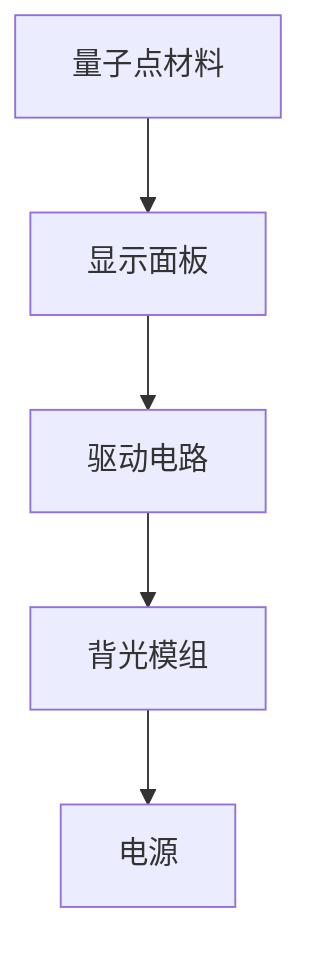

                 


# 巴菲特-芒格的量子点显示技术投资：新一代显示革命

> 关键词：量子点显示技术，巴菲特，芒格，投资策略，显示革命

> 摘要：本文深入探讨了量子点显示技术的革命性发展及其在投资领域的潜力，结合巴菲特和芒格的投资理念，分析了这一技术的投资机会、风险管理和系统架构，为投资者和技术爱好者提供了全面的视角。

---

## 第一部分：量子点显示技术与投资概述

### 第1章：量子点显示技术与投资概述

#### 1.1 量子点显示技术的基本概念

量子点显示技术是一种基于纳米材料的显示技术，通过半导体纳米晶体（量子点）的光电特性，实现高色域、高亮度和高对比度的显示效果。量子点的发光颜色由其尺寸决定，这使得其在显示领域的应用具有极高的潜力。

#### 1.2 巴菲特与芒格的投资理念

巴菲特的价值投资策略强调长期持有优质资产，注重企业的基本面和管理层素质。芒格的多元思维模型则强调广泛的知识储备和独立思考，注重风险管理和逆向思维。

#### 1.3 量子点显示技术的投资机会

量子点显示技术在显示领域的应用前景广阔，尤其是在电视、智能手机和汽车显示屏等领域。投资者需要关注技术的商业化进展和企业的竞争优势。

---

## 第二部分：量子点显示技术的原理与应用

### 第2章：量子点显示技术的原理与应用

#### 2.1 量子点的物理特性

量子点的尺寸决定了其发光颜色，小尺寸量子点发出蓝光，大尺寸则发出红光。这种特性使其在显示技术中能够实现高色域和精准的颜色控制。

#### 2.2 量子点显示技术的工作原理

量子点通过电场或光照激发发光，其发光效率高，色彩纯度高，能够实现更逼真的图像显示。与传统液晶显示技术相比，量子点显示技术具有更高的对比度和色彩表现。

#### 2.3 量子点显示技术的市场应用

量子点显示技术已在高端电视和智能手机中得到应用，未来有望扩展到医疗成像和工业检测等领域。其市场前景广阔，但技术壁垒和成本问题仍需解决。

---

## 第三部分：巴菲特与芒格的投资策略

### 第3章：巴菲特与芒格的投资策略

#### 3.1 巴菲特的价值投资策略

巴菲特注重企业的长期价值和竞争优势，寻找具有持续盈利能力的企业。他认为，投资的核心是理解企业的商业模式和管理层素质。

#### 3.2 芒格的多元思维模型

芒格强调跨学科思考，将物理学、心理学等知识应用于投资决策。他注重风险管理和逆向思维，避免盲目跟风。

#### 3.3 量子点显示技术领域的投资策略

在量子点显示技术领域，投资者应关注技术的商业化进程、企业的研发能力和市场竞争力。同时，需评估行业的技术壁垒和市场空间。

---

## 第四部分：量子点显示技术的投资风险与风险管理

### 第4章：量子点显示技术的投资风险与风险管理

#### 4.1 量子点显示技术的主要风险

技术风险：量子点技术的商业化仍面临挑战，如成本高、技术不稳定等问题。市场风险：显示市场的竞争激烈，技术替代性强。经济周期风险：全球经济波动可能影响技术的投资回报。

#### 4.2 投资者的风险管理策略

分散投资：通过多样化投资降低风险。安全边际：在投资时留有安全边际，避免过度估值。宏观经济监控：关注宏观经济环境，避免系统性风险。

#### 4.3 巴菲特与芒格的风险管理智慧

巴菲特强调安全边际和长期投资，芒格注重独立思考和风险分散。两者结合，为投资者提供了全面的风险管理框架。

---

## 第五部分：量子点显示技术的系统设计与架构

### 第5章：量子点显示技术的系统设计与架构

#### 5.1 量子点显示技术的系统架构

量子点显示系统包括量子点材料、驱动电路、背光模组和显示面板。其架构设计决定了显示效果和成本。

#### 5.2 系统功能设计

量子点显示系统的功能包括色彩优化、亮度调节和动态对比度控制。这些功能通过量子点材料和驱动电路协同实现。

#### 5.3 系统架构设计

量子点显示系统的架构设计需考虑材料稳定性、电路设计和制造成本。系统架构图如下：



---

## 第六部分：量子点显示技术的项目实战

### 第6章：量子点显示技术的项目实战

#### 6.1 环境安装

量子点显示技术的开发需要专业的实验室环境，配备纳米材料合成设备和光学测试设备。

#### 6.2 核心实现源代码

以下是量子点显示技术的Python实现示例：

```python
import numpy as np

def quantum_dot_display():
    # 量子点尺寸决定颜色
    size = np.random.choice([5, 10, 15])  # 以纳米为单位
    wavelength = 1240 / size  # 红到紫的近似关系
    color = wavelength_to_color(wavelength)
    return color

def wavelength_to_color(wavelength):
    if wavelength < 450:
        return '紫色'
    elif 450 <= wavelength < 495:
        return '蓝色'
    elif 495 <= wavelength < 560:
        return '绿色'
    else:
        return '红色'

print(quantum_dot_display())
```

#### 6.3 代码应用解读

上述代码模拟了量子点尺寸对发光颜色的影响，展示了量子点显示技术的基本原理。通过随机选择量子点尺寸，计算其发光波长，并映射到具体颜色。

#### 6.4 案例分析

某企业开发的量子点电视在色彩表现上优于传统液晶电视，但成本较高。投资者需评估其市场竞争力和成本控制能力。

---

## 第七部分：总结与展望

### 第7章：总结与展望

#### 7.1 总结

量子点显示技术具有革命性的潜力，但投资需谨慎评估技术风险和市场前景。巴菲特和芒格的投资理念为投资者提供了有效的指导。

#### 7.2 展望

未来，量子点显示技术将更加成熟，应用场景将更加广泛。投资者需持续关注技术发展和市场动态，抓住投资机会。

---

作者：AI天才研究院/AI Genius Institute & 禅与计算机程序设计艺术 /Zen And The Art of Computer Programming

