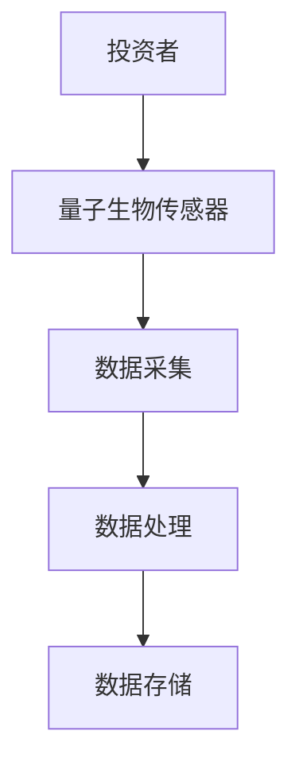
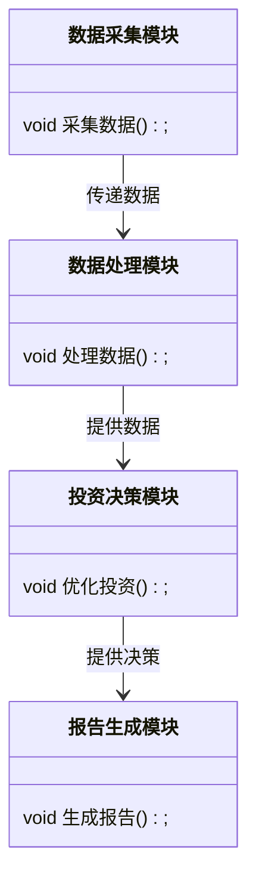
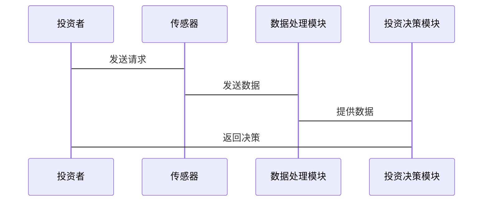

                 


# 巴菲特-芒格的量子生物传感器医疗网络投资：精准健康监测的未来

> **关键词**：巴菲特, 芒格, 量子生物传感器, 医疗网络投资, 精准健康监测

> **摘要**：  
本文探讨了巴菲特和芒格的投资理念与量子生物传感器技术在医疗网络投资中的结合，分析了精准健康监测的未来发展方向。通过详细的技术分析和实际案例，展示了如何利用量子生物传感器优化医疗网络投资决策，推动医疗行业的智能化和精准化发展。

---

## 第一部分：背景介绍

### 第1章：巴菲特-芒格投资理念与量子生物传感器的结合

#### 1.1 巴菲特-芒格投资理念概述

##### 1.1.1 巴菲特的价值投资理论
巴菲特的价值投资理论强调长期投资、注重基本面分析和安全边际。他主张投资于具有强大护城河和良好管理的公司，并在市场恐慌时寻找低估的投资机会。

##### 1.1.2 芒格的多元思维模型
芒格提倡通过多个学科的交叉思维来理解问题，强调在决策中考虑多种因素和潜在风险，以避免单一思维的局限性。

##### 1.1.3 投资理念与现代科技的结合
现代科技的进步为巴菲特和芒格的投资理念提供了新的工具和方法。通过量子生物传感器等先进技术，投资者可以更精准地评估医疗企业的价值。

#### 1.2 量子生物传感器的基本概念

##### 1.2.1 量子传感器的定义与原理
量子传感器利用量子力学原理，通过测量量子系统的状态变化来获取信息。其灵敏度和精度远高于传统传感器。

##### 1.2.2 生物传感器在医疗领域的应用
生物传感器可以检测生物分子、生理指标等，广泛应用于疾病诊断、健康监测等领域。

##### 1.2.3 量子生物传感器的优势与挑战
量子生物传感器的优势包括高灵敏度、高特异性等；但其技术复杂性和成本较高是主要挑战。

#### 1.3 医疗网络投资的核心问题

##### 1.3.1 精准健康监测的需求
医疗网络投资需要精准的健康监测数据，以支持投资决策。

##### 1.3.2 医疗网络投资的现状与痛点
传统医疗监测技术存在精度低、成本高、数据孤岛等问题，难以满足精准投资需求。

##### 1.3.3 问题解决的路径与目标
通过量子生物传感器技术，实现精准、实时的健康监测，优化医疗网络投资决策。

### 第2章：量子生物传感器医疗网络投资的背景与意义

#### 2.1 问题背景分析

##### 2.1.1 当前医疗监测技术的局限性
传统医疗传感器存在灵敏度低、数据准确性差等问题。

##### 2.1.2 投资者面临的不确定性与风险
医疗网络投资涉及高风险，投资者需要更精准的数据支持决策。

##### 2.1.3 精准医疗的发展趋势
精准医疗要求个性化、实时化的健康监测，量子生物传感器为其提供了技术支撑。

#### 2.2 问题描述与解决路径

##### 2.2.1 传统医疗监测的不足
传统医疗监测设备无法实现精准、实时的监测。

##### 2.2.2 量子生物传感器的应用场景
应用于疾病诊断、健康管理等领域，提供高精度数据支持。

##### 2.2.3 投资决策的优化方法
通过量子生物传感器技术，优化投资决策，降低风险。

#### 2.3 投资理念与技术的结合

##### 2.3.1 巴菲特-芒格理念的现代应用
将价值投资与量子生物传感器技术结合，提升投资决策的科学性。

##### 2.3.2 量子生物传感器的技术优势
高灵敏度、高特异性等技术优势，为精准医疗提供支持。

##### 2.3.3 医疗网络投资的未来方向
通过技术与投资理念的结合，推动医疗行业的智能化和精准化发展。

---

## 第二部分：核心概念与联系

### 第3章：量子生物传感器的核心原理

#### 3.1 量子传感器的基本原理

##### 3.1.1 量子力学在传感器中的应用
量子传感器利用量子叠加和纠缠等现象，实现更高精度的测量。

##### 3.1.2 传感器的灵敏度与精度提升
量子传感器的灵敏度和精度远高于传统传感器。

##### 3.1.3 生物传感器的信号处理机制
生物传感器通过捕获生物分子信号，将其转换为可读的电子信号。

#### 3.2 医疗网络投资的系统模型

##### 3.2.1 核心概念原理
量子生物传感器在医疗网络投资中的应用原理。

##### 3.2.2 概念属性特征对比表格
| 属性        | 量子生物传感器      | 传统传感器      |
|-------------|-------------------|-----------------|
| 灵敏度       | 高                | 低              |
| 特异性       | 高                | 低              |
| 数据精度     | 高                | 一般            |
| 成本         | 高                | 低              |

##### 3.2.3 ER实体关系图
```mermaid
er
    actor 投资者
    actor 医疗机构
    actor 患者
    entity 传感器数据
    entity 投资决策
    entity 健康报告
    relationship 投资者 -> 传感器数据: 获取数据
    relationship 医疗机构 -> 传感器数据: 采集数据
    relationship 患者 -> 传感器数据: 提供数据
    relationship 传感器数据 -> 投资决策: 支持决策
    relationship 传感器数据 -> 健康报告: 生成报告
```

---

### 第4章：量子生物传感器医疗网络投资的算法原理

#### 4.1 算法原理讲解

##### 4.1.1 量子生物传感器数据采集算法


##### 4.1.2 数据处理与分析算法
```python
def quantum_sensor_algorithm(data):
    # 数据预处理
    processed_data = preprocess(data)
    # 数据分析
    result = analyze(processed_data)
    return result
```

##### 4.1.3 投资决策优化模型
```latex
$$
\text{投资收益} = \sum_{i=1}^{n} w_i \cdot x_i
$$
其中，$w_i$ 是权重，$x_i$ 是传感器数据。

#### 4.2 算法实现与优化

##### 4.2.1 算法实现步骤
1. 数据采集：通过量子生物传感器获取健康数据。
2. 数据预处理：去除噪声，提取特征。
3. 数据分析：应用机器学习模型进行预测。
4. 投资决策：根据分析结果优化投资组合。

##### 4.2.2 算法优化方法
使用遗传算法优化投资组合，降低风险和提高收益。

---

## 第三部分：系统分析与架构设计

### 第5章：量子生物传感器医疗网络投资系统的架构设计

#### 5.1 问题场景介绍

##### 5.1.1 系统目标
实现精准健康监测，支持医疗网络投资决策。

##### 5.1.2 系统需求
支持多用户、多设备的数据采集与分析。

#### 5.2 系统功能设计

##### 5.2.1 功能模块划分
- 数据采集模块
- 数据处理模块
- 投资决策模块
- 报告生成模块

##### 5.2.2 功能模块关系


#### 5.3 系统架构设计

##### 5.3.1 架构风格选择
采用微服务架构，便于模块化开发和维护。

##### 5.3.2 系统架构图


#### 5.4 系统接口设计

##### 5.4.1 接口描述
- 数据采集接口：接收传感器数据。
- 数据处理接口：处理数据并返回结果。
- 投资决策接口：根据数据优化投资组合。

##### 5.4.2 接口交互序列图


---

## 第四部分：项目实战

### 第6章：量子生物传感器医疗网络投资系统的实现

#### 6.1 环境安装

##### 6.1.1 安装Python环境
安装Python 3.8及以上版本，并安装必要的库（如NumPy、Pandas、Scikit-learn等）。

##### 6.1.2 安装传感器驱动
安装量子生物传感器的驱动程序，确保传感器与系统的兼容性。

#### 6.2 系统核心实现源代码

##### 6.2.1 数据采集模块
```python
import numpy as np

def collect_data(sensor):
    data = sensor.read()
    return data
```

##### 6.2.2 数据处理模块
```python
import pandas as pd

def preprocess(data):
    processed_data = data.dropna()
    return processed_data
```

##### 6.2.3 投资决策模块
```python
from sklearn import linear_model

def optimize_portfolio(data):
    model = linear_model.LinearRegression()
    model.fit(data[['feature1', 'feature2']], data['target'])
    return model.predict(new_data)
```

#### 6.3 实际案例分析

##### 6.3.1 数据分析
分析量子生物传感器数据，识别投资机会。

##### 6.3.2 投资决策
根据数据分析结果，优化投资组合，降低风险。

##### 6.3.3 案例总结
通过实际案例，验证系统的有效性和可行性。

---

## 第五部分：最佳实践

### 第7章：量子生物传感器医疗网络投资的未来展望

#### 7.1 小结
量子生物传感器技术为精准健康监测提供了新的工具和方法，优化了医疗网络投资决策。

#### 7.2 注意事项
投资者应关注技术风险和数据隐私问题，确保系统的安全性和稳定性。

#### 7.3 拓展阅读
建议进一步研究量子传感器在其他领域的应用，如环境监测、工业检测等。

---

## 作者信息

作者：AI天才研究院/AI Genius Institute & 禅与计算机程序设计艺术 /Zen And The Art of Computer Programming

---

以上是《巴菲特-芒格的量子生物传感器医疗网络投资：精准健康监测的未来》的技术博客文章，详细阐述了量子生物传感器与医疗网络投资的结合，以及其在未来精准健康监测中的应用前景。通过理论分析、算法设计和实际案例，展示了如何利用先进技术优化投资决策，推动医疗行业的智能化和精准化发展。

