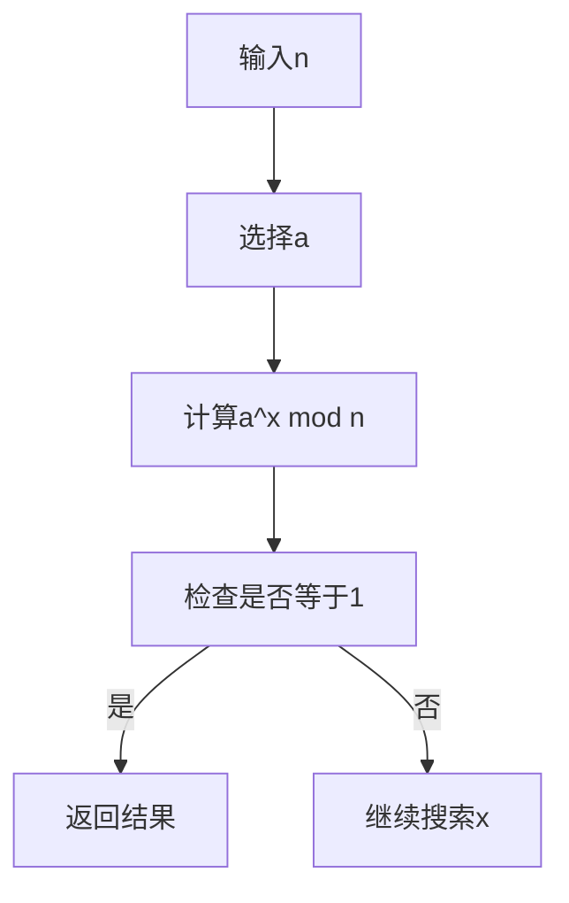
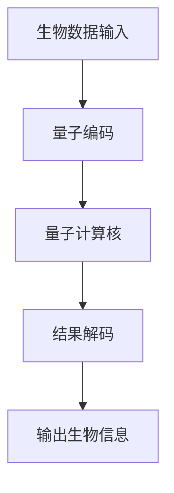
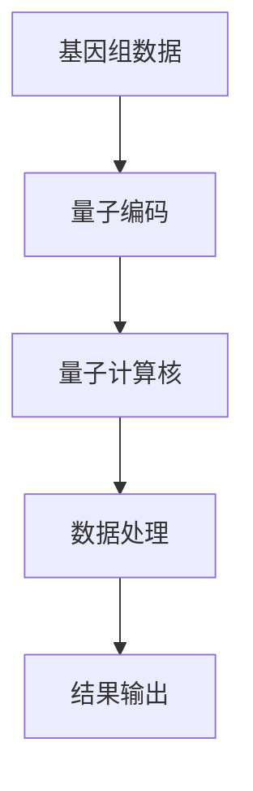
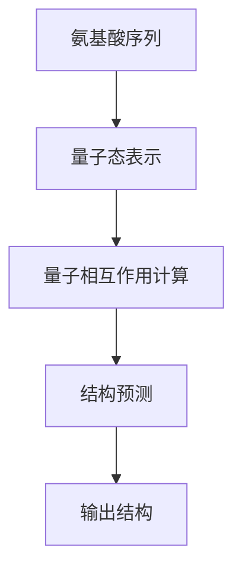
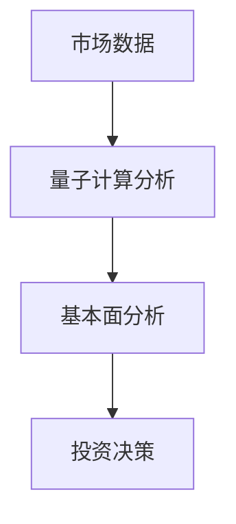
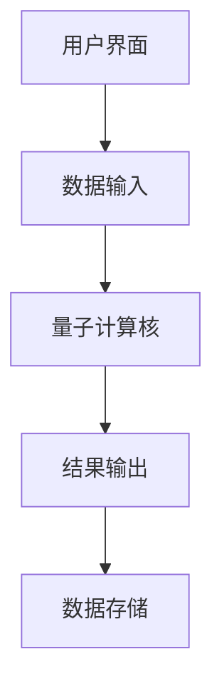
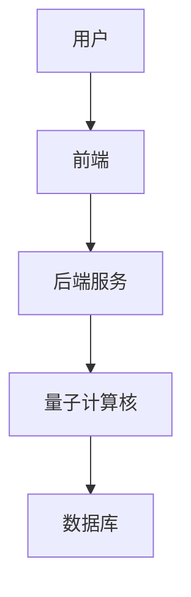

                 

# 巴菲特-芒格的量子生物计算投资：生命科学的计算革命

> 关键词：巴菲特，芒格，量子计算，生物计算，投资策略，系统架构，算法模型

> 摘要：本文探讨了巴菲特和芒格如何将量子生物计算应用于投资领域，分析了量子生物计算的基本原理、在生命科学中的应用，以及其对投资策略的影响。通过结合量子计算的技术优势与巴菲特的价值投资理念，本文揭示了这一领域的投资潜力和未来发展方向。

---

# 第一部分：量子生物计算的基本原理与应用

## 第1章：量子计算的核心原理

### 1.1 量子叠加与纠缠的数学模型

量子叠加的数学表示为：
$$
|\psi\rangle = \alpha|0\rangle + \beta|1\rangle
$$
其中，$\alpha$ 和 $\beta$ 是概率幅度，满足归一化条件：
$$
|\alpha|^2 + |\beta|^2 = 1
$$

量子纠缠的数学表示为：
$$
|\psi\rangle = \frac{1}{\sqrt{2}}(|0\rangle|1\rangle + |1\rangle|0\rangle)
$$

### 1.2 量子计算的核心算法

量子计算的核心算法包括Shor算法和Grover算法。Shor算法用于大整数分解，Grover算法用于无序搜索问题。

#### Shor算法的流程图

## 第2章：生物计算的定义与技术特点

### 2.1 生物计算的基本概念

生物计算是一种利用生物分子（如DNA、RNA）进行信息处理的技术。其核心优势在于并行计算能力和数据存储密度。

#### 生物计算与量子计算的对比表格
| 特性           | 生物计算       | 量子计算       |
|----------------|----------------|----------------|
| 并行性         | 高             | 极高           |
| 数据存储密度   | 高             | 高             |
| 适用场景       | 生物信息学     | 密码学、优化问题|

### 2.2 量子生物计算的系统架构

#### 量子生物计算系统的架构图

---

# 第二部分：量子生物计算在生命科学中的应用

## 第3章：生物信息学中的量子计算

### 3.1 基因组学中的量子计算应用

#### 基因组数据分析的流程图

### 3.2 蛋白质结构预测的量子计算优势

蛋白质结构预测的量子计算方法基于氨基酸序列的量子态表示。

#### 蛋白质结构预测的算法流程图

---

# 第三部分：量子生物计算的投资策略与案例分析

## 第4章：巴菲特与芒格的投资哲学

### 4.1 巴菲特的价值投资理念

巴菲特的价值投资理念强调长期稳健的投资策略和对公司基本面的深入分析。

#### 价值投资与量子计算的结合
- 通过量子计算技术评估公司的潜在价值。
- 利用量子计算进行市场趋势预测。

### 4.2 芒格的多元思维模型

芒格的多元思维模型强调跨学科思考，将量子计算技术应用于投资分析。

#### 多元思维模型的应用流程图

---

# 第四部分：系统架构设计与项目实战

## 第5章：量子生物计算系统的架构设计

### 5.1 系统功能设计

#### 系统功能模块图

### 5.2 系统架构图

#### 系统架构图

---

# 第五部分：总结与展望

## 第6章：总结与未来展望

### 6.1 量子生物计算的投资潜力

量子生物计算技术将为生命科学领域带来革命性的变化，同时也为投资者提供了新的机遇。

### 6.2 未来发展趋势

- 量子计算技术的进一步发展。
- 生物计算与人工智能的深度融合。

---

# 作者：AI天才研究院/AI Genius Institute & 禅与计算机程序设计艺术 /Zen And The Art of Computer Programming

