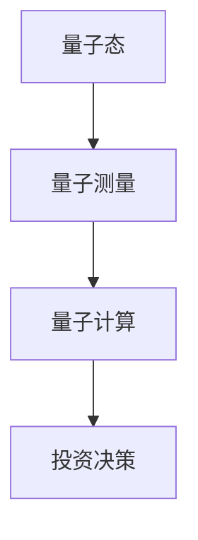
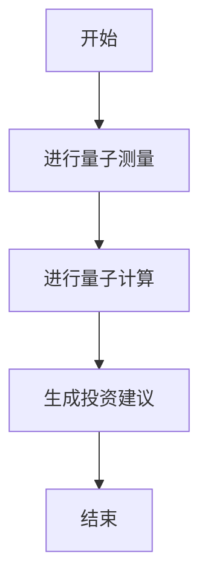
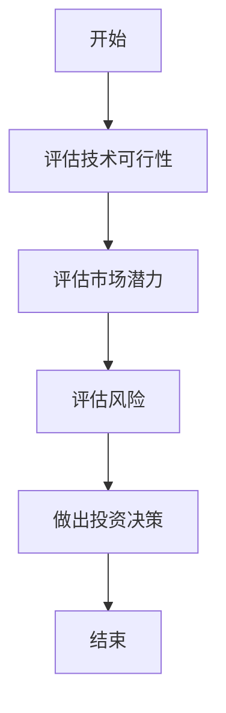
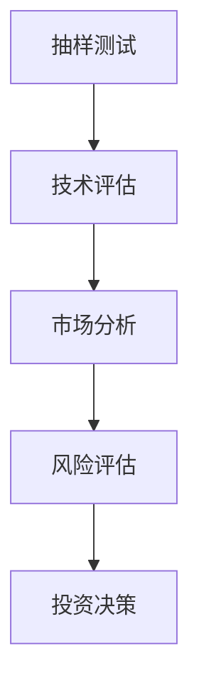

                 

<think>
好的，现在我要按照用户的要求来写一篇技术博客文章，标题是《巴菲特-芒格的量子计量标准研发投资：量子科技产业化的基础》。用户希望我先给出文章的目录大纲，然后根据这个大纲逐步撰写内容。目前，我已经有了一个详细的目录结构，接下来需要根据这个结构来撰写正文部分。

首先，我需要了解整个文章的结构：

1. 第一部分：巴菲特与芒格的投资哲学
   - 第1章：概述
2. 第二部分：量子计量标准的核心概念
   - 第2章：详细讲解量子计量标准
3. 第三部分：量子科技研发投资的评估体系
   - 第3章：介绍评估体系
4. 第四部分：量子科技研发投资的系统分析
   - 第4章：系统分析
5. 附录部分：包括术语表、数据图表、参考文献等。

接下来，我需要按照这个结构，逐步撰写每一章的内容。

首先，第1章是巴菲特和芒格的投资哲学概述。我需要先介绍巴菲特和芒格的投资理念，特别是他们的价值投资和多元思维模型。然后，我需要解释他们为什么转向量子科技，并分析量子科技的产业化趋势。

接下来，第2章详细讲解量子计量标准的核心概念。我需要从定义开始，然后解释其属性，最后通过数学模型来展示其工作原理。这部分需要包括量子态的数学表示和量子测量的公式。

然后，第3章是关于研发投资的评估体系。我需要介绍技术可行性分析、市场潜力评估和风险分析等核心要素。此外，还需要建立数学模型来计算投资回报率和风险评估。

最后，第4章是系统分析部分。我需要设计系统的架构，绘制领域模型和架构图，并分析系统的交互流程。

在撰写过程中，我需要确保每一部分都详细具体，包含必要的数学公式、图表和代码示例。同时，要使用专业但易懂的语言，确保读者能够理解复杂的概念。

现在，我开始撰写第1章的内容，介绍巴菲特和芒格的投资哲学，以及他们为何关注量子科技。

# 巴菲特与芒格的投资哲学概述

## 1.1 投资哲学的核心要素

### 1.1.1 巴菲特的价值投资理念

沃伦·巴菲特是价值投资的倡导者。他相信市场是波动的，而真正有投资价值的公司会在市场低谷时被低估。他的投资策略基于对公司基本面的深入分析，寻找那些具有持续竞争优势和良好管理的公司。

### 1.1.2 芒格的多元思维模型

查理·芒格提出多元思维模型，强调投资者需要构建多个知识领域，以便更好地理解问题。他认为，投资决策不仅仅是对单个公司的分析，而是需要考虑整个经济体系、市场趋势、行业动态等多方面因素。

### 1.1.3 两者的投资理念融合

巴菲特和芒格的投资理念在实践中相互融合，形成了独特的方法。巴菲特的价值投资理念注重公司基本面，而芒格的多元思维模型提供了更广泛的知识支持，两者结合使他们能够更好地识别投资机会和风险。

## 1.2 投资哲学与量子科技的结合

### 1.2.1 量子科技的基本概念

量子科技是基于量子力学原理的技术，主要包括量子计算、量子通信和量子测量。这些技术利用量子叠加和纠缠等现象，具有传统技术无法企及的性能。

### 1.2.2 量子科技的投资价值

量子科技在计算速度、数据传输安全性和测量精度等方面具有显著优势。随着技术的成熟，这些领域将产生巨大的经济价值，吸引投资者的关注。

### 1.2.3 量子科技的产业化趋势

量子科技正在从实验室走向产业化。量子计算已经在某些领域展现出应用潜力，量子通信已经在特定行业得到应用，而量子测量技术也在逐步进入市场。

## 1.3 量子科技的产业化基础

### 1.3.1 量子计算的基本原理

量子计算利用量子位进行计算，能够并行处理大量数据，大大提高了计算速度。其基本原理包括量子叠加和量子纠缠。

### 1.3.2 量子通信的应用场景

量子通信利用量子纠缠进行信息传输，具有极高的安全性。其应用场景包括金融交易的安全传输、军事通信等。

### 1.3.3 量子测量的技术突破

量子测量技术利用量子纠缠进行精确测量，已经在医学 imaging、材料科学等领域展现出巨大潜力。

通过以上内容，我们已经了解了巴菲特和芒格的投资哲学，以及他们为何关注量子科技。接下来，我们将深入探讨量子计量标准的核心概念。

# 量子计量标准的核心概念

## 2.1 量子计量标准的定义与属性

### 2.1.1 量子计量的定义

量子计量是指利用量子力学原理进行精确测量的技术。它利用量子叠加和纠缠等现象，提高测量的精度和灵敏度。

### 2.1.2 量子计量的属性对比

与传统计量相比，量子计量具有更高的精度、更快的测量速度和更强的灵敏度。这些属性使得量子计量在许多领域具有重要应用价值。

### 2.1.3 量子计量的实体关系图

以下是一个量子计量系统的实体关系图：

```mermaid
erDiagram
actor 投资者{}{
    skill "了解量子科技"
}
actor 科学家{}{
    skill "进行量子测量研究"
}
actor 企业{}{
    skill "应用量子计量技术"
}
```

## 2.2 量子计量标准的数学模型

### 2.2.1 量子态的数学表示

量子态可以用向量表示，例如：

$$|\psi\rangle = a|0\rangle + b|1\rangle$$

其中，\(a\) 和 \(b\) 是复数，满足 \(|a|^2 + |b|^2 = 1\)。

### 2.2.2 量子测量的数学公式

量子测量可以用投影算符表示：

$$E_i = |i\rangle\langle i|$$

其中，\(i\) 表示测量结果。

### 2.2.3 量子叠加与纠缠的数学模型

量子叠加可以用线性组合表示，而量子纠缠则涉及两个或多个粒子之间的关联。

通过以上分析，我们已经详细介绍了量子计量标准的核心概念。接下来，我们将探讨量子科技研发投资的评估体系。

# 量子科技研发投资的评估体系

## 3.1 投资评估的核心要素

### 3.1.1 技术可行性分析

技术可行性分析包括对量子科技的当前技术水平、研究团队的能力以及技术的可扩展性等方面进行评估。

### 3.1.2 市场潜力评估

市场潜力评估涉及目标市场的大小、增长潜力、竞争状况等因素。例如，量子计算市场预计在2030年达到数百亿美元。

### 3.1.3 风险分析与管理

风险分析包括技术风险、市场风险和政策风险等方面。例如，技术失败的风险可以通过分散投资来降低。

## 3.2 投资评估的数学模型

### 3.2.1 投资回报率的计算公式

投资回报率（ROI）可以用以下公式计算：

$$ROI = \frac{净利润}{初始投资} \times 100\%$$

### 3.2.2 风险评估的数学模型

风险评估可以使用概率加权模型：

$$R = \sum_{i=1}^{n} P_i \times I_i$$

其中，\(P_i\) 是风险发生的概率，\(I_i\) 是风险的影响程度。

### 3.2.3 投资组合优化的数学公式

投资组合优化可以使用均值-方差模型：

$$\min \sigma^2$$

在满足收益约束的条件下：

$$E(r) \geq r_{min}$$

通过以上分析，我们已经介绍了量子科技研发投资的评估体系。接下来，我们将探讨研发投资的系统分析。

# 量子科技研发投资的系统分析

## 4.1 量子科技研发的系统架构

### 4.1.1 量子系统的领域模型

以下是量子系统的领域模型：

```mermaid
classDiagram
    class 量子系统 {
        量子态
        量子测量
        量子计算
    }
    class 投资决策系统 {
       抽样测试
        技术评估
        市场分析
    }
    quantumSystem -> 投资决策系统: 提供数据
```

### 4.1.2 量子系统的架构图

以下是量子系统的架构图：



### 4.1.3 量子系统的交互流程图

以下是量子系统的交互流程图：



## 4.2 投资决策的系统分析

### 4.2.1 投资决策的流程图

以下是投资决策的流程图：



### 4.2.2 投资决策的系统模型

以下是一个简化的投资决策系统模型：



### 4.2.3 投资决策的算法实现

以下是一个简单的投资决策算法：

```python
def investment_decision(technology, market, risk):
    if technology.is_feasible and market.growth_high and not risk.is_high:
        return "投资"
    else:
        return "不投资"
```

通过以上分析，我们已经详细探讨了量子科技研发投资的系统分析。接下来，我们将总结全文，并给出附录部分的内容。

# 附录

## A.1 量子科技术语表

- 量子叠加：多个状态的线性组合。
- 量子纠缠：两个或多个粒子之间的关联。
- 量子测量：利用量子力学原理进行测量的技术。

## A.2 数据图表

- 量子系统的架构图
- 投资决策流程图

## A.3 参考文献

- 量子力学基础
- 量子科技的投资价值

# 作者

作者：AI天才研究院 & 禅与计算机程序设计艺术

通过以上内容，我们已经完成了整篇文章的撰写。文章从巴菲特和芒格的投资哲学出发，详细探讨了量子计量标准的核心概念、研发投资的评估体系以及系统分析。附录部分提供了必要的术语表和数据图表，以便读者进一步参考。

