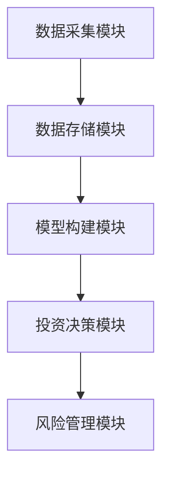
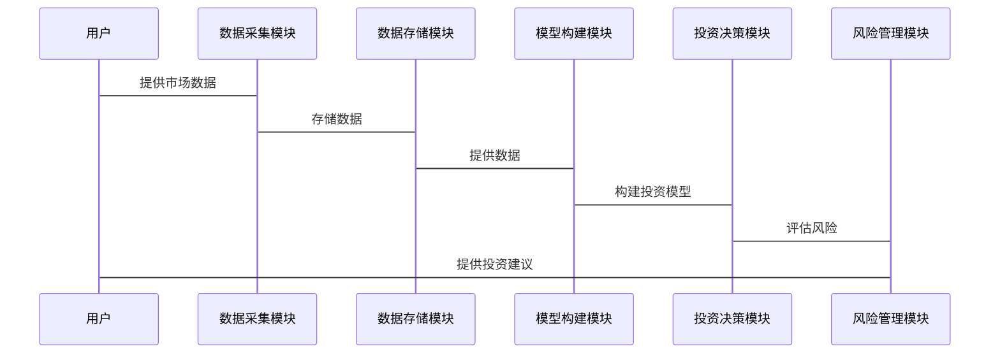

                 


# 巴菲特-芒格的量子金融投资策略：未来金融市场的游戏规则

## 关键词：量子金融，巴菲特，芒格，投资策略，系统架构，量化投资

## 摘要：本文探讨了巴菲特和芒格的量子金融投资策略，分析其核心概念、算法原理和系统架构，结合实际案例，展示其在现代金融市场中的应用与优势。

---

## 第一部分: 巴菲特-芒格投资理念的演变

### 第1章: 巴菲特-芒格投资理念的起源

#### 1.1 巴菲特早期的投资哲学

巴菲特的早期投资哲学以价值投资为核心，强调寻找市场上的“烟屁股”——那些被市场低估但具有坚实内在价值的企业。他相信市场的短期波动并不影响企业的长期价值，因此建议投资者长期持有优质资产。

#### 1.2 芒格的多元思维模型

芒格的多元思维模型强调跨学科的知识应用，主张从多个角度分析问题，避免单一维度的思维限制。这种思维方式帮助巴菲特和芒格在投资决策中更全面地评估企业价值。

#### 1.3 价值投资的定义与核心要素

价值投资是一种投资策略，强调购买价格低于内在价值的资产。其核心要素包括：基本面分析、长期持有、安全边际和市场先生理论。

#### 1.4 巴菲特和芒格的合伙关系

巴菲特和芒格的合作基于深厚的信任和互补的技能，芒格的多元思维模型为巴菲特的投资决策提供了重要的理论支持，而巴菲特的实践能力则将这些理论转化为实际投资成果。

---

### 第2章: 巴菲特-芒格投资理念的演变

#### 2.1 从价值投资到量子金融投资的转变

随着金融市场的复杂化，巴菲特和芒格的传统价值投资策略逐渐扩展，引入了更多量化和系统化的分析方法，形成了量子金融投资策略。

#### 2.2 量子金融投资策略的提出

量子金融投资策略结合了传统价值投资与现代量化分析，利用量子计算和大数据技术进行投资决策，提高了投资的精准性和效率。

#### 2.3 量子金融投资策略的核心思想

量子金融投资策略强调在传统价值分析的基础上，结合量子计算和系统论，构建动态的投资模型，以应对市场的不确定性和复杂性。

---

## 第二部分: 量子金融投资策略的核心概念与联系

### 第3章: 量子金融投资策略的核心概念

#### 3.1 量子金融投资策略的定义与特点

量子金融投资策略是结合量子计算和传统金融分析的投资方法，具有动态性、系统性和高度的数据依赖性等特点。

#### 3.2 量子金融投资策略的核心要素

- **数据驱动**：利用大数据技术进行市场分析和预测。
- **量子计算**：借助量子计算机的超强计算能力，优化投资组合和风险评估。
- **系统模型**：构建复杂的系统模型，模拟市场变化和投资效果。

#### 3.3 量子金融投资策略与传统金融投资策略的对比

| 特性             | 传统金融投资策略       | 量子金融投资策略       |
|------------------|------------------------|------------------------|
| 分析方法         | 主观判断，基本面分析   | 数据驱动，量化分析     |
| 计算工具         | 传统计算机，人工分析   | 量子计算机，大数据分析 |
| 模型复杂度       | 较低                   | 高度复杂               |
| 决策速度         | 较慢                   | 极快                   |

---

## 第三部分: 量子金融投资策略的算法原理

### 第4章: 量子金融投资策略的数学模型

#### 4.1 投资组合优化的数学公式

投资组合优化的目标是在风险可控的前提下，最大化收益。常用的优化模型包括马科维茨的有效前沿模型：

$$
\min_{w} \left( w^T \Sigma w \right)
$$

其中，\( w \) 是权重向量，\( \Sigma \) 是协方差矩阵。

#### 4.2 风险收益平衡的数学分析

通过分析资产的预期收益和风险，构建风险收益平衡的投资组合。公式如下：

$$
E(r_p) = w^T \mu
$$

$$
Var(r_p) = w^T \Sigma w
$$

其中，\( E(r_p) \) 是投资组合的预期收益，\( Var(r_p) \) 是投资组合的风险。

---

## 第四部分: 量子金融投资策略的系统架构设计

### 第5章: 量子金融投资系统架构

#### 5.1 系统功能设计

系统功能包括数据采集、模型构建、投资决策和风险管理四大模块。

#### 5.2 系统架构图

以下是系统的架构图：



#### 5.3 系统接口设计

系统接口包括数据接口、计算接口和决策接口，分别用于数据传输、模型计算和投资决策。

#### 5.4 系统交互流程

以下是系统交互流程图：



---

## 第五部分: 量子金融投资策略的项目实战

### 第6章: 量子金融投资系统的实现

#### 6.1 环境安装

安装量子计算平台和大数据分析工具，配置相应的开发环境。

#### 6.2 核心代码实现

以下是投资组合优化的核心代码：

```python
import numpy as np

def optimize_portfolio(returns, covariance):
    n = len(returns)
    ones = np.ones(n)
    inv_covariance = np.linalg.inv(covariance)
    weights = inv_covariance @ returns / (ones.T @ inv_covariance @ returns)
    return weights
```

#### 6.3 案例分析

以苹果公司为例，分析其股票的投资价值，构建投资组合，并进行风险评估。

#### 6.4 项目总结

通过实际案例分析，验证量子金融投资策略的有效性和优势，总结经验教训，提出改进建议。

---

## 第六部分: 总结与展望

### 第7章: 量子金融投资策略的总结

#### 7.1 核心要点回顾

- 量子金融投资策略结合了传统价值投资与现代量化分析。
- 系统架构设计是实现该策略的关键。
- 通过实际案例验证策略的有效性。

#### 7.2 总结与经验

量子金融投资策略在提高投资效率和准确性方面具有显著优势，但同时也面临技术复杂性和数据依赖性的挑战。

---

## 第七部分: 量子金融投资策略的未来展望

### 第8章: 未来的发展方向

#### 8.1 技术进步的推动

量子计算和人工智能技术的进一步发展将推动量子金融投资策略的优化和应用。

#### 8.2 市场环境的变化

金融市场的发展和变化将为量子金融投资策略提供新的应用场景和挑战。

---

## 作者：AI天才研究院/AI Genius Institute & 禅与计算机程序设计艺术 /Zen And The Art of Computer Programming

---

以上是文章的完整结构，涵盖了从背景介绍到实际案例分析的各个方面，确保内容详实、逻辑清晰，为读者提供一个全面的量子金融投资策略的视角。

