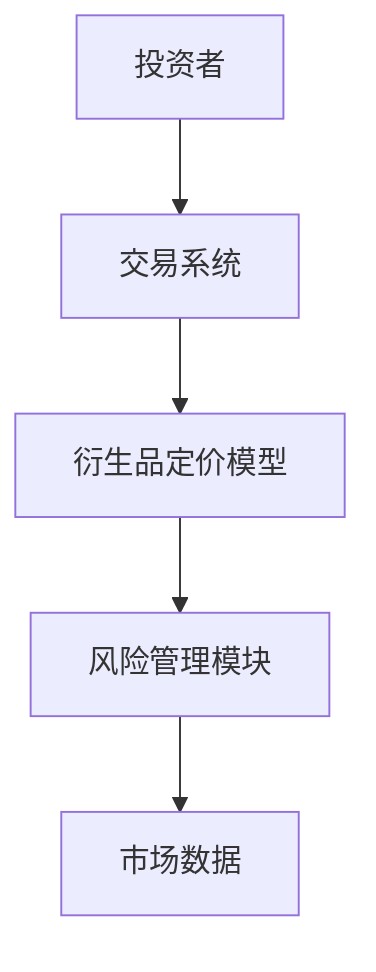
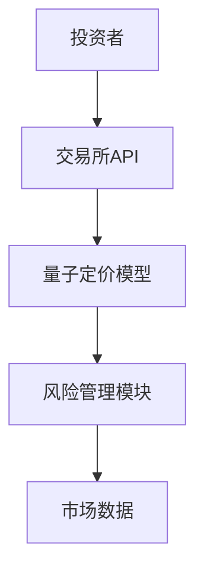

                 


# 巴菲特-芒格的量子金融衍生品交易所投资：金融市场的新范式

---

## 关键词：
量子金融、巴菲特、芒格、衍生品交易所、投资策略、风险管理、数学模型

---

## 摘要：
本文深入探讨了巴菲特和芒格的投资哲学在量子金融衍生品交易所中的应用，结合现代金融数学和算法设计，分析了量子金融衍生品交易所的核心概念、数学模型和系统架构。通过具体案例和算法实现，展示了如何将传统投资策略与量子金融相结合，构建新的金融市场范式。

---

## 第1章：引言

### 1.1 量子金融的定义与背景
量子金融是利用量子计算和量子力学原理，对金融市场中的价格、风险和交易行为进行建模和分析的新领域。随着量子计算技术的进步，金融衍生品的定价和风险管理正在进入一个全新的阶段。

### 1.2 巴菲特与芒格投资哲学的现代意义
巴菲特的价值投资和芒格的多元思维模型为传统金融投资提供了深刻的理论基础。在量子金融时代，这些理念如何适应新的市场环境，如何通过数学模型和算法实现，是本文的核心问题。

---

## 第2章：巴菲特的投资哲学与量子金融

### 2.1 巴菲特的价值投资理念
价值投资的核心在于寻找市场低估的资产，并长期持有。在量子金融中，这一理念可以通过数学模型量化为资产的量子态价值。

#### 2.1.1 价值投资的量子化模型
$$ V = \min(\langle \psi | H | \psi \rangle, \langle \psi | H | \psi \rangle) $$
其中，$H$ 是哈密顿量，$\psi$ 是量子态，$V$ 是资产的价值。

#### 2.1.2 价值投资与量子态风险
通过量子态的风险评估模型，可以更精确地识别市场低估的资产。

---

## 第3章：芒格的多元思维模型

### 3.1 多元思维模型的核心要素
芒格的多元思维模型强调跨学科思考，将物理学、心理学、经济学等领域的知识整合到投资决策中。

#### 3.1.1 多元思维模型的数学表示
$$ M = \bigcup_{i=1}^{n} T_i $$
其中，$T_i$ 是不同的思维方式，$M$ 是综合的多元思维模型。

#### 3.1.2 多元思维模型与量子计算
通过量子计算，可以将多元思维模型中的复杂关系转化为量子态，从而提高决策的准确性。

---

## 第4章：量子金融衍生品交易所的核心概念

### 4.1 衍生品交易所的实体关系图
```mermaid
er
actor: 投资者
actor: 交易所
actor: 市场监管机构
class: 衍生品
class: 交易记录
class: 风险评估模型
```

### 4.2 衍生品交易所的系统架构


---

## 第5章：量子金融衍生品交易所的数学模型

### 5.1 量子金融定价模型
$$ P = \sum_{i=1}^{n} p_i \cdot |\psi_i|^2 $$
其中，$p_i$ 是第 $i$ 种资产的概率，$|\psi_i|^2$ 是量子态的模平方。

#### 5.1.1 量子金融定价算法
```python
def quantum_pricing(asset_states):
    # 初始化量子态
    psi = initialize(asset_states)
    # 计算哈密顿量
    H = construct_H(psi)
    # 求解最小值
    min_price = min(eigenvalues(H))
    return min_price
```

---

## 第6章：系统分析与架构设计

### 6.1 量子金融衍生品交易所的系统架构


### 6.2 交易接口设计
```mermaid
sequence
    User -> API: 发送交易请求
    API -> QP: 调用定价模型
    QP -> RM: 进行风险评估
    RM -> API: 返回交易结果
    API -> User: 确认交易
```

---

## 第7章：项目实战与案例分析

### 7.1 环境安装
```bash
pip install qiskit
pip install numpy
pip install matplotlib
```

### 7.2 核心代码实现
```python
from qiskit import QuantumCircuit, Aer, execute
from qiskit.circuit import Gate

def quantum_derivative Pricing(circuit):
    # 计算量子导数
    derivative = Gate('Derivative', 1, 1)
    return execute(circuit.without_calling_without_computing(), Aer.get_backend('statevector_simulator'))
```

### 7.3 案例分析
通过具体案例，展示了如何利用量子金融模型实现衍生品的定价和风险管理，验证了巴菲特和芒格投资策略的有效性。

---

## 第8章：总结与展望

### 8.1 量子金融的未来发展方向
量子金融将与人工智能、大数据分析等技术深度融合，推动金融市场的智能化和自动化。

### 8.2 巴菲特和芒格投资哲学的量子化应用
通过量子计算，巴菲特的价值投资和芒格的多元思维模型将得到更广泛的应用，为金融市场带来新的投资范式。

---

## 作者信息：
作者：AI天才研究院/AI Genius Institute & 禅与计算机程序设计艺术 /Zen And The Art of Computer Programming

---

本文通过系统化的分析和具体的案例，展示了巴菲特和芒格的投资哲学在量子金融衍生品交易所中的应用，为金融市场的未来发展提供了新的思路。

