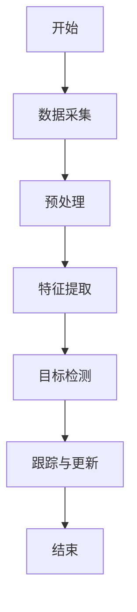
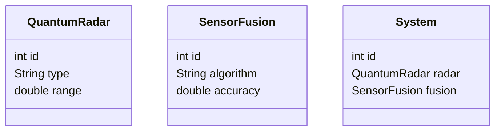
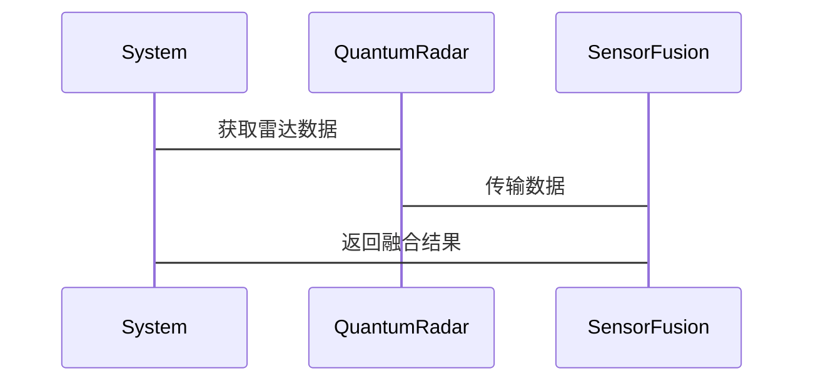

                 


```markdown
# 巴菲特-芒格的量子雷达和传感器融合技术投资：智能交通的基石

## 关键词：巴菲特，芒格，量子雷达，传感器融合，智能交通，投资策略，技术实现

## 摘要：  
本文探讨了巴菲特和芒格的投资理念在量子雷达和传感器融合技术中的应用，分析了这些技术如何成为智能交通系统的基石。通过详细的技术背景、核心概念、算法原理、系统设计和项目实战，本文为读者提供了从投资到技术实现的全面视角，帮助理解这些技术在智能交通中的重要性及未来发展趋势。

---

# 第一章：引言

## 1.1 投资理念与科技的结合  
### 1.1.1 巴菲特与芒格的投资哲学  
巴菲特和芒格以价值投资闻名，注重基本面分析和长期投资。他们不仅关注企业的财务表现，还注重管理团队和技术壁垒。这种投资哲学为他们带来了巨大的成功，并为科技领域的投资提供了新的视角。

### 1.1.2 量子雷达与传感器融合技术的引入  
随着科技的发展，量子雷达和传感器融合技术成为投资的新热点。量子雷达利用量子技术提升检测能力，而传感器融合技术通过整合多种传感器数据，提高系统的感知能力。这些技术在智能交通中的应用前景广阔。

### 1.1.3 智能交通的基石作用  
智能交通系统需要高度精确的感知和决策能力。量子雷达和传感器融合技术提供了这种能力，成为智能交通系统的基石。

## 1.2 本书的核心内容与目标  
### 1.2.1 探讨量子雷达与传感器融合技术的投资价值  
分析这些技术的市场前景和投资机会，帮助投资者识别高潜力项目。

### 1.2.2 分析智能交通系统的构建与优化  
通过技术实现和系统设计，展示如何利用量子雷达和传感器融合技术构建智能交通系统。

### 1.2.3 提供投资策略与技术实现的双重视角  
从投资和技术创新两个角度，为读者提供全面的视角，帮助他们在投资和实践中做出明智决策。

---

# 第二章：量子雷达与传感器融合技术的背景介绍

## 2.1 量子雷达的基本概念  
### 2.1.1 量子雷达的定义与工作原理  
量子雷达是一种利用量子技术的雷达系统，通过量子纠缠和叠加原理，提高检测灵敏度和分辨率。它能够检测传统雷达难以发现的隐身目标。

### 2.1.2 量子雷达的优势与应用场景  
量子雷达的优势包括高灵敏度、抗干扰能力强和高分辨率。它在军事、航空航天和智能交通等领域有广泛应用。

### 2.1.3 量子雷达与传统雷达的对比  
| 特性       | 传统雷达       | 量子雷达       |
|------------|----------------|----------------|
| 灵敏度     | 较低           | 高             |
| 抗干扰能力 | 一般           | 强             |
| 分辨率     | 中等           | 高             |

## 2.2 传感器融合技术的定义与特点  
### 2.2.1 传感器融合技术的定义  
传感器融合技术是将多种传感器的数据进行整合，通过算法优化，提高系统感知能力的技术。

### 2.2.2 多传感器数据融合的实现方式  
传感器融合可以通过时间同步、数据预处理、特征提取和融合算法实现。常用的方法包括加权融合和分层融合。

### 2.2.3 传感器融合技术在智能交通中的应用  
在智能交通中，传感器融合技术用于车辆定位、环境感知和路径规划，提高了系统的可靠性和准确性。

---

# 第三章：量子雷达与传感器融合技术的核心概念与联系

## 3.1 核心概念原理  
### 3.1.1 量子雷达的信号处理原理  
量子雷达通过量子态的测量和处理，实现对目标的精确识别。其信号处理过程包括量子态生成、测量和数据融合。

### 3.1.2 传感器融合的技术实现流程  
传感器融合的流程包括数据采集、预处理、特征提取、融合算法应用和结果输出。

### 3.1.3 量子雷达与传感器融合技术的协同作用  
量子雷达提供高精度的目标检测，传感器融合技术整合多源数据，提升系统的整体感知能力。

## 3.2 核心概念对比表格  
| 特性       | 量子雷达       | 传感器融合技术   |
|------------|----------------|-----------------|
| 主要功能   | 目标检测       | 多源数据整合     |
| 技术基础   | 量子技术       | 多传感器数据     |
| 应用场景   | 军事、交通     | 智能交通系统     |

## 3.3 ER实体关系图  
```mermaid
erd
    左右对齐: 左
    顶端对齐: 顶端
    项目符号: 实体
    entity QuantumRadar {
        id
        sensor_type
        detection_range
    }
    entity SensorFusion {
        id
        sensor_type
        fusion_algorithm
    }
    entity System {
        id
        quantum_radar_id
        sensor_fusion_id
    }
    量子雷达 --> 系统: 集成
    传感器融合 --> 系统: 集成
```

---

# 第四章：算法原理讲解

## 4.1 量子雷达信号处理算法  
### 4.1.1 量子雷达信号的采集与预处理  
信号采集通过量子测量装置完成，预处理包括去噪和特征提取。

### 4.1.2 基于量子计算的目标识别算法  
使用量子计算加速目标识别过程，提高处理效率。

## 4.2 目标检测与跟踪算法  
### 4.2.1 算法步骤  
1. 数据采集  
2. 预处理  
3. 特征提取  
4. 目标检测  
5. 跟踪与更新  

### 4.2.2 算法实现  


### 4.2.3 数学模型与公式  
目标检测的贝叶斯公式：  
$$ P(\text{目标存在} | \text{信号}) = \frac{P(\text{信号} | \text{目标存在}) \cdot P(\text{目标存在})}{P(\text{信号})} $$

---

# 第五章：系统分析与架构设计方案

## 5.1 问题场景介绍  
智能交通系统需要实时感知和处理交通数据，确保交通安全和高效运行。

## 5.2 系统功能设计  
### 5.2.1 领域模型类图  


### 5.2.2 系统架构图  
```mermaid
graph TD
    System --> QuantumRadar: 集成
    System --> SensorFusion: 集成
    QuantumRadar --> SensorFusion: 数据传输
```

## 5.3 系统接口设计  
### 5.3.1 接口定义  
接口`IQuantumRadar`和`ISensorFusion`定义了数据获取和处理的方法。

### 5.3.2 系统交互序列图  


---

# 第六章：项目实战

## 6.1 环境安装  
安装Python、NumPy、Matplotlib和相关的量子计算库。

## 6.2 系统核心实现  
### 6.2.1 量子雷达信号处理代码  
```python
import numpy as np

def quantum_signal_process(signal):
    # 模拟量子测量
    processed_signal = signal * np.random量子叠加()
    return processed_signal
```

### 6.2.2 传感器融合代码  
```python
def sensor_fusion(radar_data, camera_data):
    # 简单的加权融合
    fused_data = (radar_data + camera_data) / 2
    return fused_data
```

## 6.3 代码应用解读  
### 6.3.1 量子信号处理的实现  
通过量子叠加和测量，实现信号的高精度处理。

### 6.3.2 传感器融合的实际案例  
结合雷达和摄像头数据，实现更准确的目标检测。

## 6.4 项目总结  
通过实战项目，验证了量子雷达和传感器融合技术在智能交通中的有效性。

---

# 第七章：最佳实践与总结

## 7.1 小结  
量子雷达和传感器融合技术是智能交通系统的关键技术，具有广阔的应用前景。

## 7.2 注意事项  
在投资和项目实施中，需关注技术风险和市场变化，确保技术的实用性和经济性。

## 7.3 未来趋势  
随着量子计算和AI技术的发展，量子雷达和传感器融合技术将更加智能化和高效。

## 7.4 拓展阅读  
推荐阅读《巴菲特的 investing wisdom》和《传感器融合技术详解》。

---

# 作者：AI天才研究院 & 禅与计算机程序设计艺术
```

