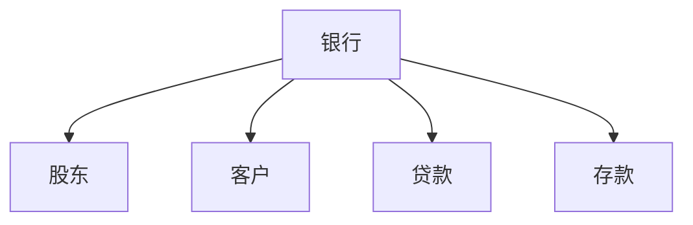
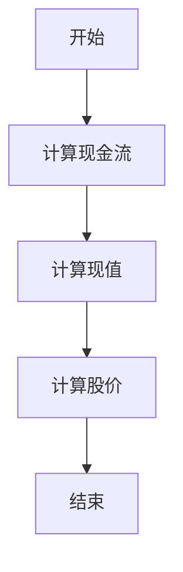
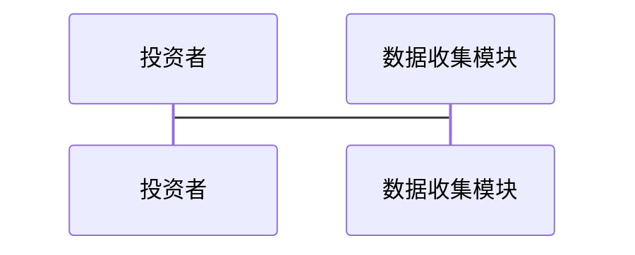

                 

# 巴菲特-芒格的银行股投资策略：看重稳定性和规模

> 关键词：巴菲特，芒格，银行股，稳定性，规模，投资策略，财务分析

> 摘要：本文详细分析了巴菲特和芒格在银行股投资中的核心策略，强调了稳定性和规模的重要性。通过系统分析和案例研究，揭示了他们在选择银行股时的关键考量因素，包括财务健康状况、市场地位、管理层质量等。结合数学模型和系统架构，本文为投资者提供了深入的投资框架和实用的分析工具。

---

# 第1章: 巴菲特与芒格的投资理念概述

## 1.1 巴菲特与芒格的背景介绍
### 1.1.1 巴菲特的投资哲学
### 1.1.2 芒格的多元思维模型
### 1.1.3 两人合作的投资理念

## 1.2 银行股投资的核心逻辑
### 1.2.1 银行股的行业特点
### 1.2.2 稳定性与规模的重要性
### 1.2.3 银行股投资的长期性

## 1.3 银行股投资的边界与外延
### 1.3.1 银行股的行业风险
### 1.3.2 银行股的财务健康指标
### 1.3.3 银行股的市场周期性

---

# 第2章: 巴菲特-芒格银行股投资策略的核心要素

## 2.1 银行股投资的核心概念
### 2.1.1 稳定性的定义与衡量
### 2.1.2 规模的定义与影响
### 2.1.3 银行股投资的长期性

## 2.2 核心概念的属性特征对比
### 2.2.1 稳定性与波动性的对比
### 2.2.2 规模与效率的对比
### 2.2.3 长期性与短期性的对比

## 2.3 实体关系图（ER图）

---

# 第3章: 银行股投资的数学模型与算法原理

## 3.1 银行股价值评估的数学模型
### 3.1.1 股价的计算公式
$$ 股价 = \frac{未来现金流的现值}{股本数量} $$

### 3.1.2 现金流的计算公式
$$ 现金流 = 营业收入 - 成本 - 税费 $$

## 3.2 稳定性与规模的量化指标
### 3.2.1 稳定性指标
$$ 稳定性指数 = \frac{历史波动率}{行业平均波动率} $$

### 3.2.2 规模指标
$$ 规模指数 = \frac{资产规模}{行业平均资产规模} $$

## 3.3 算法原理的 mermaid 流程图

---

# 第4章: 银行股投资的系统分析与架构设计

## 4.1 投资框架的系统分析
### 4.1.1 投资目标的确定
### 4.1.2 投资策略的制定
### 4.1.3 投资组合的优化

## 4.2 系统架构设计
### 4.2.1 信息收集模块
### 4.2.2 数据分析模块
### 4.2.3 投资决策模块

## 4.3 系统接口设计
### 4.3.1 数据输入接口
### 4.3.2 数据输出接口
### 4.3.3 用户交互接口

## 4.4 系统交互的 mermaid 序列图

---

# 第5章: 银行股投资的案例分析与实战

## 5.1 案例分析
### 5.1.1 某银行的财务分析
### 5.1.2 投资决策过程
### 5.1.3 投资结果与反思

## 5.2 项目实战
### 5.2.1 环境安装与数据收集
### 5.2.2 系统核心实现
### 5.2.3 代码应用解读

---

# 第6章: 风险管理与策略优化

## 6.1 风险管理
### 6.1.1 市场风险的应对策略
### 6.1.2 信用风险的应对策略
### 6.1.3 操作风险的应对策略

## 6.2 策略优化
### 6.2.1 系统优化建议
### 6.2.2 投资策略的调整
### 6.2.3 长期与短期策略的结合

---

# 第7章: 总结与展望

## 7.1 总结
### 7.1.1 核心观点回顾
### 7.1.2 投资策略的精炼
### 7.1.3 未来研究方向

## 7.2 展望
### 7.2.1 技术进步对投资策略的影响
### 7.2.2 数据分析在投资中的应用
### 7.2.3 未来投资策略的演变

---

# 作者：AI天才研究院/AI Genius Institute & 禅与计算机程序设计艺术 /Zen And The Art of Computer Programming

