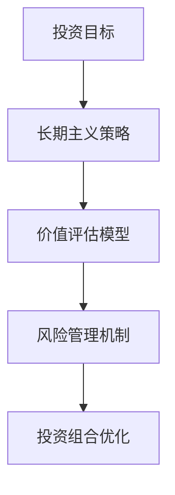
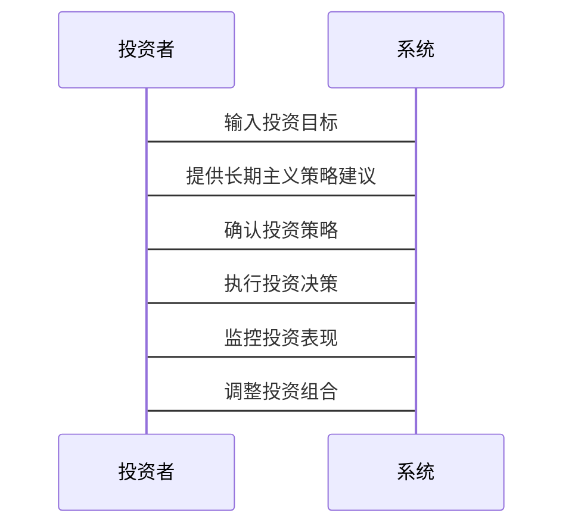

                 


# 巴菲特-芒格的长期主义：为什么耐心是最佳投资策略

> 关键词：长期主义，巴菲特，芒格，价值投资，耐心，投资策略，复合增长率

> 摘要：本文深入探讨了巴菲特和芒格倡导的长期主义投资策略，分析了耐心作为最佳投资策略的核心原因。文章从长期主义的背景、核心概念、算法原理、系统架构、项目实战等多方面展开，结合实际案例和数学模型，详细阐述了长期主义在投资决策中的应用。通过本文，读者可以理解长期主义的内在逻辑，掌握其在实际投资中的应用技巧，并学习如何通过耐心和纪律来实现长期稳健的投资回报。

---

## 第一部分：长期主义的背景与核心概念

### 第1章：长期主义的定义与背景

#### 1.1 长期主义的定义
长期主义是一种投资哲学，强调以耐心和纪律为核心，专注于长期价值的创造和积累。它与传统的短期交易策略形成鲜明对比，主张通过长期持有优质资产来实现财富的稳步增长。

#### 1.2 巴菲特与芒格的背景
巴菲特和芒格是长期主义的代表人物。巴菲特以“价值投资”闻名，芒格则以其多元思维模型著称。他们的合作不仅创造了巨大的财富，更为投资者提供了深刻的投资理念。

#### 1.3 长期主义与投资策略的关系
长期主义与传统投资策略相比，更注重资产的内在价值和长期成长潜力。通过长期持有优质资产，投资者可以在市场波动中保持稳定，实现财富的长期增长。

---

### 第2章：长期主义的核心要素

#### 2.1 长期主义的核心要素
- **耐心**：耐心是长期主义的第一性原理，只有通过长期持有优质资产，才能实现复利效应。
- **理解**：理解资产的内在价值是长期投资的基础，投资者需要深入研究公司的基本面。
- **纪律**：纪律是长期投资的保障，通过严格的买入和卖出标准，避免短期波动的干扰。

#### 2.2 长期主义与其他投资策略的对比
- **长期主义与趋势投资**：趋势投资依赖市场趋势，而长期主义则关注资产的内在价值。
- **长期主义与套利策略**：套利策略追求短期价差，而长期主义注重长期收益。
- **长期主义与短期交易**：短期交易频繁操作，而长期主义强调长期持有。

#### 2.3 长期主义的数学模型与公式
##### 2.3.1 长期主义的价值评估公式
$$ V = \frac{CF}{r - g} $$
其中，\( V \) 是资产的内在价值，\( CF \) 是未来现金流，\( r \) 是贴现率，\( g \) 是现金流增长率。

##### 2.3.2 长期复合增长率的计算公式
$$ CAGR = \left( \frac{V_f}{V_i} \right)^{1/n} - 1 $$
其中，\( CAGR \) 是复合年均增长率，\( V_f \) 是最终价值，\( V_i \) 是初始价值，\( n \) 是时间跨度。

---

## 第二部分：长期主义的系统分析与架构设计

### 第3章：长期主义的系统化方法

#### 3.1 投资决策的系统化方法
##### 3.1.1 长期主义的系统架构图


##### 3.1.2 投资决策的流程
1. 确定投资目标：明确投资期限、风险承受能力和收益目标。
2. 选择长期主义策略：基于资产的内在价值和长期增长潜力。
3. 构建价值评估模型：计算资产的内在价值，评估其是否被市场低估。
4. 设计风险管理机制：通过分散投资和严格止损控制风险。
5. 优化投资组合：根据市场变化和资产表现，动态调整投资组合。

#### 3.2 长期主义的算法原理
##### 3.2.1 长期复合增长率的计算流程
1. 收集历史数据：获取资产的历史价格和财务数据。
2. 计算现金流：预测未来现金流，考虑资产的盈利能力。
3. 评估内在价值：使用DCF模型计算资产的内在价值。
4. 计算复合增长率：根据内在价值和市场价格，计算复合年均增长率。

##### 3.2.2 长期复合增长率的实现代码
```python
def calculate_cagr(initial_value, final_value, years):
    return ((final_value / initial_value) ** (1 / years)) - 1

# 示例
initial_value = 1000
final_value = 2000
years = 10
cagr = calculate_cagr(initial_value, final_value, years)
print(f"复合年均增长率：{cagr:.2f}")
```

---

## 第三部分：长期主义的项目实战

### 第4章：长期主义的实际案例分析

#### 4.1 巴菲特的经典投资案例
##### 4.1.1 投资可口可乐的案例
- **背景**：可口可乐作为一家具有强大竞争优势的企业，其品牌和渠道优势使其具备长期增长潜力。
- **分析**：巴菲特通过DCF模型评估可口可乐的内在价值，发现其市场价格低于内在价值，因此决定长期持有。

##### 4.1.2 投资苹果的案例
- **背景**：苹果作为科技行业的领导者，其创新能力和技术优势使其具备长期增长潜力。
- **分析**：芒格通过多元思维模型分析苹果的竞争优势，发现其具备长期投资价值。

#### 4.2 长期主义的实际应用
##### 4.2.1 现金流预测
```python
def predict_cash_flow(revenue, cost, tax_rate):
    return (revenue - cost) * (1 - tax_rate)

# 示例
revenue = 1000000
cost = 600000
tax_rate = 0.2
cash_flow = predict_cash_flow(revenue, cost, tax_rate)
print(f"预测现金流：{cash_flow}")
```

##### 4.2.2 内在价值评估
```python
def calculate_intrinsic_value(cash_flow, discount_rate, growth_rate):
    return cash_flow / (discount_rate - growth_rate)

# 示例
cash_flow = 1000000
discount_rate = 0.08
growth_rate = 0.05
intrinsic_value = calculate_intrinsic_value(cash_flow, discount_rate, growth_rate)
print(f"内在价值：{intrinsic_value:.2f}")
```

---

## 第四部分：长期主义的最佳实践

### 第5章：长期主义的注意事项与小结

#### 5.1 长期主义的注意事项
1. **避免过度杠杆**：长期投资需要稳健的资金管理，避免过度杠杆导致的风险。
2. **分散投资**：通过分散投资降低风险，避免将所有资金投入单一资产。
3. **定期复盘**：定期评估投资组合的表现，根据市场变化调整策略。

#### 5.2 长期主义的小结
长期主义是一种需要耐心、纪律和深入研究的投资策略。通过长期持有优质资产，投资者可以在市场波动中实现财富的稳步增长。然而，长期主义并非没有风险，投资者需要具备强大的心理素质和严格的风险管理能力。

---

## 第五部分：长期主义的数学模型与公式总结

### 第6章：长期主义的数学模型与公式

#### 6.1 长期复合增长率的数学模型
$$ CAGR = \left( \frac{V_f}{V_i} \right)^{1/n} - 1 $$

#### 6.2 内在价值评估的数学模型
$$ V = \frac{CF}{r - g} $$

---

## 第六部分：长期主义的系统架构与交互设计

### 第7章：长期主义的系统架构与交互设计

#### 7.1 投资决策系统的架构图


#### 7.2 投资决策系统的交互图


---

## 第七部分：长期主义的最佳实践与案例总结

### 第8章：长期主义的最佳实践

#### 8.1 长期主义的最佳实践
1. **坚持长期视角**：避免短期波动的干扰，专注于长期价值。
2. **深入研究企业**：了解企业的基本面和竞争优势。
3. **分散投资风险**：通过多样化投资降低风险。
4. **严格遵守纪律**：坚持投资策略，避免情绪化决策。

#### 8.2 长期主义的案例总结
通过分析巴菲特和芒格的经典投资案例，我们可以看到，长期主义的核心在于耐心和深入研究。只有通过长期持有优质资产，投资者才能实现财富的稳健增长。

---

## 结语

长期主义是一种需要耐心、纪律和深入研究的投资策略。通过本文的分析，读者可以理解长期主义的内在逻辑，掌握其在实际投资中的应用技巧，并学习如何通过耐心和纪律来实现长期稳健的投资回报。

---

## 作者

作者：AI天才研究院/AI Genius Institute & 禅与计算机程序设计艺术 /Zen And The Art of Computer Programming

