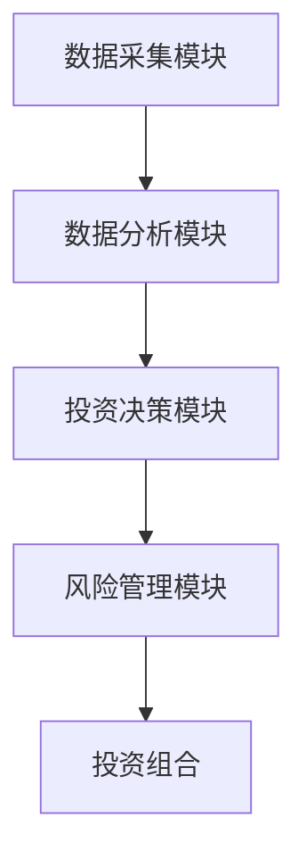

                 


# 巴菲特-芒格的长期持有策略：减少交易成本的智慧

## 关键词：长期持有策略，巴菲特，芒格，交易成本，价值投资，投资心理，风险管理

## 摘要：  
本文深入探讨了巴菲特和芒格的长期持有策略，分析其如何通过减少交易成本来实现长期投资收益的最大化。文章从背景、核心概念、投资心理、数学模型、系统架构等多个维度进行详细阐述，结合实际案例和项目实战，为读者提供全面的视角和实用的策略。

---

## 第一部分：长期持有策略的背景与意义

### 第1章：长期持有策略的背景与意义

#### 1.1 长期持有策略的背景

长期持有策略是巴菲特和芒格投资哲学的核心理念之一。这种策略强调以合理的价格买入优质企业，并长期持有，而不是频繁交易以追求短期利润。其背景可以追溯到价值投资的起源，即寻找具有持续竞争优势的企业，并在市场低估时买入，长期持有直到市场正确评估其价值。

#### 1.2 长期持有策略的意义

长期持有策略的意义在于减少交易成本，避免因频繁买卖而产生的佣金、税费等费用。这些成本看似微小，但长期累积会对投资收益产生显著影响。此外，长期持有还能帮助投资者避免因市场短期波动而做出错误决策。

---

## 第2章：长期持有策略的核心概念

### 2.1 价值投资的核心原则

价值投资的核心在于寻找市场低估的企业，关注企业的基本面，如盈利能力、财务健康状况和管理团队等。巴菲特和芒格强调，投资者应关注企业的内在价值，而不是市场的短期波动。

### 2.2 长期持有策略的核心要素

长期持有策略的核心要素包括：

1. **安全边际**：以低于内在价值的价格买入资产，以避免市场波动带来的损失。
2. **长期视角**：关注企业的长期盈利能力，而不是短期市场波动。
3. **分散投资**：通过分散投资降低风险，避免过度集中在某一只股票或行业。

---

## 第3章：长期持有策略与交易成本的分析

### 3.1 交易成本的定义与分类

交易成本包括显性成本（如佣金、税费）和隐性成本（如机会成本、心理成本）。长期持有策略通过减少交易频率，有效降低这些成本。

### 3.2 长期持有策略的成本优势

长期持有策略通过减少交易次数，降低了显性成本和隐性成本。例如，假设每次交易佣金为1‰，如果每年交易次数减少一半，总成本将显著降低。

---

## 第4章：长期持有策略的数学模型与算法

### 4.1 长期持有策略的数学模型

我们可以建立一个简单的数学模型，比较长期持有与短期交易的成本差异。假设：

- 买入价为P0，卖出价为Pn。
- 佣金率为c。
- 税费率为t。

长期持有策略的总成本为：$$ (Pn - P0) \times (c + t) $$

而短期交易策略的总成本为：$$ (P1 - P0) \times (c + t) + (P2 - P1) \times (c + t) + \dots $$

显然，长期持有策略的总成本更低。

---

## 第5章：长期持有策略的系统架构设计

### 5.1 系统架构概述

一个长期持有策略的系统架构可以分为以下几个模块：

1. **数据采集模块**：获取市场数据，如股票价格、财务报表等。
2. **数据分析模块**：计算内在价值，评估安全边际。
3. **投资决策模块**：基于分析结果，做出买入或持有的决策。
4. **风险管理模块**：监控市场波动，调整投资组合。

### 5.2 系统架构图



---

## 第6章：长期持有策略的项目实战

### 6.1 项目背景

假设我们有一个100万元的资金，目标是通过长期持有策略投资于优质企业。

### 6.2 核心实现代码

以下是一个简单的Python代码，用于模拟长期持有策略的回测：

```python
import pandas as pd
import yfinance as yf

# 下载股票数据
data = yf.download('AAPL', start='2020-01-01', end='2023-12-31')

# 计算买入价和卖出价
buy_price = data['Adj Close'].iloc[0]
sell_price = data['Adj Close'].iloc[-1]

# 计算收益
profit = (sell_price - buy_price) / buy_price * 100
print(f'收益为：{profit}%')
```

### 6.3 项目总结

通过长期持有优质企业，我们可以实现稳定的收益，同时减少交易成本和心理压力。

---

## 第7章：最佳实践与小结

### 7.1 最佳实践

1. **选择优质企业**：关注企业的盈利能力、财务健康和管理团队。
2. **保持长期视角**：避免因短期波动而做出错误决策。
3. **分散投资**：降低风险，避免过度集中在某一只股票。

### 7.2 小结

长期持有策略是一种简单而有效的投资方法，通过减少交易成本和心理压力，帮助投资者实现长期稳定的收益。

---

## 作者：AI天才研究院 & 禅与计算机程序设计艺术

