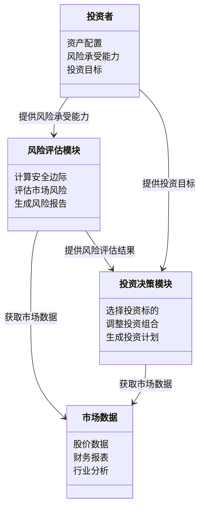
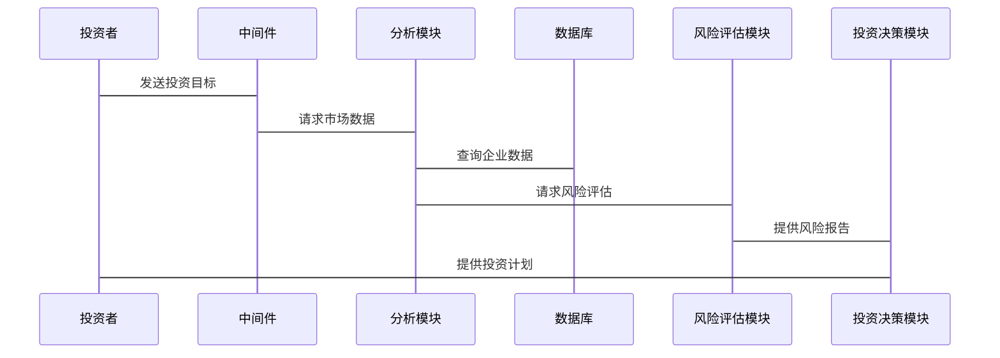

                 


# 巴菲特-芒格的风险管理：如何在投资中降低风险

## 关键词
- 巴菲特
- 芒格
- 风险管理
- 价值投资
- 安全边际
- 逆向思维
- 投资策略

## 摘要
巴菲特和芒格是投资界最具影响力的人物之一，他们的风险管理策略以价值投资为核心，强调安全边际和逆向思维。本文系统地分析了他们的风险管理理论，包括安全边际的计算、逆向思维的应用，以及如何通过数学模型和系统架构来实现风险管理。结合实际案例和Python代码示例，展示了如何将这些理论应用于投资决策中，帮助投资者降低风险，实现稳健收益。

---

# 第一部分: 巴菲特-芒格的风险管理概述

## 第1章: 巴菲特-芒格投资理念概述

### 1.1 巴菲特与芒格的背景介绍

#### 1.1.1 巴菲特的生平与投资理念
沃伦·巴菲特（Warren Buffett）是世界著名的投资家，被誉为“股神”。他出生于1934年，毕业于哥伦比亚大学，师从本杰明·格雷厄姆（Benjamin Graham），创立了伯克希尔哈撒韦公司（Berkshire Hathaway），并以价值投资闻名。巴菲特的投资理念强调安全边际、长期持有和分散投资。

#### 1.1.2 芒格的哲学与决策思维
查理·芒格（Charlie Munger）是巴菲特的长期合作伙伴，也是伯克希尔哈撒韦的副主席。芒格的决策思维基于“认知的框架”，强调逆向思维、心理模型和避免情绪化决策。他的投资哲学强调理解企业基本面和长期价值。

#### 1.1.3 巴菲特与芒格合作的投资哲学
巴菲特和芒格的合作基于共同的价值投资理念，即寻找具有持续竞争优势、良好管理和合理估值的企业。他们的投资哲学强调长期价值、安全边际和分散投资，以降低风险。

### 1.2 风险管理的核心概念

#### 1.2.1 风险管理的定义与重要性
风险管理是指在投资过程中识别、评估和控制潜在风险，以实现投资目标。它是投资决策的重要组成部分，能够帮助投资者降低损失，提高收益的稳定性。

#### 1.2.2 巴菲特-芒格风险管理的独特视角
巴菲特和芒格的风险管理注重企业的内在价值和安全边际，强调避免高风险投资和情绪化决策。他们的方法以长期视角为基础，关注企业的基本面和竞争优势。

#### 1.2.3 风险管理与投资回报的关系
有效的风险管理能够降低投资组合的波动性，减少潜在损失，从而提高投资回报的稳定性。通过控制风险，投资者能够在市场波动中保持稳健，实现长期收益。

---

## 第2章: 巴菲特-芒格风险管理理论

### 2.1 巴菲特的安全边际理论

#### 2.1.1 安全边际的定义
安全边际是指投资价格低于企业内在价值的部分，即安全空间。它能够保护投资者免受市场价格波动的影响。

#### 2.1.2 安全边际的计算方法
安全边际 = 内在价值 - 市场价格

#### 2.1.3 安全边际在投资中的应用
投资者应选择具有较大安全边际的企业，以降低投资风险。例如，当市场价格低于内在价值的20%，投资风险较低。

### 2.2 芒格的逆向思维与风险管理

#### 2.2.1 逆向思维的定义
逆向思维是指在市场恐慌时寻找机会，避免在市场高点投资，而选择在市场低点买入优质资产。

#### 2.2.2 逆向思维在风险管理中的应用
芒格的逆向思维强调在市场低迷时投资，利用价格优势获取长期收益。例如，在2008年金融危机期间，伯克希尔哈撒韦大量买入优质资产。

#### 2.2.3 逆向思维与巴菲特安全边际理论的结合
逆向思维与安全边际理论结合，能够帮助投资者在市场低点找到具有较大安全边际的企业，实现稳健收益。

### 2.3 巴菲特-芒格的风险管理框架

#### 2.3.1 风险管理框架的组成部分
风险管理框架包括市场分析、企业基本面评估、安全边际计算和投资组合管理。

#### 2.3.2 框架中各要素的相互关系
市场分析帮助识别投资机会，企业基本面评估确定内在价值，安全边际计算评估风险，投资组合管理控制整体风险。

#### 2.3.3 框架的优缺点与适用场景
优点：能够有效控制风险，提高投资回报的稳定性。缺点：需要较高的分析能力和市场敏感性。适用于长期价值投资者。

---

## 第3章: 巴菲特-芒格风险管理的数学模型

### 3.1 安全边际的数学模型

#### 3.1.1 安全边际的计算公式
$$ \text{安全边际} = \text{内在价值} - \text{市场价格} $$

#### 3.1.2 公式的应用场景与限制
应用场景：评估企业的安全空间，选择具有较大安全边际的投资标的。限制：内在价值的评估需要准确的数据和模型支持。

#### 3.1.3 公式与实际投资决策的结合
例如，当内在价值为100，市场价格为80时，安全边际为20，投资风险较低。

### 3.2 芒格决策树的构建与分析

#### 3.2.1 决策树的定义与构建方法
决策树是一种用于分析决策过程的树状图，包括决策节点和结果节点。芒格的决策树帮助投资者识别关键决策点和潜在风险。

#### 3.2.2 决策树在风险管理中的应用
例如，投资者在决策树中评估不同投资标的的风险和收益，选择风险最低、收益最高的选项。

#### 3.2.3 决策树的优缺点与改进方向
优点：能够清晰地展示决策过程和潜在风险。缺点：需要大量的数据支持，构建复杂。

### 3.3 投资组合的风险评估模型

#### 3.3.1 投资组合风险的定义与评估指标
投资组合风险包括市场风险、流动性风险和信用风险。评估指标包括波动率、夏普比率和最大回撤。

#### 3.3.2 投资组合风险的数学公式
$$ \text{夏普比率} = \frac{\text{预期收益} - \text{无风险利率}}{\text{收益波动率}} $$

#### 3.3.3 公式的实际应用案例
例如，投资组合的预期收益为10%，无风险利率为2%，波动率为5%，夏普比率为(10%-2%)/5% = 1.6。

---

## 第4章: 系统分析与架构设计

### 4.1 系统功能设计

#### 4.1.1 领域模型mermaid类图


### 4.2 系统架构设计

#### 4.2.1 系统架构设计mermaid架构图


### 4.3 系统接口设计

#### 4.3.1 风险评估模块接口
- 输入：企业财务数据、市场价格
- 输出：安全边际、风险等级

#### 4.3.2 投资决策模块接口
- 输入：风险评估结果、投资目标
- 输出：投资计划、投资组合调整建议

### 4.4 系统交互设计

#### 4.4.1 系统交互mermaid序列图


---

## 第5章: 项目实战

### 5.1 环境配置

#### 5.1.1 技术选型
- Python 3.8+
- Pandas、NumPy、Matplotlib库
- Jupyter Notebook

### 5.2 核心实现源代码

#### 5.2.1 安全边际计算代码
```python
import pandas as pd
import numpy as np

def calculate_margin_of_safety(intrinsic_value, market_price):
    return intrinsic_value - market_price

# 示例数据
intrinsic_values = {'AAPL': 150, 'GOOGL': 200, 'MSFT': 120}
market_prices = {'AAPL': 130, 'GOOGL': 180, 'MSFT': 110}

# 计算安全边际
margins = {company: calculate_margin_of_safety(iv, mp) for company, iv, mp in zip(intrinsic_values.keys(), intrinsic_values.values(), market_prices.values())}

print(margins)
```

#### 5.2.2 投资组合风险评估代码
```python
import pandas as pd
import numpy as np

def calculate_sharpe_ratio(expected_return, risk_free_rate, volatility):
    return (expected_return - risk_free_rate) / volatility

# 示例数据
expected_returns = [0.1, 0.08, 0.12]
risk_free_rates = [0.02, 0.02, 0.02]
volatilities = [0.15, 0.1, 0.2]

# 计算夏普比率
sharpe_ratios = [calculate_sharpe_ratio(er, rfr, vol) for er, rfr, vol in zip(expected_returns, risk_free_rates, volatilities)]
print(sharpe_ratios)
```

### 5.3 实际案例分析

#### 5.3.1 案例背景
假设投资者考虑投资苹果公司（AAPL），当前市场价格为130美元，内在价值为150美元，安全边际为20美元。

#### 5.3.2 数据收集与分析
- 市场价格：130美元
- 内在价值：150美元
- 安全边际：20美元

#### 5.3.3 投资决策
由于安全边际较大，投资者决定买入苹果公司股票，预期收益率为10%。

### 5.4 项目小结
通过Python代码实现安全边际计算和风险评估，投资者能够更科学地进行投资决策，降低风险。

---

## 第6章: 总结与最佳实践

### 6.1 本章总结
巴菲特和芒格的风险管理策略以安全边际和逆向思维为核心，能够帮助投资者降低风险，实现稳健收益。通过数学模型和系统架构的设计，投资者能够更科学地进行投资决策。

### 6.2 最佳实践 tips
- 定期评估投资组合的风险
- 选择具有较大安全边际的企业
- 避免情绪化决策，坚持长期投资
- 持续学习，更新风险管理策略

### 6.3 注意事项
- 风险管理需要结合市场环境和个人风险承受能力
- 投资决策需要综合考虑多种因素
- 系统架构设计需要根据实际需求进行调整

### 6.4 拓展阅读
- 《The Intelligent Investor》 by Benjamin Graham
- 《Poor Charlie's Almanack》 by Charlie Munger
- 《投资最重要的事情》 by 巴菲特

---

## 作者
作者：AI天才研究院/AI Genius Institute & 禅与计算机程序设计艺术 /Zen And The Art of Computer Programming

