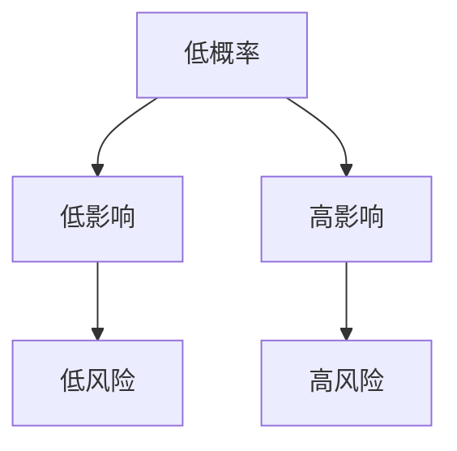
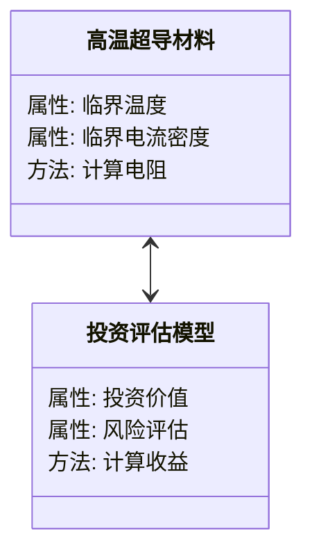

                 


# 巴菲特-芒格的高温超导材料投资：能源传输的革命

> 关键词：高温超导材料，巴菲特，芒格，投资策略，能源传输，数学模型

> 摘要：本文探讨了高温超导材料在能源传输中的革命性应用，并结合巴菲特和芒格的投资理念，分析了如何在高温超导材料领域进行有效的投资。文章从高温超导材料的科学原理、投资评估模型的建立、系统架构设计以及项目实战等方面进行了详细阐述，旨在为投资者和科技爱好者提供有价值的参考。

---

## 第1章: 高温超导材料概述

### 1.1 高温超导材料的基本概念

高温超导材料是一种在高温环境下（通常在液氮温度以上）具有零电阻特性的材料。这种材料在能源传输、磁悬浮、量子计算等领域具有重要应用。高温超导材料的发现是材料科学领域的重大突破，它为能源传输的革命提供了可能。

#### 1.1.1 超导体的定义与特性

超导体是指在特定条件下（如低温、高压等）电阻为零的材料。高温超导材料的发现使得在相对较高的温度下实现超导成为可能。高温超导材料的主要特性包括零电阻、完全抗磁性和临界电流密度。

#### 1.1.2 高温超导材料的发现与历史

1986年，瑞士科学家马约拉纳和缪勒发现了首个高温超导材料——铜氧化物超导体。这一发现打破了传统的低温超导材料的限制，为超导材料的应用开辟了新的可能性。

#### 1.1.3 高温超导材料的应用领域

高温超导材料在能源传输、磁共振成像（MRI）、粒子加速器、量子计算等领域具有广泛的应用潜力。特别是在能源传输领域，高温超导材料可以显著降低能量损耗，提高传输效率。

---

### 1.2 巴菲特与芒格的投资哲学

#### 1.2.1 巴菲特的价值投资理论

巴菲特的价值投资理论强调长期投资、安全边际和公司基本面分析。他认为，投资的本质是寻找那些具有持续竞争优势和良好管理团队的公司。

#### 1.2.2 芒格的多元思维模型

芒格的多元思维模型强调将多个学科的知识结合起来，以形成全面的思维方式。他认为，投资者需要从物理学、心理学、经济学等多个角度去理解和分析问题。

#### 1.2.3 两人投资哲学的异同

尽管巴菲特和芒格的投资理念有许多相似之处，但也有不同之处。巴菲特更注重企业的财务状况和管理团队，而芒格则更注重企业所在行业的竞争格局和技术创新。

---

## 第2章: 高温超导材料的科学原理

### 2.1 高温超导材料的物理特性

#### 2.1.1 超导体的临界温度

临界温度是材料从正常导电状态转变为超导状态的温度。高温超导材料的临界温度通常在77K（液氮温度）以上，这使得其应用更加广泛。

#### 2.1.2 高温超导材料的制备方法

高温超导材料的制备通常采用高温烧结法。这种方法通过将铜氧化物与其他金属氧化物混合，经过高温烧结形成超导体。

#### 2.1.3 高温超导材料的微观结构

高温超导材料的微观结构通常具有复杂的层状结构，这种结构是其超导性能的重要来源。

---

### 2.2 高温超导材料的数学模型

#### 2.2.1 电阻模型

在高温超导材料中，电阻R与温度T的关系可以表示为：

$$ R = R_0 \exp\left(-\frac{T_c}{T}\right) $$

其中，$R_0$是常数，$T_c$是临界温度。

#### 2.2.2 临界电流密度模型

临界电流密度$I_c$与磁场$B$的关系可以表示为：

$$ I_c = I_0 \exp\left(-\frac{B}{B_c}\right) $$

其中，$I_0$是常数，$B_c$是临界磁场。

---

## 第3章: 高温超导材料的投资策略

### 3.1 投资评估模型

#### 3.1.1 投资价值评估

投资价值可以通过以下公式进行评估：

$$ V = \frac{CF}{r} $$

其中，$CF$是未来现金流，$r$是折现率。

#### 3.1.2 风险评估

高温超导材料的投资风险可以通过风险矩阵进行评估。风险矩阵包括概率和影响两个维度，如图所示：



---

## 第4章: 高温超导材料的系统架构设计

### 4.1 领域模型

领域模型可以通过类图表示，如图所示：



---

## 第5章: 项目实战

### 5.1 环境配置

高温超导材料的投资分析需要以下环境配置：

- 数据来源：学术论文、行业报告
- 工具：Python、Matplotlib、Scipy

### 5.2 数据收集

高温超导材料的性能数据可以通过以下方式收集：

```python
import pandas as pd
data = pd.read_csv('high_temp_superconductors.csv')
```

### 5.3 模型实现

投资评估模型的实现可以通过以下代码完成：

```python
def calculate_value(cash_flow, discount_rate):
    return cash_flow / discount_rate
```

### 5.4 案例分析

以某高温超导材料企业为例，假设其未来现金流为1000万元，折现率为5%，则其投资价值为：

$$ V = \frac{1000}{0.05} = 20000万元 $$

---

## 第6章: 总结与展望

### 6.1 总结

高温超导材料的投资具有巨大的潜力，但也伴随着较高的风险。投资者需要结合巴菲特和芒格的投资理念，从多个角度进行分析。

### 6.2 展望

未来，随着高温超导材料技术的进一步发展，其在能源传输领域的应用将更加广泛。投资者需要密切关注行业动态，抓住投资机会。

---

作者：AI天才研究院/AI Genius Institute & 禅与计算机程序设计艺术 /Zen And The Art of Computer Programming

