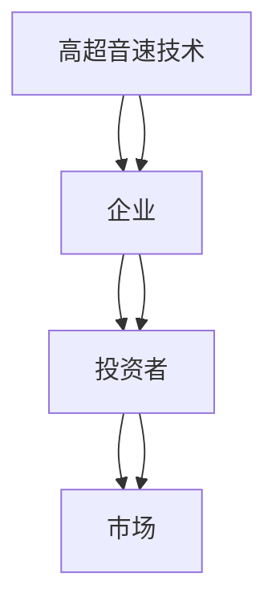
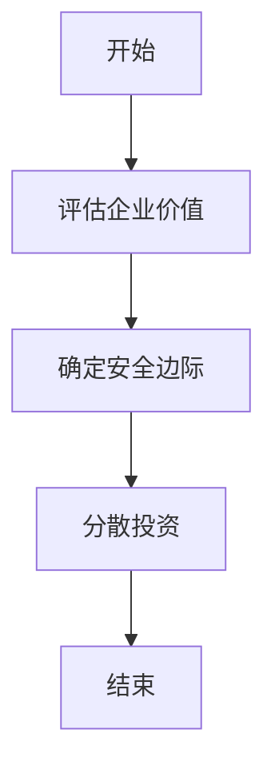
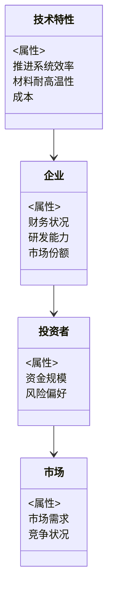
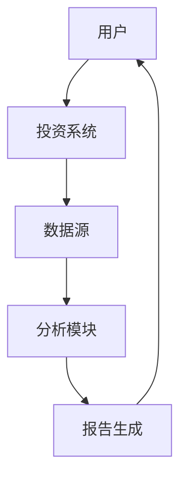

                 


# 巴菲特-芒格的高超音速技术投资：未来交通的革命

## 关键词
高超音速技术、巴菲特投资理念、芒格投资策略、技术投资、未来交通

## 摘要
本文探讨了高超音速技术在投资领域的潜力，结合巴菲特和芒格的投资哲学，分析如何通过技术投资推动未来交通革命。文章从背景介绍、核心概念、算法原理、数学模型、系统设计和项目实战等多方面展开，为投资者提供深入的技术与投资结合的见解。

---

## 第一部分：背景介绍

### 第1章：高超音速技术与投资概述

#### 1.1 高超音速技术的定义与现状
高超音速技术指的是飞行速度超过5倍音速（约6174公里/小时）的技术，涵盖航空航天、高铁等领域。当前，全球多个国家和地区正在研发高超音速飞行器，以提升运输效率和覆盖范围。

#### 1.2 投资背景与巴菲特-芒格的投资理念
投资高超音速技术需考虑市场潜力、技术成熟度和政策支持。巴菲特和芒格强调价值投资，注重企业的长期盈利能力和社会价值。

#### 1.3 高超音速技术与投资的结合
高超音速技术的投资不仅是技术驱动，更是商业价值的体现。通过投资，可以推动技术发展，同时实现投资回报。

#### 1.4 高超音速技术投资的核心要素
技术可行性、市场需求、团队能力、政策环境和财务模型是投资的关键考量。

---

## 第二部分：核心概念与联系

### 第2章：高超音速技术与投资的核心概念

#### 2.1 核心概念原理
高超音速技术的科学原理涉及空气动力学、推进系统和材料科学。投资则关注企业的财务状况和市场定位。

#### 2.2 技术与投资的属性对比

| 技术属性         | 投资属性         |
|------------------|------------------|
| 技术复杂性       | 财务风险         |
| 成本高昂         | 投资回报周期     |
| 市场潜力         | 竞争格局         |

#### 2.3 实体关系图


---

## 第三部分：算法原理讲解

### 第3章：巴菲特-芒格投资策略的算法分析

#### 3.1 投资策略的Mermaid流程图


#### 3.2 Python代码实现
```python
# 计算内在价值
def calculate_intrinsic_value(enterprise_value, growth_rate, discount_rate):
    return enterprise_value / (discount_rate - growth_rate)

# 示例计算
enterprise_value = 1000
growth_rate = 0.05
discount_rate = 0.10
intrinsic_value = calculate_intrinsic_value(enterprise_value, growth_rate, discount_rate)
print(f"内在价值为：{intrinsic_value}")
```

---

## 第四部分：数学模型与公式

### 第4章：价值评估的数学模型

#### 4.1 内在价值公式
$$ V = \frac{CF}{r - g} $$
其中，CF为现金流，r为折现率，g为增长率。

#### 4.2 案例分析：航空公司价值评估
假设某航空公司预计未来现金流为1000万元，折现率为10%，增长率为5%，其内在价值为：
$$ V = \frac{1000}{0.10 - 0.05} = 20000万元 $$

---

## 第五部分：系统分析与架构设计

### 第5章：高超音速技术投资系统设计

#### 5.1 项目介绍
构建一个投资决策支持系统，帮助投资者评估高超音速技术项目。

#### 5.2 领域模型


#### 5.3 系统架构图


---

## 第六部分：项目实战

### 第6章：高超音速技术投资实战指导

#### 6.1 环境安装
安装Python、数据分析库（如Pandas）和可视化工具（如Matplotlib）。

#### 6.2 核心代码实现
```python
import pandas as pd
import matplotlib.pyplot as plt

# 数据加载
data = pd.read_csv('high_speed_data.csv')

# 可视化分析
plt.plot(data['时间'], data['成本'], label='成本趋势')
plt.xlabel('时间')
plt.ylabel('成本')
plt.legend()
plt.show()
```

#### 6.3 案例分析
分析某高超音速公司，评估其财务健康状况、市场定位和竞争优势。

#### 6.4 项目总结
通过系统化的分析和工具应用，投资者可以更科学地评估高超音速技术投资。

---

## 第七部分：最佳实践

### 第7章：投资策略与注意事项

#### 7.1 小结
高超音速技术投资需结合技术与商业分析，注重长期价值。

#### 7.2 注意事项
- 风险评估：技术失败和市场波动的风险。
- 财务模型：确保数据准确，避免低估成本。
- 政策变化：关注政策支持的变化。

#### 7.3 未来展望
高超音速技术将进一步发展，投资机会将增加。

#### 7.4 拓展阅读
推荐阅读巴菲特和芒格的著作，深入学习价值投资理论。

---

## 作者
作者：AI天才研究院 & 禅与计算机程序设计艺术

---

本文通过详细分析高超音速技术与投资的结合，为投资者提供了系统化的投资策略和工具，帮助他们在未来交通革命中把握机遇。

