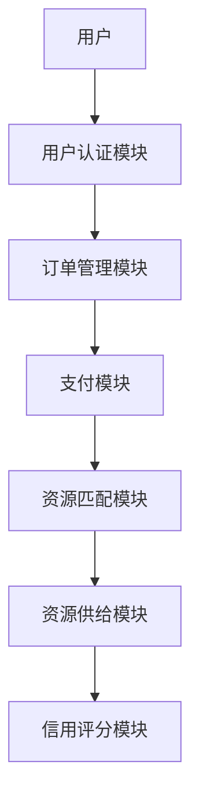
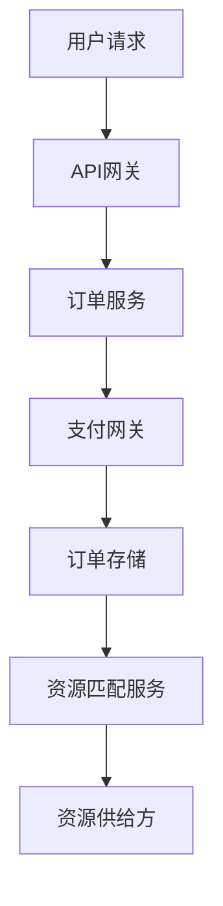

                 


# 巴菲特-芒格看共享经济：商业模式的革新

## 关键词：巴菲特，芒格，共享经济，商业模式，技术创新，投资分析，系统设计

## 摘要：  
本文从巴菲特和芒格的投资哲学出发，结合共享经济的商业模式，分析其在技术驱动下的革新。通过价值投资、多元思维模型以及系统架构设计等多维度，揭示共享经济如何实现从传统经济模式向新型经济模式的转变，并探讨其未来的趋势和发展方向。

---

## 第一部分：引言

### 1.1 背景介绍
- **共享经济的兴起**：从闲置资源利用到数字化平台的崛起。
- **巴菲特和芒格的视角**：价值投资与长期主义对商业模式创新的启示。

### 1.2 问题描述
- 共享经济的核心问题：资源匹配效率、信任机制、政策挑战。
- 巴菲特和芒格的思维方式如何为共享经济提供新思路。

### 1.3 研究目标
- 探讨共享经济的商业模式革新。
- 分析巴菲特和芒格的投资理念如何应用于共享经济的系统设计。

---

## 第二部分：共享经济概述

### 2.1 共享经济的定义与特点
- **定义**：共享经济是一种通过数字平台实现资源匹配和使用权共享的经济模式。
- **特点**：去中心化、高效率、低成本、用户参与度高。

### 2.2 共享经济的模式
- **P2P模式**：个人对个人的直接共享。
- **平台模式**：第三方平台撮合供需。
- **共享使用权模式**：通过平台提供使用权而非所有权。

### 2.3 成功案例分析
- **Airbnb**：闲置房源的共享与住宿服务。
- **滴滴出行**：私家车的共享与出行服务。
- **Zipcar**：按需租车的共享经济模式。

### 2.4 共享经济的挑战
- **政策法规**：如何在不同地区合规运营。
- **用户信任**：平台如何建立用户之间的信任机制。
- **竞争与垄断**：平台的寡头效应与市场垄断风险。

---

## 第三部分：巴菲特和芒格的投资理念

### 3.1 巴菲特的价值投资理论
- **核心理念**：寻找具有持续竞争优势的企业，关注内在价值。
- **安全边际**：以低于内在价值的价格买入，降低投资风险。

### 3.2 芒格的多元思维模型
- **多元思维模型**：将多个学科的原理组合起来，形成交叉视角。
- **决策框架**：从第一性原理出发，避免从经验出发的错误。

### 3.3 巴菲特和芒格的思维方式对共享经济的启示
- **长期主义**：关注企业的长期价值，而非短期收益。
- **竞争优势**：分析共享经济平台的核心竞争力。

---

## 第四部分：共享经济的商业模式分析

### 4.1 需求侧分析
- **用户需求**：便利性、低成本、灵活性。
- **用户行为**：使用频率、付费意愿、口碑传播。

### 4.2 供给侧分析
- **资源供给**：闲置资源的激活与利用。
- **供给者行为**：参与平台的动力、收益分配。

### 4.3 平台的双边市场匹配机制
- **供需匹配算法**：如何高效匹配用户需求与资源供给。
- **定价策略**：动态定价与用户接受度的平衡。

### 4.4 平台的增值服务
- **信任机制**：用户评价、信用评分系统。
- **保险与担保**：降低交易风险的金融工具。

---

## 第五部分：系统架构与设计

### 5.1 系统功能设计
- **用户模块**：注册、登录、订单管理。
- **资源模块**：资源发布、资源状态管理。
- **订单模块**：订单生成、支付、取消。

### 5.2 系统架构图



### 5.3 数据流图



### 5.4 关键算法与数学模型

#### 5.4.1 动态定价算法
- **需求预测模型**：基于历史数据预测用户需求。
- **供给匹配模型**：根据需求动态调整资源供给。

#### 5.4.2 信用评分模型
- **评分公式**：$$ credit\_score = \alpha \times (positive\_feedback + negative\_feedback) + \beta \times (completion\_rate) $$
- **评分权重**：$\alpha = 0.7$，$\beta = 0.3$

---

## 第六部分：项目实战

### 6.1 环境安装
- **技术选型**：前端（React或Vue），后端（Node.js或Python），数据库（MySQL或MongoDB）。
- **开发工具**：IDE（VS Code、IntelliJ IDEA）。

### 6.2 核心代码实现
#### 6.2.1 用户认证模块

```python
def authenticate(user):
    if user['password'] == hashed_password:
        return True
    else:
        return False
```

#### 6.2.2 资源匹配算法

```python
def match_resource(user_request, resources):
    for resource in resources:
        if resource['available'] and resource['type'] == user_request['type']:
            return resource
    return None
```

### 6.3 案例分析
- **共享办公空间项目**：从需求分析到系统设计，再到实现和测试。
- **实际运行中的问题与解决方案**：如何处理用户投诉、如何优化匹配算法。

---

## 第七部分：结论与展望

### 7.1 结论
- 巴菲特和芒格的思维方式为共享经济的商业模式创新提供了重要的启示。
- 技术驱动下的共享经济正在不断革新，从平台设计到算法优化，都在推动其向更高效、更可持续的方向发展。

### 7.2 未来展望
- **技术融合**：人工智能与共享经济的进一步结合。
- **全球化与本地化**：共享经济如何在不同文化背景下落地。
- **可持续发展**：共享经济如何助力绿色经济。

---

## 附录

### 附录A：术语表
- **内在价值**：企业未来现金流的现值。
- **安全边际**：买入价格低于内在价值的差额。

### 附录B：参考文献
- 巴菲特股东大会演讲。
- 芒格的《穷查理宝典》。
- 共享经济相关学术论文。

---

## 作者：AI天才研究院 & 禅与计算机程序设计艺术

